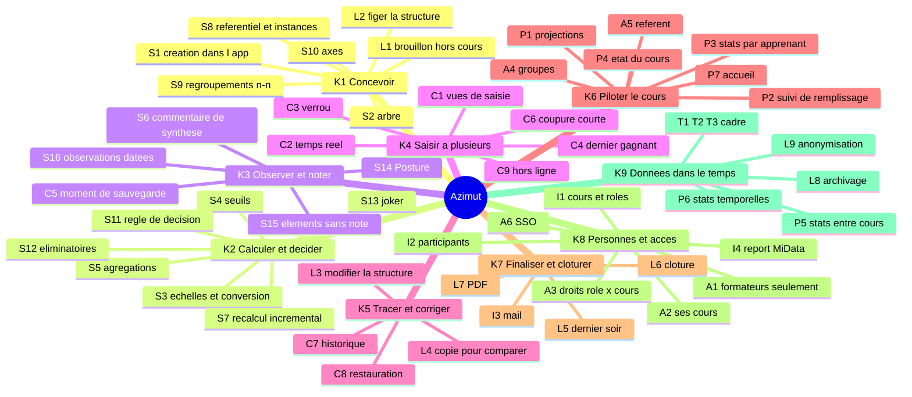
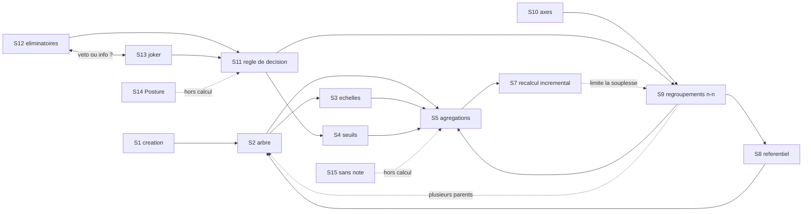
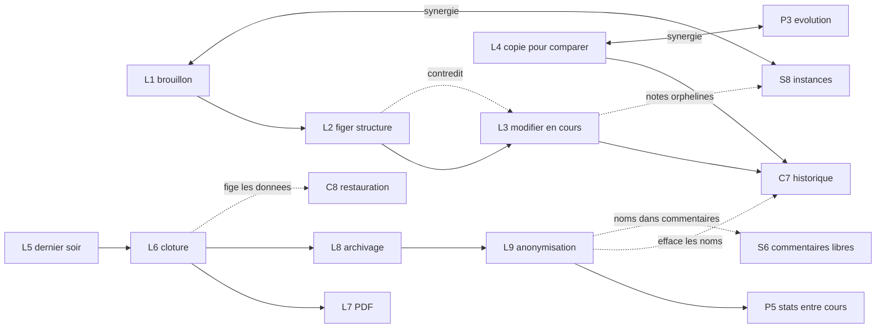
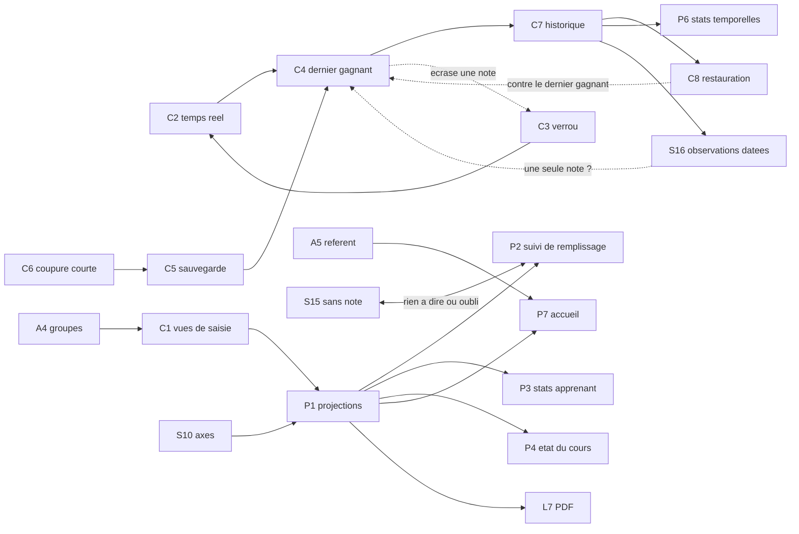
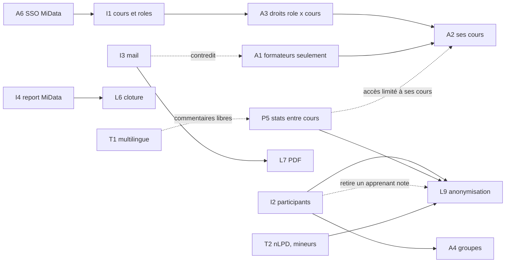

# Azimut — carte des features

Ce document met à plat toutes les features déjà notées dans `FEATURES.md` et `TODO.md`, les regroupe en capacités métier, montre leurs liens et cherche les mécanismes communs. Il ne détaille pas le modèle d'évaluation : voir `02-modele-generalise.md`. Le détail des zones floues est dans `03-zones-d-ombre.md`.

## TL;DR

- **54 features** recensées dans 7 familles (S, L, C, P, A, I, T). Seule une vingtaine est **décidée** ; la plupart de l'évaluation (S) et du cycle de vie (L) reste **à préciser** ou n'est qu'une **idée**.
- On les regroupe en **9 capacités métier**. Le cœur est « Concevoir », « Calculer et décider », « Observer et noter » et « Saisir à plusieurs ».
- Le lien le plus structurant est l'**état de la qualification** (brouillon, figée, clôturée, archivée, anonymisée). Il touche L1 à L9, les verrous, les droits et les statistiques.
- La **projection** (P1) est la seconde charnière : vues de saisie, bilan, PDF, suivi, statistiques et accueil en sont des cas particuliers.
- Quatre généralisations valent d'être faites **maintenant** : l'état, la projection, la règle de décision et la frontière MiData. Les versions et les regroupements indicatifs peuvent attendre.
- La tension principale oppose **souplesse** (structure modifiable en cours de cours, copies, vues libres) et **fiabilité** (structure figée, historique, comparabilité entre cours).
- Les features les plus **sous-spécifiées** : joker (S13), groupes et référent (A4, A5), correspondance des rôles MiData (A3), envoi par mail (I3), report dans MiData (I4), modification de structure en cours (L3).

Légende des statuts : **décidé** (dans `TODO.md` ou affirmé dans `FEATURES.md`), **à préciser** (le principe est posé, les règles manquent), **idée** (notée, rien n'est décidé). Tout ce qui est dans ce document est **constaté** dans les sources, sauf les sections marquées « proposé ».

## 1. Inventaire

### Structure et évaluation (S)

| ID | Nom | Résumé | Statut | Source |
| --- | --- | --- | --- | --- |
| S1 | Création dans l'app | On crée une qualification entièrement dans l'application, à partir de primitives. | décidé | FEATURES « Structure d'une qualification » |
| S2 | Arbre à résultat calculé | Indicateur, critère, objectif, sphère : chaque nœud a toujours un résultat calculé. | décidé (mais « toujours » remis en question, voir 03) | FEATURES « Structure », « Questions ouvertes » |
| S3 | Échelles multiples et conversion | Plusieurs échelles cohabitent (binaire, ordonnée, numérique) et on convertit de l'une à l'autre. | à préciser | FEATURES « Structure », constat 5 |
| S4 | Seuils par partie de l'arbre | Les seuils varient selon la branche. | à préciser | FEATURES « Structure » |
| S5 | Agrégations paramétrées | Poids, arrondi, gestion des cases vides, choisis par nœud. | à préciser | FEATURES constats 5 et 6 |
| S6 | Commentaire de synthèse | Chaque nœud peut avoir un commentaire qui résume ses enfants. | décidé | FEATURES « Structure », constat 9 |
| S7 | Recalcul incrémental | Comme un tableur, seuls les résultats dépendants sont recalculés, côté client. | décidé | FEATURES « Structure » ; TODO « Calculs » |
| S8 | Référentiel et instances | Séparer les éléments réutilisables des évaluations (exercice × critère). | à préciser | FEATURES constat 1, « Piste de généralisation » |
| S9 | Regroupements n-n | Thèmes, sécurité : un élément a plusieurs parents ; décisifs, indicatifs ou organisationnels. | à préciser | FEATURES constat 2, « Piste » |
| S10 | Axes | Exercice ou rendu, thème, type de critère, moment : étiquettes pour projeter. | à préciser | FEATURES « Projections », constat 3 |
| S11 | Règle de décision, seuil final | Les requis pour qu'un apprenant réussisse le cours ; peut être absente (qualif1). | idée | FEATURES constat 4, « Évaluation » |
| S12 | Critères éliminatoires | Motifs OUI/NON qui font échouer, avec justification. Veto ou simple information ? | à préciser | FEATURES vocabulaire, constat 7 |
| S13 | Joker | Ajustement unique lors de la finalisation (qualif3 : un demi-point sur une sphère, avec justification). | à préciser | FEATURES vocabulaire, tableau des 3 modèles |
| S14 | Posture et grilles hors calcul | Grille d'observation notée et commentée, qui n'entre pas dans le résultat. | à préciser | FEATURES vocabulaire, constat 7 |
| S15 | Éléments commentés sans note | Parties commentées seulement, sans échelle. | idée | FEATURES « Évaluation » |
| S16 | Observations datées et attribuées | Plusieurs observations par élément, avec auteur et date. | idée | FEATURES constat 8, « Piste » |

### Cycle de vie (L)

| ID | Nom | Résumé | Statut | Source |
| --- | --- | --- | --- | --- |
| L1 | Brouillon hors cours | Créer une qualification sans cours, puis la lier à un cours. | idée | FEATURES « Création et cycle de vie » |
| L2 | Figer la structure | La structure devient non modifiable avant le cours. Qui, quoi, défiger ? | décidé (principe), règles à préciser | FEATURES « Cycle de vie » 1, « Figer » |
| L3 | Modifier la structure en cours | Supprimer un indicateur pendant le cours ; effet sur les notes à définir. | à préciser | FEATURES « Cycle de vie » 2, « Questions ouvertes » |
| L4 | Copie avec données pour comparer | Copier en cours de cours pour tester un changement et comparer. | à préciser | FEATURES « Cycle de vie » 2, « Questions ouvertes » |
| L5 | Finalisation du dernier soir | Reformulation des commentaires, commentaire général, 3 points positifs et 3 à améliorer, joker. | à préciser | FEATURES « Cycle de vie » 3, constat 9 |
| L6 | Clôture | La qualification est figée (les données), puis imprimée ou exportée. | décidé (principe) | FEATURES « Cycle de vie » 4 |
| L7 | Export PDF et impression | Attestation imprimable ; contenu et mise en page à définir. | à préciser | FEATURES « Cycle de vie » 4, « Questions ouvertes » |
| L8 | Archivage | Archiver les qualifications des cours terminés ; qui voit quoi ? | idée | FEATURES « Création et cycle de vie » |
| L9 | Anonymisation, conservation, purge | À 3 mois : retirer les noms, garder le détail ; traiter les noms dans les commentaires libres. | idée | FEATURES « Création et cycle de vie », « Hébergement et données » |

### Saisie et collaboration (C)

| ID | Nom | Résumé | Statut | Source |
| --- | --- | --- | --- | --- |
| C1 | Vues de saisie | Par apprenant, par sphère, par sphère et groupe. | décidé | FEATURES « Vues de saisie » |
| C2 | Temps réel | On voit arriver les valeurs et les résultats des autres formateurs. | décidé | FEATURES « Saisie collaborative » ; TODO « Architecture » |
| C3 | Verrou de cellule texte | Une cellule de texte en édition est réservée, avec expiration. Cellules de note ? | décidé (principe), durée à préciser | FEATURES « Saisie collaborative » ; TODO « Verrous » |
| C4 | Dernier gagnant | En cas de conflit ou de coupure, la dernière écriture l'emporte. | décidé | TODO « Concurrence » |
| C5 | Moment de sauvegarde, brouillons | Notes à la sortie de cellule ; textes longs à la sortie plus brouillons réguliers. | à préciser | FEATURES « Saisie collaborative » |
| C6 | Coupure courte sans perte | Aucune saisie perdue tant que l'onglet reste ouvert. | décidé | TODO « Coupure courte » |
| C7 | Historique et journal | Chaque modification est versionnée : qui, quoi, quand ; évolution d'une note. | décidé (principe), consultation à préciser | FEATURES « Historique » ; TODO « Historique » |
| C8 | Restauration | Revenir en arrière sur une cellule ou une partie de grille. | à préciser | FEATURES « Historique » |
| C9 | Hors ligne | Mode hors ligne complet, à évaluer plus tard. | idée (reporté) | FEATURES « Hors ligne » |

### Projections et suivi (P)

| ID | Nom | Résumé | Statut | Source |
| --- | --- | --- | --- | --- |
| P1 | Projections | Voir les mêmes données sous plusieurs angles (5 exemples : exercice de groupe, retour sur un thème, rendu individuel, bilan de réussite, état du cours). | à préciser | FEATURES « Projections et visualisations » |
| P2 | Suivi de remplissage | Nombre d'indicateurs vides et d'indicateurs sans commentaire. | à préciser | FEATURES « Projections », constat 10 |
| P3 | Statistiques par apprenant | Écart type, évolution au fil du cours. | à préciser | FEATURES « Projections » |
| P4 | État du cours et disparités | Où en sont les apprenants, quels indicateurs manquent. | à préciser | FEATURES projection 5 |
| P5 | Statistiques entre cours | Par cours ou par type de cours ; dépend des accès MiData et de l'anonymisation. | idée | FEATURES « Statistiques » |
| P6 | Statistiques temporelles | Réussite d'un cours à l'autre, ordre de remplissage des indicateurs. | idée | FEATURES « Statistiques » |
| P7 | Accueil personnalisé | Qualification du cours en cours, raccourcis vers apprenants suivis et groupes. | idée | FEATURES « Affichage personnalisé » |

### Acteurs et accès (A)

| ID | Nom | Résumé | Statut | Source |
| --- | --- | --- | --- | --- |
| A1 | Réservé aux formateurs | Les apprenants n'ont pas accès à l'application. | décidé (« pour l'instant ») | FEATURES « Acteurs et accès » |
| A2 | Visibilité limitée à ses cours | Un formateur ne voit que ses cours et leurs apprenants. | décidé | FEATURES « Acteurs et accès » |
| A3 | Droits rôle × cours | Droits selon le rôle et le cours ; correspondance avec les rôles MiData à décider. | décidé (principe), correspondance à préciser | FEATURES « Connexion » ; TODO « Autorisation » |
| A4 | Groupes d'évaluation | Sous-ensemble d'apprenants d'un cours. | à préciser | FEATURES vocabulaire, « Acteurs et accès » |
| A5 | Formateur référent | Le formateur qui suit un apprenant. | à préciser | FEATURES « Acteurs et accès », « Affichage personnalisé » |
| A6 | Connexion SSO MiData | SSO en production, comptes locaux en dev et test seulement. | décidé | FEATURES « Connexion » ; TODO « Auth » |

### Intégrations (I)

| ID | Nom | Résumé | Statut | Source |
| --- | --- | --- | --- | --- |
| I1 | Cours et rôles depuis MiData | Les cours d'un formateur et son rôle viennent de MiData ; quand synchroniser ? | décidé (source), moment à préciser | FEATURES « Connexion » ; TODO « Domaine » |
| I2 | Participants depuis MiData | Récupérer et synchroniser les participants ; que faire d'un retiré qui a des notes ? | idée | FEATURES « Intégrations » |
| I3 | Envoi automatique par mail | Quoi, à qui, quand : à préciser. Suppose l'adresse des apprenants. | idée | FEATURES « Intégrations » |
| I4 | Report dans MiData | Faut-il reporter les qualifications dans MiData ? | idée (question ouverte) | FEATURES « Questions ouvertes » ; TODO « Domaine » |

### Transverse (T)

| ID | Nom | Résumé | Statut | Source |
| --- | --- | --- | --- | --- |
| T1 | Multilingue | Français d'abord, multilingue sans retoucher chaque écran. | décidé | FEATURES « Langues » ; TODO « i18n » |
| T2 | Hébergement suisse, nLPD, mineurs | Données de personnes souvent mineures ; conservation et purge à fixer. | décidé (hébergement), conservation à préciser | FEATURES « Hébergement et données » ; TODO « Architecture » |
| T3 | Volumes | 10 à 40 apprenants, 6 à 10 formateurs, 4 à 5 cours, environ 17 000 notes par cours. | décidé (contrainte) | FEATURES « Volumes attendus » |

## 2. Capacités métier

Neuf capacités regroupent les features. Une feature peut servir plusieurs capacités ; on la place là où elle pèse le plus.

| Capacité | Features | Question à laquelle elle répond |
| --- | --- | --- |
| **K1. Concevoir une qualification** | S1, S2, S8, S9, S10, L1, L2 | Comment l'équipe construit-elle ce qu'elle va évaluer ? |
| **K2. Calculer et décider** | S3, S4, S5, S7, S11, S12, S13 | Comment passe-t-on des notes à un résultat et à une décision ? |
| **K3. Observer et noter** | S6, S14, S15, S16, C5 | Qu'est-ce qu'un formateur consigne, et sous quelle forme ? |
| **K4. Saisir à plusieurs** | C1, C2, C3, C4, C6, C9 | Comment plusieurs formateurs remplissent-ils sans se gêner ? |
| **K5. Tracer et corriger** | C7, C8, L3, L4 | Comment garde-t-on la mémoire et corrige-t-on ? |
| **K6. Piloter le cours** | P1, P2, P3, P4, P7, A4, A5 | Où en est-on, qui doit faire quoi, que dois-je voir en premier ? |
| **K7. Finaliser et clôturer** | L5, L6, L7, I3 | Comment termine-t-on et que remet-on à la fin ? |
| **K8. Gouverner les personnes et l'accès** | A1, A2, A3, A6, I1, I2, I4 | Qui est qui, qui voit quoi, d'où viennent les personnes ? |
| **K9. Gouverner les données dans le temps** | L8, L9, P5, P6, T1, T2, T3 | Que devient la donnée après le cours, et dans quel cadre vit-elle ? |

## 3. Liens entre features

Légende commune : une flèche pleine « A --> B » signifie « A nécessite B » (B doit exister ou être décidé avant). Une flèche pointillée signifie une **tension** : A contraint ou contredit B. Une flèche double « <--> » signifie une **synergie**.

### 3.1 Conception et décision

### 3.2 Cycle de vie et état

### 3.3 Saisie, trace et projection

### 3.4 Personnes, accès et données

### 3.5 Liens les plus structurants

1. **L2 / L3 / L6 / L8 / L9 forment un état unique.** Chaque transition change qui peut modifier quoi (structure, notes, commentaires), qui voit la qualification, et ce qu'on peut calculer. Les verrous (C3), la restauration (C8) et l'accès (A2, A3) en dépendent.
2. **P1 est un nœud pour tout ce qui « montre ».** Les vues de saisie (C1), le suivi (P2 à P4), l'accueil (P7) et le PDF (L7) répondent à la même question : quelles données, filtrées comment, regroupées comment, pour qui ?
3. **S9 et S10 dépendent de S8.** Sans séparer référentiel et instances, on ne sait pas où poser les thèmes, les axes et les critères répétés. Ce lien porte aussi les projections (P1).
4. **S11 est une règle, pas la racine de l'arbre.** Elle rassemble seuils (S4), éliminatoires (S12) et joker (S13). Elle peut manquer (qualif1) : cela contredit la phrase « il y a toujours un résultat calculé » de S2.
5. **Tension entre dernier gagnant (C4) et restauration (C8).** Le dernier gagnant écrase sans avertir. La restauration, elle, suppose qu'on sache ce qui a été écrasé. L'historique (C7) les réconcilie : rien ne se perd, tout reste consultable.
6. **Tension entre L3 (modifier en cours) et le reste.** Modifier la structure en cours de cours casse l'ordre « structure figée puis données » et crée des notes orphelines. L4 (copie pour comparer) existe peut-être justement pour éviter L3 en mode destructif.
7. **Tension entre A1 (formateurs seulement) et I3 (mail aux apprenants).** Envoyer le PDF aux apprenants suppose leur adresse, donc des données de plus (T2), mais pas un accès à l'app.
8. **P5 (stats entre cours) contredit A2 (ses cours seulement)**, sauf si les données sont anonymisées (L9) ou si MiData donne l'accès. C'est un couplage entre statistiques, accès et anonymisation.
9. **I2 (synchroniser les participants) heurte L9 et C7.** Un apprenant retiré de MiData qui a déjà des notes ne peut pas simplement disparaître.
10. **S7 (recalcul incrémental) limite S9.** Des regroupements n-n et des règles composables rendent le graphe de dépendances plus complexe ; il doit rester calculable à la volée côté client, avec des volumes de l'ordre de 17 000 notes (T3).

## 4. Matrice features × moments du cours

Marques : **●** moment principal de la feature, **○** utilisée ou possible à ce moment. Case vide : sans objet.

Moments : **Avant** = conception avant le cours ; **Ouverture** = début du cours ; **Pendant** ; **Dernier soir** ; **Clôture** ; **Après** = archive, anonymisation, statistiques.

| ID | Avant | Ouverture | Pendant | Dernier soir | Clôture | Après |
| --- | :-: | :-: | :-: | :-: | :-: | :-: |
| S1 création | ● | | ○ | | | |
| S2 arbre | ● | | ○ | ○ | ○ | |
| S3 échelles | ● | | ○ | | | |
| S4 seuils | ● | | | | | |
| S5 agrégations | ● | | ○ | ○ | ○ | |
| S6 commentaire de synthèse | | | ○ | ● | | |
| S7 recalcul incrémental | | | ● | ○ | | |
| S8 référentiel et instances | ● | ○ | | | | ○ |
| S9 regroupements n-n | ● | | ○ | | | |
| S10 axes | ● | | ○ | | | |
| S11 règle de décision | ● | | ○ | ● | ● | ○ |
| S12 éliminatoires | ○ | | ● | ● | ○ | |
| S13 joker | | | | ● | | |
| S14 Posture | ○ | | ● | ○ | | |
| S15 sans note | ○ | | ● | ○ | | |
| S16 observations datées | | | ● | ○ | | ○ |
| L1 brouillon | ● | | | | | |
| L2 figer structure | ○ | ● | | | | |
| L3 modifier la structure | | | ● | | | |
| L4 copie pour comparer | | | ● | ○ | | |
| L5 dernier soir | | | | ● | | |
| L6 clôture | | | | ○ | ● | |
| L7 PDF | | | | | ● | ○ |
| L8 archivage | | | | | ○ | ● |
| L9 anonymisation | | | | | | ● |
| C1 vues de saisie | | | ● | ○ | | |
| C2 temps réel | | | ● | ● | | |
| C3 verrou | | | ● | ● | | |
| C4 dernier gagnant | | | ● | ● | | |
| C5 sauvegarde | | | ● | ● | | |
| C6 coupure courte | | | ● | ● | | |
| C7 historique | | | ● | ● | ○ | ○ |
| C8 restauration | | | ● | ● | | |
| C9 hors ligne | | | ○ | | | |
| P1 projections | | | ● | ● | ○ | ○ |
| P2 suivi de remplissage | | | ● | ● | | |
| P3 stats par apprenant | | | ● | ○ | | ○ |
| P4 état du cours | | | ● | ● | | |
| P5 stats entre cours | | | | | | ● |
| P6 stats temporelles | | | ○ | | | ● |
| P7 accueil personnalisé | ○ | ● | ● | ● | ○ | ○ |
| A1 formateurs seulement | ○ | ○ | ● | ○ | ○ | ○ |
| A2 ses cours | ○ | ● | ● | ○ | ○ | ○ |
| A3 droits rôle × cours | ○ | ● | ● | ○ | ○ | ○ |
| A4 groupes | | ● | ● | | | |
| A5 référent | | ● | ● | ○ | | |
| A6 SSO | ● | ● | ● | ● | ● | ○ |
| I1 cours et rôles | ○ | ● | ○ | | | |
| I2 participants | | ● | ○ | | | |
| I3 mail | | | | | ● | |
| I4 report MiData | | | | | ● | ○ |
| T1 multilingue | ○ | ○ | ○ | ○ | ○ | ○ |
| T2 nLPD, mineurs | ○ | ○ | ○ | ○ | ○ | ● |
| T3 volumes | | | ● | ● | | |

Ce que montre la matrice :

- **Le dernier soir est le moment le plus chargé** (saisie encore active, plus finalisation, décision, joker). C'est aussi le moins spécifié (L5, S13).
- **L'ouverture** est un moment de passage : rattacher les participants, les rôles, les groupes et figer la structure. Personne ne l'a décrit comme un moment à part.
- **Après le cours**, seules L8, L9, P5 et P6 vivent. Ce sont des idées, pas des décisions.
- **« Avant » est entièrement dédié à la conception** (S1 à S10, L1). Cette phase suppose un référentiel (S8) qu'on ne sait pas encore partager entre cours.

## 5. Potentiel de généralisation fonctionnelle

Six pistes viennent du brief d'analyse, deux sont ajoutées (marquées « proposé », préfixe `N-CF`). Le modèle d'évaluation (échelles, agrégations, référentiel) est traité dans `02-modele-generalise.md` : on ne le détaille pas ici.

### G1. État de la qualification

- **Features couvertes :** L2, L3, L6, L8, L9, C3 (verrou comme état fin), C8, A2, A3.
- **Idée :** une qualification a un état (brouillon, structure figée, en cours, finalisation, clôturée, archivée, anonymisée). Un état dit ce qu'on peut modifier (structure, notes, commentaires), qui peut le faire, et si on peut revenir en arrière.
- **Ce que ça simplifie :** les questions ouvertes de « Figer » (qui, quoi, défiger ?) deviennent une table état × rôle × action. La clôture, l'archivage et l'anonymisation cessent d'être des cas à part. Les droits et les statistiques lisent l'état.
- **Coût et risques :** risque de **sur-généralisation** si on invente des états sans besoin réel. Risque inverse : un état trop rigide empêche la correction tardive (une faute découverte après clôture). Le verrou de cellule (C3) est éphémère : à garder hors de cette notion.
- **Recommandation : généraliser maintenant.** Modéliser un cycle d'états explicite, avec peu d'états au départ (par exemple structure modifiable, structure figée, données figées, anonymisée) et des transitions nommées.

### G2. Projection

- **Features couvertes :** C1, P1, P2, P3, P4, P7, L7, et la part « vue » de S14 (grille hors calcul).
- **Idée :** une projection est : un **filtre** (quels éléments, quels apprenants), un **regroupement** (par exercice, thème, groupe), une **disposition** (lignes, colonnes, navigation), une **sortie** (écran, PDF, statistique). Les vues de saisie sont des projections qu'on peut éditer ; le PDF est une projection figée.
- **Ce que ça simplifie :** une seule logique pour 5 exemples de FEATURES.md, pour le suivi, pour l'accueil, pour l'attestation. Le suivi (P2) devient un indicateur calculé sur une projection.
- **Coût et risques :** effet **« tableur »** si chaque formateur compose ses vues (FEATURES « Questions ouvertes », vues prédéfinies ou libres). Une projection éditable demande des identifiants stables et des axes (S10) bien définis. Le PDF exige une mise en page maîtrisée, pas libre.
- **Recommandation : généraliser maintenant, mais livrer des projections prédéfinies.** Définir la notion, fournir 4 ou 5 projections fixes, remettre la composition libre à plus tard.

### G3. Versions et variantes

- **Features couvertes :** L4 (copie pour comparer), C7 (historique), C5 (brouillon), C8 (restauration), L3 (modifier la structure), L1 (brouillon hors cours).
- **Idée :** tout est une **version** d'un état antérieur : d'une cellule, d'une partie de grille, de la structure, de la qualification entière. Une copie pour comparer est une **variante** qui garde un lien avec l'origine.
- **Ce que ça simplifie :** une seule façon de comparer (différences entre deux versions) et de revenir en arrière. L3 devient « nouvelle version de la structure » au lieu de modifier à chaud.
- **Coût et risques :** trois niveaux de versions très différents : la cellule (fréquente, minuscule), la structure (rare, lourde), la qualification (copie). Les unifier peut coûter cher pour un gain faible. Les brouillons de saisie (C5) sont éphémères et n'ont rien à voir avec le versionnement d'une structure.
- **Recommandation : plus tard.** Garder l'historique de cellule (C7) tel qu'il est décidé. Décider seulement si la copie (L4) est indépendante ou liée (question ouverte) ; la généralisation attendra de voir L3 en pratique.

### G4. Règle de décision composable

- **Features couvertes :** S11 (seuil final), S12 (éliminatoires), S13 (joker), S4 (seuils), et le choix de décisif ou indicatif de S9.
- **Idée :** le résultat final est une règle faite de briques : seuil sur un regroupement, nombre de regroupements réussis, veto, ajustement unique. Elle peut manquer.
- **Ce que ça simplifie :** les trois modèles Excel (ET sur sphères, ET plus éliminatoires, aucune règle) deviennent trois paramétrages. Le joker et les éliminatoires cessent d'être des bricolages à la main.
- **Coût et risques :** le joker (S13) est la brique la moins claire : une seule fois, sur une sphère, appliqué à la main. Risque d'un mini-langage de règles trop ouvert. Il faut garder la décision **humaine** dans la boucle : l'outil propose, l'équipe décide (qualif1 n'a aucune décision calculée).
- **Recommandation : généraliser maintenant, avec un petit nombre de briques.** Voir `02-modele-generalise.md` pour le détail du modèle ; ici on retient la décision de produit : règle facultative, résultat visible même sans décision.

### G5. Regroupements indicatifs

- **Features couvertes :** S14 (Posture), S15 (éléments commentés sans note), S9 (thèmes indicatifs), S10 (axes).
- **Idée :** un ensemble de feuilles à observer, avec ou sans note, hors du calcul décisif. La Posture, les thèmes transversaux et les éléments commentés seulement sont le même objet : un regroupement dont le statut est « indicatif ».
- **Ce que ça simplifie :** pas de concept spécial « grille hors calcul ». S15 n'est plus une feature à part : c'est un élément sans échelle dans un regroupement indicatif.
- **Coût et risques :** la Posture a des méta-axes et une colonne « Quand » (S16) qui pourraient demander plus qu'un simple regroupement. Risque de masquer une vraie différence (observation de comportement, répétée dans le temps, contre évaluation d'un livrable).
- **Recommandation : plus tard, après avoir lu une Posture remplie.** Traiter la Posture comme un regroupement indicatif par défaut ; ne créer un concept à part que si l'usage réel l'impose. Question ouverte déjà notée dans FEATURES.

### G6. Frontière avec MiData

- **Features couvertes :** A6, I1, I2, I4, A3 (correspondance des rôles), A4 (groupes), P5 (accès entre cours).
- **Idée :** MiData est la **source de vérité** pour les personnes, les cours, les rôles et la liste des participants. Azimut fait de MiData une frontière nette : ce qu'on importe, quand, ce qu'on ne modifie jamais, et ce qu'on y renvoie (ou non).
- **Ce que ça simplifie :** une seule règle de synchronisation (quand, quoi, conflits) pour cours, rôles et participants. Une seule réponse à « que faire d'un apprenant retiré ? ».
- **Coût et risques :** dépendance à une API externe (disponibilité, limites d'accès, notion de type de cours à vérifier). Le report (I4) est un sens inverse, avec ses propres règles, et peut ne jamais exister.
- **Recommandation : généraliser maintenant côté import** (cours, rôles, participants : une politique unique de synchronisation) ; **reporter I4** tant qu'on ne sait pas si on veut écrire dans MiData.

### G7. Trace datée unique (proposé, N-CF1)

- **Features couvertes :** C7 (historique), S16 (observations datées), P6 (stats temporelles), P3 (évolution), L9 (anonymisation).
- **Idée :** une observation et une modification de cellule portent les mêmes informations : auteur, date, valeur. Une seule **trace** pourrait alimenter l'historique, la colonne « Quand » de la Posture, l'évolution d'une note et l'ordre de remplissage.
- **Ce que ça simplifie :** les statistiques temporelles et l'évolution par apprenant se lisent sur une seule source.
- **Coût et risques :** distinguer « correction d'une faute » (écrase) et « nouvelle observation » (s'ajoute). Si on les confond, l'agrégation par indicateur (une note ou plusieurs ?) devient ambiguë. C'est la question ouverte de S16.
- **Recommandation : plus tard.** Garder la distinction pour l'instant : historique (décidé) d'un côté, observations multiples (idée) de l'autre. Revoir après avoir vu une Posture remplie.

### G8. Surface d'accès par état et rôle (proposé, N-CF2)

- **Features couvertes :** A1, A2, A3, A4, A5, I3, P5.
- **Idée :** une même matrice rôle × cours × état (voir G1) répond à toutes les questions d'accès, y compris les cas futurs (apprenants, statistiques entre cours, envoi par mail). Le référent et le groupe sont des **portées** supplémentaires, pas des droits distincts.
- **Ce que ça simplifie :** l'arrivée éventuelle des apprenants (A1 « pour l'instant ») n'oblige pas à tout reprendre.
- **Coût et risques :** les rôles MiData sont peu nombreux mais mal alignés avec les besoins (Kursleiter, Klassenlehrer, Referent, Kurshelfer…). Une matrice trop fine devient illisible.
- **Recommandation : plus tard.** Dépend de la correspondance des rôles (A3), non décidée.

### Synthèse

| Généralisation | Recommandation | Gain | Risque principal |
| --- | --- | --- | --- |
| G1 État de la qualification | **maintenant** | élevé | états inventés sans besoin |
| G2 Projection | **maintenant** (prédéfinies) | élevé | effet tableur |
| G3 Versions et variantes | plus tard | moyen | unifier des choses très différentes |
| G4 Règle de décision | **maintenant** (briques peu nombreuses) | élevé | mini-langage de règles |
| G5 Regroupements indicatifs | plus tard | moyen | masquer ce qu'a de propre la Posture |
| G6 Frontière MiData | **maintenant** (import) | élevé | API externe, report incertain |
| G7 Trace datée (N-CF1) | plus tard | moyen | confondre correction et observation |
| G8 Accès par état et rôle (N-CF2) | plus tard | moyen | matrice illisible |

## 6. Features orphelines ou sous-spécifiées

Détail dans `03-zones-d-ombre.md`. Liste courte :

- **S13 Joker** : une seule occurrence réelle (qualif3), appliquée à la main. On ne sait pas si c'est général.
- **L5 Finalisation** : cinq gestes différents (reformulation, commentaire général, 3 points +/-, joker, éventuellement validation) sans règle ni ordre.
- **A4 Groupes et A5 Référent** : cités à trois endroits (vues, accueil, droits), jamais définis. Aucune règle de constitution ni de changement.
- **A3 Rôles MiData** : sept rôles listés, aucune correspondance décidée.
- **I3 Mail** et **I4 Report MiData** : aucune décision de contenu, de destinataire ni de moment ; I4 n'a aucun lien avec le reste du cycle de vie.
- **L3 Modifier la structure en cours** : effet sur les notes inconnu.
- **C9 Hors ligne** : reporté, aucun lien actif avec les autres features (sauf C6).
- **T3 Volumes** : contrainte, pas une feature ; relie surtout S7 et P1.
- **S15 Éléments sans note** et **S16 Observations multiples** : pas de lien décidé avec le reste ; dépendent d'une qualification remplie qu'on n'a pas encore vue.
- **Ouverture du cours** : moment qui n'a pas de feature propre (voir matrice), alors qu'il concentre figer, participants, groupes et rôles.
