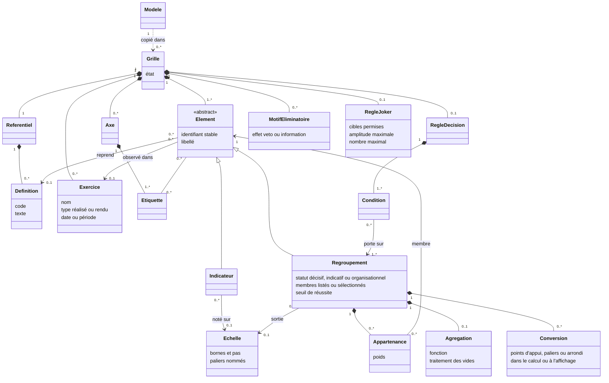
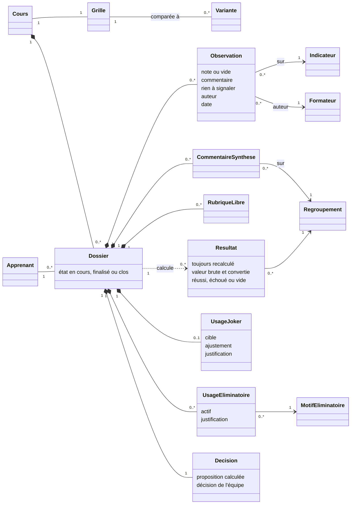
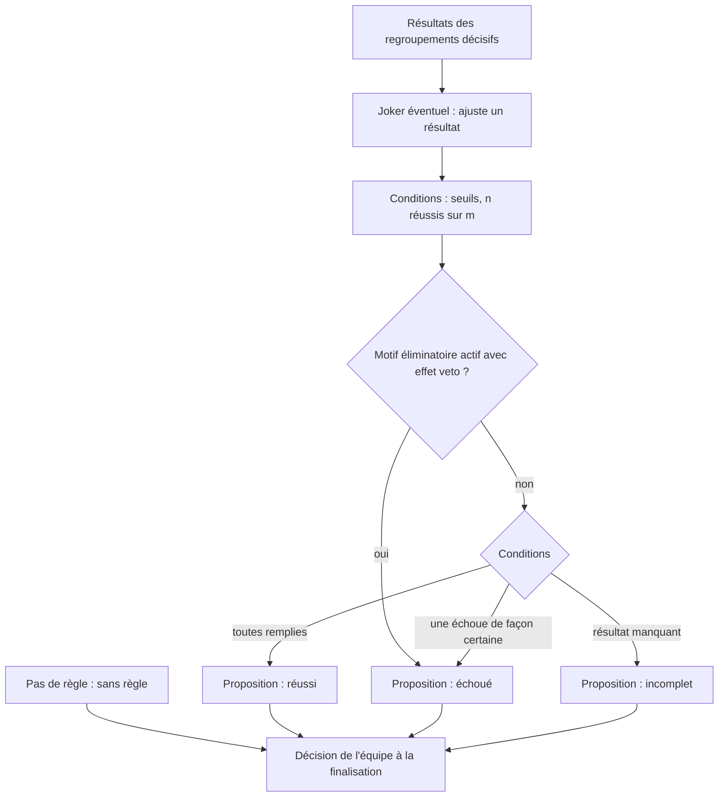
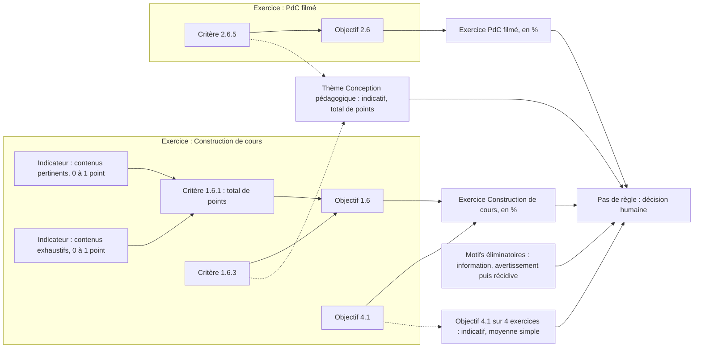
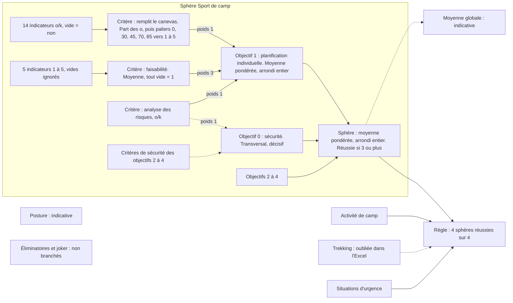
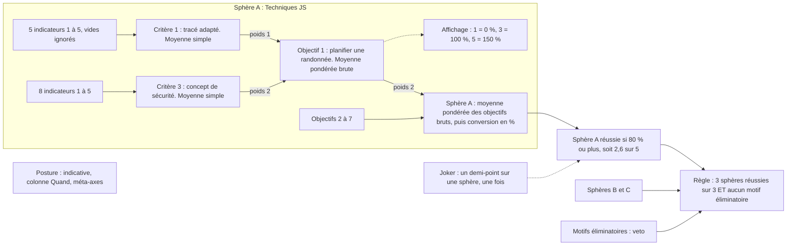
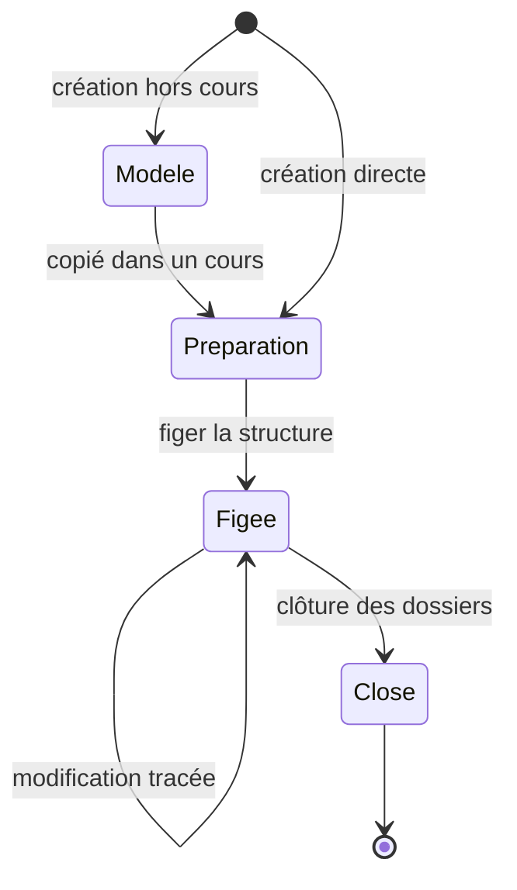

# Modèle conceptuel généralisé de l'évaluation

Ce document propose un modèle conceptuel du domaine d'évaluation d'Azimut. Il généralise les features S1 à S16 et les constats 1 à 13 de `docs/FEATURES.md`, et le confronte aux trois qualifications réelles.

> **Remplacé** par `10-modele-generique.md`, qui reprend ce document, corrige les faits démentis par `07-contre-analyse.md` et le valide sur le corpus de `09-corpus-qualifications.md`. Il est gardé pour l'historique du raisonnement.

Ce n'est pas un schéma de données. On parle de concepts, de relations et de règles. Les formules Excel ont été relues dans `.scratch/exemple qualif a analyser/` pour vérifier les détails. Chaque section distingue ce qui est **constaté** (dans les docs ou les fichiers) de ce qui est **proposé**.

## TL;DR

- **Trois noms pour trois choses** : le **modèle** (structure réutilisable, hors cours), la **grille** (la structure d'un cours) et le **dossier** (les données d'un apprenant sur cette grille). « Qualification » ne désigne plus que la démarche et son issue.
- **Un seul type de feuille notée, l'indicateur, et un seul type de nœud calculé, le regroupement.** Critère, objectif, sphère, exercice, thème, Posture et « sécurité » sont tous des regroupements. Chaque regroupement porte une agrégation, une échelle de sortie, un seuil éventuel et un statut : **décisif**, **indicatif** ou **organisationnel**.
- **Un arbre principal, plus des regroupements transversaux.** Chaque indicateur a exactement un parent dans l'arbre principal. Il peut appartenir à d'autres regroupements, sans boucle. Le **poids est porté par l'appartenance**, pas par l'élément.
- **Référentiel et exercices** : une **définition** (objectif 2.6, critère 2.6.5) peut être placée dans plusieurs **exercices**. Chaque placement est un **élément** distinct, noté indépendamment. La clé est (définition, exercice).
- **Échelles et calculs avec peu de primitives** : une échelle est toujours numérique en dessous, avec des paliers nommés si besoin. Trois conversions (points d'appui, paliers, arrondi) et trois agrégations (moyenne pondérée, nombre de réussis, minimum) couvrent les trois Excel. **Vide = non observé** dans les données. Ce que vaut un vide se décide dans l'agrégation, explicitement.
- **La règle de décision est facultative et sépare proposition et décision** : l'app calcule une **proposition** (réussi, échoué, incomplet, sans règle). L'équipe enregistre la **décision** à la finalisation. Les motifs éliminatoires ont un effet **veto** ou **information**, au choix de la grille.
- **Une note par indicateur et par dossier par défaut.** La répétition dans le temps passe par les exercices. Des observations multiples, datées, restent une option pour les grilles d'observation comme la Posture.
- **Risque principal : que le formateur doive « programmer un tableur ».** Parade : gabarits, réglages hérités, règle de décision rédigée en phrases, aperçu avec un apprenant fictif, explication de chaque calcul et contrôles de cohérence.

## 1. Problème

**Constaté** (`FEATURES.md`, « Analyse de trois qualifications réelles ») : l'arbre indicateur → critère → objectif → sphère (S2) ne suffit pas.

- Un même critère est noté plusieurs fois, dans plusieurs exercices (constat 1).
- Un critère compte dans son objectif **et** dans un regroupement transversal (constat 2).
- L'exercice est un axe de premier rang, placé différemment selon le modèle (constat 3).
- Le résultat final est une règle, pas la racine de l'arbre. Parfois elle n'existe pas (constat 4).
- Les échelles, conversions et paramètres changent d'un nœud à l'autre (constats 5 et 6).
- Des ensembles sont hors du calcul ou agissent autrement : Posture, éliminatoires, joker (constat 7).

Les Excel compensent avec des recherches sur des libellés, des plages codées en dur et des colonnes cachées. On y trouve des erreurs : sphère oubliée dans la règle de qualif2, formule cassée (`#REF!`), dénominateur faux dans l'objectif « sécurité » de qualif2. Un modèle explicite doit rendre ces erreurs impossibles ou visibles.

## 2. Glossaire proposé

### 2.1 Le double sens de « Qualification »

**Constaté** : « qualification » désigne à la fois l'arbre et les données d'un apprenant. Il y a en fait **trois** choses :

1. une structure réutilisable, préparée hors cours (L1) ;
2. la structure utilisée dans un cours précis, qui peut encore changer (L2, L3) ;
3. les données d'un apprenant sur cette structure.

**Proposé** :

| Chose | Nom proposé | Pourquoi ce nom | Rejetés |
| --- | --- | --- | --- |
| Structure réutilisable, hors cours | **Modèle** | Mot courant. Les équipes parlent déjà de « modèle Excel ». | gabarit (gardé pour les préréglages, voir §10), template (anglicisme) |
| Structure d'un cours | **Grille** | Les formateurs parlent déjà de « grille d'observation ». Le mot dit « ce qu'on remplit », sans dire « résultat ». | arbre (faux, ce n'est pas qu'un arbre), schéma, formulaire (administratif), qualification (ambigu) |
| Données d'un apprenant | **Dossier** | Un dossier se remplit au fil du cours et se clôt. Le mot existe tel quel en allemand et en italien. | fiche (évoque une seule page), bulletin (scolaire, ne parle que des notes), copie (examen), évaluation (désigne aussi l'acte) |
| Démarche et issue | **Qualification** | On garde le mot que tout le monde utilise, mais seulement pour l'ensemble : « la qualification du cours », « la qualification est réussie ». | — |

Une grille vient d'un modèle **par copie**. Modifier la grille d'un cours ne touche pas le modèle, et inversement. La grille garde la trace du modèle d'origine, ce qui permet de comparer des cours issus du même modèle (P5).

### 2.2 Termes du modèle

Les noms de niveaux (sphère, exercice, objectif, critère) restent des **libellés** choisis par grille. Ils ne sont pas des concepts du modèle.

| Terme | Définition | Rejetés |
| --- | --- | --- |
| **Cours** | Une session de formation, venue de MiData. Il a une grille et des dossiers. | — |
| **Apprenant** | Une personne qui suit un cours. Elle a un dossier par cours. | participant (garder pour MiData), candidat |
| **Référentiel** | La liste des définitions d'une grille, avec leur code. | catalogue, bibliothèque |
| **Définition** | Un objectif, un critère ou un indicateur rédigé une fois, avec son code (ex. « 2.6.5 »). | — |
| **Exercice** | Ce que l'apprenant fait et sur quoi on l'observe : exercice pratique, rendu, entretien, période du cours. Il peut avoir une date. | activité (déjà pris par « Activité de camp »), épreuve (connotation d'examen), situation (vague) |
| **Rendu** | Un exercice dont le support est un livrable (dossier, document, vidéo). C'est un type d'exercice, pas un concept à part. | livrable (gardé comme synonyme) |
| **Élément** | Une définition placée dans la grille, dans un exercice ou non. C'est un indicateur ou un regroupement. | instance, occurrence, nœud (jargon) |
| **Indicateur** | L'élément qu'on note et commente. C'est la seule chose qu'un formateur saisit. | item, ligne, case |
| **Regroupement** | Un ensemble nommé d'éléments, qui calcule un résultat (ou range seulement). | nœud, agrégat, groupe (réservé aux groupes d'apprenants, A4) |
| **Arbre principal** | Les regroupements qui rangent chaque indicateur à une seule place. C'est l'ordre de saisie et d'impression. | — |
| **Statut** | Le rôle d'un regroupement : **décisif** (peut compter pour la décision), **indicatif** (calculé, affiché, ne décide rien) ou **organisationnel** (range, ne calcule pas). | — |
| **Appartenance** | Le lien entre un regroupement et un de ses membres. Il porte le poids. | — |
| **Échelle** | Les valeurs possibles d'une note : bornes, pas, paliers nommés. | barème (sous-entend des points) |
| **Conversion** | Le passage d'une valeur à une autre échelle : points d'appui, paliers ou arrondi. | formule, mapping |
| **Agrégation** | Le calcul d'un regroupement à partir de ses membres, avec ses réglages. | formule |
| **Seuil de réussite** | La valeur à atteindre pour qu'un regroupement soit **réussi**. | minimum |
| **Axe** | Une façon transversale de classer les éléments : thème, type de critère, moment, objectif officiel. | dimension, catégorie |
| **Étiquette** | Une valeur d'un axe posée sur un élément (« thème : sécurité »). | tag |
| **Règle de décision** | Les conditions qui produisent la proposition de résultat du dossier. Facultative. | seuil final, formule finale |
| **Motif éliminatoire** | Un motif oui/non qui peut faire échouer le cours, avec justification obligatoire. | critère éliminatoire (collision avec le niveau « critère ») |
| **Joker** | Un ajustement exceptionnel, borné et justifié, d'un résultat, décidé par l'équipe. | bonus, correction |
| **Observation** | Ce qu'un formateur saisit pour un apprenant sur un indicateur : une note et/ou un commentaire, avec auteur et date. | évaluation, saisie, cellule |
| **Commentaire de synthèse** | Le commentaire d'un regroupement dans un dossier (ex. commentaire de sphère). Celui de la grille entière est le **commentaire général**. | — |
| **Rubrique libre** | Un texte prévu par la grille et rempli dans le dossier : points positifs, points à améliorer, objectifs personnels. | champ |
| **Résultat** | La valeur calculée d'un regroupement pour un dossier. Jamais saisi. | moyenne, note (réservé à l'indicateur) |
| **Proposition** | Ce que la règle de décision calcule : réussi, échoué, incomplet, ou sans règle. | — |
| **Décision** | Ce que l'équipe enregistre à la finalisation (L5). | verdict |
| **Variante** | Une grille alternative qui lit les observations du cours, pour comparer (L4). | copie, brouillon |

### 2.3 Multilingue (T1)

**Proposé** : les termes du modèle et les gabarits sont traduits par l'app. Le contenu d'une grille (textes des indicateurs, noms des paliers créés par l'équipe) est rédigé dans la langue du cours et n'est pas traduit. Pistes, **à faire valider par des formateurs germanophones et italophones** :

| fr | de | it |
| --- | --- | --- |
| Modèle | Vorlage | Modello |
| Grille | Raster | Griglia |
| Dossier | Dossier | Dossier |
| Exercice | Übung | Esercizio |
| Indicateur | Indikator | Indicatore |
| Regroupement | Gruppierung | Raggruppamento |
| Observation | Beobachtung | Osservazione |
| Motif éliminatoire | Ausschlussgrund | Motivo di esclusione |
| Joker | Joker | Jolly |

## 3. Modèle conceptuel

### 3.1 La grille (structure)

### 3.2 Le dossier (données d'un apprenant)

### 3.3 Règles du modèle (proposées)

1. **Identifiants stables.** Chaque élément a un identifiant qui ne change pas quand on le renomme, le déplace ou le recopie. Les liens ne passent jamais par un libellé ou une position.
2. **Une définition par exercice.** Dans une grille, le couple (définition, exercice) est unique. Le critère 2.6.5 peut exister dans « PdC filmé » et dans « Anim PdC OZR », mais une seule fois dans chacun. Sans exercice, une définition n'est placée qu'une fois.
3. **Arbre principal.** Chaque indicateur a exactement un parent dans l'arbre principal. L'arbre donne l'ordre de saisie, d'affichage et d'impression.
4. **Regroupements transversaux.** Un élément peut appartenir à d'autres regroupements (thème, sécurité, moyenne d'un objectif sur plusieurs exercices). Les membres sont **listés** un par un, ou **sélectionnés** par une règle simple : « toutes les occurrences de la définition 4.1 », « tout ce qui porte l'étiquette sécurité ». Il n'y a jamais de boucle.
5. **Le poids est sur l'appartenance.** Un même critère peut peser 2 dans son objectif et 1 dans un thème.
6. **Échelle de sortie homogène.** Chaque regroupement déclare l'échelle de son résultat. Tous les membres d'un regroupement qui calcule doivent produire la même échelle. Sinon, l'app demande une conversion. Il n'y a pas de conversion implicite.
7. **Statut cohérent.** Un regroupement décisif ne consomme que des indicateurs et des regroupements décisifs. Un résultat indicatif n'entre jamais dans la règle de décision. Un regroupement organisationnel n'a pas d'agrégation.
8. **Les résultats ne se saisissent pas.** Ils se recalculent toujours à partir des observations (S7). Seuls le joker et la décision de l'équipe modifient l'issue, et ils sont tracés. À la clôture (L6), on fige les résultats et la décision avec le dossier, pour que l'attestation ne change plus.
9. **Il y a toujours un résultat pour un regroupement qui calcule** (S2). Il peut être vide si rien n'est observé. La règle de décision, elle, est facultative.

Le statut et les axes se recouvrent un peu : un regroupement organisationnel range comme une étiquette. **Proposé** : un regroupement organisationnel sert à **placer** dans l'arbre principal (titres de sections, méta-axes de la Posture). Une étiquette sert à **filtrer et projeter** (P1). Si l'usage montre qu'on peut s'en passer, on fusionnera.

## 4. Échelles et conversions

### 4.1 Constaté

| Échelle | Où | Détails vérifiés dans les fichiers |
| --- | --- | --- |
| Points de 0 au poids | qualif1, tous les indicateurs | Poids toujours 1. La mise en forme distingue 0, le maximum et « entre les deux » : les demi-points semblent possibles. |
| 1 à 5 | qualif2, qualif3 | Une feuille « Echelle » décrit chaque valeur (1 = insuffisant, 3 = minimum requis, 5 = au-delà des attentes). qualif3 accepte des **décimales** dans les sphères A et B, mais seulement des **entiers** dans la sphère C. |
| o/k | qualif2 | Le type d'échelle est écrit sur la ligne du **critère** (« o/k » ou « 1-5 ») et vaut pour ses indicateurs. |
| OUI/NON, Utilisé/Inutilisé | éliminatoires | Prérempli à NON (qualif2, qualif3) ou Inutilisé (qualif1). |
| AUCUN/UTILISÉ | joker | qualif2, qualif3. |
| % | résultats | qualif1 (points / possibles), qualif3 (1 à 5 converti). |
| ++/+/-/--, 1 à 10 | — | Pas vus (constat 12). |

### 4.2 Proposé : une échelle, c'est des nombres avec des noms

Une échelle a :

- des **bornes** et un **pas** (1 à 5 par pas de 1 ; 0 à 1 par pas de 0,5 ; 0 à 150 % sans pas) ;
- des **paliers nommés**, facultatifs : une valeur numérique, un libellé court traduit, un descriptif (le texte de la feuille « Echelle ») ;
- un **sens** : plus haut veut dire mieux.

Tout se calcule sur la valeur numérique. Le libellé sert à la saisie et à l'affichage.

| Échelle | Bornes, pas | Paliers nommés |
| --- | --- | --- |
| o/k | 0 à 1, pas 1 | k = 0, o = 1 |
| ++/+/-/-- | 1 à 4, pas 1 | -- = 1, - = 2, + = 3, ++ = 4 (valeurs à choisir) |
| 1 à 5 | 1 à 5, pas 1 (ou 0,5) | 1 « insuffisant » … 5 « excellent » |
| 1 à 10 | 1 à 10, pas 1 | aucun |
| Points | 0 au poids, pas 0,5 | aucun |
| Pourcentage | 0 à 150 %, sans pas | aucun |

Les échelles sont **définies une fois par grille** et réutilisées. Les gabarits en fournissent de toutes prêtes.

**Éléments sans note (S15).** Un indicateur peut n'avoir **aucune échelle** : il se commente seulement. Il n'entre dans aucun calcul.

### 4.3 La sémantique du vide

**Constaté** : le vide ne veut pas dire la même chose partout.

| Où | Ce que vaut un vide | Source |
| --- | --- | --- |
| qualif3, indicateurs 1 à 5 | exclu de la moyenne | `AVERAGEIF(…, "<>0")` |
| qualif2, indicateurs 1 à 5 | exclu ; mais un critère **entièrement** vide vaut **1** | `IFERROR(AVERAGEIF(…), 1)` |
| qualif2, indicateurs o/k | compte comme « non » | dénominateur = toutes les lignes |
| qualif2, sphère | un objectif vide compterait 0 dans 3 sphères sur 4 (le dénominateur somme tous les poids) ; il est exclu dans Situations d'urgence | `SUMPRODUCT(F,J)/SUM(F)` |
| qualif1, points | compte comme **0 point** : les points possibles sont comptés même si la case est vide | `SUM(F)` pour le possible |

Le dernier point contredit la règle commune de `FEATURES.md` (« case vide = non observé ») : **dans qualif1, une case vide pénalise**. Il faut le confirmer avec les auteurs.

**Proposé** :

1. Dans le dossier, **vide veut toujours dire « pas d'observation »**. On ne transforme jamais un vide en valeur au moment de la saisie.
2. Ce que vaut un vide se règle **dans l'agrégation du parent**, avec trois choix :
   - **ignorer** (par défaut) : le vide sort du calcul ;
   - **compter comme** une valeur donnée (o/k : compter comme k ; points : compter comme 0) ;
   - **bloquer** : tant qu'un membre est vide, le résultat est vide.
3. Un regroupement dont tous les membres sont ignorés a un **résultat vide**. Pas de valeur de repli silencieuse comme le « 1 » de qualif2.
4. Pour les listes de contrôle o/k, le gabarit « liste de contrôle » règle d'office « compter comme non ». Le suivi (P2) compte quand même ces cases comme non remplies.
5. **« Rien à signaler »** (**N-MG1**) : le formateur peut marquer un indicateur comme vu, sans remarque. Cela distingue « rien à dire » de « oubli » pour le commentaire (constat 8), et « vu, rien de notable » de « pas encore regardé » pour la note.

### 4.4 Proposé : trois conversions

| Primitive | Ce qu'elle fait | Exemples constatés |
| --- | --- | --- |
| **Points d'appui** | Relie des points par des segments droits. Deux points = une conversion linéaire. | qualif1 : points / possibles → % (0 → 0 %, max → 100 %). qualif3 : 1 → 0 %, 3 → 100 %, 5 → 150 %. |
| **Paliers** | « À partir de telle valeur, on obtient telle valeur. » | qualif2, % de « o » → 1 à 5. Table du critère « Remplit tous les champs » : 0 → 1, 30 → 2, 45 → 3, 70 → 4, 85 → 5. Table de « Logistique et terrain » : 0, 25, 50, 75, 100. Le seuil de réussite « ≥ 3 → réussi » est aussi un palier. |
| **Arrondi** | À l'entier, au demi, au centième. | qualif2 : objectif et sphère arrondis à l'entier. qualif3 : % arrondi au centième. |

Une conversion s'applique à la **sortie d'un regroupement**. Elle porte un réglage clé : **dans le calcul** (le parent reçoit la valeur convertie) ou **à l'affichage seulement** (le parent reçoit la valeur brute).

**Constaté, et c'est important** : l'ordre change le résultat.

- qualif3 : la sphère fait la moyenne des objectifs **bruts** (1 à 5), puis convertit en %. Les % d'objectif ne sont qu'affichés. Avec deux objectifs de même poids notés 1 et 5, la moyenne brute vaut 3, donc **100 %**. La moyenne des % vaudrait (0 % + 150 %) / 2 = **75 %**, donc échoué.
- qualif2 : les arrondis sont **dans le calcul**. Une sphère brute de 2,5 s'arrondit à 3, donc réussie. Le fichier garde d'ailleurs la valeur sans arrondi dans une colonne technique.
- qualif3 : le seuil « 80 % » vaut une moyenne brute de **2,6** sur 5. La conversion cache le vrai seuil.

L'app doit donc rendre l'ordre visible. Voir l'explication du calcul (N-MG2, §10).

Exemple qualif2 (critère o/k de 14 indicateurs) : 10 « o » sur 14 → 71,4 % → palier « 70 et plus » → **4**.

Exemple qualif3 (objectif 1, sphère A) : critères 1 = 3,4, 2 = 3,0, 3 = 2,5 avec les poids 1, 1, 2 → (3,4 + 3,0 + 2 × 2,5) / 4 = 2,85 → affiché (2,85 − 1) / 2 = **92,5 %**.

## 5. Catalogue d'agrégations

### 5.1 Constaté

| Fonction | Où | Réglages vus |
| --- | --- | --- |
| Somme des points / somme des possibles | qualif1 : critère, objectif, exercice, thème | vide = 0 point |
| Moyenne pondérée | qualif3 : critères → objectif (poids 1 ou 2), objectifs → sphère (poids 1 ou 2). qualif2 : critères → objectif (poids 1 à 4), objectifs → sphère | arrondi à l'entier (qualif2) ou non (qualif3) ; vides exclus, sauf au niveau sphère de qualif2 |
| Moyenne simple | qualif3 : indicateurs → critère. qualif2 : indicateurs 1 à 5 → critère, moyenne globale indicative des sphères. qualif1 : objectif 4.1 sur 4 exercices, 2.1 sur 3 | repli à 1 si tout est vide (qualif2) ; arrondi (Trekking) |
| Part des « o » | qualif2 : indicateurs o/k → critère | vide = non ; suivie d'une table de paliers propre au critère ; **bonus +1 ou +1,5** avant la table (Situations d'urgence) |
| Nombre de réussis ≥ n | qualif3 : « 3 sphères réussies » | — |
| Tous réussis (ET) | qualif2 : règle finale | — |
| Nombre de « o » → paliers | qualif2, feuille Listes (« 8 indicateurs ou plus = 2 ») | table présente mais **non utilisée** |
| Taux de remplissage, nombre de vides, écart dû à l'arrondi | qualif2, qualif3, colonnes techniques | suivi, hors résultat |

Le **minimum** n'apparaît pas comme fonction. « Toutes les sphères ≥ seuil » revient au même.

Les **bonus +1 et +1,5** de qualif2 ne changent aucun palier dans l'état actuel : vérifié pour les critères de 6 et de 10 indicateurs, avec les seuils 0, 30, 45, 70, 85. Leur intention est inconnue.

### 5.2 Proposé : trois primitives, des préréglages

| Primitive | Réglages | Couvre |
| --- | --- | --- |
| **Moyenne pondérée** | poids (sur l'appartenance), traitement des vides | moyenne simple (poids 1) ; points / possibles (moyenne des notes ramenées à 0–1, pondérée par le maximum) ; part des « o » (moyenne de o = 1, k = 0, vide compté comme k) |
| **Nombre de réussis** | au moins n sur m, ou une proportion | « 3 sphères sur 3 », « tous réussis » (n = m) |
| **Minimum** | — | « le plus faible des membres », équivalent à « tous au-dessus du seuil » |

Le **maximum** est un candidat, non vu dans les Excel. Il servirait à la remédiation de qualif2 (« Élaboration d'un schéma de gestion de crise (remédiation !) ») : aujourd'hui la tentative et sa remédiation sont **moyennées**, et une remédiation non faite tire la sphère vers le bas, puisque ses critères o/k vides valent 1. « La meilleure des deux tentatives » serait plus juste. **À confirmer avec les auteurs.**

Les préréglages, en mots métier :

| Préréglage | Ce qu'il règle |
| --- | --- |
| Moyenne des notes | moyenne pondérée, vides ignorés |
| Total de points | moyenne pondérée par le maximum, vides = 0, affichage en % |
| Liste de contrôle | moyenne de o/k, vides = non, puis paliers vers une note |
| Tous réussis | nombre de réussis, n = m |
| Au moins n réussis | nombre de réussis, n choisi |

**À garder comme réglages explicites** : poids, traitement des vides, conversions (dont l'arrondi, avec sa position), seuil de réussite.

**À refuser** :

- **Formules libres.** C'est la porte d'entrée du tableur.
- **Bonus codés en dur.** Un bonus avant une table de paliers revient à **décaler les seuils** (« + 1 puis ≥ 70 » = « ≥ 69 »). On l'exprime dans la table.
- **Valeur de repli silencieuse** (critère vide = 1). Remplacée par « compter comme » ou « bloquer », visibles.
- **Colonnes d'ajustement manuel.** qualif3 additionne une colonne cachée à chaque % d'objectif dans la Synthèse (`E27 = … + M27`). Tout ajustement passe par le joker, tracé.

Le **suivi** (taux de remplissage, nombre de vides, indicateurs sans commentaire, écart dû à l'arrondi, moyenne brute de tous les indicateurs) n'est pas une agrégation configurable. L'app le fournit partout (P2, P3).

## 6. Règle de décision

### 6.1 Proposé : une forme composable

Une règle de décision est une liste de **conditions**, toutes nécessaires (ET). Une condition a l'une de ces formes :

- **Seuil** : « le regroupement R est réussi » (R a son seuil de réussite) ;
- **n sur m** : « au moins n regroupements réussis parmi R1 … Rm » ;
- **Veto** : « aucun motif éliminatoire à effet veto n'est actif ».

Le **joker** n'est pas une condition. Il ajuste un résultat **avant** l'évaluation des conditions, dans les bornes de la règle de joker.

Le OU n'a pas été vu. « Au moins 1 sur m » le couvre si besoin.

La règle se rédige **en phrases** dans l'app : « Le cours est réussi si [toutes] les [sphères] sont réussies et si [aucun motif éliminatoire] n'est actif. »

### 6.2 États de sortie

La règle produit une **proposition**. L'équipe enregistre ensuite une **décision** à la finalisation (L5).

| Proposition | Quand |
| --- | --- |
| **Réussi** | Toutes les conditions sont remplies. |
| **Échoué** | Un veto est actif, ou une condition échoue de façon certaine. Si deux sphères sur trois sont déjà échouées, « 3 sur 3 » est échoué même si la troisième est vide. |
| **Incomplet** | Il manque un résultat pour conclure. |
| **Sans règle** | La grille n'a pas de règle (qualif1). |

| Décision | Qui, quand |
| --- | --- |
| **À décider** | Tant que l'équipe n'a pas statué. |
| **Réussi** ou **échoué** | L'équipe, à la finalisation. Auteur, date. Si la grille n'a pas de règle : justification obligatoire. |

**Proposé** : la décision suit la proposition. S'en écarter n'est possible qu'avec un joker, si la grille en prévoit un. Sinon le joker n'aurait pas de sens. C'est une **question de politique de cours à trancher** : certaines équipes voudront peut-être un dernier mot humain sans joker.

### 6.3 Les trois cas

| | Règle exprimée dans le modèle |
| --- | --- |
| **qualif1** | Pas de règle. Proposition « sans règle ». Les % par exercice et par thème sont des résultats indicatifs. Les motifs éliminatoires ont l'effet **information**. Décision humaine, justifiée. |
| **qualif2** | Chaque sphère a le seuil « ≥ 3 » (sur 1 à 5, après arrondi). Règle : « au moins 4 sphères réussies sur 4 ». L'Excel n'en teste que 3 : Trekking est oubliée. La moyenne globale est un regroupement **indicatif**. Éliminatoires et joker sont prévus mais pas branchés : effet **information** jusqu'à confirmation. |
| **qualif3** | Chaque sphère a le seuil « ≥ 80 % ». Règle : « au moins 3 sphères réussies sur 3 » ET veto « aucun motif éliminatoire ». Joker : une fois, une sphère, un demi-point, justification obligatoire. |

### 6.4 Motifs éliminatoires et joker

**Motif éliminatoire (S12).** Effet **veto** ou **information**, réglé par motif. L'activer demande une justification. **Constaté** dans qualif1 : un motif activé vaut d'abord **avertissement**, et l'élimination ne vient qu'en cas de récidive. **Proposé** : les avertissements sont des observations datées sur le motif (§8). L'activation reste une décision de l'équipe.

**Joker (S13).** **Proposé** : une **règle de joker** facultative dans la grille, avec les cibles permises (ex. les sphères), l'amplitude maximale (ex. 0,5), le nombre maximal (ex. 1), la justification obligatoire et le moment (finalisation). **Incertain** dans qualif3 : le demi-point s'applique-t-il à la note brute de la sphère ou au % ? Sous 3, un demi-point brut vaut +25 % ; au-dessus de 3, il vaut +12,5 %. La colonne d'ajustement cachée de la Synthèse agit, elle, sur les **objectifs** en %. Rien ne dit que le joker est général : qualif1 n'en a pas.

## 7. Validation par les trois cas

Chaque schéma montre un échantillon représentatif, pas toute la grille. Flèche pleine = arbre principal. Pointillés = regroupement transversal ou indicatif.

### 7.1 qualif1 : exercices, points et thèmes

| Concept du modèle | Dans qualif1 |
| --- | --- |
| Exercices | 7 (Construction de cours, PdC filmé, Planif PdC OZR…). Ils forment le premier niveau de l'arbre principal. |
| Référentiel | Objectifs et critères codés (1.6, 2.6.5). Le même code revient dans plusieurs exercices. |
| Échelle | Points de 0 à 1 par indicateur. |
| Agrégation | « Total de points » à tous les niveaux, vides = 0. |
| Regroupements transversaux | 4 thèmes **indicatifs**, membres listés (exercice, critère). 2 moyennes **indicatives** : l'objectif 4.1 sur 4 exercices, l'objectif 2.1 sur 3 exercices. Membres sélectionnés par définition. |
| Règle, joker | Aucune règle, pas de joker. |

**Alertes** :

- Vide = 0 point. C'est contraire à la règle supposée commune. Le modèle l'exprime (« compter comme 0 »), mais il faut confirmer que c'est voulu.
- Les thèmes font un total de points ; les moyennes de 4.1 et 2.1 font une moyenne de %. Deux logiques différentes dans la même Synthèse. Le modèle les exprime toutes les deux.
- La décision humaine n'a aucun support dans l'Excel. Le modèle ajoute une décision enregistrée et justifiée.

### 7.2 qualif2 : sphères, o/k mélangés, sécurité transversale

| Concept du modèle | Dans qualif2 |
| --- | --- |
| Exercices | Confondus avec les objectifs (« planification individuelle », puis « planification en groupe »). Le modèle peut les déclarer comme exercices pour la vue par rendu, sans changer le calcul. |
| Échelles | 1 à 5 et o/k, réglés par critère. |
| Conversions | Paliers propres au critère (3 tables utilisées, une quatrième présente mais inutilisée). Arrondi à l'entier **dans le calcul**, pour l'objectif et la sphère. |
| Regroupements transversaux | Objectif « 0. sécurité » **décisif**, qui compte dans la sphère. Ses membres sont des critères d'autres objectifs. |
| Indicatifs | Moyenne globale des sphères, Posture, taux de remplissage. |
| Règle | 4 sphères réussies sur 4 (l'Excel en teste 3). |

**Alertes** :

- **Double comptage** : les critères de sécurité comptent dans leur objectif **et** dans l'objectif 0, qui compte lui-même dans la sphère. Le modèle le permet. L'app doit le signaler à la création (N-MG3) et l'équipe doit confirmer que c'est voulu.
- **Erreur de formule** dans l'objectif 0 de Sport de camp : le dernier terme du dénominateur somme des notes au lieu de poids. Le modèle rend cette erreur impossible.
- **Repli à 1** d'un critère 1 à 5 vide et **vide = non** en o/k : une remédiation non faite vaut 1 et fait baisser la sphère. Le modèle ne reproduit pas ce comportement sans un réglage explicite.
- Le critère « Faisabilité du sport du camp » de l'objectif 2 est marqué « o/k » mais calculé comme du 1 à 5. Le modèle impose une seule échelle par indicateur.
- **Bonus +1 et +1,5** sans effet mesurable. À remplacer par des seuils explicites si l'intention est confirmée.
- **On ne reproduira pas l'Excel à l'identique.** Les résultats de l'app peuvent différer là où l'Excel est incohérent. Il faut l'accepter avec les auteurs.

### 7.3 qualif3 : moyennes pondérées, conversion non linéaire, veto

| Concept du modèle | Dans qualif3 |
| --- | --- |
| Exercices | Cachés dans les libellés (« Planification randonnée », « Correction SC »). Le modèle en fait des exercices ou une étiquette « rendu ». |
| Échelle | 1 à 5 (décimales permises en A et B, pas en C). |
| Agrégation | Moyenne simple (indicateurs → critère), moyenne pondérée (critères → objectif, objectifs → sphère), vides ignorés. |
| Conversion | Points d'appui 1 → 0 %, 3 → 100 %, 5 → 150 %. **À l'affichage** pour l'objectif, **dans le calcul** pour la sphère. |
| Axes | Méta-axes de la Posture (« Énergie globale », « Énergie individuelle », « Comportement ») ; table de couverture des objectifs officiels MSdS (axe organisationnel « objectif officiel »). |
| Règle | 3 sphères ≥ 80 % sur 3, ET veto des motifs éliminatoires. Joker. |

**Alertes** :

- L'**ordre conversion / agrégation** compte (§4.4). Le modèle l'exprime avec le réglage « dans le calcul ou à l'affichage ». Un formateur ne le devinera pas seul : il faut l'explication du calcul.
- Le **joker** est ambigu (note brute ou %, sphère ou objectif). À clarifier avant de le modéliser plus finement.
- La **colonne « Quand »** de la Posture est du texte libre. Elle appelle des observations datées (§8).
- La sphère B a deux objectifs numérotés « 4 » dans la Synthèse (« Réunions » et « Organisation maîtrises »), liés par numéro de ligne codé en dur. L'identifiant stable règle ce cas.

### 7.4 Ce qui ne rentre pas, ou mal

| Point | Pourquoi c'est un signal |
| --- | --- |
| Joker de qualif3 | Sa cible et son échelle sont floues. Le modèle le borne, mais la règle métier reste à écrire. |
| Avertissement puis récidive (qualif1) | C'est une procédure dans le temps, pas un booléen. Le modèle la traite par des observations datées sur le motif, et une activation décidée par l'équipe. Non éprouvé. |
| Remédiation (qualif2) | Une deuxième tentative est aujourd'hui moyennée. Si « meilleure tentative » est voulu, il faut le maximum. |
| Résultats différents de l'Excel | Les incohérences (vides, repli à 1, double comptage, formules cassées) ne seront pas reproduites. |
| Vides et usage réel | Les trois fichiers sont vierges (constat 13). Le traitement des vides et l'usage des commentaires restent des hypothèses. |
| Table « nombre de o → note » de qualif2 | Non utilisée. Les paliers la couvrent si l'entrée est un nombre au lieu d'un %. À vérifier si quelqu'un en a besoin. |

## 8. Observations

**Constaté** : chaque Excel a **une case par indicateur et par apprenant**. La Posture ajoute une colonne « Quand ». Une note de relecture dit qu'un indicateur sans commentaire est ambigu. `FEATURES.md` veut un historique de chaque modification (C7) et le suivi de l'évolution d'une note.

### Option A : une note par indicateur et par dossier

Une seule observation par (dossier, indicateur) : une note, un commentaire, l'auteur et la date de la dernière modification. Les corrections vont dans l'historique.

- Simple à saisir, comme l'Excel. Le calcul ne change pas.
- La répétition dans le temps passe par les **exercices** : « planification individuelle » puis « planification en groupe » sont deux éléments distincts. C'est déjà le cas dans qualif2.
- **Limite** : l'historique mélange **correction** (« je me suis trompé ») et **évolution** (« il a progressé »). On ne sait pas lire l'évolution sans ambiguïté.
- Deux formateurs qui observent la même chose écrivent dans la même case : dernier gagnant (C4).

### Option B : plusieurs observations datées et attribuées

Chaque formateur ajoute ses observations : une note et/ou un commentaire, un auteur, une date, un exercice éventuel.

- Fidèle à la Posture et au constat 8. Plus de conflit sur une case : chacun ajoute la sienne.
- L'évolution se lit directement (P3, P6). L'historique ne sert plus qu'aux corrections.
- **Coût** : il faut une règle pour tirer **une** note de plusieurs observations : la dernière, la moyenne, la meilleure, ou une **note retenue** choisie par l'équipe. Chaque règle change le résultat.
- La saisie se complique (ajouter ou corriger ?), le volume grossit, et un résultat peut bouger quand un collègue ajoute une observation.

### Recommandation

**Option A par défaut, option B en réglage par regroupement.**

- Par défaut, une note par indicateur et par dossier. La répétition passe par les exercices, explicites.
- Un regroupement peut passer en **mode journal** (**N-MG7**) : plusieurs observations par indicateur, avec une règle de note retenue (la dernière, par défaut). Usage visé : la Posture et les avertissements sur les motifs éliminatoires.
- Partout, l'auteur et la date de l'observation sont connus. Le marqueur **« rien à signaler »** (N-MG1) lève l'ambiguïté entre « rien à dire » et « oubli ».
- **Historique ≠ observation** : l'historique trace les corrections (C7, C8). Une observation est un fait distinct, daté. Ne pas utiliser l'historique pour montrer une progression.

**Risque** : deux modes de saisie dans l'app. Il faut vérifier sur une qualification remplie si le mode journal est vraiment utilisé.

## 9. Structure qui change pendant le cours

**Constaté** (L2, L3) : la structure est figée avant le cours, mais on la modifie quand même, par exemple pour supprimer un indicateur. L'effet sur les données saisies n'est pas défini. Dans l'Excel, on édite le fichier sans versions.

### 9.1 Effet des opérations dans ce modèle

Les observations sont rattachées à l'**identifiant stable** de l'indicateur, pas à sa place. Les résultats ne sont jamais stockés en tant que tels : ils se recalculent.

| Opération | Effet sur les données saisies | Règle proposée |
| --- | --- | --- |
| **Retirer** un indicateur ou un regroupement | Ses observations restent dans les dossiers, mais sortent du calcul et de la saisie. Les résultats parents changent. | Pas de suppression pendant le cours : on **retire** (**N-MG5**). Un élément retiré se consulte et se rétablit. Suppression définitive seulement s'il n'a aucune observation. |
| **Ajouter** un indicateur | Il est vide dans tous les dossiers. Avec « ignorer », aucun résultat ne change. Avec « compter comme 0 » ou « compter comme non », les résultats baissent. | Permis. L'app montre combien de dossiers changent de proposition. |
| **Déplacer** un élément (autre parent) | Les observations suivent l'élément. L'ancien et le nouveau parent sont recalculés. | Permis. Si le déplacement change l'exercice et que (définition, exercice) existe déjà, refus : il faut **fusionner** explicitement. |
| **Changer l'échelle** d'un indicateur déjà noté | Les notes saisies n'ont plus de sens. | Refus, sauf si l'équipe fournit une correspondance (ex. 1 à 5 → o/k : 3 et plus = o). |
| **Changer un réglage** (poids, seuil, conversion, règle) | Tous les résultats concernés changent. | Permis. Aperçu de l'impact avant validation, ou passage par une variante. |
| **Renommer** un élément | Aucun effet sur les données. | Permis. Si le sens change, mieux vaut retirer et ajouter. L'app ne peut pas le détecter. |

### 9.2 Règle générale

1. Avant le figeage (L2), tout est libre.
2. Après le figeage, chaque changement de structure est une **modification tracée** : auteur, date, motif, impact. Elle est réservée à un rôle (A3) et visible dans chaque dossier concerné (« le seuil de la sphère B a changé le 12 avril »).
3. Rien ne détruit une observation pendant le cours.
4. Pour tester un changement, on passe par une **variante** (**N-MG4**, L4). C'est une grille alternative qui **lit les observations du cours** sans les copier. On compare les propositions des deux grilles, dossier par dossier. Si la variante convainc, elle remplace la grille, en une modification tracée. Comme les observations ne sont pas copiées, la variante reste à jour pendant que la saisie continue. Une observation sur un indicateur qui n'existe que dans la variante y reste.
5. Après la clôture (L6), plus rien ne change.

## 10. Arbitrages et recommandations

### 10.1 Questions ouvertes de FEATURES.md

| Question ouverte | Option recommandée | Pourquoi | Risque |
| --- | --- | --- | --- |
| Vocabulaire structure / données | **Modèle**, **grille**, **dossier** ; « qualification » pour la démarche | Trois choses distinctes, mots courants, traduisibles | L'habitude de dire « la qualif de Toto » restera. Peu grave si l'app dit toujours « dossier ». |
| Référentiel et instances | Plusieurs **éléments** liés à une même **définition**, clé (définition, exercice) | Notes indépendantes par exercice, regroupement possible par définition | Plus de concepts à expliquer qu'un simple arbre |
| Référentiel partagé entre cours | Non pour l'instant : référentiel par grille, copié avec le modèle, origine gardée | Simple ; la trace d'origine suffit pour comparer des cours (P5) | Des modèles divergent avec le temps |
| Au-delà de l'arbre | **Arbre principal** + regroupements transversaux, sans boucle | Couvre thèmes, sécurité, moyennes multi-exercices | Double comptage possible : à signaler |
| Un indicateur dans plusieurs regroupements ? | Oui. Poids sur l'appartenance | Constat 2 | Lisibilité des poids |
| Exercice, rendu, thème, type de critère | Exercice = contexte d'observation (rendu = type d'exercice) ; thème = regroupement transversal ; type de critère = axe | Constat 3 ; seul l'exercice change l'identité d'un élément | Le mot « exercice » ne parle pas à toutes les équipes |
| Généralisation des échelles | Échelle numérique + paliers nommés + sens | Couvre o/k, 1 à 5, points, % ; prête pour ++/+/-/-- et 1 à 10 | Valeurs numériques de ++/+/-/-- arbitraires |
| Conversions | Points d'appui, paliers, arrondi ; « dans le calcul » ou « à l'affichage » | Couvre les trois Excel | L'ordre des opérations reste difficile à comprendre |
| Catalogue d'agrégations | Moyenne pondérée, nombre de réussis, minimum (+ maximum à confirmer), avec préréglages | Tout ce qui est vu s'y ramène | Un cas réel non couvert apparaîtra peut-être (médiane ?) |
| Bonus et arrondis codés en dur | Réglages explicites ; bonus → seuils décalés | Les bonus vus n'ont aucun effet ; l'arrondi change les résultats | Écarts avec les anciens Excel |
| Vide | Vide = non observé ; traitement dans l'agrégation (ignorer, compter comme, bloquer) | Une seule sémantique dans les données, réglage visible | qualif1 pénalise le vide : à confirmer |
| Toujours un résultat calculé ? | Oui pour les regroupements qui calculent ; règle de décision facultative | qualif1 n'a pas de règle | — |
| Plusieurs résultats en parallèle | Oui : une seule règle de décision, le reste indicatif | Constat 4 | Les formateurs confondent indicatif et décisif : il faut un marquage clair |
| Seuil final | La règle de décision, rédigée en phrases | Remplace le `IF(AND(…))` qui a oublié Trekking | — |
| Éléments commentés sans note | Indicateur sans échelle | Rien de nouveau à apprendre | — |
| Posture | Regroupement indicatif, éventuellement en mode journal | Pas besoin d'un concept à part | Si la Posture devient décisive un jour, il suffit de changer son statut |
| Éliminatoires | Effet veto ou information, réglé par motif ; justification obligatoire | qualif3 veto, qualif1 avertissement | Une procédure plus riche (avertissement, récidive) reste peu outillée |
| Joker | Règle de joker facultative : cibles, amplitude, nombre, justification | Seul qualif3 l'utilise vraiment | Sémantique floue (brut ou %) |
| Observations multiples | Une note par défaut, mode journal en option | Simple d'abord, Posture couverte | Deux modes de saisie |
| « Rien à dire » ou « oubli » | Marqueur « rien à signaler » (N-MG1) | Lève l'ambiguïté du constat 8 | Un clic de plus par indicateur |
| Indicateur supprimé en cours | Retrait, pas suppression (N-MG5) | Ne perd rien, réversible | Des éléments retirés encombrent la vue de structure |
| Copie pour comparer | Variante liée qui lit les mêmes observations (N-MG4) | Toujours à jour, comparaison directe | Une observation saisie dans la variante seule peut se perdre si on l'abandonne |

### 10.2 Le risque principal : programmer un tableur

Le modèle est assez riche pour exprimer les trois Excel. Il est donc assez riche pour qu'un formateur s'y perde. Si créer une grille demande de choisir une fonction, des poids, une conversion et un traitement des vides **à chaque nœud**, on aura recréé Excel avec moins de liberté.

**Proposé, pour limiter ce risque** :

1. **Gabarits de grille** (**N-MG6**). On ne part jamais de zéro : « Grille à points par exercice » (type qualif1), « Grille 1 à 5 avec seuil par sphère » (type qualif2 ou qualif3), « Liste de contrôle ». Plus tard : « Partir de la grille d'un cours précédent ».
2. **Préréglages nommés en mots métier** : « Moyenne des notes », « Total de points », « Liste de contrôle », « Tous réussis ». Les primitives restent cachées.
3. **Réglages hérités.** On règle une fois au niveau de la sphère : échelle, agrégation, vides. Les niveaux du dessous héritent. Une exception est marquée visiblement.
4. **Options avancées repliées** : arrondi, position de la conversion, traitement des vides, poids. Visibles seulement à la demande.
5. **Règle de décision en phrases**, avec des listes à choisir, pas une formule.
6. **Aperçu avec un apprenant fictif** (**N-MG2**). Le formateur saisit quelques notes et voit tous les résultats et la proposition. Il peut aussi rejouer le calcul sur les dossiers d'un cours passé.
7. **Explication de chaque résultat** (N-MG2). Un clic sur un résultat montre la chaîne : « moyenne pondérée de 3,4 (×1), 3,0 (×1) et 2,5 (×2) = 2,85 → 92,5 % ». Ce serait utile aussi pendant le cours.
8. **Contrôles de cohérence** (**N-MG3**) avant le figeage : regroupement décisif absent de la règle (le cas Trekking), élément compté deux fois, échelles incompatibles, poids nul, regroupement sans membre, seuil hors de l'échelle.
9. **Saisie du référentiel par copier-coller** d'une liste numérotée (« 1.6.1 Listing des contenus… »), pour ne pas créer 290 indicateurs à la main.

### 10.3 Nouvelles features proposées

| ID | Feature |
| --- | --- |
| N-MG1 | Marqueur « rien à signaler » sur un indicateur |
| N-MG2 | Aperçu avec un apprenant fictif et explication de chaque calcul |
| N-MG3 | Contrôles de cohérence de la grille avant le figeage |
| N-MG4 | Variante liée, qui lit les observations du cours, et comparaison des propositions |
| N-MG5 | Retrait (au lieu de suppression) et modifications de structure tracées |
| N-MG6 | Gabarits de grille et préréglages d'agrégation |
| N-MG7 | Mode journal : plusieurs observations datées par indicateur, avec note retenue |

### 10.4 Ce qui reste incertain

- **L'usage réel.** Les trois fichiers sont vierges. Le traitement des vides, la place des commentaires et le besoin du mode journal ne se vérifient qu'avec une qualification remplie et anonymisée.
- **Les intentions des auteurs** : vide = 0 dans qualif1, bonus de qualif2, remédiation moyennée, sécurité comptée deux fois, joker de qualif3. Le modèle sait exprimer chaque option, mais il faut choisir.
- **Écart avec les Excel.** Le modèle ne reproduira pas les incohérences. Les équipes doivent accepter des résultats parfois différents.
- **La politique de décision** : la décision de l'équipe peut-elle s'écarter de la proposition sans joker ?
- **Les noms allemands et italiens** sont des pistes, à faire valider.
- **Qualix** n'a pas été analysé ici. Il faut comparer ce modèle au sien avant de figer le vocabulaire.
- **La frontière entre regroupement organisationnel et étiquette** est mince. On pourra fusionner les deux si l'usage le permet.
