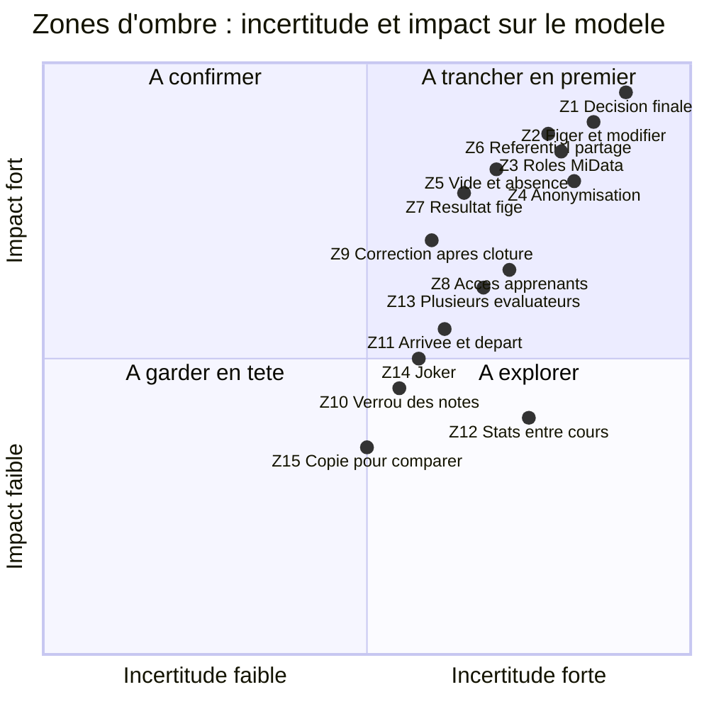
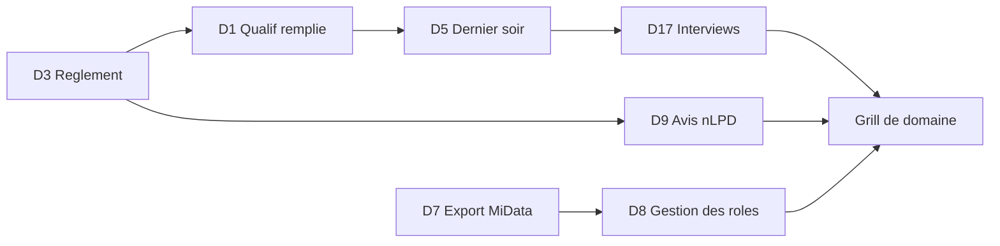

# Zones d'ombre du domaine Azimut

Ce document recense ce qui est flou, contradictoire ou non traité dans le domaine, pour décider quoi clarifier avant de modéliser. Les IDs de features (S1, L3, C4…) sont ceux de `00-inventaire.md`.

## TL;DR

- Les docs contiennent **au moins 10 contradictions** internes. Les plus lourdes touchent le résultat final, le sens de « figer » et l'anonymisation.
- **« Il y a toujours un résultat calculé »** est déjà démentie par qualif1 (aucune décision) et par le fait que la décision finale est une règle, pas la racine d'un arbre.
- **L'anonymisation à 3 mois** entre en conflit avec l'historique, les commentaires libres, les PDF envoyés et les statistiques entre cours.
- **Aucune règle** n'existe pour les cas humains : apprenant qui part, absent, évaluateurs en désaccord, correction après clôture, recours.
- Les docs **supposent** un cours = une qualification, une structure identique pour tous les apprenants, un résultat individuel et un réseau fiable. Chacune de ces hypothèses est à vérifier.
- Les trois blocages les plus forts : la **règle de décision finale**, le **cycle de vie de la structure** (figer, modifier, copier) et la **correspondance rôles MiData / droits**.
- Tout ce qui suit est **proposé** comme analyse, sauf mention « constaté » (cité des docs ou des Excel).
- La levée des doutes passe par peu de données de terrain : une qualification remplie, le règlement du cours, un dernier soir observé.

## 1. Contradictions et tensions

Chaque ligne cite deux énoncés (section de `FEATURES.md` ou de `TODO.md`) et décrit le conflit.

| # | Énoncé A | Énoncé B | Le conflit | Features |
| --- | --- | --- | --- | --- |
| K1 | « Il y a toujours un résultat calculé » (Structure d'une qualification) | qualif1 n'a **aucun** résultat final, seulement des % ; « le résultat est une règle de décision, pas la racine d'un arbre » (constat 4) ; question ouverte « garder la règle ou la rendre facultative ? » | Le mot « résultat » désigne trois choses : la valeur d'un nœud (toujours calculée), la moyenne indicative, la décision de réussite. Seule la première est toujours vraie. | S2, S11 |
| K2 | « Réservé aux formateurs » ; « les apprenants n'y ont pas accès » (Acteurs et accès) | « Envoyer aux apprenants ne contredit pas l'accès réservé » (Intégrations) | Envoyer le PDF revient à **donner accès** aux données à une personne hors équipe, en dehors d'Azimut, sans contrôle. Il faut une adresse mail, qui n'est pas dans la liste des données connues. Le droit d'accès nLPD pousse dans le même sens. | A1, I3, T2 |
| K3 | « La structure est figée avant le cours » (Cycle de vie, étape 1) | « La structure peut quand même changer en cours de route » (étape 2) | « Figer » veut dire deux choses selon l'étape : interdit de modifier, ou modifiable avec précaution. On ne sait pas qui peut défiger ni quand. | L2, L3 |
| K4 | **Dernier gagnant** (Saisie collaborative) | « Le serveur refuse l'écriture sur une cellule verrouillée » (`CELL_LOCKED`, TODO) | Le dernier gagnant suppose que toute écriture passe. Le refus de l'écriture crée une saisie perdue côté formateur. Si la coupure fait expirer le verrou, la saisie « en retard » écrase ou est refusée ? | C3, C4, C6 |
| K5 | « Aucune saisie perdue lors d'une coupure » (Hors ligne) | « La survie à un rechargement n'est pas exigée » (TODO) ; l'écriture échouée est annulée (TODO, coupure courte) | « Ne rien perdre » est promis sans condition, puis limité à l'onglet ouvert. Sur un téléphone, l'onglet se recharge souvent. | C6, C9 |
| K6 | **Anonymisation à 3 mois** : « supprimer tous les noms, garder notes, commentaires, structure » (Idées) | L'historique garde l'**auteur** de chaque modification ; les commentaires libres contiennent des noms ; les PDF envoyés restent chez les apprenants ; la copie « pour comparer » duplique les données | Une anonymisation de façade (noms retirés de la fiche) laisse les noms dans l'historique, les commentaires et les copies. Les auteurs sont des formateurs, donc des personnes aussi. Une personne identifiable par ses seuls commentaires n'est pas anonyme. | L9, L4, C7, S16 |
| K7 | « Statistiques sur plusieurs cours » (Statistiques) | « Un formateur ne voit **que** les cours auxquels il participe… jamais accès aux autres cours » (Acteurs et accès) | Les stats entre cours exigent une vue hors périmètre. Reste à savoir qui voit quoi : tout le monde des agrégats anonymes, ou seulement un rôle particulier. Le doc ne prévoit pas de rôle hors cours. | P5, A2 |
| K8 | « Le serveur ne stocke que les données maîtres ; les moyennes sont calculées sur le client » (TODO, Données stockées) | « À la clôture, la qualification est figée, puis imprimée ou exportée en PDF » ; décision de réussite à prouver | Le résultat qui fait foi (réussi ou non) n'existe nulle part de façon durable. Si la règle ou la structure évolue, un calcul refait plus tard peut donner un autre résultat. Le TODO prévoit que le serveur calcule pour l'export, ce qui n'exclut pas cette dérive. | L6, L7, S11 |
| K9 | **Verrou sur les cellules de texte** seulement ; « reste à définir si les notes sont aussi verrouillées » | Dernier gagnant pour tout ; « on n'édite jamais une même cellule à plusieurs » (TODO) | Pour une note, deux formateurs peuvent poser une valeur différente en même temps sans verrou. Le dernier gagnant écrase l'autre sans prévenir, alors qu'il s'agit d'un désaccord d'évaluation (voir E4). | C3, C4 |
| K10 | « Un cours = une qualification » (Contexte, implicite) ; « qualification = structure + données » (Vocabulaire) | Le « référentiel » partagé et les instances (constat 1) ; brouillon hors cours puis lien à un cours | Si la structure peut exister sans cours, et si plusieurs cours la partagent, la qualification n'appartient plus à un seul cours. Qui est propriétaire de la structure ? | S8, L1 |
| K11 | « Chaque nœud produit un résultat à partir de ses enfants » (arbre) | Un élément a plusieurs parents (constat 2) ; Posture et éliminatoires hors arbre (constat 7) | L'arbre ne décrit pas le calcul réel. L'ordre de calcul entre regroupements décisifs et indicatifs n'est pas défini, et le recalcul « type tableur » dépend de cet ordre. | S2, S9, S14 |
| K12 | « Case vide = non observé, exclue des moyennes » (constat commun) | « Un indicateur sans commentaire est ambigu : rien à dire ou oubli ? » (constat 8) ; en ok/ko, vide = « non » | Une même case vide a trois sens : non observé (exclu), « non » (compte), oubli. La moyenne d'un apprenant mal observé est biaisée sans que personne le voie. | S5, P2, S15 |
| K13 | Éliminatoires : veto qui **bloque** (qualif3) | Éliminatoires « non branchés » dans qualif1 et qualif2 ; question ouverte « veto ou simple information ? » | Le même concept a trois comportements. Un veto automatique sur un critère comme « absences » est lourd de conséquences, pour un mineur. | S12 |
| K14 | Joker appliqué « à la main », un demi-point, une seule fois (qualif3) | Joker présent seulement comme liste non branchée (qualif2), absent (qualif1) ; défini comme « mécanisme de finalisation » | On ne sait pas si le joker modifie une note, un résultat de sphère ou la décision, ni si le résultat affiché inclut le joker. Il casse la règle « tout est calculé ». | S13, L5 |
| K15 | « Posture : notée, commentée, hors résultat » | Observations datées et attribuées (constat 8) ; stats d'évolution (P3) | Une grille qui n'entre pas dans le résultat peut y entrer en pratique via le commentaire général. La limite entre « indicatif » et « décisif » est une décision humaine, non modélisée. | S14, S9 |

## 2. Cas limites métier non traités

Colonnes : situation, ce que les docs disent (rien, sauf indication), risque, features touchées. Tous sont **proposés** comme cas à trancher.

### 2.1 Personnes et participation

| # | Cas | Pourquoi c'est un trou | Features |
| --- | --- | --- | --- |
| E1 | **Apprenant qui quitte le cours en route** (blessure, abandon, exclusion) | Ses notes existent. Il n'est pas évalué sur toute la durée. Pas de statut (abandon, exclu, malade). Faut-il une qualification partielle ? Figer à la date de départ ? | I2, L6, P4 |
| E2 | **Apprenant qui rejoint en route** (remplaçant, inscription tardive) | Les indicateurs déjà évalués pour les autres n'ont pas de note pour lui. Ses vides doivent-ils compter « non observé » ? Faut-il des exercices manqués ? | I2, S5 |
| E3 | **Retiré de MiData alors qu'il a des notes** (cité dans les docs, sans réponse) | Supprimer ses notes, les garder cachées, ou lui garder l'accès ? Un retrait par erreur de MiData ne doit pas détruire des données. | I2, L9 |
| E4 | **Deux formateurs ne sont pas d'accord sur une note** | Le dernier gagnant efface le désaccord. Il n'y a ni double évaluation, ni décision d'équipe tracée. Le formateur référent a-t-il le dernier mot ? | C4, S16, A5 |
| E5 | **Apprenant absent pendant un exercice** | Non observé (vide, exclu), « ko » ou critère éliminatoire « absences » ? Les trois ont des effets différents sur la décision. Qui qualifie l'absence : justifiée ou non ? | S5, S12 |
| E6 | **Formateur qui change de cours ou quitte l'équipe en cours** | Que deviennent ses notes et son verrou ? Garde-t-il l'accès après son départ ? Ses commentaires restent attribués à lui. | A3, I1, C7 |
| E7 | **Formateur ajouté tard à l'équipe** | Voit-il tout l'historique ? Peut-il modifier des notes antérieures ? Un rôle donné dans MiData le jour même est-il visible tout de suite ? | I1, A3 |
| E8 | **Apprenant inscrit dans deux cours** (cours parallèles, cours de formation successifs) | Une personne, deux qualifications. Lien entre elles ? Stats par personne dans le temps (P3) ? Identité stable hors du cours ? | I2, P3, L9 |
| E9 | **Formateur qui est aussi parent ou proche d'un apprenant** | Conflit d'intérêts : doit-il être empêché d'évaluer ou de voir cet apprenant ? Qui le sait, à part l'équipe ? | A2, A4 |
| E10 | **Apprenant mineur : droit d'accès, rectification, représentant légal** | La nLPD donne des droits d'accès et de rectification. Qui répond ? Quelles données sont fournies (notes, commentaires, historique, noms des formateurs) ? | T2, A1 |
| E11 | **Personne qui demande l'effacement avant les 3 mois** | Peut-on tout effacer d'un cours sans casser les stats et la comparabilité ? Qui exécute ? | L9, T2 |

### 2.2 Évaluation et décision

| # | Cas | Pourquoi c'est un trou | Features |
| --- | --- | --- | --- |
| E12 | **Exercice de groupe noté une seule fois pour tout le groupe** | La note est-elle copiée sur chaque membre ou partagée ? Qu'arrive-t-il si un membre est absent ou si on veut nuancer un seul membre ? | A4, S8, C1 |
| E13 | **Groupe qui change en cours** (réaffectation, groupes différents selon l'exercice) | Un groupe d'évaluation est-il fixe pour le cours ou propre à un exercice ? Le doc parle d'un « sous-ensemble », sans durée de vie. | A4 |
| E14 | **Commentaire qui nomme un autre apprenant** (« a bien dirigé avec Léa ») | Après anonymisation et pour le PDF, le nom d'un tiers fuit. Pas de règle sur ce que le PDF peut contenir. | L9, L7, S6 |
| E15 | **Données sensibles dans un commentaire** (santé, famille, comportement, discipline) | Les commentaires libres sont conservés 3 mois et peuvent être envoyés. Pas de consigne, ni de séparation entre commentaire interne et commentaire destiné à l'apprenant. | T2, S6, I3 |
| E16 | **Contestation ou recours d'un apprenant après le cours** | Pas de procédure. Faut-il pouvoir relire l'historique complet (qui a dit quoi, quand) pour justifier ? Qui peut rouvrir ? | L6, C7 |
| E17 | **Correction d'une qualification après clôture** (erreur de saisie, erreur de calcul découverte) | Défiger est une question ouverte. Il faut sans doute une **correction tracée** et un nouveau PDF. Que fait-on des PDF déjà envoyés ? | L6, L7, I3 |
| E18 | **Qualification « non réussie » mais décision humaine différente** (qualif1 : la décision reste humaine) | Où écrit-on la décision réelle ? Un champ libre ? Le calcul et la décision peuvent diverger durablement. | S11, L5 |
| E19 | **Cours où seule une partie des sphères est réussie** (seconde chance, validation partielle, rattrapage) | La règle ET (qualif2) est supposée. Une sphère manquée peut-elle être rattrapée dans un autre cours ? Qui suit la validation partielle ? | S11, E8 |
| E20 | **Joker utilisé : justification et responsabilité** | Qui décide ? Où est tracée la justification ? Pourquoi un demi-point ? Le joker est-il propre à une qualification ou à la personne ? | S13, L5 |
| E21 | **Éliminatoire déclenché puis retiré** (plagiat contesté) | Le veto doit être réversible et tracé. Il bloque la décision tant qu'il est actif, y compris dans le PDF. | S12, C8 |

### 2.3 Structure, modèle et cours

| # | Cas | Pourquoi c'est un trou | Features |
| --- | --- | --- | --- |
| E22 | **Cours bilingue (fr/de) ou rôles MiData en allemand** (Kursleiter·in, Klassenlehrer·in…) | Le texte d'une structure est-il dans une seule langue ? Un commentaire est-il traduit ? Le PDF est-il dans la langue de l'apprenant ? | T1, A3 |
| E23 | **Plusieurs cours partagent un modèle et le modifient** | Si un cours change un critère, les autres voient-ils le changement ? Un modèle est-il une copie, un lien, un modèle versionné ? Qui possède le modèle ? | S8, L1, L3 |
| E24 | **Modification de structure en cours de cours : suppression, déplacement, changement d'échelle** | Que deviennent les notes d'un indicateur supprimé (déjà dans les questions ouvertes) ? Et un changement d'échelle (1 à 5 vers ok/ko) ? Un changement de poids après saisie ? | L3, S3, S5 |
| E25 | **Copie « pour comparer » qui diverge** | Si on modifie la copie ou l'original ensuite, qui reçoit les nouvelles saisies ? Que devient la copie à la clôture ? Est-elle anonymisée aussi ? | L4, L9 |
| E26 | **Notes saisies pendant une période où la structure était différente** | Une note donnée sur l'ancienne version d'un critère garde-t-elle son sens ? Faut-il une version de structure datée ? | L3, C7 |
| E27 | **Qualification avec des indicateurs mesurés dans le temps** (évolution d'un rendu à l'autre) | L'ordre ou la date d'évaluation n'est pas un champ de l'indicateur. Les stats temporelles reposent sur l'historique de modification, pas sur la date de l'observation réelle. | P3, P6, S16 |
| E28 | **Cours sans formateur ayant le droit de qualifier** (Kursleiter absent) | Qui peut figer, clôturer, défiger ? Si personne n'est disponible le dernier soir ? | A3, L6 |
| E29 | **Fusion ou séparation de deux cours en cours de route** | Deux équipes, deux listes d'apprenants. Pas de modèle de cours liés. | I1, A2 |
| E30 | **Cours de type différent avec une même personne** (cours de base puis cours avancé) | Pas de notion de type de cours (à vérifier dans MiData). Pas de lien entre qualifications d'une même personne (voir E8). | P5, E8 |

## 3. Questions sans réponse par feature

Ne reprend pas telles quelles les « Questions ouvertes » de `FEATURES.md`. Les features sans trou sont omises (S1, C5, P7 en partie).

### Structure et évaluation

- **S2 Arbre et résultat par nœud**
  - Que vaut le résultat d'un nœud dont tous les enfants sont vides ? « Pas de résultat », zéro, ou hérité ?
  - Un nœud peut-il être sans résultat sans que ce soit une erreur (élément commenté sans note, S15) ?
  - L'ordre de calcul entre regroupements décisifs, indicatifs et organisationnels est-il imposé ?
- **S3 Échelles et conversion**
  - La conversion est-elle toujours définie entre deux échelles, ou seulement dans certaines paires ?
  - Une conversion non linéaire (1 vers 0 %, 3 vers 100 %, 5 vers 150 %) est-elle un cas isolé de qualif3 ou général ?
  - Peut-on changer l'échelle d'un critère après saisie (voir E24) ?
- **S4 Seuils**
  - Un seuil est-il inclusif ou exclusif (≥ ou >) ? qualif2 et qualif3 disent « ≥ », mais est-ce partout ?
  - Le seuil porte-t-il sur la valeur arrondie ou sur la valeur brute ? (qualif3 garde la moyenne brute et l'écart d'arrondi.)
- **S5 Agrégations**
  - Qu'est-ce qu'un « arrondi intermédiaire » légitime et qu'est-ce qu'un artefact du tableur ?
  - Les bonus codés en dur (+1, +1,5) répondent à quelle règle métier ? Sont-ils encore voulus ?
  - À partir de combien de vides un résultat n'est-il plus fiable (par exemple 1 seul indicateur noté sur 20) ?
- **S6 Commentaires de synthèse**
  - Le commentaire de synthèse suit-il le résultat (alerte si les notes changent après rédaction) ?
  - Peut-il être commun à plusieurs apprenants (exercice de groupe) ?
- **S8 Référentiel et instances**
  - Un critère évalué dans quatre exercices a-t-il quatre notes indépendantes qui comptent chacune, ou une note finale par critère ?
  - Qui peut créer ou modifier un élément du référentiel ? Quand une définition change, les instances déjà notées suivent-elles ?
- **S9 Regroupements n-n**
  - Qui définit un regroupement : l'équipe de cours, le responsable de formation national ?
  - Un regroupement indicatif peut-il devenir décisif au cours du cours ?
- **S11 Règle de décision**
  - La règle est-elle propre à un type de cours (réglementée) ou librement choisie par l'équipe ?
  - Le calcul de la décision est-il une proposition ou un résultat officiel ? Qui signe ?
  - Quel statut a la décision tant que la structure ou les notes changent (provisoire / définitive) ?
- **S12 Éliminatoires**
  - Faut-il une règle sur le nombre de justifications (une ou plusieurs) et sur leur visibilité dans le PDF ?
  - Un éliminatoire coché par un seul formateur est-il valide, ou faut-il l'accord de l'équipe ?
- **S13 Joker**
  - Appartient-il à la qualification, à la personne ou au cours ?
  - Peut-il compenser un critère éliminatoire ? Le montant est-il fixe (un demi-point) ?
- **S14 Posture**
  - A-t-elle un effet sur le commentaire général ou sur le dernier soir ? Si oui, elle n'est plus « hors calcul ».
  - Est-elle partagée avec l'apprenant dans le PDF ?
- **S16 Observations**
  - Plusieurs observations par indicateur : comment résumer pour un résultat (dernière, moyenne, meilleure) ?
  - Quand un formateur n'a rien observé, doit-il pouvoir le dire explicitement (« non observé ») ?

### Cycle de vie

- **L1 Brouillon et lien à un cours**
  - Un brouillon appartient-il à une personne ou à un groupe de concepteurs ? Qui peut le lier à un cours ?
  - Que se passe-t-il quand on lie un brouillon à un cours après le début de la saisie ?
- **L2 Figer la structure**
  - Qui fige et quand (avant le premier jour, le premier soir) ? Qui défige ?
  - Figer : la structure seule, ou aussi les données ? Et la règle de décision ?
- **L3 Modifier en cours**
  - Quels types de modification sont possibles : ajout, suppression, renommage, poids, échelle ?
  - Faut-il une version datée de la structure, visible dans le PDF ?
- **L4 Copie pour comparer**
  - La copie sert-elle une seule fois (test) ou devient-elle l'original ?
  - Faut-il comparer côte à côte les résultats de deux versions ? Sur quels niveaux ?
- **L5 Finalisation du dernier soir**
  - Quel est l'ordre des actions (reformuler, commentaire général, 3 points, joker) ?
  - Le dernier soir, la saisie est-elle bloquée pour les autres tâches, ou en parallèle ?
- **L6 Clôture**
  - Une clôture se fait par apprenant ou pour tout le cours ?
  - Qu'est-ce qui est « fait foi » : les notes, les résultats calculés, le PDF ? Sont-ils stockés ensemble ?
- **L7 PDF / attestation**
  - Quelle mise en page, quelle langue, quels éléments (commentaires internes, Posture, historique) ?
  - Est-ce un document officiel (signature, date, nom du cours) ou un compte rendu ?
- **L8 Archivage**
  - Qui voit une qualification archivée et pendant combien de temps ?
  - L'archivage change-t-il les droits des formateurs du cours ?
- **L9 Anonymisation, conservation, purge**
  - Quels éléments sont des « noms » : apprenants seulement, ou aussi formateurs, lieux, dates, noms du cours ?
  - Les commentaires sont-ils conservés tels quels, supprimés, ou filtrés ? Qui décide ?
  - Le délai de 3 mois part de quelle date : fin du cours, clôture, envoi du PDF ?
  - Comment l'apprenant peut-il obtenir ses données avant l'anonymisation ? Après ?
  - Est-ce l'anonymisation ou la purge qui est requise par la loi ou par le mouvement ?

### Saisie et collaboration

- **C1 Vues de saisie**
  - Quelle vue est la vue « par défaut » du dernier soir ? Quelle vue la plus utilisée pendant un exercice ?
- **C2 Temps réel**
  - Un formateur doit-il voir qu'une note vient de changer (alerte), ou une mise à jour silencieuse suffit-elle ?
- **C3 Verrou**
  - Durée, inactivité, cellules de notes : déjà ouverts. S'ajoute : que se passe-t-il quand le formateur quitte la page sans terminer ? Quand le verrou est tenu par une personne partie en pause ? Un responsable peut-il forcer ?
- **C4 Dernier gagnant**
  - L'écrasement d'une note par un autre formateur est-il signalé à l'ancien auteur ?
  - Y a-t-il une différence entre deux saisies simultanées (même instant) et deux saisies à plusieurs heures d'écart ?
- **C6 Coupure courte**
  - Quelle durée de coupure est visée (secondes, minutes) ? Quel affichage informe le formateur qu'une saisie n'est pas encore enregistrée ?
  - Si la coupure dure, que doit faire l'utilisateur ?
- **C7 Historique**
  - L'historique est-il un outil de preuve (recours), de coordination (qui a fait quoi) ou de statistiques ? Chacun demande une durée et un accès différents.
  - L'historique est-il visible par tous les formateurs du cours, ou seulement par le formateur concerné et le responsable ?
- **C8 Restauration**
  - Qui peut restaurer, et la restauration est-elle elle-même historisée ? Peut-on restaurer une cellule modifiée par quelqu'un d'autre ?
  - Après anonymisation, l'historique est-il conservé ?
- **C9 Hors ligne**
  - Y a-t-il des sites de cours sans réseau (camp en forêt, randonnée) ? Si oui, hors ligne n'est pas « plus tard » mais bloquant pour certains cours (voir hypothèse H4).

### Projections et suivi

- **P1 Projections**
  - Les cinq exemples sont-ils prédéfinis, configurables ? Qui crée une projection (l'équipe, un développeur) ?
- **P2 Suivi de remplissage**
  - Un indicateur « sans commentaire » est-il toujours un manque ? Pour une note maximale, le commentaire est-il obligatoire ?
- **P3 Stats par apprenant**
  - Les statistiques d'un apprenant (écart type, évolution) servent-elles à décider ou à rédiger le commentaire ? Sont-elles imprimées ?
- **P4 État du cours**
  - Que doit montrer l'écran du dernier soir : qui est « prêt à clôturer » ?
- **P5 Stats entre cours**
  - Entre cours de formation de types différents, la comparaison a-t-elle un sens ? Qui veut ces statistiques (formateur, responsable, mouvement) ?
- **P6 Stats temporelles**
  - Ordre de remplissage des indicateurs : sert à quoi (qualité de la formation, pilotage) ? Cela expose-t-il le travail individuel des formateurs ?

### Acteurs et accès

- **A1 Réservé aux formateurs**
  - Les stagiaires voient-ils plus tard leur qualification (par un lien, un PDF, un compte) ? Sous quelle forme ?
- **A2 Visibilité limitée**
  - Un formateur d'un cours peut-il voir ses propres anciens cours ? Les cours archivés ?
- **A3 Rôles MiData**
  - Pour chacun des 7 rôles (Kursleiter·in, Klassenlehrer·in, Referent·in, Kurshelfer·in, Küche, Participant, LKB) : voit-il, écrit-il, fige-t-il, clôture-t-il ? Un Participant est-il un apprenant sans accès ?
  - Qu'est-ce que le rôle LKB (responsable de formation, à vérifier) ? A-t-il accès à plusieurs cours ?
  - Les rôles sont-ils fiables dans MiData (mis à jour avant le cours) ?
- **A4 Groupes**
  - Qui forme les groupes, et où est-ce défini (MiData ou Azimut) ?
  - Un apprenant est-il dans un seul groupe ? Un formateur dans plusieurs ?
- **A5 Formateur référent**
  - Le référent a-t-il plus de droits sur « son » apprenant (dernier mot, signature) ?
  - Que se passe-t-il si le référent est absent ou parti ?
- **A6 SSO**
  - Que se passe-t-il si MiData est indisponible le dernier soir ? Quel mode de secours ?

### Intégrations et transverse

- **I1 Cours et rôles**
  - À quel moment lit-on les rôles (connexion, périodique) ? Quel délai de changement est acceptable ?
- **I2 Participants**
  - Qui est la source de vérité de la liste d'apprenants : MiData ou Azimut ? Un apprenant ajouté à la main (hors MiData) est-il possible ?
- **I3 Envoi par mail**
  - Faut-il une validation avant envoi ? Un envoi peut-il être annulé ou rectifié ?
  - Quelle adresse : celle de MiData ? Pour un mineur, aux parents ?
- **I4 Report dans MiData**
  - Que reporter : la décision seule, le PDF, les notes ? MiData sait-il la recevoir ? Qui répond d'une erreur de report ?
- **T1 Multilingue**
  - Les structures sont-elles traduites ou une structure par langue ? Les commentaires restent-ils dans la langue saisie ?
- **T2 nLPD**
  - Faut-il un registre des traitements, une analyse d'impact ? Qui est responsable du traitement (le mouvement, l'association cantonale, le cours) ?
  - Les sous-traitants (hébergeur, envoi de mails, suivi d'erreurs) sont-ils tous en Suisse ?
- **T3 Volumes**
  - Combien d'années d'historique, combien de cours archivés ? (Le TODO le demande aussi pour la perf.)

## 4. Hypothèses implicites

| # | Hypothèse (non dite) | Solide ? | Si c'est faux |
| --- | --- | --- | --- |
| H1 | Un cours = une qualification (une structure) | **Fragile** : le brouillon hors cours et le référentiel partagé disent déjà autre chose (K10). | Un cours avec deux qualifications (ex. deux niveaux dans un même camp) ou deux cours avec une même structure. Il faut alors un lien explicite structure / cours. |
| H2 | Tous les apprenants d'un cours ont la même structure | **Plutôt solide** (constat 11 : la structure ne varie pas d'un apprenant à l'autre), sauf adaptation pour un besoin particulier. | Si un apprenant a des critères allégés (handicap, remplacement), il faut des instances par apprenant, et la comparaison entre apprenants devient discutable. |
| H3 | Le résultat est **individuel** | **Moyen** : exercices de groupe (E12), évaluations croisées. | Une part de la note est collective. Il faut une note de groupe qui se distribue, avec nuance individuelle. |
| H4 | Les formateurs ont un **réseau** sur place | **Fragile** : camps en forêt, randonnées, bâtiments isolés. | La saisie « ne rien perdre » devient un mode hors ligne complet (C9), à revoir tôt. Le temps réel perd son intérêt. |
| H5 | Le **dernier soir**, tout le monde est connecté en même temps | **Fragile** : fatigue, un seul ordinateur, saisie partagée. | La finalisation se fait sur un seul poste ou en différé. Des verrous plus longs, ou un « mode finalisation » avec un seul rédacteur. |
| H6 | Les formateurs ont un **appareil adapté** (ordinateur, grand écran) | **Inconnu** : saisie sur téléphone en extérieur plausible. | La grille de 40 colonnes n'est pas utilisable. Les vues par apprenant sur petit écran deviennent prioritaires. |
| H7 | **MiData est la source de vérité** pour cours, équipes et participants | **Moyen** : retards, erreurs, rôles à jour ? | Il faut pouvoir corriger localement, avec le risque d'écart après chaque synchronisation. |
| H8 | Un cours dure quelques jours et se **termine** nettement (« dernier soir ») | **Moyen** : cours en plusieurs modules, sur plusieurs mois. | La clôture et le délai de 3 mois changent de sens. L'évolution dans le temps (P3) devient centrale. |
| H9 | Les **règles** de qualification sont libres et propres à l'équipe de cours | **Inconnu** : qualif1 à 3 ressemblent à des modèles transmis, peut-être imposés par un cadre national. | Un catalogue central contrôlé (qui valide un modèle) devient une exigence, et la liberté de création (S1) doit être cadrée. |
| H10 | Les **formateurs sont de confiance** et n'abusent pas de l'historique ou de la restauration | **Moyen** : bénévoles, jeunes, forte rotation. | Il faut séparer les droits (restaurer, défiger) et protéger les données sensibles. |
| H11 | Les **apprenants** n'ont pas besoin d'accès pendant le cours | **Moyen** : la réflexion de l'apprenant sur son parcours est courante en formation. | Un accès en lecture, voire en auto-évaluation, change le modèle de confidentialité et de langage des commentaires. |
| H12 | Un **commentaire** est du texte libre sans structure | **Moyen** : constats 8 et 9 suggèrent des types (positif, à améliorer, observation datée, justification). | Si les commentaires sont d'usage varié, l'anonymisation et le PDF doivent les distinguer. |
| H13 | Le calcul fait **côté client** donne le même résultat pour tous | **Solide si** la règle est la même, **fragile si** la structure change en cours de route (E26) ou si deux versions du code coexistent. | Deux formateurs voient deux résultats différents ; le PDF et l'écran divergent. |
| H14 | Les **noms** d'apprenants sont les seules données personnelles à anonymiser | **Faux** probablement : adresse, âge, groupe, commentaires, auteurs. | Une anonymisation partielle est un traitement de données personnelles par un autre nom. |
| H15 | L'**échelle de notation** des modèles est fixée par les concepteurs | **Solide** pour qualif1 à 3. | Si un formateur veut sa propre échelle, l'espace de conversion explose. |
| H16 | Les trois Excel sont **représentatifs** de tous les cours | **Fragile** : trois fichiers vierges, d'un même milieu (constat 13). | Des échelles ++/+/-/-- et 1 à 10 sont attendues et jamais vues (constat 12). Le modèle général risque d'être sur-fit à ces trois cas. |

## 5. Priorisation

Les 15 zones d'ombre les plus importantes. L'**incertitude** mesure à quel point on ignore la réponse. L'**impact** mesure à quel point la réponse change le modèle du domaine.

| ID | Zone |
| --- | --- |
| Z1 | Règle de décision finale optionnelle, plusieurs résultats |
| Z2 | Sens de figer, défiger, modifier la structure en cours |
| Z3 | Rôles MiData et droits |
| Z4 | Anonymisation face à l'historique, aux commentaires, aux PDF |
| Z5 | Case vide, absence et éliminatoire absences |
| Z6 | Référentiel et modèle partagés entre cours |
| Z7 | Résultat figé et prouvable à la clôture |
| Z8 | Accès des apprenants, envoi par mail |
| Z9 | Correction après clôture, recours |
| Z10 | Verrou des notes et refus d'écriture |
| Z11 | Apprenant qui arrive ou part, synchronisation |
| Z12 | Stats entre cours face à la visibilité |
| Z13 | Plusieurs évaluateurs, désaccord, double saisie |
| Z14 | Joker : portée et règles |
| Z15 | Copie pour comparer |

Le placement est une estimation à discuter, pas une mesure.

### Tableau ordonné

| Rang | Zone | Pourquoi elle bloque | Qui peut trancher | Comment lever le doute |
| --- | --- | --- | --- | --- |
| 1 | **Z1** Décision finale | Détermine si le modèle a une règle de décision obligatoire, facultative ou plurielle. Tout le calcul et le PDF en dépendent (K1, S11). | Responsable de formation, équipe de cours | Grill sur qualif1 (pourquoi pas de décision ?) ; qualif remplie ; règlement du cours |
| 2 | **Z2** Figer, modifier | Définit le cycle de vie complet : versions de structure, sens des notes déjà saisies (K3, E24, E26). | Équipe de cours, développeur | Interview de concepteurs de cours : qu'est-ce qui change réellement en cours ? Qualif remplie avec traces de modification |
| 3 | **Z3** Rôles MiData | Sans table de droits, on ne peut pas ouvrir l'accès ni tester l'autorisation. | Responsable formation, administrateur MiData | Export des rôles d'un cours réel ; grill par rôle ; atelier de 30 minutes avec un Kursleiter |
| 4 | **Z4** Anonymisation | Choix légal et technique : que reste-t-il après 3 mois (K6). Influence l'historique, les copies, les stats. | Juriste nLPD, responsable formation | Avis juridique écrit ; liste des données conservées ; test de ré-identification sur un exemple |
| 5 | **Z6** Référentiel partagé | Détermine la propriété des structures, le versionnement et la reprise d'un cours à l'autre. | Responsable formation, développeur | Interview : d'où viennent les modèles ? Qui les maintient ? Combien de cours en parallèle les partagent ? |
| 6 | **Z5** Vide et absence | Une case vide change la décision (K12, E5) : si l'app confond non observé et oubli, les résultats sont faux. | Équipe de cours | Observation d'un dernier soir ; qualif remplie : combien de cases vides ? Règlement sur les absences |
| 7 | **Z7** Résultat figé | La preuve de la décision (K8, L6) : sinon aucun résultat n'est opposable en cas de recours. | Responsable formation, juriste | Définir ce qui fait foi (PDF signé ?) ; test de recalcul avec une structure modifiée |
| 8 | **Z9** Correction, recours | Détermine défiger, historique, nouvelle version de l'attestation (E16, E17). | Responsable formation | Cas réels passés de contestation ; interview |
| 9 | **Z8** Accès apprenants | Change le modèle de confidentialité et d'identité, l'adresse mail, la langue (K2, H11). | Responsable formation, juriste nLPD | Grill sur le besoin réel ; règlement ; avis juridique sur le droit d'accès d'un mineur |
| 10 | **Z13** Plusieurs évaluateurs | Détermine si une observation a un auteur et plusieurs valeurs (E4, S16). | Équipe de cours | Observation d'un dernier soir ; question : comment les désaccords se règlent-ils aujourd'hui ? |
| 11 | **Z11** Arrivée, départ | Statut d'apprenant et synchronisation (E1 à E3). | Équipe de cours, développeur | Cas passés ; exemple d'export MiData avec changements |
| 12 | **Z14** Joker | Règle d'exception à intégrer dans la décision (K14). | Responsable formation | Règlement du cours ; qualif3 remplie avec joker utilisé |
| 13 | **Z10** Verrou des notes | Détermine la collaboration réelle sur une même cellule (K4, K9). | Développeur, équipe de cours | Test : prototype à deux formateurs ; observation d'une soirée de saisie |
| 14 | **Z12** Stats entre cours | Détermine un rôle hors cours et la nature des données (K7). | Responsable formation, juriste nLPD | Interview : qui veut ces stats et pour quelle décision ? |
| 15 | **Z15** Copie pour comparer | Détermine un lien entre versions et leur propre cycle de vie (E25). | Équipe de cours | Interview : combien de fois a-t-on fait cela ? Pour quelle décision ? |

## 6. Données à collecter sur le terrain

Liste concrète de ce qu'il faut obtenir, avec la zone levée.

| # | Donnée à obtenir | Source possible | Zones levées |
| --- | --- | --- | --- |
| D1 | **Une qualification remplie et anonymisée**, de préférence deux (une réussie, une en échec ou avec éliminatoire), pour chaque modèle disponible | Équipe d'un cours passé | Z1, Z5, Z14, Z13, S5 |
| D2 | **Version de chaque fichier au fil du cours** (copies intermédiaires, si elles existent) | Équipe de cours | Z2, Z15 |
| D3 | **Règlement de cours** et directives du mouvement sur les qualifications : exigences de décision, absences, joker, recours, durée de conservation | Responsable formation, mouvement | Z1, Z5, Z9, Z14, Z4 |
| D4 | **Liste des types de cours**, des modèles de qualification en vigueur, de qui les maintient et à quelle fréquence | Responsable formation | Z6, Z12 |
| D5 | **Observation d'un dernier soir** (2 à 3 heures) : qui saisit, sur quel appareil, avec quel réseau, comment les désaccords se règlent | Participation sur place | Z13, Z5, H4, H5, H6 |
| D6 | **Observation d'une journée de saisie** pendant un cours (réseau, appareils, comportements de saisie) | Participation sur place | Z10, H4, H6 |
| D7 | **Export réel de MiData** pour un cours : rôles, participants, groupes, adresses, changements en cours de route | Administrateur MiData | Z3, Z11, I2 |
| D8 | **Description de la gestion des rôles dans MiData** (qui peut les attribuer, à quel moment, avec quel délai) | Administrateur MiData | Z3, H7 |
| D9 | **Avis juridique nLPD** : base légale, droit d'accès d'un mineur, anonymisation, durée, sous-traitants, envoi par mail | Juriste | Z4, Z8, E10, E11 |
| D10 | **Exemples réels de commentaires** (anonymisés) : longueur, ton, noms d'apprenants, données sensibles | Équipe de cours | Z4, E14, E15 |
| D11 | **Exemples d'attestations et de PDF** envoyés aujourd'hui : contenu, langue, signatures | Responsable formation | Z7, Z8, L7 |
| D12 | **Cas réels de recours ou de correction** des cinq dernières années (nombre, motifs, suites) | Responsable formation | Z9, E16, E17 |
| D13 | **Cours bilingues ou allemands** : un exemple de structure, de rôle et de PDF en allemand | Responsable formation, associations alémaniques | E22, T1 |
| D14 | **Pratique de Qualix** : ce qu'il couvre, ce qui manque, ce qu'on peut reprendre | Utilisateurs de Qualix, dépôt public | Z1, Z6, positionnement |
| D15 | **Volumes réels** : nombre de cours par an, années d'historique, nombre de qualifications par personne | Responsable formation | T3, E8 |
| D16 | **Échelles non vues** (++/+/-/-- et 1 à 10) : un exemple de modèle qui les emploie | Responsable formation | S3, H16 |
| D17 | **Interviews courtes** (30 minutes) de trois Kursleiter·in : qui est référent, que fait un groupe, qui fige, qui conteste | Kursleiter·in | Z2, Z13, A4, A5 |

### Ordre conseillé

Le règlement et la qualification remplie se récupèrent à distance et en quelques jours. Ils servent à préparer l'observation du dernier soir, qui demande la plus longue organisation. L'avis juridique et l'export MiData sont indépendants et peuvent démarrer tout de suite.
