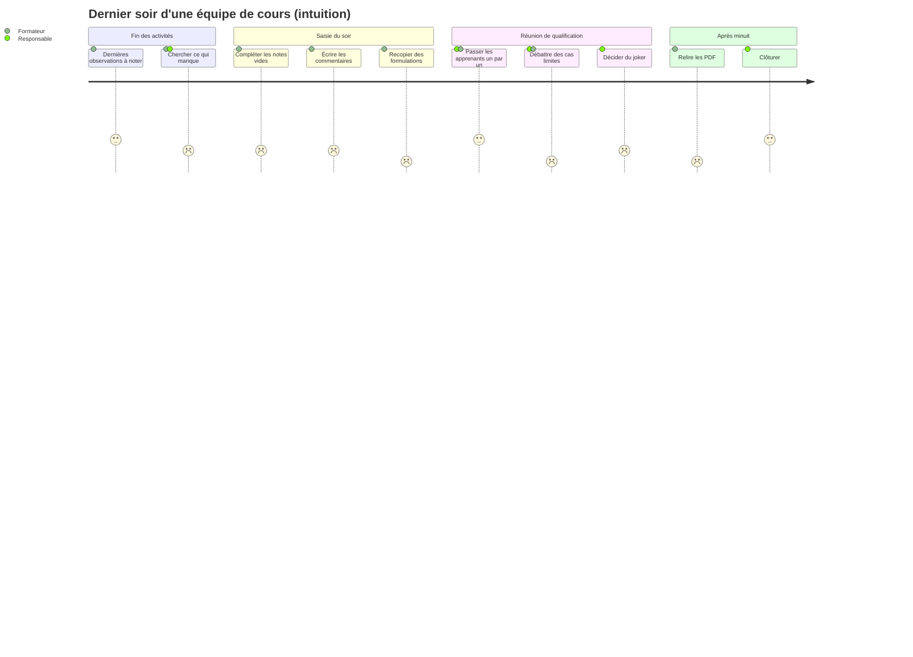
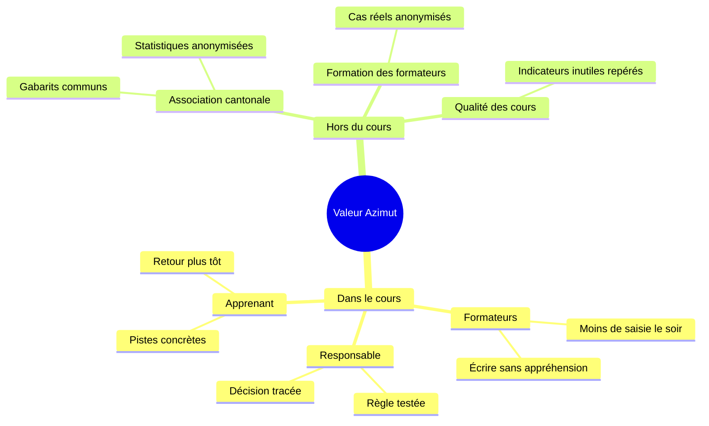
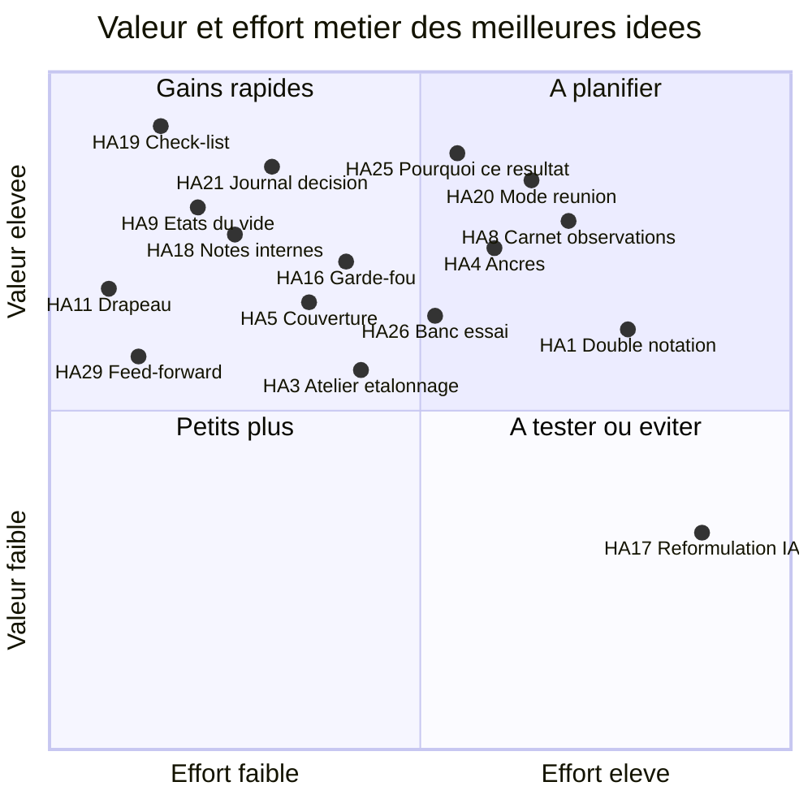

# Azimut — idéation par les six chapeaux

Ce document cherche des features manquantes et challenge les features existantes, en regardant le produit sous six angles distincts (les six chapeaux de Bono).

**TL;DR**

- Le plus gros risque n'est pas technique : c'est l'**injustice perçue** entre apprenants évalués par des formateurs différents. Aucune feature actuelle ne la mesure ni ne la réduit.
- Le **dernier soir** concentre la fatigue, la peur d'oublier et les décisions lourdes. Une **check-list** (N-HA19), un **mode réunion** (N-HA20) et un **journal de décision** (N-HA21) le rendent plus sûr.
- Une case vide est ambiguë (oubli, non observé, rien à dire). Trois **états explicites du vide** (N-HA9) règlent un problème déjà relevé dans les Excel.
- Un résultat calculé doit pouvoir s'**expliquer** en clair (N-HA25). Sinon les erreurs de calcul restent invisibles, comme dans qualif2.
- Il faut séparer les **notes de travail** de l'équipe du **texte imprimé** pour l'apprenant (N-HA18). Cela protège le mineur, libère la parole des formateurs et réduit les données conservées.
- La **calibration** entre formateurs (ancres d'échelle N-HA4, double notation à l'aveugle N-HA1, alerte de disparité N-HA2) est la valeur qu'Excel ne peut pas offrir.
- 38 idées au total : 15 recommandées pour le MVP, 11 à tester, 10 pour plus tard, 2 rejetées (voir le chapeau bleu).
- Deux idées supposent de l'IA : N-HA17 (reformulation), à tester seulement si la question de la nLPD et des données de mineurs est réglée, et N-HA37 (décision automatique), rejetée.

## Méthode

- Chaque chapeau est joué séparément, dans l'ordre blanc, rouge, noir, jaune, vert, bleu.
- Les IDs existants (S1, L5, P2…) renvoient à l'inventaire (`00-inventaire.md`). Les nouvelles idées portent un ID `N-HA`.
- Les idées naissent dans plusieurs chapeaux. Elles sont toutes décrites dans les **fiches** du chapeau vert, avec leur chapeau d'origine.
- **Constaté** = écrit dans `FEATURES.md`, `TODO.md` ou vu dans les Excel. **Proposé** = idée de ce document, rien n'est décidé.

---

## Chapeau blanc — les faits

### Ce qu'on sait (constaté)

| Fait | Source |
| --- | --- |
| Un cours compte 10 à 40 apprenants, 6 à 10 formateurs, 5 à 7 sphères, 10 à 60 indicateurs par sphère. | `FEATURES.md`, volumes |
| Aujourd'hui, on duplique **un classeur Excel par apprenant**. Il n'y a jamais de vue apprenants × indicateurs. | Analyse des 3 modèles |
| Les trois modèles ont des règles de calcul très différentes : points, o/k convertis par critère, moyennes puis conversion non linéaire. | Analyse des 3 modèles |
| La décision finale est parfois automatique (qualif2, qualif3), parfois absente et laissée à l'humain (qualif1). | Analyse, constat 4 |
| Les Excel contiennent des **formules cassées** et une sphère **oubliée** dans la règle finale (qualif2). Personne ne l'a vu. | Analyse, « Ce qui est commun » |
| Le joker et les éliminatoires sont souvent **non branchés** : présents dans la feuille, sans effet sur le résultat. | Analyse, tableau des modèles |
| Une case vide veut dire « non observé », sauf en o/k où elle compte comme « non ». | Analyse, « Ce qui est commun » |
| Une note de relecture dit qu'un indicateur sans commentaire est **ambigu** : rien à dire, ou oubli ? | Analyse, constat 8 |
| Les formateurs bricolent déjà du suivi : taux de remplissage, nombre de vides, écart dû à l'arrondi. | Analyse, constat 10 |
| Le dernier soir, l'équipe reformule les commentaires, écrit un commentaire général, 3 points positifs, 3 points à améliorer, et décide du joker. | `FEATURES.md`, cycle de vie |
| Les apprenants sont souvent **mineurs**. L'anonymisation à 3 mois est une piste. | `FEATURES.md`, hébergement et idées |
| L'app est réservée aux formateurs. Seuls les Kursleiter·in ont le droit de qualifier dans MiData. | `FEATURES.md`, acteurs et connexion |
| Une app existante, **Qualix**, fait déjà des qualifications de cours scouts connectées à MiData. | `FEATURES.md`, questions ouvertes |

### Ce qu'on ne sait pas

- **L'usage réel.** Les trois Excel sont vierges. On ignore la longueur des commentaires, la part de cases vides, les ajustements faits à la main le dernier soir.
- **Le temps passé.** Combien d'heures par soir un formateur passe-t-il à saisir ? Quand saisit-il : pendant l'activité, juste après, le soir ?
- **Qui note qui.** Un apprenant est-il observé par un seul formateur (son référent) ou par plusieurs ? Les groupes d'évaluation tournent-ils ?
- **Les écarts entre formateurs.** Personne n'a mesuré si deux formateurs donnent la même note au même rendu.
- **Le taux d'échec** et la part des décisions « limites ». Combien de décisions changent pendant la réunion du dernier soir ?
- **Les contestations.** Un apprenant ou un parent a-t-il déjà contesté une qualification ? Comment l'équipe a-t-elle justifié la décision ?
- **Le devenir du PDF.** Qui le lit (apprenant, parents, chef de groupe, association cantonale) ? Est-il discuté en entretien ou simplement envoyé ?
- **La réutilisation.** La qualification d'un cours sert-elle au cours suivant de l'apprenant ?
- **Ce que Qualix fait déjà.** Il semble centré sur des observations par participant, mais ce document ne l'a pas vérifié.

### Données manquantes pour décider

| Donnée | Ce qu'elle permet de décider | Comment l'obtenir |
| --- | --- | --- |
| Une qualification **remplie** et anonymisée | Si N-HA9 (états du vide), N-HA15 (commentaires répétés) et N-HA14 (gabarit) répondent à un vrai problème | Demander à un responsable de cours un classeur rempli d'un cours passé |
| Un **planning type** du dernier soir | La forme de N-HA19 (check-list) et N-HA20 (mode réunion) | Interview d'un responsable de cours |
| Les notes de **deux formateurs sur un même rendu** | L'utilité réelle de N-HA1, N-HA2, N-HA4 | Exercice d'étalonnage pendant la préparation d'un cours |
| Le nombre de **formateurs qui observent** chaque apprenant | L'utilité de N-HA5 (couverture) et N-HA13 (plan d'observation) | Interview, ou relevé sur un cours |
| Les cas de **contestation** passés | La priorité de N-HA21 (journal de décision) | Interview de l'association cantonale |
| Le **circuit du PDF** après le cours | N-HA23, N-HA29, N-HA31 et l'envoi par mail (I3) | Interview d'apprenants et de responsables |
| Le modèle de **Qualix** | Ce qu'Azimut fait de différent | Lire la doc et le modèle de Qualix |

---

## Chapeau rouge — émotions et intuitions

### Ce que ressentent les acteurs

| Acteur | Moment | Ce qu'il ressent | Ce dont il a besoin | Features |
| --- | --- | --- | --- | --- |
| Formateur | Dernier soir, 23 h | **Fatigue**. Il reste 12 apprenants à commenter. Il ne sait pas ce qui manque. | Savoir précisément ce qui reste, et pouvoir s'arrêter | N-HA19, N-HA24, P2 |
| Formateur | Pendant la saisie | **Peur de perdre** un long commentaire (coupure, collègue qui écrase) | Être sûr que rien ne se perd, voir qui écrit | C3, C5, C6, C7 |
| Formateur | En écrivant | **Malaise** d'écrire un jugement sur un mineur, qui le lira, peut-être avec ses parents | Un espace pour penser à voix haute, séparé du texte final ; une aide à écrire factuel | N-HA18, N-HA14, N-HA23 |
| Formateur | En comparant | **Sentiment d'injustice** : « mon groupe est noté plus sévèrement que celui d'à côté » | Voir les écarts, s'étalonner avant le cours | N-HA1, N-HA2, N-HA3, N-HA4 |
| Formateur | Pendant une activité | **Frustration** : il a vu un fait important mais n'a rien pour le noter, il l'oubliera | Noter en 10 secondes, trier plus tard | N-HA8 |
| Formateur | En public | **Gêne** : un apprenant passe derrière lui pendant qu'il saisit | Masquer l'écran en un geste | N-HA12 |
| Formateur débutant | Premier cours | **Insécurité** : « est-ce que mon 3 vaut le 3 des autres ? » | Des descriptions de ce que vaut chaque note | N-HA4, N-HA3 |
| Responsable de cours | Dernier soir | **Poids de la décision**. Peur qu'un échec soit injuste ou mal justifié. | Une réunion structurée, une trace du raisonnement | N-HA20, N-HA21, N-HA6, N-HA7 |
| Responsable de cours | Avant le cours | **Doute** : « ma règle de calcul fait-elle ce que je crois ? » | Tester la règle sur des cas | N-HA26, N-HA25, L4 |
| Apprenant | Lecture du PDF | **Vulnérabilité**. Un commentaire maladroit peut le blesser pour longtemps. Un échec sans explication paraît arbitraire. | Un texte factuel, des pistes pour progresser, un entretien | N-HA29, N-HA31, N-HA23, N-HA16 |
| Apprenant | Pendant le cours | **Incertitude** : « est-ce que je suis en train de rater ? » | Un retour intermédiaire, pas une surprise le dernier jour | N-HA27, N-HA28 |
| Parent | Lecture du PDF ou contestation | **Méfiance** si le texte juge la personne plutôt que les actes | Une décision expliquée, un texte respectueux | N-HA21, N-HA16, N-HA14 |

### Le dernier soir, vu de l'intérieur

Le score indique l'humeur estimée (1 = mauvaise, 5 = bonne). C'est une intuition, pas une mesure.

### Intuitions fortes

- **La saisie du soir est une corvée, l'observation pendant la journée est un plaisir.** Tout ce qui déplace la saisie vers le moment de l'observation soulage le soir (N-HA8).
- **On ose écrire ce qu'on pense seulement si on sait que ce ne sera pas imprimé.** Sans espace de travail privé à l'équipe, les commentaires deviennent soit fades, soit blessants (N-HA18).
- **Un formateur ne veut pas être « noté » par l'outil.** Une alerte de disparité doit parler de l'équipe et des données, jamais d'un coupable (N-HA2).
- **Un apprenant retient la phrase la plus dure.** Le PDF doit finir sur des pistes, pas sur un verdict (N-HA29).

---

## Chapeau noir — risques et critique

Pour chaque risque : un scénario concret, la gravité estimée, et la feature ou la règle qui le neutralise.

### Abus et biais humains

| Risque | Scénario | Gravité | Parade |
| --- | --- | --- | --- |
| **Règlement de compte** | Un formateur en conflit avec un apprenant note bas partout. Il est le seul à l'observer. | Haute | Couverture d'observation (N-HA5) ; quorum pour un échec (N-HA6) ; historique attribué (C7) |
| **Commentaire copié-collé** | Le même texte apparaît chez 15 apprenants. Le commentaire ne dit plus rien de la personne. | Moyenne | Détection de commentaires répétés (N-HA15) |
| **Formateur sévère ou laxiste** | Deux groupes d'évaluation, deux niveaux d'exigence. Le résultat dépend du groupe tiré. | Haute | Ancres d'échelle (N-HA4) ; atelier d'étalonnage (N-HA3) ; double notation (N-HA1) ; alerte de disparité (N-HA2) |
| **Effet de halo** | Une première impression forte colore toutes les notes suivantes. | Moyenne | Observations datées (S16) ; plan d'observation qui varie les regards (N-HA13) |
| **Jugement de la personne** | « Il est paresseux », « elle est immature ». Le texte juge l'identité, pas un comportement observé. | Haute | Gabarit factuel (N-HA14) ; garde-fou avant impression (N-HA16) ; relecture croisée (N-HA22) |
| **Données sensibles dans un commentaire** | Mention d'un traitement médical, d'une situation familiale, d'une orientation. | Haute | Garde-fou données sensibles (N-HA16) ; notes internes purgées (N-HA18) |
| **Joker utilisé pour faire passer un ami** | Le joker est un ajustement sans contrôle. | Moyenne | Joker avec justification obligatoire (S13) ; journal de décision (N-HA21) |
| **Pression de groupe en réunion** | La voix la plus forte l'emporte. Les formateurs discrets se taisent. | Moyenne | Mode réunion avec avis individuel avant débat (N-HA20) |

### Erreurs de calcul et décisions injustes

| Risque | Scénario | Gravité | Parade |
| --- | --- | --- | --- |
| **Erreur de calcul invisible** | Une sphère est oubliée dans la règle finale, comme dans qualif2. Le résultat paraît correct. | Haute | Explication du calcul (N-HA25) ; banc d'essai de la règle (N-HA26) ; règles déclaratives (S11) |
| **Décision « à un cheveu »** | Un arrondi fait passer un apprenant de 2,5 à 3, un autre de 2,49 à 2. Personne ne le voit. | Haute | Marge de décision (N-HA7) |
| **Vide mal interprété** | Une case vide compte comme « non » en o/k alors que le formateur n'a pas pu observer. | Haute | Trois états du vide (N-HA9) |
| **Changement de structure en cours** | On supprime un indicateur au milieu du cours. Des moyennes bougent sans que l'équipe le sache. | Moyenne | Copie pour comparer (L4) ; banc d'essai (N-HA26) ; journal (C7) |
| **Confiance aveugle dans le chiffre** | « L'app a dit échec. » L'équipe ne discute plus. | Haute | La règle propose, l'équipe décide : décision humaine tracée (N-HA21) ; marge (N-HA7) |
| **Échec découvert le dernier soir** | L'apprenant n'a reçu aucun signal pendant le cours. | Haute | Alerte précoce et bilan intermédiaire (N-HA27) |
| **Pas de recours possible** | Un parent conteste. L'équipe ne se souvient plus pourquoi elle a décidé. | Moyenne | Journal de décision (N-HA21) ; historique (C7) |

### Données de mineurs

| Risque | Scénario | Gravité | Parade |
| --- | --- | --- | --- |
| **Fuite par l'écran** | Un apprenant voit l'écran d'un formateur dans la salle commune. | Moyenne | Mode discret (N-HA12) |
| **Conservation trop longue** | Les notes de travail et les brouillons restent des années. | Haute | Notes internes purgées à la clôture (N-HA18) ; anonymisation (L9) |
| **Ré-identification après anonymisation** | Un commentaire contient un prénom, un lieu, un événement unique. | Moyenne | Garde-fou avant impression (N-HA16) ; relecture avant anonymisation (L9) |
| **Envoi au mauvais destinataire** | Le PDF part chez un autre apprenant ou chez un parent sans droit. | Haute | Restitution accompagnée, pas d'envoi automatique sans validation (N-HA31, I3) |
| **IA et données de mineurs** | Des commentaires sur des mineurs partent chez un fournisseur d'IA hors de Suisse. | Haute | IA seulement sous condition, signalée et désactivable (N-HA17) ; rejet de la décision par IA (N-HA37) |
| **Partage de la qualification au cours suivant** | Un apprenant est « étiqueté » pour la suite de son parcours scout. | Moyenne | Passeport seulement avec consentement, limité aux pistes (N-HA30) |

### Dépendance, adoption, retour à Excel

| Risque | Scénario | Gravité | Parade |
| --- | --- | --- | --- |
| **MiData indisponible** | Le premier jour du cours, la connexion ou la liste des participants échoue. | Moyenne | Kit de secours papier (N-HA35) ; liste des participants modifiable à la main (règle à décider avec I2) |
| **Outil trop complexe** | Créer une qualification demande de comprendre regroupements, axes, conversions. Personne ne s'y met. | Haute | Bibliothèque de gabarits (N-HA32) ; banc d'essai (N-HA26) ; explication du calcul (N-HA25) |
| **Retour à Excel** | Un responsable reconstruit son Excel « parce qu'il sait ce qu'il fait ». | Haute | Ne pas exiger de tout modéliser : une décision humaine sans règle reste possible (cas qualif1) ; export lisible |
| **Saisie trop lente** | Sur mobile ou en fin de journée, chaque note demande trop de clics. | Haute | Carnet d'observations (N-HA8) ; vues de saisie (C1) |
| **L'outil devient un surveillant** | Les statistiques sur les formateurs créent de la méfiance dans l'équipe. | Moyenne | Statistiques d'équipe, pas de classement de formateurs ; visibles par l'équipe entière (N-HA2) |
| **Classement des apprenants** | Une vue triée par moyenne fait naître une compétition. | Moyenne | Rejet explicite d'un classement (N-HA36) |

---

## Chapeau jaune — bénéfices et opportunités

### Ce qu'Azimut peut faire et qu'Excel ne peut pas

- **Voir tous les apprenants à la fois.** Excel force un classeur par apprenant. Azimut permet de comparer, d'étalonner, de suivre l'état du cours (C1, P4).
- **Savoir qui a écrit quoi, et quand.** L'historique (C7) rend la qualification défendable.
- **Expliquer un résultat.** Une règle déclarative peut se lire et se tester (S11, N-HA25, N-HA26). Une formule Excel cassée ne se voit pas.
- **Travailler à plusieurs sans écraser.** Le temps réel et les verrous (C2, C3) remplacent l'envoi de fichiers.
- **Capitaliser d'un cours à l'autre.** Les gabarits (N-HA32) et le bilan qualité (N-HA33) améliorent la qualification au fil des sessions.

### Valeur par acteur

| Acteur | Bénéfice | Features |
| --- | --- | --- |
| Formateur | Moins de saisie le soir ; il sait ce qui reste ; il écrit avec moins d'appréhension | N-HA8, N-HA19, N-HA18, N-HA14 |
| Formateur débutant | Il apprend à évaluer grâce aux ancres et à l'étalonnage | N-HA4, N-HA3 |
| Responsable de cours | Une réunion du dernier soir plus courte et mieux tracée ; une règle testée avant le cours | N-HA20, N-HA21, N-HA26 |
| Apprenant | Un retour plus juste, plus tôt, avec des pistes concrètes | N-HA27, N-HA29, N-HA31 |
| Parent | Une décision expliquée, un texte respectueux | N-HA21, N-HA16 |
| Équipe de cours | Une culture commune de l'évaluation | N-HA1, N-HA2, N-HA3 |

### Hors du cours

| Bénéficiaire | Opportunité | Features |
| --- | --- | --- |
| **Association cantonale** | Des gabarits communs par type de cours ; des statistiques anonymisées entre cours (taux de réussite, sphères difficiles) | N-HA32, P5, L9 |
| **Formation des formateurs** | Des cas réels anonymisés pour apprendre à évaluer et à écrire un bon commentaire | N-HA34, N-HA3 |
| **Qualité des cours** | Repérer les indicateurs jamais remplis, jamais discriminants, ou toujours sans commentaire, et améliorer la qualification | N-HA33 |
| **Parcours de l'apprenant** | Les pistes de progression d'un cours servent au cours suivant, avec son accord | N-HA29, N-HA30 |

---

## Chapeau vert — créativité

### Provocation 1 : l'inversion

**« Et si on voulait que la qualification soit la plus injuste possible ? »**

| Recette de l'injustice | Idée inverse |
| --- | --- |
| Un seul formateur observe chaque apprenant, toujours le même. | Couverture d'observation (N-HA5), plan d'observation (N-HA13) |
| Chaque formateur invente ce que vaut un 3. | Ancres d'échelle (N-HA4), atelier d'étalonnage (N-HA3) |
| On découvre l'échec le dernier soir, sans avoir rien dit avant. | Alerte précoce et bilan intermédiaire (N-HA27) |
| On décide à minuit, fatigué, sans relire. | Check-list (N-HA19), relecture croisée (N-HA22), commentaire à froid (N-HA38) |
| Un arrondi décide à la place de l'équipe, sans que personne le voie. | Marge de décision (N-HA7), explication du calcul (N-HA25) |
| On ne garde aucune trace du pourquoi. | Journal de décision (N-HA21) |
| On écrit des jugements sur la personne. | Gabarit factuel (N-HA14), garde-fou (N-HA16) |
| On confond « pas observé » et « raté ». | Trois états du vide (N-HA9) |

**« Et si on voulait que personne n'adopte Azimut ? »**

| Recette de l'échec | Idée inverse |
| --- | --- |
| Obliger chaque équipe à construire sa qualification de zéro. | Bibliothèque de gabarits (N-HA32) |
| Exiger l'ordinateur pour noter une observation. | Carnet d'observations (N-HA8) |
| Rendre l'app indispensable sans plan B. | Kit de secours papier (N-HA35) |
| Montrer des chiffres sans les expliquer. | Explication du calcul (N-HA25) |

### Provocation 2 : SCAMPER sur deux features clés

**Sur L5, la finalisation du dernier soir :**

| Lettre | Question | Idée |
| --- | --- | --- |
| **S**ubstituer | Remplacer la réunion improvisée par quoi ? | Un mode réunion structuré, apprenant par apprenant (N-HA20) |
| **C**ombiner | Combiner finalisation et suivi de remplissage ? | Check-list générée à partir des manques (N-HA19) |
| **A**dapter | Adapter la double correction des examens ? | Relecture croisée avant clôture (N-HA22) |
| **M**odifier | Agrandir, étaler la finalisation ? | Bilan intermédiaire à mi-cours, pour que le dernier soir ne soit qu'une confirmation (N-HA27) |
| **P**roduire autre chose | Que peut produire la finalisation, en plus de la décision ? | Des objectifs de progression pour la suite (N-HA29) |
| **É**liminer | Éliminer la relecture de 30 PDF à minuit ? | Aperçu du PDF au fil de la saisie (N-HA23) ; garde-fou automatique (N-HA16) |
| **R**éorganiser | Inverser l'ordre : décider d'abord, commenter ensuite ? | Avis individuel avant débat, puis rédaction alignée sur la décision (N-HA20, N-HA21) |

**Sur S16, les observations datées et attribuées :**

| Lettre | Question | Idée |
| --- | --- | --- |
| **S**ubstituer | Remplacer la note du soir par une trace prise sur le moment ? | Carnet d'observations (N-HA8) |
| **C**ombiner | Combiner observation et degré de certitude ? | Note de certitude (N-HA10) |
| **A**dapter | Adapter le dossier médical (notes internes vs compte rendu) ? | Notes de travail internes (N-HA18) |
| **M**odifier | Exiger plusieurs regards ? | Couverture d'observation (N-HA5) |
| **P**roduire autre chose | Utiliser les observations pour planifier ? | Plan d'observation (N-HA13) |
| **É**liminer | Éliminer l'ambiguïté du vide ? | Trois états du vide (N-HA9) |
| **R**éorganiser | Faire observer l'apprenant par lui-même ? | Auto-évaluation (N-HA28) |

### Provocation 3 : les analogies

| Domaine | Pratique observée | Transposition dans Azimut |
| --- | --- | --- |
| **Dossier médical** | Notes de suivi datées et signées. Le compte rendu au patient est distinct des notes internes. Un diagnostic peut rester « à confirmer ». | Notes internes (N-HA18), note de certitude (N-HA10), observations attribuées (S16) |
| **Correction de copies à plusieurs** | Barème commun, copies-témoins corrigées par tous, double correction, troisième correcteur si l'écart est trop grand. | Ancres (N-HA4), atelier d'étalonnage (N-HA3), double notation à l'aveugle (N-HA1) |
| **Arbitrage sportif** | Briefing d'avant-match, répartition des zones entre arbitres, revue vidéo des seules décisions déterminantes, observateurs qui évaluent les arbitres. | Plan d'observation (N-HA13), marge de décision (N-HA7), alerte de disparité (N-HA2) |
| **Revue de code** | Rien n'entre sans l'approbation d'un pair. Les commentaires de revue ne vont pas dans le produit final. On voit le diff. | Relecture croisée (N-HA22), notes internes (N-HA18), historique (C7) |
| **Apprentissage professionnel** | Un rapport de formation périodique, discuté avec l'apprenti, qui fixe des objectifs pour la période suivante. | Bilan intermédiaire (N-HA27), auto-évaluation (N-HA28), feed-forward (N-HA29), restitution accompagnée (N-HA31) |

### Fiches des idées

Chaque fiche donne le chapeau d'origine, une description, le problème résolu et une question à poser à l'équipe de cours. Les idées qui supposent de l'IA sont marquées **[IA]**.

#### Justice et calibration

**N-HA1 — Double notation à l'aveugle** · origine : vert (analogie correction de copies)
- **Description :** deux formateurs notent le même rendu sans voir la note de l'autre. Azimut révèle ensuite les écarts, et l'équipe en discute. Un tiers tranche si l'écart dépasse un seuil.
- **Problème :** on ne sait pas si deux formateurs notent de la même façon.
- **Question :** sur quels rendus accepteriez-vous de doubler le travail de notation, et combien de fois par cours ?

**N-HA2 — Alerte de disparité entre évaluateurs** · origine : rouge
- **Description :** Azimut compare la distribution des notes par groupe d'évaluation ou par formateur, sur les mêmes critères. Il signale un écart marqué à toute l'équipe, sans nommer de coupable.
- **Problème :** le sentiment d'injustice entre groupes, aujourd'hui invérifiable.
- **Question :** seriez-vous à l'aise de voir vos notes comparées à celles de vos collègues ? Qui doit voir cette alerte ?

**N-HA3 — Atelier d'étalonnage avant le cours** · origine : vert (analogie copies-témoins)
- **Description :** pendant la préparation, toute l'équipe note un apprenant fictif ou un rendu d'exemple avec la qualification en brouillon (L1). On compare et on discute les écarts.
- **Problème :** chaque formateur arrive avec sa propre idée de ce que vaut un 3.
- **Question :** avez-vous un moment, dans le week-end de préparation, pour un exercice d'une heure ?

**N-HA4 — Ancres descriptives par niveau d'échelle** · origine : blanc
- **Description :** pour chaque indicateur, une phrase décrit ce que veut dire chaque niveau (par exemple 1, 3 et 5). Elle s'affiche au moment de noter.
- **Problème :** une échelle sans description est interprétée différemment par chacun.
- **Question :** vos qualifications actuelles décrivent-elles les niveaux quelque part (dans un document à part, à l'oral) ?

**N-HA5 — Couverture d'observation** · origine : noir
- **Description :** Azimut montre, pour chaque apprenant, combien de formateurs différents l'ont noté et dans combien de situations. Il signale un apprenant vu par un seul formateur.
- **Problème :** un apprenant dépend d'un seul regard, ce qui ouvre la porte au biais ou au règlement de compte.
- **Question :** combien de formateurs différents devraient, selon vous, avoir observé un apprenant avant qu'on le déclare en échec ?

**N-HA6 — Quorum pour un échec** · origine : noir
- **Description :** une décision d'échec ou un critère éliminatoire (S12) exige l'avis enregistré d'au moins deux formateurs et du responsable de cours.
- **Problème :** une décision lourde portée par une seule personne.
- **Question :** comment se prend aujourd'hui une décision d'échec ? Qui doit être d'accord ?

**N-HA7 — Marge de décision (« à un cheveu »)** · origine : vert (analogie arbitrage vidéo)
- **Description :** Azimut signale les apprenants dont la décision change si une seule note bouge d'un cran, ou qui passent un seuil grâce à un arrondi. L'équipe revoit ces cas en priorité.
- **Problème :** l'arrondi ou une seule note décident sans que personne le voie.
- **Question :** combien de cas limites avez-vous par cours ? Les identifiez-vous aujourd'hui ?

#### Saisie et observation

**N-HA8 — Carnet d'observations rapide** · origine : rouge
- **Description :** pendant une activité, sur un téléphone, le formateur note en quelques secondes un fait court sur un ou plusieurs apprenants. Il le rattache plus tard à un indicateur, ou le laisse comme observation libre (S16).
- **Problème :** les faits observés en journée s'oublient avant la saisie du soir.
- **Question :** prenez-vous déjà des notes pendant les activités (carnet, téléphone) ? Que devient ce carnet ?

**N-HA9 — Trois états du vide** · origine : blanc
- **Description :** une case peut être « pas encore saisie », « non observé » (pas eu l'occasion) ou « rien à signaler ». Chaque état a un effet clair sur le calcul et sur le suivi (P2).
- **Problème :** une case vide est ambiguë, et elle compte parfois comme « non » (o/k).
- **Question :** quand vous laissez une case vide aujourd'hui, que voulez-vous dire le plus souvent ?

**N-HA10 — Note de certitude** · origine : vert (analogie dossier médical)
- **Description :** le formateur marque une note « sûre » ou « à confirmer ». Les notes à confirmer remontent dans la check-list (N-HA19).
- **Problème :** une note posée sur une seule observation pèse autant qu'une note bien établie.
- **Question :** vous arrive-t-il de mettre une note provisoire en attendant de revoir l'apprenant ?

**N-HA11 — Drapeau « à discuter en équipe »** · origine : rouge
- **Description :** un formateur pose un drapeau sur une note, un commentaire ou un apprenant. Les drapeaux forment l'ordre du jour de la réunion (N-HA20).
- **Problème :** les doutes notés sur un bout de papier sont oubliés en réunion.
- **Question :** comment préparez-vous aujourd'hui la liste des cas à discuter ?

**N-HA12 — Mode discret** · origine : rouge
- **Description :** en un geste, l'écran masque les noms et les notes. Il les ré-affiche à la demande.
- **Problème :** la gêne et le risque de saisir en public, devant des apprenants.
- **Question :** où saisissez-vous pendant le cours ? Les apprenants peuvent-ils voir les écrans ?

**N-HA13 — Plan d'observation** · origine : vert (analogie arbitrage)
- **Description :** avant chaque activité, l'équipe répartit qui observe qui et quels critères. Azimut propose une rotation pour varier les regards.
- **Problème :** certains apprenants sont beaucoup observés, d'autres presque pas.
- **Question :** répartissez-vous aujourd'hui les apprenants à observer avant une activité ?

#### Commentaires

**N-HA14 — Gabarit de commentaire factuel** · origine : rouge
- **Description :** une aide à l'écriture propose la forme « fait observé, effet, piste ». Un court guide rappelle de décrire un comportement, pas une personne.
- **Problème :** le malaise d'écrire sur un mineur, et des commentaires qui jugent la personne.
- **Question :** avez-vous des consignes de rédaction des commentaires ? Sont-elles suivies ?

**N-HA15 — Détection de commentaires répétés** · origine : noir
- **Description :** Azimut signale un commentaire identique ou presque chez plusieurs apprenants. Il ne bloque rien. Sans IA : une simple comparaison des textes.
- **Problème :** le copié-collé du soir qui vide le commentaire de son sens.
- **Question :** un même commentaire pour plusieurs apprenants est-il parfois légitime (travail de groupe) ?

**N-HA16 — Garde-fou avant impression** · origine : noir
- **Description :** avant la clôture, Azimut signale les mots d'une liste tenue par l'équipe : santé, famille, termes blessants, jugements de personne, prénoms d'autres personnes. Sans IA.
- **Problème :** des données sensibles ou blessantes arrivent dans le PDF.
- **Question :** quels mots ou sujets ne devraient jamais figurer dans une qualification ?

**N-HA17 — Suggestions de reformulation [IA]** · origine : vert
- **Description :** un assistant propose une reformulation plus factuelle et plus bienveillante d'un commentaire. Le formateur accepte, modifie ou ignore.
- **Problème :** la reformulation du dernier soir, longue et fatigante.
- **nLPD et mineurs :** le texte concerne des mineurs et peut contenir des données sensibles. Où est traité le texte ? En Suisse ? Le fournisseur garde-t-il les données ? Faut-il pseudonymiser avant envoi ? Un modèle hébergé en Suisse ou local suffit-il ? Faut-il informer les apprenants et leurs parents ?
- **Question :** accepteriez-vous qu'un commentaire sur un apprenant passe par un service d'IA, même anonymisé ? Le gain de temps en vaut-il la peine ?

**N-HA18 — Notes de travail internes** · origine : rouge (analogie dossier médical)
- **Description :** à côté de chaque commentaire, un espace de notes de l'équipe, jamais imprimé. Ces notes sont supprimées à la clôture (L6).
- **Problème :** on mélange ce qu'on pense et ce qu'on écrit à l'apprenant. On garde trop longtemps des données inutiles.
- **Question :** où notez-vous aujourd'hui ce que vous ne voulez pas voir dans le PDF ? Faut-il le garder après le cours ?

**N-HA38 — Commentaire à froid** · origine : vert (inversion)
- **Description :** un commentaire écrit tard le soir reste marqué « à relire » jusqu'à une relecture le lendemain par son auteur ou un collègue.
- **Problème :** des phrases écrites sous la fatigue ou l'émotion arrivent telles quelles dans le PDF.
- **Question :** avez-vous déjà regretté une formulation écrite le soir ? Y a-t-il un moment le lendemain pour relire ?

#### Dernier soir et décision

**N-HA19 — Check-list du dernier soir** · origine : rouge
- **Description :** Azimut génère la liste de ce qui reste : notes vides, commentaires manquants, éliminatoires sans justification, joker non décidé, notes à confirmer, drapeaux, commentaires « à relire ». Chaque formateur voit sa part.
- **Problème :** à 23 h, personne ne sait précisément ce qui manque.
- **Question :** quelles vérifications faites-vous aujourd'hui avant la réunion de qualification ?

**N-HA20 — Mode réunion de qualification** · origine : vert (SCAMPER sur L5)
- **Description :** une vue projetée passe les apprenants un par un : résultat calculé, marge, drapeaux, avis individuels donnés avant le débat. L'équipe enregistre la décision et passe au suivant.
- **Problème :** une réunion longue, désordonnée, où la voix la plus forte l'emporte.
- **Question :** combien de temps dure votre réunion de qualification ? Projetez-vous quelque chose ?

**N-HA21 — Journal de décision** · origine : noir
- **Description :** chaque décision finale garde le résultat calculé, les ajustements (joker, éliminatoire), qui a décidé, le motif, et l'écart avec le calcul s'il y en a un.
- **Problème :** en cas de contestation, on ne sait plus pourquoi on a décidé.
- **Question :** avez-vous déjà dû justifier une décision après le cours ? Avec quoi ?

**N-HA22 — Relecture croisée avant clôture** · origine : vert (analogie revue de code)
- **Description :** chaque qualification est relue et approuvée par un autre formateur que son auteur principal avant la clôture (L6).
- **Problème :** les erreurs et les maladresses passent sans second regard.
- **Question :** qui relit les qualifications aujourd'hui ? Tout le monde, le responsable, personne ?

**N-HA23 — Aperçu « comme l'apprenant le lira »** · origine : rouge
- **Description :** à tout moment, le formateur voit le texte tel qu'il apparaîtra dans le PDF (L7), sans les colonnes techniques ni les notes internes.
- **Problème :** on découvre la mise en forme et le ton du PDF trop tard.
- **Question :** relisez-vous le PDF final avant de le remettre ?

**N-HA24 — Charge restante et répartition** · origine : rouge
- **Description :** Azimut estime le travail qui reste par formateur et propose de répartir les apprenants en retard entre les formateurs libres.
- **Problème :** certains formateurs finissent à 22 h, d'autres à 2 h.
- **Question :** la charge du soir est-elle équilibrée dans votre équipe ?

#### Calcul et confiance

**N-HA25 — « Pourquoi ce résultat ? »** · origine : noir
- **Description :** sur tout résultat calculé, le formateur peut afficher le chemin du calcul en clair : notes prises en compte, vides ignorés, poids, conversions, arrondis, seuil.
- **Problème :** les erreurs de calcul restent invisibles et le résultat n'est pas défendable.
- **Question :** vous est-il arrivé de douter d'un résultat Excel ? Comment l'avez-vous vérifié ?

**N-HA26 — Banc d'essai de la règle** · origine : noir
- **Description :** avant de figer la structure (L2), le responsable teste la règle de décision sur des profils fictifs (« tout à 3 », « une sphère à 2 », « un éliminatoire »). Il vérifie que la décision est celle qu'il attend.
- **Problème :** une règle mal construite, comme la sphère oubliée de qualif2.
- **Question :** comment vérifiez-vous aujourd'hui que votre Excel calcule juste avant le cours ?

#### Pendant le cours et progression

**N-HA27 — Alerte précoce et bilan intermédiaire** · origine : noir (SCAMPER sur L5)
- **Description :** Azimut signale un apprenant qui passe sous un seuil (S4) pendant le cours. L'équipe prépare un bilan intermédiaire à partir des données, et note ce qui a été dit.
- **Problème :** l'échec découvert le dernier soir, sans chance de progresser.
- **Question :** faites-vous un bilan à mi-cours ? Que dites-vous à un apprenant en difficulté ?

**N-HA28 — Auto-évaluation de l'apprenant** · origine : vert (analogie apprentissage)
- **Description :** l'apprenant s'évalue sur une version simplifiée de la qualification. Le formateur saisit le résultat, ou l'apprenant le saisit lui-même plus tard (ce qui touche A1). Azimut montre l'écart entre son regard et celui de l'équipe.
- **Problème :** l'apprenant découvre le regard de l'équipe sans s'être interrogé lui-même.
- **Question :** l'auto-évaluation fait-elle partie de vos cours ? Sur papier, à l'oral ?

**N-HA29 — Feed-forward : objectifs de progression** · origine : rouge
- **Description :** l'équipe formule deux ou trois objectifs concrets pour la suite (camp, prochain cours). Ils figurent en fin de PDF.
- **Problème :** le PDF regarde en arrière et finit sur un verdict.
- **Question :** les « 3 points à améliorer » actuels sont-ils lus comme des reproches ou comme des pistes ?

**N-HA30 — Passeport de progression entre cours** · origine : vert (audacieux)
- **Description :** avec l'accord de l'apprenant (et de ses parents s'il est mineur), les objectifs de progression d'un cours sont transmis à l'équipe de son cours suivant.
- **Problème :** chaque cours repart de zéro, sans continuité pour l'apprenant.
- **Question :** voudriez-vous connaître les objectifs fixés au cours précédent ? Est-ce que cela risque d'étiqueter l'apprenant ?

**N-HA31 — Restitution accompagnée** · origine : rouge (analogie apprentissage)
- **Description :** le PDF n'est remis qu'après un entretien. Azimut note que l'entretien a eu lieu avant d'autoriser l'envoi (I3).
- **Problème :** un PDF reçu seul, sans explication, blesse ou paraît arbitraire.
- **Question :** comment remettez-vous la qualification aujourd'hui ? En entretien, par mail, à la fin du cours ?

#### Hors du cours

**N-HA32 — Bibliothèque de gabarits partagés** · origine : jaune
- **Description :** des qualifications types, par type de cours, avec leurs ancres et leurs règles. Une équipe part d'un gabarit et l'adapte. Les concepteurs y laissent des notes de conception (constat 11).
- **Problème :** chaque équipe recopie et réadapte un Excel, avec ses erreurs.
- **Question :** existe-t-il une qualification de référence par type de cours dans votre association ? Qui la tient à jour ?

**N-HA33 — Bilan qualité de la qualification** · origine : jaune
- **Description :** après le cours, Azimut liste les indicateurs jamais remplis, ceux où tout le monde a la même note, ceux toujours sans commentaire.
- **Problème :** la qualification grossit (jusqu'à 290 indicateurs dans qualif2) sans qu'on sache ce qui sert.
- **Question :** avez-vous l'impression que certains indicateurs ne servent à rien ?

**N-HA34 — Cas d'école pour la formation des formateurs** · origine : jaune
- **Description :** des extraits anonymisés et relus servent à apprendre à noter et à écrire un bon commentaire.
- **Problème :** les formateurs apprennent à évaluer sur le tas.
- **Question :** la formation des formateurs aborde-t-elle l'évaluation ? Avec quels exemples ?

**N-HA35 — Kit de secours papier** · origine : noir
- **Description :** l'équipe imprime à l'avance des grilles vierges par apprenant ou par activité. En cas de panne, elle note sur papier et ressaisit ensuite.
- **Problème :** la dépendance totale à MiData et au réseau, au milieu d'un cours en pleine nature.
- **Question :** quelle connexion avez-vous sur les lieux de cours ? Que faites-vous si rien ne marche le premier jour ?

#### Idées provocantes à rejeter

**N-HA36 — Classement des apprenants** · origine : vert (inversion)
- **Description :** une vue triée par moyenne générale.
- **Pourquoi rejeter :** la qualification mesure l'atteinte d'objectifs, pas une compétition. Un classement visible crée des comparaisons nuisibles.
- **Question :** un tri par résultat sert-il à quelque chose que l'état du cours (P4) ne couvre pas ?

**N-HA37 — Décision automatique par IA [IA]** · origine : vert (inversion)
- **Description :** une IA lit les notes et les commentaires et propose la décision.
- **Pourquoi rejeter :** une décision lourde sur un mineur, opaque, non explicable. Elle pose aussi la question de la nLPD (décision individuelle automatisée, données de mineurs).
- **Question :** aucune. L'idée sert à fixer la limite : l'outil calcule et explique, l'équipe décide.

---

## Chapeau bleu — synthèse et pilotage

### Tri des idées

Valeur : H (haute), M (moyenne), B (basse). Effort métier : S (petit), M (moyen), L (grand). Il s'agit de l'effort pour définir la règle et la faire adopter, pas de l'effort de développement.

| ID | Idée | Chapeau | Valeur | Effort | Risque principal | Liens | Reco |
| --- | --- | --- | --- | --- | --- | --- | --- |
| N-HA1 | Double notation à l'aveugle | Vert | H | M | Charge de travail en plus | P4, A4, S16 | À tester |
| N-HA2 | Alerte de disparité | Rouge | H | M | Méfiance dans l'équipe | P4, A4, P3 | Plus tard |
| N-HA3 | Atelier d'étalonnage avant le cours | Vert | H | S | Pas de temps en préparation | L1, L4, S3 | À tester |
| N-HA4 | Ancres par niveau d'échelle | Blanc | H | M | Long à rédiger | S3, S1, N-HA32 | MVP |
| N-HA5 | Couverture d'observation | Noir | H | S | Faux sentiment de sécurité | S16, A5, P4 | MVP |
| N-HA6 | Quorum pour un échec | Noir | M | S | Lourdeur administrative | S11, S12 | À tester |
| N-HA7 | Marge de décision | Vert | H | M | Mal compris si mal expliqué | S5, S11 | Plus tard |
| N-HA8 | Carnet d'observations rapide | Rouge | H | M | Observations jamais triées | S16, C1, C9 | MVP |
| N-HA9 | Trois états du vide | Blanc | H | S | Un clic de plus par case | S5, S15, P2 | MVP |
| N-HA10 | Note de certitude | Vert | M | S | Tout reste « à confirmer » | S16, N-HA19 | À tester |
| N-HA11 | Drapeau « à discuter » | Rouge | H | S | Peu | L5, N-HA20 | MVP |
| N-HA12 | Mode discret | Rouge | M | S | Peu | T2 | MVP |
| N-HA13 | Plan d'observation | Vert | M | M | Rigidité du planning | A4, A5, S10 | Plus tard |
| N-HA14 | Gabarit de commentaire factuel | Rouge | M | S | Textes formatés et fades | S6, L5 | À tester |
| N-HA15 | Détection de commentaires répétés | Noir | M | S | Faux positifs (travail de groupe) | S6, L5 | Plus tard |
| N-HA16 | Garde-fou avant impression | Noir | H | S | Liste incomplète | L7, L9, T2 | MVP |
| N-HA17 | Suggestions de reformulation [IA] | Vert | M | L | nLPD, données de mineurs | L5, T2 | À tester |
| N-HA18 | Notes de travail internes | Rouge | H | S | Notes internes trop franches | L6, L7, L9, T2 | MVP |
| N-HA19 | Check-list du dernier soir | Rouge | H | S | Peu | L5, P2, S12, S13 | MVP |
| N-HA20 | Mode réunion de qualification | Vert | H | M | Ne colle pas à toutes les équipes | L5, S11, S13 | MVP |
| N-HA21 | Journal de décision | Noir | H | S | Saisie perçue comme bureaucratique | S11, S12, S13, C7 | MVP |
| N-HA22 | Relecture croisée | Vert | M | S | Ajoute du travail le soir | L6, C7 | À tester |
| N-HA23 | Aperçu comme l'apprenant le lira | Rouge | M | S | Peu | L7 | MVP |
| N-HA24 | Charge restante et répartition | Rouge | M | M | Pression entre formateurs | P2, A5 | Plus tard |
| N-HA25 | « Pourquoi ce résultat ? » | Noir | H | M | Explication trop technique | S2, S5, S7, S11 | MVP |
| N-HA26 | Banc d'essai de la règle | Noir | H | M | Profils fictifs mal choisis | S11, L2, L4 | MVP |
| N-HA27 | Alerte précoce et bilan intermédiaire | Noir | H | M | Étiqueter trop tôt un apprenant | S4, P3, P1 | À tester |
| N-HA28 | Auto-évaluation de l'apprenant | Vert | M | M | Contredit A1 si saisie par l'apprenant | A1, P1 | Plus tard |
| N-HA29 | Feed-forward | Rouge | H | S | Objectifs vagues | L5, L7 | MVP |
| N-HA30 | Passeport de progression | Vert | M | L | Étiquetage, consentement, nLPD | L9, I4, T2 | Plus tard |
| N-HA31 | Restitution accompagnée | Rouge | M | S | Retarde la remise | L7, I3 | À tester |
| N-HA32 | Bibliothèque de gabarits | Jaune | H | L | Gouvernance des gabarits | L1, S8, P5 | Plus tard |
| N-HA33 | Bilan qualité de la qualification | Jaune | M | S | Peu lu | P5, P2 | Plus tard |
| N-HA34 | Cas d'école pour formateurs | Jaune | M | M | Ré-identification | L9, T2 | Plus tard |
| N-HA35 | Kit de secours papier | Noir | M | S | Double saisie | L7, A6, I2 | À tester |
| N-HA36 | Classement des apprenants | Vert | B | S | Compétition nuisible | P3, P4 | Rejeter |
| N-HA37 | Décision automatique par IA | Vert | B | L | Opacité, nLPD | S11, T2 | Rejeter |
| N-HA38 | Commentaire à froid | Vert | M | S | Rien n'est jamais « fini » | L5, C5 | À tester |

**Bilan :** 15 MVP, 11 à tester (dont 1 en IA), 10 plus tard, 2 rejetées. Toutes les recommandations sont des propositions à valider avec une équipe de cours.

### Valeur × effort

Les 16 idées les plus fortes. Position estimée, pas mesurée.

### Les cinq idées les plus prometteuses

1. **N-HA19 Check-list du dernier soir** : forte valeur, peu d'effort, s'appuie sur P2 qui est déjà prévu.
2. **N-HA21 Journal de décision** : rend chaque décision défendable, en particulier les échecs.
3. **N-HA9 Trois états du vide** : règle une ambiguïté constatée dans les Excel et fiabilise les calculs.
4. **N-HA25 « Pourquoi ce résultat ? »** : rend visibles les erreurs de calcul qu'Excel cache.
5. **N-HA18 Notes de travail internes** : protège le mineur, libère la parole de l'équipe et réduit les données conservées.

### Prochaines étapes proposées

- Poser les questions des fiches MVP à un ou deux responsables de cours, en priorité celles de N-HA9, N-HA18, N-HA19 et N-HA21.
- Obtenir une qualification remplie et anonymisée (chapeau blanc) pour vérifier N-HA9, N-HA15 et N-HA33 sur des données réelles.
- Proposer l'atelier d'étalonnage (N-HA3) lors de la préparation d'un prochain cours. Il produit à la fois une mesure des écarts entre formateurs et un test de la qualification.
- Comparer ces idées au modèle de Qualix avant de les intégrer à `FEATURES.md`.
