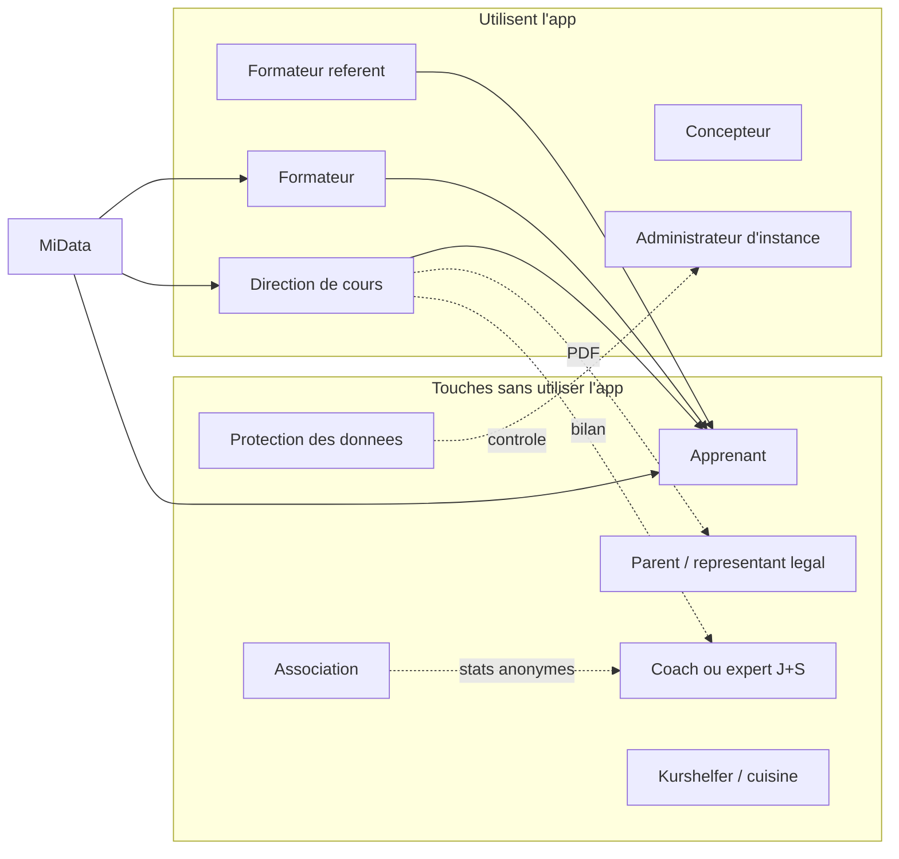
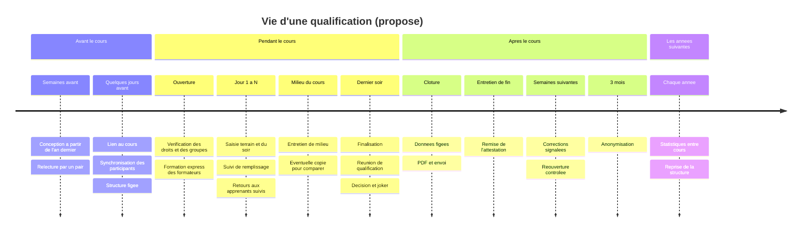
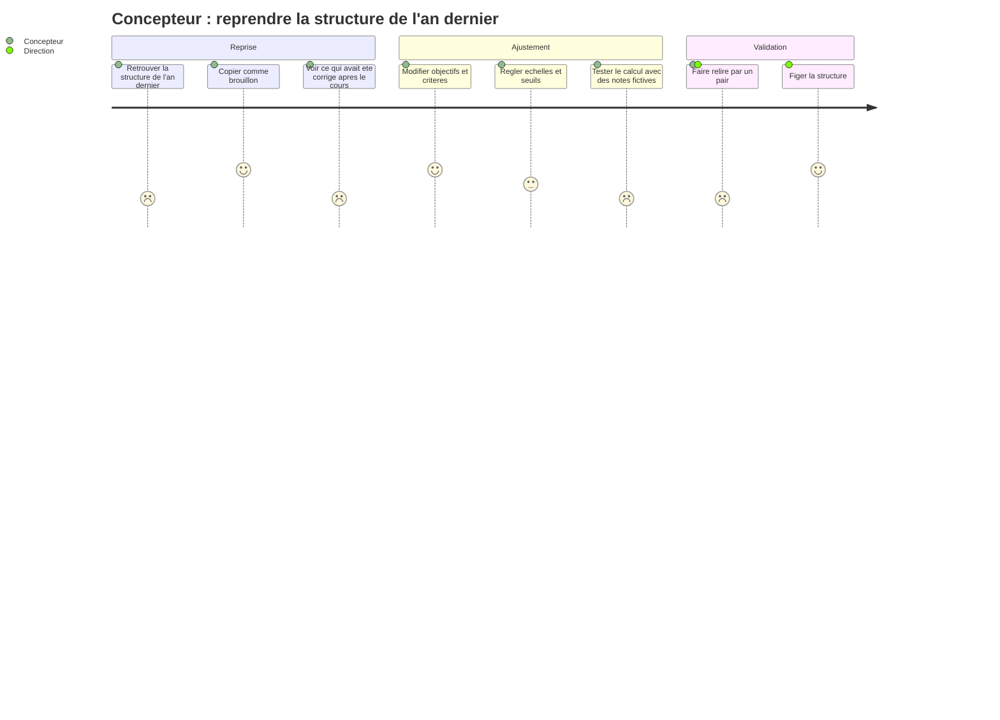
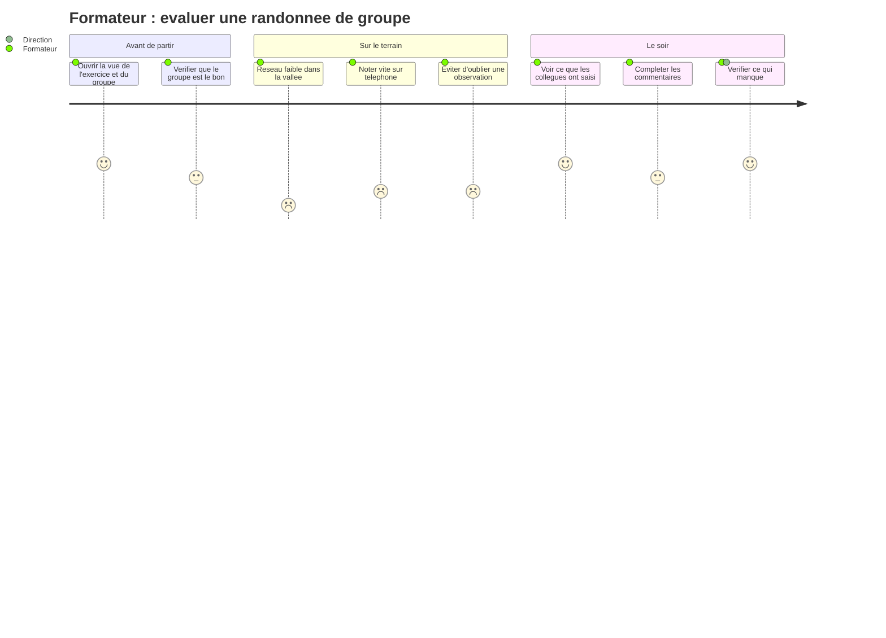
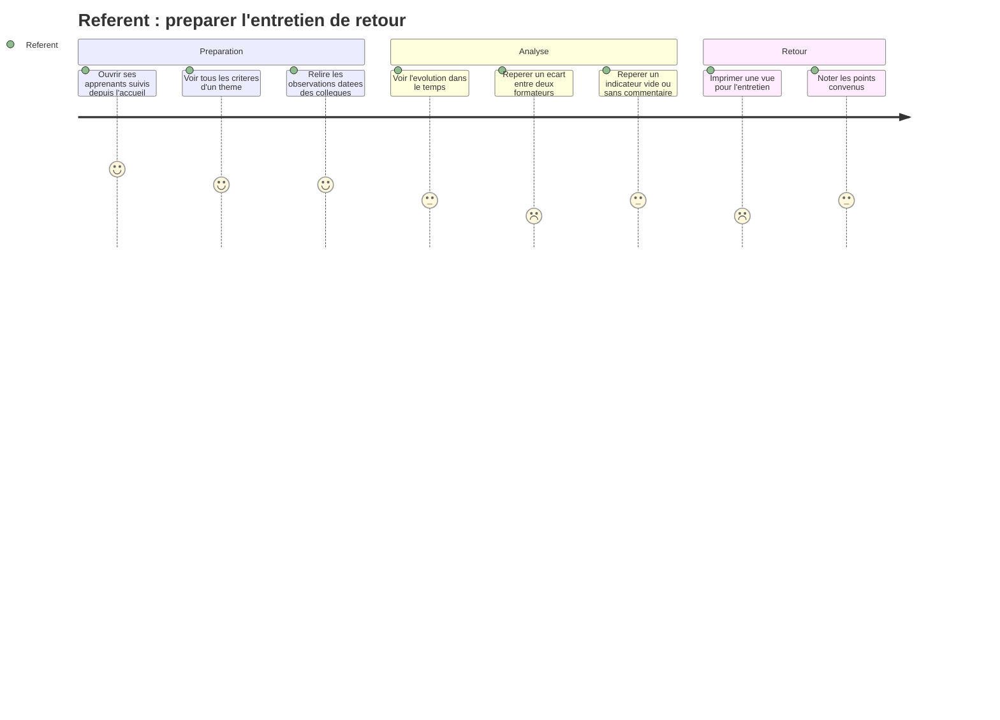
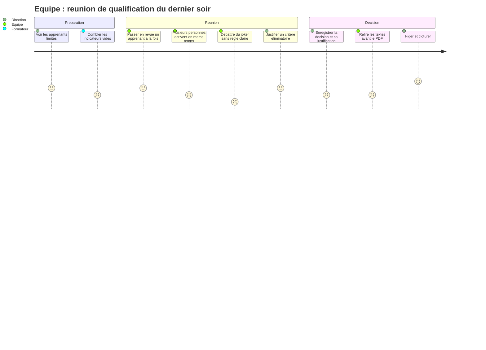
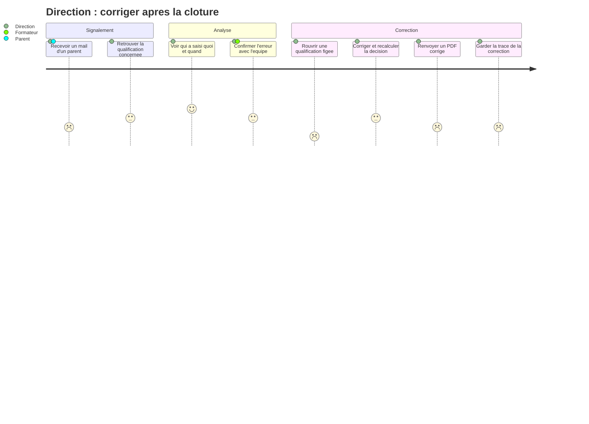
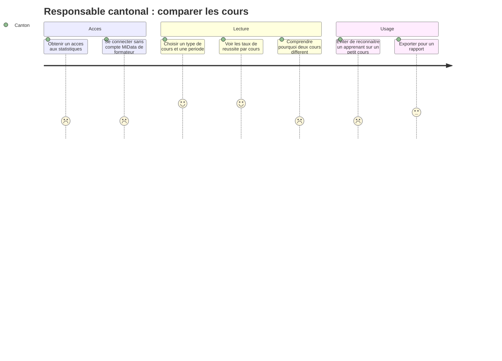

# Acteurs et parcours

But : regarder Azimut depuis les personnes et depuis le temps. Qui touche à la qualification, à quel moment, avec quelles frictions, et ce qu'il faut ajouter ou interdire.

Préfixe des nouvelles features : `N-PA`. Les IDs `S`, `L`, `C`, `P`, `A`, `I`, `T` viennent de l'inventaire commun.

## TL;DR

- Il y a **12 acteurs**, dont 5 n'ouvrent jamais l'application mais sont touchés par elle : apprenant, parent, association, personne chargée de la protection des données, coach ou responsable cantonal.
- Le **concepteur** travaille des semaines avant le cours, souvent seul, sur la structure. Rien dans les docs ne lui donne un rôle propre : il faut un droit « concevoir » séparé du droit « saisir » (N-PA1).
- Le **dernier soir** est le moment le plus risqué : toute l'équipe, la fatigue, des décisions lourdes (échec, joker). Il faut un mode dédié à la réunion de qualification (N-PA6) et une décision tracée (N-PA4).
- **Après la clôture**, les erreurs existent quand même. Sans procédure de réouverture contrôlée (N-PA3), l'équipe contournera l'outil (Excel, PDF retouché).
- Le **mineur et ses parents** sont des acteurs de fait : le PDF part vers eux, le droit d'accès existe (nLPD). Il faut une procédure claire (N-PA14) et une vérification du destinataire (N-PA5).
- Le pre-mortem montre que l'abandon vient moins des fonctions manquantes que de **la friction sur le terrain** (saisie en randonnée, réseau, rapidité) et de **la confiance** (perte de données, droits flous).
- Les **statistiques entre cours** touchent des données de mineurs et des évaluations de formateurs : seuil minimal d'effectif et données anonymisées d'abord (N-PA9).
- Proposé : 19 nouvelles features `N-PA1` à `N-PA20` (sans N-PA2) (section 7).

Convention : **[C]** = constaté dans les docs ou les Excel, **[P]** = proposé ici.

---

## 1. Acteurs

### 1.1 Vue d'ensemble

### 1.2 Fiches

Pour chaque acteur : objectifs, moment, besoins, droits probables, features.

#### A1. Concepteur de la qualification

- **Qui :** souvent la direction de cours, parfois une personne de l'association ou une ancienne direction. **[P]** Rien dans les docs ne le nomme. Les Excel montrent des notes de relecture que les concepteurs se laissent dans le fichier (FEATURES constat 11) **[C]**.
- **Objectifs :** produire une structure juste (arbre, échelles, seuils, règle de décision), réutiliser celle de l'an dernier, la corriger, la faire valider.
- **Moment :** des semaines avant le cours. Parfois pas encore lié à un cours (brouillon).
- **Besoins :** partir d'une copie, voir ce qui a changé, tester le calcul avec des notes fictives, laisser des notes de relecture, avoir un avis d'un pair avant de figer.
- **Droits probables :** créer et modifier une structure en brouillon ; la lier à un cours ; proposer de la figer. Pas d'accès aux apprenants.
- **Features :** S1 à S5, S8 à S14, L1, L2, L4, N-PA1, N-PA7, N-PA16.

#### A2. Direction de cours (Kursleiter·in)

- **Qui :** rôle MiData « qui a le droit de qualifier » **[C]**. Responsable du cours et de la décision.
- **Objectifs :** que la qualification soit prête à l'ouverture, que le remplissage avance, que la décision finale soit juste et défendable, que le PDF parte à temps.
- **Moment :** avant (figer), pendant (suivi), dernier soir (animer la réunion), après (clôture, entretiens, corrections).
- **Besoins :** vue d'ensemble du cours (P4), suivi de remplissage (P2), voir les cas limites, tracer la décision, figer et exporter.
- **Droits probables :** tous les droits de l'équipe, plus figer, modifier la structure en cours, finaliser, clôturer, exporter, rouvrir (avec trace).
- **Features :** L1 à L7, S11 à S13, P1 à P4, A3, A4, A5, I2, I3, N-PA3, N-PA4, N-PA6, N-PA8, N-PA11, N-PA15.

#### A3. LKB

- **Qui :** rôle MiData listé **[C]**. Son sens exact et ses droits ne sont pas décrits. **[P]** À confirmer : probablement une personne de l'encadrement du cours (soutien, supervision) qui n'évalue pas elle-même.
- **Objectifs :** soutenir la direction, vérifier que le cours se déroule bien.
- **Moment :** pendant le cours, surtout dernier soir.
- **Besoins :** voir l'état du cours, éventuellement les résultats, sans saisir.
- **Droits probables [P] :** lecture de tout le cours ; pas de saisie ; pas de décision.
- **Features :** A3, P4, P2.

#### A4. Formateur (Klassenlehrer·in, Referent·in)

- **Qui :** membre de l'équipe qui remplit les qualifications **[C]**. Le Referent·in intervient peut-être sur un bloc précis (un seul thème).
- **Objectifs :** saisir vite, sans perdre de notes, sans écraser le travail d'un collègue, préparer ses retours.
- **Moment :** chaque jour, souvent sur le terrain ou entre deux blocs, le soir au calme.
- **Besoins :** vue par groupe ou par exercice (C1, P1), voir qui édite (C3), saisie rapide, historique en cas d'erreur (C7, C8), vue de ses apprenants suivis (P7).
- **Droits probables :** saisir sur tout le cours ou seulement ses groupes [P] ; voir le cours entier [C : « il voit les qualifications des apprenants de ces cours »].
- **Features :** C1 à C8, P1, P2, P7, A2, A4, N-PA12, N-PA13, N-PA17.

#### A5. Formateur référent d'un apprenant

- **Qui :** un formateur qui suit un apprenant en particulier **[C : « à affiner »]**.
- **Objectifs :** connaître son apprenant, préparer l'entretien de retour, relayer ses difficultés à l'équipe.
- **Moment :** pendant tout le cours ; entretien de milieu et de fin.
- **Besoins :** vue par thème sur « son » apprenant (projection 2 de FEATURES), évolution (P3), raccourcis (P7), observations datées (S16).
- **Droits probables [P] :** mêmes droits de saisie ; en plus, accès rapide à ses suivis et à une vue « retour ». Pas de droit de décision en plus.
- **Features :** A5, P1, P3, P7, S6, S16, L5.

#### A6. Kurshelfer·in et cuisine (Küche)

- **Qui :** rôles MiData listés **[C]**. Ils aident à la logistique, ne forment pas.
- **Objectifs :** aucun lié à la qualification.
- **Besoins :** aucun dans Azimut.
- **Droits probables [P] :** **aucun accès** par défaut. Ils sont des participants du cours dans MiData mais ne doivent rien voir : la règle « formateur = ses cours » (A1, A2) ne suffit pas, il faut que le rôle compte (A3). Risque : un cours synchronisé depuis MiData les rend « membres du cours ».
- **Features :** A1, A2, A3, I1.

#### A7. Apprenant (Participant)

- **Qui :** personne évaluée, souvent mineure **[C]**. N'a pas accès à l'app **[C]**.
- **Objectifs :** comprendre où il en est, avoir des retours justes, recevoir son attestation, contester une erreur.
- **Moment :** entretien de retour, fin de cours, après.
- **Besoins :** retours oraux préparés par le référent, PDF clair et lisible, possibilité de signaler une erreur.
- **Droits probables :** nLPD : droit d'accès et de rectification sur ses données. **[P]** Pas de compte pour l'instant ; la demande passe par la direction (N-PA14).
- **Features :** L7, I3, T2, N-PA14.

#### A8. Parent ou représentant légal

- **Qui :** pour un apprenant mineur. Non nommé dans les docs. **[P]**
- **Objectifs :** recevoir l'attestation, comprendre une décision d'échec.
- **Besoins :** un document sobre, sans commentaires internes sensibles.
- **Droits probables [P] :** reçoit uniquement le PDF destiné à l'apprenant, via l'apprenant ou la direction. Jamais d'accès direct.
- **Features :** L7, I3, N-PA5, N-PA14.

#### A9. Coach ou expert J+S, responsable formation cantonal

- **Qui :** personne extérieure à l'équipe qui reçoit un bilan ou compare des cours. Non nommé dans les docs. **[P]**
- **Objectifs :** vérifier la qualité, comparer les taux de réussite entre cours d'un canton ou d'un type.
- **Moment :** pendant (visite d'un cours), après (bilan annuel).
- **Besoins :** statistiques agrégées, sans nom, par type de cours ; parfois une lecture ponctuelle d'un cours précis.
- **Droits probables [P] :** statistiques anonymes sur son périmètre (canton, type) ; lecture d'un cours seulement sur invitation de la direction, limitée dans le temps.
- **Features :** P5, P6, A3, L9, I1, N-PA8, N-PA9.

#### A10. Association (statistiques)

- **Qui :** l'organisation qui chapeaute les cours **[C : « statistiques entre cours »]**.
- **Objectifs :** taux de réussite, évolution d'un cours à l'autre, qualité de la formation, ajustement des exigences.
- **Besoins :** données anonymes et comparables ; savoir si deux cours ont des structures différentes.
- **Droits probables [P] :** statistiques entre cours uniquement, sur données anonymisées. Aucun nom.
- **Features :** P5, P6, L9, S8, N-PA9.

#### A11. Personne responsable de la protection des données

- **Qui :** n'est pas nommée dans les docs. **[P]** Contrôle la conformité nLPD (T2).
- **Objectifs :** durée de conservation respectée, accès traçables, droit d'accès exercé, aucune fuite.
- **Besoins :** voir les durées en vigueur, les purges effectuées, les accès exceptionnels, sans voir les notes.
- **Droits probables [P] :** voir le journal des accès et des purges ; déclencher une purge ou un export de dossier sur demande ; pas d'accès aux contenus.
- **Features :** L8, L9, T2, C7, N-PA1, N-PA10, N-PA14.

#### A12. Administrateur de l'instance

- **Qui :** personne technique qui héberge et exploite. **[P]**
- **Objectifs :** disponibilité, sauvegardes, synchronisation MiData, comptes.
- **Droits probables [P] :** gère l'instance, pas les contenus métier. **Il ne doit pas lire les qualifications** sans trace. Les comptes locaux n'existent pas en production **[C : TODO]**.
- **Features :** A6, I1, I2, T2, T3, N-PA1.

### 1.3 Croisement avec les rôles MiData

| Rôle MiData [C] | Acteur Azimut | Accès proposé [P] | Remarque |
| --- | --- | --- | --- |
| Kursleiter·in | Direction de cours | Tous les droits du cours | « A le droit de qualifier » [C] |
| LKB | Soutien de la direction | Lecture du cours, pas de saisie | Sens à confirmer |
| Klassenlehrer·in | Formateur | Saisie, lecture du cours | |
| Referent·in | Formateur | Saisie, peut-être limitée à son bloc | Intervenant ponctuel ? |
| Kurshelfer·in | Aucun | Aucun accès | Ne doit rien voir |
| Küche | Aucun | Aucun accès | Ne doit rien voir |
| Participant | Apprenant | Aucun accès à l'app | Source de la liste d'apprenants (I2) |
| (absent de MiData) | Concepteur | Droit « concevoir » dans Azimut | Rôle à créer (N-PA1) |
| (absent de MiData) | Coach J+S, canton | Lecture sur invitation, stats | Hors cours MiData |
| (absent de MiData) | Association, DPO, admin | Rôles propres à Azimut | Pas de lien avec un cours |

Constat : MiData ne connaît ni le concepteur, ni le coach, ni les statistiques. Une part des droits devra être **propre à Azimut** (A3 ne se limite pas à une table de correspondance).

---

## 2. Matrice de droits proposée

Légende : **O** = oui ; **S** = sous condition ; **-** = non ; **L** = lecture seule. Colonne « Source » : **D** = déduit des docs, **P** = proposé ici.

| Action | Concepteur | Direction | LKB | Formateur | Référent | Kurshelfer / cuisine | Coach / canton | Association | DPO | Admin | Source |
| --- | --- | --- | --- | --- | --- | --- | --- | --- | --- | --- | --- |
| Concevoir une structure (brouillon) | O | O | - | - | - | - | - | - | - | - | P |
| Lier une structure à un cours | O (S : accord direction) | O | - | - | - | - | - | - | - | - | P |
| Figer la structure | - | O | - | - | - | - | - | - | - | - | D partiel : « qui peut figer » ouvert |
| Modifier la structure en cours | - | O | - | S (proposition) | - | - | - | - | - | - | D : « peut changer » ; règle P |
| Saisir notes et commentaires | - | O | - | O | O | - | - | - | - | - | D |
| Voir tout le cours | - | O | L | O | O | - | S (invitation) | - | - | - | D : « voit les apprenants de ses cours » |
| Voir seulement son groupe | - | - | - | S (option) | S (option) | - | - | - | - | - | P : A4 à définir |
| Voir ses apprenants suivis | - | O | - | - | O | - | - | - | - | - | D : A5 |
| Utiliser le joker | - | O (S : avec justification) | - | proposer | proposer | - | - | - | - | - | D : « équipe » ; qui décide : P |
| Décider (réussite / échec) | - | O (S : réunion d'équipe) | - | - | - | - | - | - | - | - | P : règle humaine, tracée |
| Finaliser (dernier soir) | - | O | - | O (saisie de textes) | O | - | - | - | - | - | D : « l'équipe » |
| Clôturer (figer les données) | - | O | - | - | - | - | - | - | - | - | P |
| Exporter le PDF | - | O | L | O | O | - | S | - | - | - | D : L7 ; qui exporte : P |
| Rouvrir après clôture | - | S (double validation + justification) | - | - | - | - | - | - | S (sur demande) | - | P |
| Voir stats d'un cours | - | O | L | O | O | - | S | - | - | - | D : P4 |
| Voir stats entre cours | - | S (son type de cours) | - | - | - | - | O (son périmètre) | O | - | - | D : P5, droits à vérifier |
| Anonymiser / purger | - | - | - | - | - | - | - | - | O (déclenche) | O (exécute) | P : automatique à 3 mois [C], exceptions humaines [P] |
| Restaurer une valeur (historique) | - | O | - | S (ses propres saisies) | S (idem) | - | - | - | - | - | D : C8 ; qui : P |
| Voir le journal des accès | - | S (son cours) | - | - | - | - | - | - | O | S (technique) | P |
| Gérer comptes, instance | - | - | - | - | - | - | - | - | - | O | D : A6, sans contenu |

Règles transversales proposées :

- **Un droit se donne pour un cours.** Un rôle seul n'ouvre aucun cours (A2, A3).
- **Aucun rôle ne lit les contenus sans trace**, y compris l'administrateur (N-PA1).
- **Le droit de décider reste humain** et appartient à la direction. L'application calcule, ne décide pas (cohérent avec qualif1 et son absence de décision finale **[C]**).
- **Les droits expirent** avec le cours (N-PA11).

---

## 3. Le cours dans le temps

### 3.1 Vue d'ensemble

### 3.2 Moment par moment

#### M1. Des semaines avant : conception

- **Qui agit :** concepteur (souvent la direction).
- **Ce qu'il fait :** copie la structure de l'an dernier, ajuste les objectifs, échelles, seuils, la règle de décision ; relit.
- **Features :** S1 à S5, S8 à S14, L1, L2.
- **Frictions :** retrouver et comprendre la structure de l'an dernier ; savoir ce qui a changé ; peur de casser un calcul (formules cassées dans les Excel **[C]**) ; pas de moyen de tester le résultat avec des notes fictives.
- **Manquant :** reprise avec différences (N-PA7), cours d'entraînement et simulation (N-PA16), droit « concevoir » (N-PA1).

#### M2. Quelques jours avant : mise en place

- **Qui :** direction, administrateur (synchronisation).
- **Fait :** lie la structure au cours, vérifie la liste d'apprenants et l'équipe (MiData), crée les groupes, désigne les référents, fige la structure.
- **Features :** L1, L2, I1, I2, A3, A4, A5.
- **Frictions :** liste d'apprenants incomplète ou changée à la dernière minute ; Kurshelfer et cuisine synchronisés comme membres ; référents à répartir à la main.
- **Manquant :** vérification de la mise en place (un écran « prêt à démarrer » : droits, groupes, référents, structure figée). Voir N-PA15 pour les rappels.

#### M3. Ouverture du cours

- **Qui :** direction, formateurs.
- **Fait :** première connexion SSO, découverte de l'outil, premières saisies.
- **Features :** A6, P7, C1.
- **Frictions :** première connexion qui échoue (SSO, rôle absent) pendant que les apprenants attendent ; formateurs qui n'ont jamais vu l'outil ; tentation de revenir à Excel dès le premier blocage.
- **Manquant :** cours d'entraînement (N-PA16), mode de secours (export de la structure vide pour saisie papier ou tableur, N-PA18).

#### M4. Chaque jour : saisie

- **Qui :** formateurs, référents.
- **Fait :** évalue un exercice de groupe sur le terrain, saisit le soir, commente, consulte l'avancement.
- **Features :** C1 à C8, P1, P2, S15, S16.
- **Frictions :** réseau faible en montagne ; saisie sur téléphone ; deux formateurs sur la même cellule ; commentaire vide (oubli ou « rien à dire ? » **[C]**) ; collègue qui écrase une note ; fatigue en fin de journée.
- **Manquant :** saisie mobile adaptée (N-PA17), rappels de remplissage (N-PA15), remplacement d'un formateur absent (N-PA13), droit de brouillon privé (N-PA12).

#### M5. Milieu du cours

- **Qui :** direction, référents.
- **Fait :** entretien de milieu, bilan intermédiaire, éventuelle copie de la qualification pour tester un changement **[C : L4]**.
- **Features :** P1, P3, P4, L3, L4.
- **Frictions :** changement de structure alors que des notes existent (que deviennent-elles ? **[C : question ouverte]**) ; confusion entre copie de test et version réelle.
- **Manquant :** règle claire de modification en cours (qui, quand, effet sur les notes) ; marquage visible des copies d'essai.

#### M6. Dernier soir : réunion de qualification

- **Qui :** toute l'équipe, animée par la direction.
- **Fait :** passe en revue les cas limites, reformule les commentaires, rédige commentaire général et 3 points +/-, décide du joker, décide de la réussite.
- **Features :** L5, S11 à S13, P1, P4, C3.
- **Frictions :** tout le monde tape en même temps sur le même apprenant ; fatigue ; pression de temps ; qui tient la plume ; discussion sur un joker sans règle claire ; éliminatoire à justifier ; modifications de dernière minute sans trace de la décision.
- **Manquant :** mode séance (N-PA6), décision tracée (N-PA4), relecture avant PDF (N-PA19).

#### M7. Clôture

- **Qui :** direction.
- **Fait :** fige les données, exporte les PDF, envoie.
- **Features :** L6, L7, I3.
- **Frictions :** erreur découverte juste après la clôture ; PDF au mauvais destinataire ; adresse manquante ; mise en page inadaptée aux parents.
- **Manquant :** vérification du destinataire (N-PA5), procédure de rouvrir (N-PA3).

#### M8. Entretien de fin

- **Qui :** référent, apprenant (et parfois parent).
- **Fait :** remise de l'attestation, discussion des résultats.
- **Features :** L7, P3.
- **Frictions :** le référent n'a pas le détail sous la main ; l'apprenant conteste une note ; le référent n'a plus accès après la clôture.
- **Manquant :** accès en lecture du référent après clôture (dans la durée prévue), vue « retour » imprimable (N-PA14 couvre la procédure de contestation).

#### M9. Semaines suivantes : corrections

- **Qui :** direction, éventuellement DPO.
- **Fait :** corrige une erreur signalée, répond à une demande d'accès.
- **Features :** L6, C7, C8.
- **Frictions :** les données sont figées ; sans réouverture, l'équipe modifie le PDF à la main.
- **Manquant :** N-PA3, N-PA14.

#### M10. Trois mois : anonymisation

- **Qui :** système, DPO.
- **Fait :** supprime les noms, garde le détail **[C : L9]**.
- **Features :** L8, L9, T2.
- **Frictions :** noms dans les commentaires libres **[C : question ouverte]** ; un cas en cours de litige qu'il ne faut pas anonymiser ; stats de cours déjà utilisées dans un rapport.
- **Manquant :** traitement des noms dans les commentaires (N-PA10), suspension pour litige (N-PA10).

#### M11. Les années suivantes

- **Qui :** association, coach, cantons, concepteurs.
- **Fait :** compare les taux, reprend une structure, ajuste les seuils.
- **Features :** P5, P6, S8, L1.
- **Frictions :** structures différentes d'un cours à l'autre, donc comparaisons sans sens ; petits cours (effectifs de 10) où l'anonymat est faible.
- **Manquant :** seuil d'effectif minimal (N-PA9), liens entre versions d'une structure (N-PA7).

---

## 4. Parcours détaillés

Score d'émotion : 1 = très mauvais, 5 = très bon. Étape à 2 ou moins : la feature qui manque est donnée sous chaque diagramme. Les scores sont **proposés** et traduisent une hypothèse d'usage.

### 4.1 Concevoir une qualification à partir de celle de l'an dernier

Features manquantes :

- retrouver et comparer : reprise avec différences et notes de relecture (N-PA7) ;
- tester le calcul : cours d'entraînement et simulation (N-PA16) ;
- faire relire : statut « relu » avec commentaires de conception (N-PA7) ;
- rôle propre au concepteur (N-PA1).

### 4.2 Évaluer une randonnée de groupe sur le terrain

Features manquantes :

- réseau : coupure prolongée tolérée, hors ligne (C9, remonter en priorité, N-PA17) ;
- saisie rapide : vue mobile, grosses cibles, dictée ou notes brèves à compléter le soir (N-PA17) ;
- observation oubliée : note rapide datée rattachée à un apprenant, à classer plus tard (S16, N-PA12).

### 4.3 Préparer l'entretien de retour d'un apprenant suivi

Features manquantes :

- écart entre formateurs : vue des notes divergentes sur un même élément avec les auteurs (S16, P3) ;
- imprimer une vue d'entretien : sortie « fiche de retour » à usage interne, distincte de l'attestation (N-PA6 en fournit la mise en page ; voir aussi L7) ;
- trace des points convenus : note d'entretien rattachée à l'apprenant (S6, S16).

### 4.4 La réunion de qualification du dernier soir

Features manquantes :

- apprenants limites et vides : liste des cas à discuter, calculée (P2, N-PA6) ;
- écriture simultanée : un animateur qui tient la plume, les autres en lecture (N-PA6) ;
- joker : règles explicites par qualification, avec justification (S13, L5) ;
- décision : enregistrement signé (qui, quand, règles appliquées) (N-PA4) ;
- relecture : statut « relu par » avant export (N-PA19).

### 4.5 Corriger une erreur signalée après la clôture

Features manquantes :

- rouvrir : réouverture contrôlée avec justification et double validation (N-PA3) ;
- renvoyer : version du PDF numérotée, remplaçant l'ancienne, avec vérification du destinataire (N-PA5) ;
- trace : journal visible de la correction après clôture (C7, N-PA3, N-PA4) ;
- signalement : procédure d'accès et de rectification (N-PA14).

### 4.6 Un responsable cantonal compare les taux de réussite

Features manquantes :

- accès : rôle de lecture statistique hors cours (A3, N-PA8) ;
- comprendre l'écart : comparaison de structures et signalement quand les règles diffèrent (S8, N-PA7) ;
- reconnaissance dans un petit cours : seuil d'effectif minimal, données anonymisées (N-PA9) ;
- export : export agrégé uniquement (L7, N-PA9).

---

## 5. Pre-mortem

Hypothèse : un an après le lancement, Azimut est abandonné et les cours sont revenus à Excel. Pourquoi ?

| # | Cause plausible (point de vue de l'acteur) | Signal précoce | Feature ou règle qui l'évite |
| --- | --- | --- | --- |
| 1 | **Formateur :** « En randonnée, ça ne passe pas : je note sur papier et je ressaisis le soir, donc j'oublie. » | Part des notes saisies après 21 h ; formateurs qui ressaisissent depuis des notes papier | N-PA17, C6, C9 remonté en priorité |
| 2 | **Direction :** « J'ai perdu une note la veille de la réunion, je ne fais plus confiance. » | Un seul incident signalé de perte ou d'écrasement | C4 + C7 + C8 visibles ; message de sauvegarde clair (C5) ; test de coupure |
| 3 | **Concepteur :** « Je dois tout recréer, mon Excel de l'an dernier était plus rapide à dupliquer. » | Cours qui démarrent sans structure Azimut à J-7 | L1, L4, N-PA7 (reprise avec différences), import de structure |
| 4 | **Formateur :** « Je ne vois pas clairement ce que je dois remplir ; trop d'écrans. » | Temps moyen par indicateur ; écrans quittés sans saisie | C1, P1, P7 (accueil centré sur le groupe du jour) |
| 5 | **Direction :** « Le dernier soir, l'outil nous ralentit : on finit sur un tableur à côté. » | Export des données la veille de la clôture ; tableur à côté | N-PA6 (mode séance), L5, P2 |
| 6 | **Direction :** « Le calcul donne un résultat que je ne comprends pas ou que je ne peux pas corriger. » | Questions « pourquoi ce résultat ? » ; ajustements hors outil | S2, S5 transparents ; détail du calcul affichable à chaque nœud ; S11 avec explication |
| 7 | **Direction :** « Une erreur découverte après la clôture : impossible de corriger, on a retouché le PDF. » | Demandes de réouverture sans canal ; PDF retouchés | N-PA3 |
| 8 | **Formateur :** « Mes collègues ne remplissent pas, donc je ne vois rien d'utile. » | Taux de remplissage à mi-cours inférieur à celui attendu | P2, N-PA15 (rappels), P4 pour la direction |
| 9 | **Formateur :** « La première connexion ne marche pas, il me manque mon rôle MiData. » | Tickets de connexion le jour d'ouverture | A6, I1, écran de mise en place (M2), N-PA16 (essai avant le cours) |
| 10 | **Direction :** « Mes formateurs ne veulent pas que tout le monde voie leurs observations brutes. » | Notes laissées vides ou stockées ailleurs | N-PA12 (brouillon privé), droits explicites ; observations attribuées (S16) |
| 11 | **Parent / apprenant :** « Le PDF contient des commentaires blessants ou un nom qui n'est pas le nôtre. » | Plaintes sur le contenu ou le destinataire | N-PA19 (relecture), N-PA5 (vérification), L7 version sobre |
| 12 | **Association :** « Les stats ne sont pas comparables, on continue notre tableau à part. » | Chaque canton garde son propre fichier | S8, N-PA7 (lien entre versions), P5 avec règles affichées, N-PA9 |
| 13 | **DPO :** « On ne peut pas démontrer la durée de conservation ni qui a accédé à quoi. » | Question du DPO sans réponse possible | L9, N-PA1 (journal d'accès), N-PA14, N-PA10 |
| 14 | **Direction :** « Une personne de l'équipe est malade ; on ne sait pas qui reprend ses apprenants. » | Apprenants sans référent actif en cours | N-PA13 (remplacement), A5 |
| 15 | **Administrateur :** « La synchronisation MiData change la liste en plein cours et efface ou duplique des gens. » | Écart entre liste MiData et Azimut | I2 : aucune suppression automatique d'un apprenant avec notes, alerte à la direction |

---

## 6. Cas d'abus (misuse cases)

Un acteur utilise l'app contre l'intérêt d'un autre, par malveillance ou par négligence. Tout est **proposé**.

| # | Scénario | Acteur et victime | Conséquence | Contre-mesure métier |
| --- | --- | --- | --- | --- |
| M1 | Un formateur qui a un lien personnel (famille, conflit) avec un apprenant le note ou voit des notes qui ne le concernent pas. | Formateur → apprenant | Évaluation partiale | Déclaration de conflit d'intérêts : la direction retire cet apprenant à ce formateur (N-PA20). Visibilité des auteurs (S16). |
| M2 | Un ancien formateur ou un Kurshelfer garde un accès au cours après la fin ou à un cours auquel il n'est plus rattaché dans MiData. | Ancien membre → apprenants | Fuite de données de mineurs | Droits qui expirent à la clôture (N-PA11), resynchronisation des rôles, A2 et A3 appliqués. |
| M3 | Une note est modifiée après la décision pour « arranger » un résultat. | Formateur ou direction → apprenant | Décision injuste | Données figées à la clôture (L6) ; historique complet (C7) ; décision signée (N-PA4) ; modification après décision exige une réouverture justifiée (N-PA3). |
| M4 | Quelqu'un efface ou masque une observation gênante (un propos, un incident). | Formateur → apprenant ou collègue | Perte de preuve | Pas de suppression physique, seulement correction avec historique (C7, C8) ; la restauration par un tiers reste possible. |
| M5 | Un PDF part vers le mauvais destinataire (mauvaise adresse, parent d'un autre apprenant). | Direction → apprenant | Fuite de données personnelles | Vérification du destinataire avec confirmation (N-PA5), envoi manuel par défaut, journal d'envoi. |
| M6 | Un formateur exporte les notes de tout le cours dans un fichier personnel, puis les garde. | Formateur → apprenants | Conservation illégale | Exports journalisés et limités à la direction (N-PA1) ; filigrane avec nom et date ; rappel des règles à l'export. |
| M7 | Quelqu'un conserve les données au-delà de la durée prévue (anonymisation bloquée, copie de cours d'essai non purgée). | Direction ou admin → apprenants | Violation nLPD | Anonymisation automatique à 3 mois (L9) y compris pour les copies d'essai (L4) ; suspension de la purge seulement avec justification visible au DPO (N-PA10). |
| M8 | Un utilisateur d'un canton regroupe des statistiques sur un petit cours et reconnaît un apprenant ou juge un formateur. | Responsable de stats → apprenant, formateur | Réidentification | Seuil d'effectif minimal, pas de détail en dessous (N-PA9), données anonymisées uniquement. |
| M9 | L'administrateur lit des qualifications par curiosité (accès à la base). | Admin → apprenants | Fuite interne | Pas d'accès de contenu par l'interface ; accès exceptionnels journalisés et visibles du DPO (N-PA1). |
| M10 | Un apprenant ou un parent obtient, par un formateur imprudent, les commentaires internes (observations brutes, Posture). | Formateur → collègues | Conflit, atteinte | PDF sobre, sans commentaires internes ni éléments hors calcul sauf choix explicite (L7, S14) ; relecture (N-PA19). |

---

## 7. Features manquantes (synthèse)

Les IDs vont de N-PA1 à N-PA20 sans N-PA2 (fusionné dans N-PA1).

Priorité : **P1** = nécessaire au lancement ; **P2** = tôt après ; **P3** = plus tard.

| ID | Description | Acteur | Moment | Problème résolu | Priorité |
| --- | --- | --- | --- | --- | --- |
| N-PA1 | **Droit « concevoir » séparé de « saisir », et journal des accès** : un concepteur sans accès aux apprenants ; trace de qui a consulté ou exporté quoi ; pas de lecture sans trace par l'administrateur. | Concepteur, DPO, admin | Avant, tout au long | Droits trop larges ; preuve nLPD ; M2, M6, M9 | P1 |
| N-PA3 | **Réouverture contrôlée après clôture** : justification obligatoire, validation par deux personnes de l'équipe, modification marquée dans le PDF corrigé, nouvelle clôture. | Direction | Après la clôture | Corrections après coup sans contournement ; M3 | P1 |
| N-PA4 | **Décision tracée** : qui a décidé, quand, avec quelles règles et quel joker, rattachée à l'apprenant ; changement visible dans l'historique. | Direction, équipe | Dernier soir | Décision non défendable ; M3 | P1 |
| N-PA5 | **Vérification du destinataire avant envoi** : prévisualisation, confirmation de l'adresse, journal des envois, remplacement d'un PDF par une version numérotée. | Direction | Clôture | Mauvais destinataire ; M5 | P1 |
| N-PA6 | **Mode réunion de qualification** : liste des cas limites et des vides, un animateur qui tient la plume, affichage partagé, fiche de retour pour l'entretien. | Direction, équipe, référent | Dernier soir | Chaos de la réunion ; abandon pour tableur | P1 |
| N-PA7 | **Reprise d'une structure avec différences** : copier la structure d'un cours précédent, voir ce qui a changé, garder les notes de relecture, relecture par un pair. | Concepteur | Avant | Reconstruire chaque année ; comparabilité entre cours | P1 |
| N-PA8 | **Accès de lecture limité dans le temps pour un coach ou expert** : sur invitation de la direction, pour un cours, avec fin automatique. | Direction, coach | Pendant le cours | Coach hors cours MiData | P2 |
| N-PA9 | **Statistiques entre cours sûres** : seuil d'effectif minimal, données anonymisées, périmètre par canton ou type, export agrégé seulement. | Association, canton | Années suivantes | Réidentification ; M8 | P2 |
| N-PA10 | **Anonymisation des commentaires et suspension** : traitement des noms dans les textes libres (détection, relecture) ; suspension de la purge pour litige, visible du DPO. | DPO, direction | +3 mois | Noms dans les commentaires ; M7 | P1 |
| N-PA11 | **Expiration des droits** : accès de l'équipe limité à la durée utile (lecture après clôture pour une période fixée), retrait d'un membre. | Direction, admin | Clôture, après | Accès résiduels ; M2 | P2 |
| N-PA12 | **Notes rapides privées** : brouillon visible seulement de son auteur, publié à l'équipe sur demande ; à décider avec S16. | Formateur | Pendant | Observations oubliées ; gêne devant les collègues | P2 |
| N-PA13 | **Remplacement d'un formateur** : reprise des apprenants suivis et des groupes d'une personne absente, avec trace. | Direction | Pendant | Absence en cours de cours | P2 |
| N-PA14 | **Procédure d'accès et de rectification pour l'apprenant** : demande reçue par la direction, dossier exportable, correction via N-PA3, délai suivi. | Apprenant, parent, DPO | Après | nLPD ; confiance | P2 |
| N-PA15 | **Rappels de remplissage et écran « prêt à démarrer »** : alertes à la direction et aux formateurs (indicateurs vides avant ce soir) ; contrôle de mise en place avant l'ouverture. | Direction, formateur | Avant, pendant | Remplissage inégal ; mise en place oubliée | P2 |
| N-PA16 | **Cours d'essai** : cours fictif pour apprendre l'outil et tester une structure, purgé à date fixe. | Concepteur, formateur | Avant, ouverture | Peur de l'outil ; structure non testée | P2 |
| N-PA17 | **Saisie terrain** : vue mobile, notes brèves datées à compléter plus tard, tolérance aux longues coupures (rejoint C9). | Formateur | Pendant, sur le terrain | Randonnée, réseau faible ; cause 1 du pre-mortem | P1 |
| N-PA18 | **Export de secours** : structure et données exportables dans un format ouvert (tableur) pour la saisie hors outil et la réversibilité. | Direction | Tout moment | Peur du verrouillage ; panne le jour J | P2 |
| N-PA19 | **Relecture avant export** : statut « relu par », liste des commentaires non relus, PDF sans commentaires internes par défaut. | Direction, équipe | Dernier soir, clôture | PDF blessant ou erroné ; M10 | P2 |
| N-PA20 | **Déclaration de conflit d'intérêts** : un formateur signale un lien avec un apprenant ; la direction réaffecte ; la décision ne retient pas ses notes sans validation. | Formateur, direction | Avant, pendant | Évaluation partiale ; M1 | P3 |

### 7.1 Les trois constats principaux

1. **Le dernier soir et l'après-clôture décident de l'adoption** : mode séance (N-PA6), décision tracée (N-PA4) et réouverture contrôlée (N-PA3). Sans eux, l'équipe retourne à Excel et au PDF retouché.
2. **Les droits ne se limitent pas à MiData** : concepteur, coach, canton, association, DPO et admin n'y sont pas ; Kurshelfer et cuisine y sont mais ne doivent rien voir (matrice, section 2).
3. **Le terrain et la protection des mineurs** sont les deux risques concrets : saisie en randonnée (N-PA17, C9) et destinataire, anonymisation, accès (N-PA5, N-PA9, N-PA10, N-PA1).
