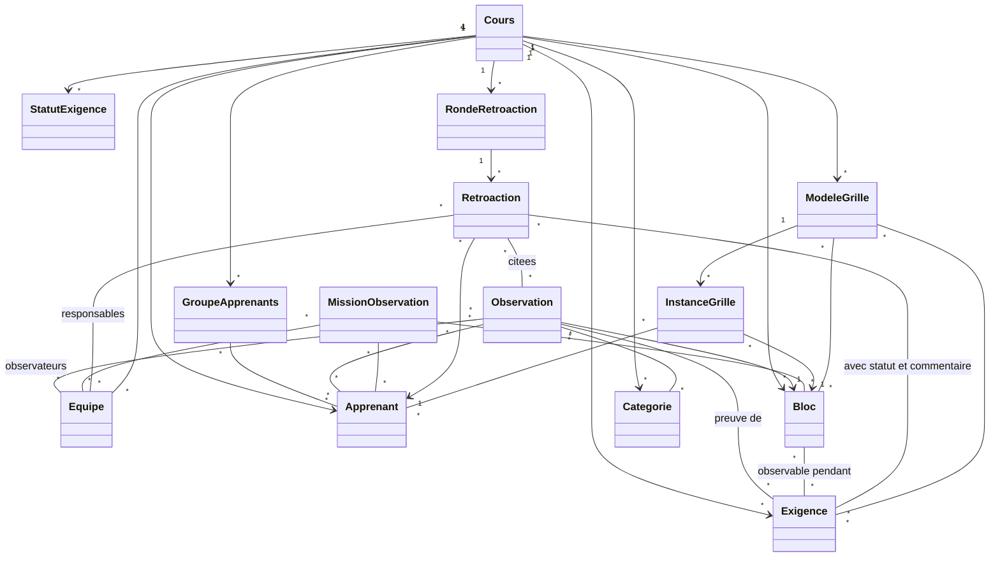
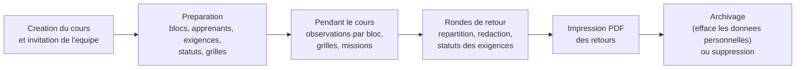

# Benchmark : Qualix face à Azimut

Ce document compare le **domaine métier** de Qualix, une application existante pour les cours scouts suisses, avec celui d'Azimut. Il cherche ce qu'Azimut peut reprendre, ce qu'il fait de différent, et où se placer.

> **Statut : analyse antérieure aux décisions (3 octobre 2026).** Le modèle de qualification est fixé par [18 — Décisions définitives](18-decisions-definitives.md), qui fait foi en cas de contradiction. Le positionnement face à Qualix reste ouvert (18, section 13). Les recommandations de modèle de ce document ne s'appliquent que si elles sont compatibles avec 18.

Sources : dépôt `gloggi/qualix` (cloné le 2026-10-03, dernier commit 2026-09-13), ses docs `docs/`, ses fichiers de langue, `CHANGELOG.md`, et ses issues GitHub (`gh`). Les chemins cités sont relatifs à ce dépôt. Les features Azimut (S, L, C, P, A, I, T) renvoient aux [identifiants du README](README.md#identifiants-des-features). Les nouvelles features portent l'ID `N-QX…` et sont des **propositions**.

Convention : **[V]** = vérifié dans le dépôt Qualix ; **[D]** = déduit, à confirmer.

## TL;DR

- Qualix est centré sur l'**observation**, pas sur la **note**. On y note des faits courts (1023 caractères max) pendant des blocs d'activité, puis on rédige à la main une **rétroaction** par apprenant. [V]
- Qualix ne **calcule rien** : pas de note, pas de moyenne, pas d'échelle, pas de règle de décision. La décision « exigence remplie ou non » est un **statut choisi à la main**. [V]
- Sa notion centrale est l'**exigence** (`Requirement`) : un critère de réussite, souvent « minimal » (obligatoire), recommandé à 10 au plus par cours, 40 au maximum. C'est une doctrine J+S, pas une contrainte technique. [V]
- Azimut vise un autre problème : des qualifications **calculées**, avec échelles, agrégations, seuils, veto, joker et temps réel sur des grilles. Qualix ne couvre pas cela. [V]
- Qualix a des features utiles que le domaine d'Azimut ignore : **blocs** (horaire), **observations assignées**, **groupes d'apprenants**, **répartition automatique des entretiens**, **import eCamp et MiData**, **matrice d'avancement des exigences**. [V]
- Les utilisateurs de Qualix demandent surtout : exports, regroupement d'observations, plus de souplesse sur les exigences, et la prise en compte de la pratique romande (critères en % d'indicateurs). Cette dernière demande ressemble à Azimut. [V]
- Positionnement proposé : Azimut est le **moteur de qualification calculée** qu'on remplit en cours, Qualix reste l'outil de **collecte d'observations**. Ils peuvent se compléter plus qu'ils ne se concurrencent.
- Contribuer à Qualix reste une option sérieuse, mais le cœur d'Azimut (calcul, temps réel sur grille) ne cadre pas avec la philosophie de Qualix.

## 1. Ce qu'est Qualix

Qualix (« was gaffsch? ») est une application web libre (licence MIT), née en 2019 dans l'Ausbildungsregion 4 Pfadi Züri. Elle sert à « saisir et gérer les observations et rétroactions utiles à la qualification dans les cours de formation J+S de la Pfadi » (`README.md`). Une instance publique tourne sur `qualix.flamberg.ch`. Il n'existe pas de site de documentation utilisateur séparé : on trouve seulement le dépôt, un `CHANGELOG.md` (avec une version française `CHANGELOG_fr.md`) et la documentation technique `docs/`. [V]

**Son approche est centrée sur les observations.** Le principe fondateur, écrit dans `docs/Vision/61 Guiding Principles.md`, est que les observations sont des notes courtes, factuelles, une affirmation par observation. Elles servent ensuite de **preuves** dans la rétroaction donnée à chaque apprenant. L'outil suit la brochure J+S/PBS « Rückmelden, Qualifizieren und Fördern im Ausbildungskurs » (RQF). Il gère les deux méthodes courantes : la qualification « en deux points » (un grand retour à la fin) et la qualification « continue » (des petits retours dès qu'une exigence est démontrée). [V]

**Qui l'utilise.** Les équipes de cours (Kursleitung, « Equipe ») uniquement. Les apprenants ne voient jamais l'outil (`61 Guiding Principles.md`). On trouve des usages pour les cours Top (Expert et Coach, issue #124), pour des cours romands (#151) et même hors scoutisme, en formation professionnelle (#76). [V]

**Ce qu'il n'est pas.** Les principes disent que Qualix résout la collecte d'observations et la planification des retours, et que pour le reste on préfère l'intégration avec d'autres outils. [V] Il n'est donc pas, par choix, un outil de calcul de résultats.

## 2. Modèle métier de Qualix

### Concepts

| Terme d'origine | Traduction | Sens |
| --- | --- | --- |
| **Kurs** (`Course`) | cours | Le conteneur de tout. Tout dépend d'un cours. Il peut être archivé. |
| **Equipe / Leitende** (`Trainer`, `User`) | équipe de cours | Les formateurs. Tous ont les mêmes droits, il n'y a pas de rôles. [V] |
| **TN** (`Participant`) | participant, apprenant | Pfadiname, groupe d'origine (Abteilung), photo, texte libre. Ni sexe ni e-mail, par principe de minimisation. [V] |
| **TN-Gruppe** (`ParticipantGroup`) | groupe d'apprenants | Un nom et des membres. Sert de raccourci pour les filtres et les formulaires. Un générateur propose des groupes qui évitent de réunir toujours les mêmes personnes. [V] |
| **Block** | bloc | Une plage de l'horaire du cours : jour, numéro, nom, date. C'est le « quand » d'une observation. Importé depuis eCamp v3. [V] |
| **Beobachtung** (`Observation`) | observation | Une note courte (1023 caractères), liée à **un bloc**, à **un ou plusieurs apprenants**, à **un ou plusieurs observateurs**. Elle peut avoir une **impression** (négative, neutre, positive), des exigences et des catégories. [V] |
| **Eindruck** (`impression`) | impression | Trois valeurs : 0, 1, 2. Facultative, désactivable par cours (surtout pour la Romandie, où observer et évaluer sont deux phases, #151). [V] |
| **Anforderung / Mindestanforderung** (`Requirement`) | exigence / exigence minimale | Un critère de réussite du cours. Le champ `mandatory` dit si elle doit être remplie pour réussir. [V] |
| **Anforderungs-Status** (`RequirementStatus`) | statut d'exigence | Une étiquette définie par le cours (nom, couleur, icône), par exemple « remplie », « en cours ». Pas de sémantique fixe. [V] |
| **Kategorie** (`Category`) | catégorie | Une étiquette libre pour regrouper des observations. [V] |
| **Beobachtungsauftrag** (`ObservationAssignment`) | mission d'observation | « Tel formateur observe tels apprenants pendant tels blocs. » Sans note ni contenu. Il alimente le Spick et la matrice. [V] |
| **Spick** (`crib`) | aide-mémoire du formateur | Une vue par bloc : ce qu'on doit y observer, quels apprenants on suit, quelles exigences s'y rattachent. [V] `routes/web.php` |
| **Rückmeldung** (`Feedback`, `FeedbackData`) | rétroaction, entretien de retour | Une **ronde** (`FeedbackData`) donne un document par apprenant (`Feedback`). Le texte est un éditeur riche où l'on insère des observations et des exigences. [V] |
| **Anforderungs-Matrix** | matrice des exigences | Apprenants en lignes, exigences en colonnes, une cellule = statut + commentaire interne. [V] |
| **Beurteilungsraster** (`EvaluationGrid`) | grille d'évaluation | Une grille de critères avec curseur, boutons radio, case, titre ou « notes seulement ». Un **modèle** (template) puis une **instance** par apprenant et par bloc. Imprimable. Créée en août 2024. [V] |
| **Übersicht** | tableau de bord des observations | Qui a fait combien d'observations sur qui, en rouge ou vert selon des seuils réglables par cours. [V] |
| **Namenslernspiel** | jeu pour apprendre les noms | Un jeu de mémorisation des noms, hors évaluation. [V] |

### Relations

Source : `docs/Architecture/12 Domain Model and Database Schema.md` et les modèles de `app/Models/`. Le diagramme est une lecture conceptuelle simplifiée. [V]

Points à noter pour le domaine :

- **L'exigence n'a pas de valeur propre pour un apprenant.** Son état pour un apprenant vit dans la rétroaction : `FeedbackRequirement` relie une rétroaction, une exigence, un statut et un commentaire (`docs/Features/23 Requirements and Qualifications.md`). La « qualification » d'un apprenant est donc l'ensemble de ses statuts dans ses rétroactions. [V]
- **Une exigence n'a qu'un niveau.** Il existe un `RequirementDetail` (sous-points), mais il est sans interface et inutilisé. Il n'y a pas d'arbre. [V]
- **La grille d'évaluation sépare modèle et instance**, comme le propose Azimut pour le référentiel. Mais elle ne calcule pas : une barre de progression au mieux, d'après l'issue #406. [V pour la séparation, D pour l'absence de calcul, confirmé par une recherche de moyennes dans `app/` qui ne trouve rien hors de la répartition]

### Cycle de vie d'un cours dans Qualix

- **Préparation.** On importe les blocs depuis l'**eCamp v3** (PDF du plan de blocs) et les apprenants depuis un export **MiData** (colonnes détectées par leurs titres traduits). Les apprenants ne sont pas synchronisés : réimporter crée des doublons. [V] `docs/Features/26 Course Setup and Teardown.md`
- **Pendant le cours.** On saisit les observations « le soir ou la nuit » : la liste des blocs met en tête ceux des deux derniers jours. [V] Les missions d'observation disent qui regarde qui. La matrice **Übersicht** montre qui manque d'observations.
- **Retours.** On crée une ronde, on répartit les apprenants entre formateurs (voulez-vous prendre telle personne ? limite de charge, paires interdites) par un algorithme de flot à coût minimal. [V] Chaque retour s'écrit à plusieurs, en direct, avec insertion d'observations et d'exigences. La matrice des exigences sert de tableau de suivi.
- **Clôture.** L'**archivage** supprime les apprenants, observations, missions, groupes et grilles remplies, et garde blocs, exigences, statuts, catégories, modèles de grille et équipe. Il est irréversible. La **suppression** efface tout. [V] Il n'y a pas d'anonymisation avec conservation des notes : c'est la différence avec L9 d'Azimut.

## 3. Correspondance des concepts

| Concept Qualix | Concept Azimut | Remarque |
| --- | --- | --- |
| Kurs | Cours | Équivalent. |
| Equipe (tous égaux) | Équipe de cours, rôles MiData (A3) | Azimut est plus riche : droits par rôle et par cours. Qualix n'a pas de rôles. |
| TN | Apprenant | Équivalent. Qualix garde un nom de scout, un groupe d'origine et une photo. |
| TN-Gruppe | Groupe (A4) | Équivalent. Qualix propose en plus un **générateur** de groupes (voir N-QX5). |
| Block | Aucun (le moment, axe « temps », S10) | **Absent** d'Azimut. Le bloc est la clé du « quand » dans Qualix. |
| Beobachtung | Observation (S16), indicateur noté | Qualix : l'observation est la donnée de base, sans note. Azimut : l'indicateur noté est la base, l'observation datée est une piste. Voir section 5. |
| Eindruck (0/1/2) | Échelle (S3) | Qualix : trois valeurs fixes, sans calcul. Azimut est plus riche. |
| Anforderung / Mindestanforderung | Critère, indicateur, éliminatoire (S2, S12) | Qualix : une liste plate, remplie ou non. Azimut : arbre calculé. L'exigence obligatoire ressemble à un critère sans compensation. |
| Anforderungs-Status | Résultat d'un nœud (S2), règle de décision (S11) | Qualix : étiquette choisie à la main. Azimut : résultat calculé et décision par règle. |
| Kategorie | Axe, thème (S9, S10) | Qualix : étiquette libre sur l'observation. Azimut : regroupement n-n possiblement décisif. |
| Beobachtungsauftrag | Aucun | **Absent** (N-QX2). |
| Spick (aide-mémoire par bloc) | Vue de saisie (C1), projection 1 (P1) | Partiel. Qualix l'organise par moment, Azimut par apprenant ou sphère. |
| Rückmeldung / Ronde | Commentaire de synthèse (S6), finalisation (L5) | Qualix : un document riche, centré sur le dialogue. Azimut : des commentaires par nœud plus un commentaire général. Voir N-QX3. |
| Anforderungs-Matrix | Projection 5 (P1), suivi (P2, P4) | Équivalent, mais Qualix y met des statuts manuels, Azimut des résultats calculés. |
| Beurteilungsraster (modèle puis instance) | Référentiel vs instances (S8), Posture et grilles hors calcul (S14) | Proche de S8 et S14. Qualix : sans calcul, ancré à un bloc, imprimable en blanc pour un usage papier. |
| Übersicht (observations par formateur et apprenant) | Suivi de remplissage (P2) | Équivalent partiel. Qualix compte les observations par formateur. Azimut compte les vides. |
| Archivage | Archivage, anonymisation (L8, L9) | Qualix efface les personnes, garde la structure. Azimut veut garder les données anonymisées. Plus riche. |
| Import eCamp v3, import MiData (CSV/XLSX) | I1, I2 (via l'API MiData) | Qualix : fichiers exportés à la main. Azimut vise la connexion directe. |
| Connexion MiData (OAuth) ou e-mail et mot de passe | A6 | Équivalent. Qualix ne lit ni les cours ni les rôles MiData. [V] `docs/Architecture/14…` |
| Rétroaction en direct à plusieurs (Yjs, pair à pair) | C2 à C4 | Différent : Qualix ne synchronise que le **texte** de la rétroaction, pas des notes. Voir section 5. |
| Namenslernspiel | Aucun | Hors périmètre d'Azimut (N-QX8, faible valeur). |

## 4. Features de Qualix absentes d'Azimut

Valeur : **haute**, **moyenne** ou **faible**. Ce sont des propositions.

| ID | Feature Qualix | Description | Valeur pour Azimut |
| --- | --- | --- | --- |
| **N-QX1** | **Blocs d'activité (le « quand »)** | L'horaire du cours est une liste de blocs datés. Les observations, grilles et retours s'y rattachent. Import depuis eCamp v3. | **Haute.** Azimut a un axe « moment » (S10) mais pas d'horaire. Un bloc donne aussi les dates de P3 et P6 sans effort. Rattacher un indicateur à un bloc répond à « quand a-t-on observé ça ? ». |
| **N-QX2** | **Missions d'observation** | Désigner d'avance qui observe quel apprenant dans quel bloc, et l'afficher dans une vue de poche (Spick). | **Haute.** Complète A5 (formateur référent) et P2 : on sait ce qui manque **et** qui devait le faire. Cela répond au vide ambigu « oubli ou rien à dire » noté dans FEATURES.md (constat 8). |
| **N-QX3** | **Rétroaction en document, avec preuves insérées** | Un texte de retour par apprenant, où l'on insère les observations et exigences concernées. Une ronde de retours (milieu de cours, fin de cours) donne un document par apprenant. | **Moyenne.** Azimut a des commentaires de synthèse (S6) mais pas de document de retour. Utile pour L5 et pour une attestation (L7). |
| **N-QX4** | **Répartition automatique des retours** | Un algorithme répartit les apprenants entre formateurs selon des vœux classés, une capacité et des paires interdites. | **Moyenne.** Utile pour A5 (référents). Le problème est réel et déjà résolu. Mérite d'être repris comme idée, pas nécessairement dès la V1. |
| **N-QX5** | **Générateur de groupes d'apprenants** | Proposer des groupes qui évitent de réunir toujours les mêmes personnes, avec des préférences de taille. | **Faible à moyenne.** Complète A4, qui porte sur des groupes d'évaluation. Hors cœur. |
| **N-QX6** | **Plusieurs observateurs, une observation, plusieurs apprenants** | Une observation peut viser plusieurs apprenants (travail de groupe) et avoir plusieurs auteurs (issue #293, livrée en juillet 2026). | **Haute.** À intégrer dans S16 : une observation d'un exercice de groupe concerne plusieurs apprenants. |
| **N-QX7** | **Commenter ou grouper les observations des collègues** | Ajouter une précision à l'observation d'un autre (#405), ou grouper des observations en un « fait » (#155). Demandes ouvertes. | **Moyenne.** Montre que les observations vivent en réseau, pas en liste plate. |
| **N-QX8** | **Jeu d'apprentissage des noms** | Un jeu pour mémoriser les prénoms et noms de scout des apprenants. | **Faible.** Sans rapport avec la qualification. Cité pour mémoire. |
| **N-QX9** | **Visibilité de l'effort d'observation** | Le tableau « qui a observé qui, combien de fois » est coloré par seuils réglables. | **Haute.** Direct pour P2 et P4 : mesurer l'**équilibre** entre apprenants, pas seulement les vides. |
| **N-QX10** | **Grille vierge imprimable pour usage papier** | Imprimer un modèle de grille ou une grille vide (et, en projet #347, pour tous les apprenants) afin de noter au stylo sur le terrain. | **Moyenne.** Répond à la réalité du terrain sans réseau (C9) : on note sur papier, on saisit après. |
| **N-QX11** | **Champs facultatifs activables par cours** | Impression, exigences, catégories sont masquées tant qu'on ne les active pas (`uses_impressions`, `uses_requirements`, `uses_categories`, #154). | **Moyenne.** Principe de conception : ne pas imposer toute la complexité aux cours simples. |
| **N-QX12** | **Séparer observer et évaluer** | Pratique romande : en phase d'observation, on exclut impression et interprétation, qu'on ne montre qu'en phase d'évaluation (#151, #154). | **Moyenne.** Cela touche au moment de la saisie (C5) et à la nature des champs d'un indicateur. |
| **N-QX13** | **Reprise de la structure sans les personnes** | À l'archivage, on garde blocs, exigences, statuts, catégories, modèles de grille. | **Haute.** Rejoint L1 (brouillon réutilisable) et L9. Une structure se réutilise d'une édition à l'autre. |
| **N-QX14** | **Avertissement hors ligne et reprise du formulaire** | Un bandeau net quand on est hors ligne (#342) et une restauration des formulaires après déconnexion. | **Moyenne.** Reprend C6 et C9 : le besoin est apparu en usage réel. |
| **N-QX15** | **Export des données du cours** | Exporter les observations d'un apprenant (#60), pour garder une trace en cas de recours ou d'indisponibilité du serveur. | **Haute.** Complète L7 (PDF) : le recours après échec est un cas réel. Voir aussi section 6. |

Les features d'infrastructure de Qualix (Sentry, pipeline CI, déploiement) sont hors périmètre.

## 5. Ce qu'Azimut fait et que Qualix ne fait pas

J'ai cherché dans `app/` des moyennes, pourcentages et écarts types. Le seul calcul que j'ai trouvé est l'algorithme de répartition des retours (`app/Services/FeedbackAllocation/`) et des comptages simples (nombre d'observations, nombre d'usages d'un statut). [V] Le reste est déduit de la structure des modèles.

| Domaine | Qualix | Azimut (proposé dans FEATURES.md) |
| --- | --- | --- |
| **Notes et échelles** | Aucune note. Impression à trois valeurs (0/1/2), qui ne sert à aucun calcul. Les grilles ont des curseurs et des cases, sans conversion. [V] | Échelles multiples, conversion, seuils (S3, S4). |
| **Agrégation** | Aucune. [V] Les comptes (observations par formateur et apprenant) sont les seuls chiffres. | Arbre calculé, poids, arrondi, vides (S2, S5, S7). |
| **Règle de décision** | Aucune. Le statut d'une exigence est choisi par un humain. « Réussi » n'existe pas comme concept : c'est la lecture de la matrice. [V] | Règle composable, seuil final, veto, joker (S11 à S13). |
| **Exigences sans compensation** | Oui, **par doctrine** : « chaque exigence minimale doit être remplie pour elle-même ». Mais la règle n'est pas calculée. [V] `CHANGELOG.md`, janvier 2024 | Règle ET entre sphères (qualif2, qualif3), mais aussi moyennes. Azimut couvre les deux familles. |
| **Hiérarchie** | Plate : exigence, au mieux regroupée en catégories (#124 demande des groupes). [V] | Arbre à quatre niveaux plus regroupements n-n (S2, S9). |
| **Référentiel et instances** | Modèle de grille et instance : oui. Exigences : une par cours, sans notion d'instance par exercice. [V] | Référentiel partagé, instances (exercice × critère) (S8). |
| **Temps réel** | Seulement sur le **texte de la rétroaction**, en pair à pair. Les observations, statuts et notes sont enregistrés par formulaire, sans verrou ni synchronisation en direct. [V] `docs/Features/24…` | Grille synchronisée, verrou de cellule, dernier gagnant (C2 à C4). |
| **Historique** | Pas de versionnement des cellules ni des observations constaté. [D] J'ai cherché dans les migrations, sans trouver de table d'historique. | Historique par cellule et restauration (C7, C8). |
| **Projections** | Vues fixes : liste d'observations filtrable, aide-mémoire par bloc, matrice des exigences, tableau de bord des observations. [V] | Projections configurables à partir d'un modèle multi-axes (P1). |
| **Statistiques** | Aucune au-delà des comptes et des seuils rouge/vert. [V] | Écart type, évolution, comparaisons entre cours (P3, P5, P6). |
| **Structure modifiable avec effet sur les données** | Le cas existe pour les grilles : ajouter une ligne crée des cellules vides partout. Changer un type de contrôle ne nettoie pas les données (TODO dans le code). [V] `docs/Features/22 Evaluation Grids.md` | Question ouverte en L3. |
| **Copie pour comparer** | Non constaté. [D] | L4. |
| **Droits par rôle MiData** | Aucun. Tous les formateurs sont égaux. Les cours ne viennent pas de MiData. [V] | A3, I1. |
| **Envoi automatique, report dans MiData** | Non. [V] `docs/Vision/62` : pas d'API externe, car les données sont sensibles. | I3, I4. |
| **Conservation et anonymisation** | Pas d'anonymisation avec conservation. L'archivage supprime les personnes. [V] | L9. |

**En résumé.** Qualix traite ce qui se passe **avant** la décision : collecter, répartir, préparer le dialogue. Azimut traite la décision elle-même, telle qu'elle se calcule dans les trois fichiers Excel analysés. Les deux se rejoignent sur la **rétroaction finale** et l'**exigence** vue comme un critère à remplir.

## 6. Ce que disent les utilisateurs de Qualix

Le dépôt compte ~70 issues ouvertes. Il n'y a pas de discussions GitHub. [V] Beaucoup d'issues sont rédigées par les mainteneurs à partir de retours d'équipes de cours (noms de scouts cités). L'activité est régulière : changelog fourni jusqu'en septembre 2026. [V]

### Besoins exprimés

| Thème | Issues | Enseignement pour Azimut |
| --- | --- | --- |
| **Sortie des données** | #60 (export CSV, ouvert depuis 2019), #59 (carnet A5 imprimable), #71 (liste d'exigences imprimable), #316 (export des groupes) | Les utilisateurs veulent garder une copie hors de l'outil : pour un **recours**, par peur d'une panne en cours de cours, pour préparer l'entretien. Cela justifie L7 et N-QX15 dès la V1. |
| **Préparer l'entretien final** | #406 (insérer des lignes de grille dans la rétroaction), #231 et #225 (modèle de texte avec observations), #158 (insérer plusieurs observations d'un coup), #119 (observations groupées par exigence) | Le vrai travail de fin de cours est de **transformer des observations en texte**. L5 doit offrir l'accès facile aux observations sous-jacentes. |
| **Regrouper et nuancer** | #155 (grouper des observations), #405 (commenter celles des autres), #156 (en masquer pour gérer le flot), #152 (champ d'interprétation séparé), #153 (importance) | Le **flot** d'observations est un problème réel. Une observation seule ne suffit pas : il faut les rassembler. Plaide pour S16 avec un regroupement. |
| **Souplesse des exigences** | #124 (grouper les exigences, cours Top à deux volets), #151 (Romandie : critères = % d'indicateurs remplis, pas d'exigences toutes à 100 %), #441 (statuts différents selon le type d'entretien) | Les besoins réels **débordent la liste plate**. Le cas romand (66 % ou 75 % des indicateurs d'un objectif) est presque exactement S5 et S11. |
| **Suivi du cours** | #252 (tableau apprenants × objectifs avec couleurs), #341 (masquer ceux qui ont tout rempli), #269 (opérations de masse sur les statuts), #227 (colonnes triables) | Même besoin que P2 et P4 : voir **où l'on en est** et **qui est en difficulté** d'un coup d'œil, et agir en masse. |
| **Planification** | #115 (missions d'observation, livrée), #215 (faire tourner les missions), #260 (répartition des retours, livrée), #394 (répartition plus équitable) | Les équipes veulent **répartir le travail** entre formateurs. À prévoir autour d'A5. |
| **Pratique papier** | #59, #347 (imprimer des grilles vierges pour tous les apprenants) | Le papier reste présent sur le terrain. Azimut ne doit pas supposer que tout se saisit en direct. |
| **Fiabilité** | #342 (hors ligne bien visible), #282 (éditeur qui ne synchronise pas sur un hotspot), #229 et #320 (perte de texte) | La synchronisation en direct pose des problèmes **sur les réseaux de camp**. C2 à C6 doivent être testés sur de mauvaises connexions. |
| **Données de personnes** | #77 (inviter des gens de cours précédents), #54 (import MiData, clos) | L'import des apprenants depuis un fichier est jugé utile ; la synchronisation, non demandée. |
| **Détournement** | #76 (usage hors scoutisme, bloc = jour), #61 (« une IA fait la décision » en plaisanterie, mai 2019) | La notion de bloc est parfois trop rigide : on veut parfois seulement une date. |

### Frustrations et limites visibles

- **L'exigence est un statut manuel.** Qualix n'aide pas à dire si quelqu'un a réussi : les formateurs lisent des cellules colorées. [V, par l'absence de calcul] Cela confirme qu'il y a un besoin d'aide à la décision, mais aucune demande explicite de calcul n'apparaît dans les issues. Un seul indice : la demande romande (#151).
- **Peu d'issues de calcul.** Personne ne demande une moyenne ou une note, ce qui est cohérent avec la doctrine RQF de Qualix. [D] Azimut vise des cours qui calculent déjà dans Excel (qualif1 à 3) : sa demande vient d'un autre public ou d'une autre pratique, ce qu'il faut valider avec les équipes concernées.
- **La limite de 40 exigences** a été posée parce que la matrice devenait illisible et que la doctrine déconseille plus de 10 exigences minimales (`CHANGELOG.md`, janvier 2024). Les modèles Excel d'Azimut comptent 156 à 290 indicateurs : ils sont **une ou deux grandeurs au-dessus** de ce que Qualix juge raisonnable. Un seul arbre d'une telle taille ne s'affiche pas en matrice complète. Les projections d'Azimut (P1) doivent donc filtrer et résumer.
- **Retours inégaux sur la Romandie.** Le vocabulaire « exigence minimale » ne passe pas, selon #151. Le multilinguisme (T1) est donc aussi un problème de **vocabulaire métier**, pas seulement de traduction.

## 7. Leçons et positionnement

### Ce qu'Azimut devrait reprendre

1. **Le bloc comme axe de temps.** C'est simple, importable depuis eCamp, et donne les dates des statistiques temporelles (N-QX1).
2. **La séparation observation / décision.** Garder les faits courts, datés, attribués (S16), distincts du résultat calculé.
3. **L'effort d'observation visible** : qui a observé qui (N-QX9), et les missions d'observation (N-QX2).
4. **Un export de sortie dès la V1** (N-QX15), pour le recours et la confiance.
5. **Le principe « masqué tant qu'on ne l'active pas »** (N-QX11) : un cours simple ne doit pas voir la mécanique des échelles et des agrégations.
6. **La séparation modèle et instance pour les grilles**, qui valide S8.
7. **Les données minimales** : pas de sexe, pas d'adresse. Utile pour T2.
8. **L'import des apprenants depuis un fichier MiData**, en attendant la connexion directe (I2), en détectant les colonnes par leurs titres plutôt que par leur position.

### Ce qu'Azimut devrait éviter

- **Ne pas fixer le plafond de taille à 10 ou 40 exigences.** Les cours cibles sont bien plus gros ; en revanche, prévoir des projections qui résument.
- **Ne pas dupliquer sa doctrine** : Qualix est calé sur la brochure RQF, Azimut est calé sur des qualifications Excel réelles. Les deux ne sont pas la même pédagogie.
- **Ne pas viser un temps réel sur du texte long en pair à pair.** Qualix l'a fait et rapporte des problèmes sur des réseaux de camp (#282). Le verrou de cellule d'Azimut (C3) est une approche plus prudente.
- **Éviter l'archivage destructif sans retour.** Qualix supprime les apprenants à l'archivage, sans retour possible. Azimut veut anonymiser et garder, ce qui est un meilleur choix. Mais il faut aussi prévoir l'export (N-QX15).
- **Ne pas ajouter de jeux ni de fonctions annexes.** Qualix le fait (jeu des noms) ; c'est un coût de maintenance pour une équipe réduite (8 contributeurs, 21 étoiles). [V]

### Ce qu'Azimut devrait faire différemment

- **Calculer.** Un résultat par nœud, une règle de décision, des échelles : c'est le point d'Azimut.
- **Mettre des identifiants stables et des règles déclaratives** là où Qualix et les Excel ont des liens fragiles.
- **Garder une trace de chaque modification** (C7), absente dans Qualix. [D]
- **S'appuyer sur MiData pour les cours et les rôles** (I1, A3). Qualix ne lit que l'identité.

### Positionnement proposé

> Azimut est l'outil de **qualification calculée** des cours de formation scouts : il remplit en équipe, en direct, la grille qui produit les résultats et la décision. Il complète Qualix plutôt que de le remplacer : Qualix collecte des observations courtes pendant les blocs, Azimut transforme les évaluations en résultats, seuils et décision finale. Ce qu'Azimut reprend de Qualix (blocs, missions d'observation, observations multi-apprenants), il le reprend comme **sources de données** de la qualification, pas comme un second outil à tenir.

### Contribuer à Qualix plutôt que créer Azimut

| Pour | Contre |
| --- | --- |
| Qualix **existe**, est en production, utilisé par de vraies équipes, avec import eCamp et MiData déjà faits. | Le cœur d'Azimut est un moteur de calcul avec arbre, échelles et règle de décision. Qualix n'a rien de tel : il faudrait en **ajouter un** à un modèle volontairement plat. |
| Licence MIT : on peut reprendre le code, y compris pour un projet séparé. | Les principes de Qualix **refusent** certaines choses : observations courtes, peu d'exigences, pas d'API externe, pas d'outil visible par les apprenants. Un moteur de calcul y serait un corps étranger. [D] |
| Une communauté et des mainteneurs actifs. Pas besoin de refaire la collecte et l'infrastructure. | L'équipe est petite (8 contributeurs, 21 étoiles) ; faire accepter une grosse refonte du modèle est incertain. [D] |
| La demande romande (#151) montre que l'ouverture aux critères en pourcentage est possible, et qu'on la cherche. | La pile technique de Qualix (PHP, Laravel, rendu serveur) diffère de celle visée pour Azimut. Les temps réel sur grille et le recalcul type tableur seraient à ajouter à contre-courant. [D] |
| Éviter de diviser le petit public scout. | Un public différent : Azimut vise des cours qui calculent aujourd'hui dans Excel. Ce public n'a pas été interrogé dans les issues de Qualix. [D] |

**Avis honnête.** Si le besoin se limitait à « voir où en est le cours, répartir, préparer le retour », contribuer à Qualix suffirait. Si le besoin est de reproduire les trois modèles Excel (arbre calculé, seuils, veto, joker), Qualix ne le fait pas et ne s'y destine pas. La décision dépend d'une question à poser aux porteurs de Qualix : **accepteraient-ils un module de calcul optionnel** ? Une réponse négative justifie Azimut. Une réponse positive demande de comparer le coût d'une intégration à celui d'un projet séparé. Un échange avec les mainteneurs avant de coder est recommandé, quelle que soit l'issue.

## Ce qui reste à vérifier

- L'usage réel de Qualix sur les cours qui calculent leurs résultats dans Excel : le font-ils en parallèle ? Une demande directe aux équipes de cours serait plus fiable que les issues.
- La présence ou non d'un historique des modifications dans Qualix : non trouvé dans les migrations, à confirmer en testant l'instance publique.
- La nouvelle édition de la brochure RQF, annoncée comme « bientôt » dans `docs/Vision/61`, qui peut changer la doctrine sur laquelle Qualix s'appuie.
