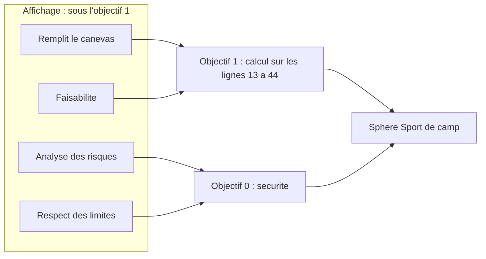
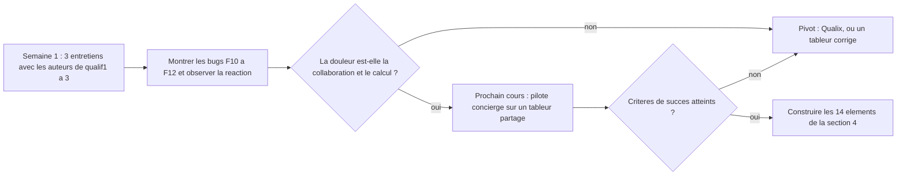

# Contre-analyse (red team) des analyses 01 à 06

Ce document attaque les six analyses produites sur Azimut. Il cherche ce qui est faux, fragile, contradictoire ou excessif, et dit aussi ce qui tient. Il ne résume pas les autres documents.

> **Cadrage (ajouté après relecture du porteur du projet).** Les trois Excel sont le système **actuel**, pas la cible : Azimut vise un outil **générique**, compatible avec tous les types de qualification. Les **faits vérifiés** de ce document (section 1), ses angles morts (section 5) et sa critique de l'utilisabilité restent valables. Ses **réductions de périmètre** ne sont pas retenues : le modèle minimal (§3.4), « un seul chemin de calcul », les étiquettes « jamais décisives » et la coupe des axes et des projections (§4.4). qualif1 calcule déjà deux chemins en parallèle (exercices et thèmes transversaux). Le modèle de référence est `10-modele-generique.md`, et les vues sont dans `11-projections-et-vues.md`.

## TL;DR

- **Le doc 02 se trompe sur trois faits structurants.** Dans qualif2, les critères de sécurité ne comptent **pas deux fois** : ils sont affichés sous leur objectif mais calculés seulement dans l'objectif 0. La remédiation de qualif2 n'est **pas moyennée** : elle est hors du calcul. Dans qualif1, l'objectif 4.1 ne compte **pas** dans le % de l'exercice. `FEATURES.md` (constat 2) contient déjà la même erreur que le doc 02 pour qualif2.
- **Conséquence pour le modèle** : dans les trois fichiers, chaque indicateur compte dans **un seul** chemin de calcul décisif. Les regroupements n-n ne servent qu'à des résultats indicatifs. Le vrai besoin est de séparer **où un élément s'affiche** de **où il compte**. Le doc 02 ne fait pas cette distinction.
- **Deux bugs graves n'ont été vus par personne.** Dans qualif3, un dossier **entièrement vide** donne « Réussi ». Dans qualif2, l'objectif « Topographie » de Trekking vaut **toujours 1**, quelles que soient les notes.
- **Les affirmations du doc 02 qui contredisent `FEATURES.md` sont vraies, mais il faut les nuancer.** Dans qualif1, « vide = 0 point » est confirmé, mais qualif1 note en points de 0 à 1 : c'est presque l'exception ok/ko déjà prévue. Les bonus sont confirmés sans effet, mais le +1,5 rate le seuil de 85 % de seulement 0,17 point : c'est probablement une intention ratée. Le seuil de 80 % correspond à 2,6 sur 5, ou à 2,59 avec l'arrondi.
- **Inflation** : 81 nouveaux IDs, qui se ramènent à environ 45 idées distinctes. Les docs 04 et 05 classent « MVP » ou « P1 » 23 idées nouvelles, en plus des 54 features existantes. Le plus petit produit qui fait abandonner Excel tient en **14 éléments**. Il ne contient ni l'éditeur de grille, ni le mode réunion, ni les statistiques.
- **Angles morts communs** : personne ne sait comment l'Excel est partagé aujourd'hui. Personne ne voit l'alternative « un meilleur tableur ». Personne ne parle de la gouvernance du produit (qui paie, qui maintient, qui répond à 23 h), du cadre J+S (la décision donne une **licence**) ni du biais de l'échantillon (trois cours romands, dont deux de Neuchâtel).
- **L'hypothèse la plus risquée** : la douleur actuelle est la collaboration et la fiabilité du calcul, et une équipe confiera sa qualification à un outil externe tenu par un bénévole. On peut la tester **sans code** en deux semaines : entretiens avec les auteurs des trois Excel, puis un pilote « concierge » sur un tableur partagé.

Légende : **[V]** vérifié par moi dans les fichiers (feuille, cellule, formule) ou dans une source citée ; **[D]** déduit, à confirmer ; **[C]** repris d'un autre doc sans vérification.

---

## 1. Vérification des faits

Méthode : lecture des formules avec `openpyxl`, et des **valeurs en cache** des modèles vierges (`data_only=True`). Elles montrent ce que l'Excel affiche quand rien n'est saisi.

### 1.1 Les affirmations du doc 02 qui contredisent `FEATURES.md`

| # | Affirmation | Doc | Verdict | Preuve |
| --- | --- | --- | --- | --- |
| F1 | Dans qualif1, une case vide vaut 0 point. | 02 §4.3 | **Confirmé, à nuancer** | `Construction de cours!K12 = SUM(F13:F16)` (points possibles, toujours comptés) ; `L12 = SUM(G13:G16)` (points obtenus) ; `O11 = N11/M11`. Une case vide ne rapporte rien mais compte dans le possible. **Nuance** : l'échelle de qualif1 va de 0 au poids, et le poids vaut toujours 1. C'est presque une échelle ok/ko, et `FEATURES.md` traite déjà le cas ok/ko comme une exception. La contradiction est donc plus faible qu'annoncé. Le vrai problème est ailleurs : **0 et vide sont indiscernables** dans qualif1. |
| F2 | Les bonus +1 et +1,5 de qualif2 ne changent aucun palier. | 02 §5.1 | **Confirmé, à nuancer** | `Situations d'urgence!I30` : `COUNTIF(H31:H36,"o")/ROWS(H31:H36)*100+1.5`, soit 6 indicateurs. Les % possibles sont 0 ; 16,7 ; 33,3 ; 50 ; 66,7 ; 83,3 ; 100. Les seuils (`Listes!E13:F17`) sont 0, 30, 45, 70 et 85. Avec le bonus, 83,3 + 1,5 = 84,8, donc toujours sous 85. `I44` et `I59` : +1 sur 10 indicateurs comptés (multiples de 10), aucun seuil n'est franchi. **Nuance [D]** : le +1,5 rate 85 de 0,17 point. L'intention probable était de faire passer 5 sur 6 au palier 5. Ce n'est donc pas une « intention inconnue » mais une intention **ratée**. **Bug non relevé [V]** : `I44` ne compte que `H45:H54`, alors que le critère a 11 indicateurs. La ligne 55 (« La structure ORA est respectée ») est hors calcul, mais elle est comptée dans le taux de remplissage (`O43`). |
| F3 | Dans qualif3, 80 % correspond à 2,6 sur 5. | 02 §4.4 | **Confirmé, à nuancer** | `A - Techniques JS!O6 = ROUND(IF(O4<=3,(O4-1)/2,1+(O4-3)*0.25),2)` ; seuil dans `Synthèse!O26 = 0,8`. (2,6 − 1) / 2 = 0,80. Avec l'arrondi au centième, une moyenne brute d'environ 2,59 suffit. |
| F4 | Dans qualif3, l'ordre conversion / moyenne change le résultat. | 02 §4.4 | **Confirmé** | `A - Techniques JS!O4 = SUMPRODUCT(N11:N164,F11:F164)/…` : la sphère fait la moyenne des objectifs **bruts** (colonne N). Les % d'objectif (colonne J) ne sont qu'affichés. Comme la conversion n'est pas linéaire (50 % par point sous 3, 25 % par point au-dessus), deux objectifs notés 1 et 5 donnent 100 % par la moyenne brute, et 75 % par la moyenne des %. |

### 1.2 Autres affirmations, et faits que personne n'a vus

| # | Affirmation | Doc | Verdict | Preuve |
| --- | --- | --- | --- | --- |
| F5 | Dans qualif2, les critères de sécurité comptent dans leur objectif **et** dans l'objectif 0 (double comptage). | 02 §7.2, `FEATURES.md` constat 2 | **Faux** | `Sport de camp` : l'objectif 1 (`N12`) calcule sur `I13:I44`, donc sans les critères des lignes 45 et 51. L'objectif 0 (`N10`) calcule sur les lignes 45, 51, 86, 92, 112 et 136. Les objectifs 2, 3 et 4 (`N53`, `N94`, `N117`) excluent aussi leurs critères de sécurité. On retrouve la même chose dans `Trekking` (`N12 = I13:I32`, `N10` commence en `I33`) et dans `Activité de camp` (`N12 = I13:I38`, `N10 = I39`). Chaque critère compte **une seule fois**. Il est affiché sous son objectif, et le taux de remplissage `O12` le compte là, mais il n'est calculé que dans l'objectif 0. |
| F6 | La remédiation de qualif2 est moyennée avec la tentative, et une remédiation non faite tire la sphère vers le bas. | 02 §5.2, §7.4 | **Faux** | `Situations d'urgence!O4 = SUMPRODUCT(J1:J43,F1:F43)/…`. L'objectif 4 « remédiation » est en ligne 58, donc **hors du calcul**. Il est affiché dans la Synthèse (`E53`) sans aucun effet. La proposition d'une agrégation « maximum » repose sur ce fait faux. |
| F7 | Dans qualif1, l'objectif 4.1 compte dans le % de l'exercice (schéma §7.1 : `O41a --> R1`). | 02 §7.1 | **Faux** | `Construction de cours!M7 = SUM(M11:M51)`, alors que 4.1 commence en ligne 52. Les 7 feuilles d'exercice suivent le même schéma : le dernier objectif (4.1 ou 2.1) est exclu du % de l'exercice. Il ne compte que dans les moyennes transversales de la Synthèse (`C55 = AVERAGE(C56:C59)`, `I55`). |
| F8 | Dans qualif2, un objectif vide compterait 0 dans 3 sphères sur 4. | 02 §4.3 | **Nuancé (théorique)** | Un objectif n'est jamais vide. Un critère o/k vide renvoie le premier palier (1) via `VLOOKUP`, et un critère 1 à 5 vide vaut 1 via `IFERROR(…,1)`. Les valeurs en cache du modèle vierge donnent 1 partout, et « Échoué » pour chaque sphère et pour le cours (`Synthèse!F28`). En pratique, **le vide vaut 1**, pas 0. |
| F9 | Objectif 0 de Sport de camp : le dénominateur est faux. | 02 §7.2 | **Confirmé** | `Sport de camp!N10` : le dernier terme du dénominateur est `SUMPRODUCT(I136:I138,G136:G138)` au lieu de `(I136:I138<>"")*G136:G138`. Il additionne une note × poids au lieu d'un poids. |
| F10 | Dans qualif2, Trekking est oubliée dans la règle finale. | `FEATURES.md`, 02 | **Confirmé** | `Synthèse!F28 = IF(AND(F30="Réussi", F34="Réussi", F49="Réussi"),…)`. `F41` (Trekking) est absent. |
| F11 | **Nouveau.** L'objectif « Topographie » de Trekking vaut toujours 1. | aucun | **Vérifié** | `Trekking!N142 = SUMPRODUCT(G143,I143)/SUMPRODUCT((G70:G71<>"")*I143)`. Seul `G70` est rempli, donc le dénominateur vaut `I143` et le résultat vaut `G143`, c'est-à-dire 1, quelles que soient les notes. Cet objectif pèse 1 sur 9 dans la sphère. Un apprenant parfait en topographie y est noté comme le pire. |
| F12 | **Nouveau.** Dans qualif3, un dossier vide est « Réussi ». | aucun | **Vérifié** | Valeurs en cache du modèle vierge : `Synthèse!F26`, `F35` et `F42` valent « Réussi », et `F24` (réussite du cours) aussi. Le mécanisme : `C3` renvoie `""`, et dans Excel `"" >= 0,8` est vrai (un texte est plus grand qu'un nombre). Une sphère sans aucune note est donc réussie. Cela donne raison à l'état **« incomplet »** du doc 02, mais aucun doc n'a vu le bug. |
| F13 | **Nouveau.** Les auteurs de qualif3 disent que leur échelle n'est pas numérique. | aucun ; contredit 02 §4.2 | **Vérifié** | `Echelle!C3` : « nous utilisons une échelle de couleur… chaque couleur est représentée par un nombre ». `C5` : « il ne s'agit pas d'une simple échelle de 1 à… ». `D8` : « si plagiat, colorier en rouge ». Le doc 02 pose qu'« une échelle est toujours numérique en dessous ». Les auteurs de qualif3 disent le contraire, puis font quand même des moyennes. La couleur sert aussi de **marqueur** (plagiat), ce que le modèle ne prévoit pas. |
| F14 | Ancres par niveau d'échelle : « vos qualifications décrivent-elles les niveaux ? » | 04 (N-HA4) | **Déjà dans les fichiers** | `Echelle!C8:D12` décrit chaque niveau de 1 à 5 dans qualif2 et qualif3, de façon globale et pas par indicateur. Le chapeau blanc du doc 04 n'a pas lu les Excel. |
| F15 | La colonne d'ajustement manuel de la Synthèse de qualif3 (`E27 = … + M27`). | 02 §5.2 | **Confirmé, à nuancer** | Formule exacte. Mais la colonne n'est **pas masquée** (aucune colonne masquée dans les trois fichiers), et l'ajustement ne change que le **% affiché** de l'objectif. Le résultat de la sphère et la décision n'en dépendent pas : `F26` compare `E26`, qui lit la cellule `C3` de la feuille de sphère. C'est un ajustement **cosmétique** : l'équipe retouche le chiffre imprimé pour qu'il colle à son jugement. C'est un signal sur la pratique, pas un mécanisme de calcul. |
| F16 | Les éliminatoires : un avertissement d'abord, l'élimination seulement en cas de récidive. | 02 §6.4 (qualif1) | **Confirmé, et plus large** | `qualif1, Critères éliminatoires!C8`. qualif2 a la même logique dans `Critères éliminatoires!C9` (« malgré les avertissements »). Dans qualif1, un motif est aussi un **petit arbre** (un titre en `C11`, plusieurs indicateurs, et « un seul indicateur KO suffit »), pas un simple booléen. |
| F17 | Taille : 156, ~290 et 219 indicateurs. | `FEATURES.md`, 06 | **Confirmé** | Comptés : 156, 289 et 219. **Mais** une sphère compte jusqu'à 115 indicateurs (Trekking), alors que le tableau des volumes de `FEATURES.md` en prévoit 10 à 60. Et il y a 3 ou 4 sphères, pas 5 à 7. |
| F18 | Les apprenants sont « souvent mineurs ». | `FEATURES.md`, 03, 04, 05 | **À vérifier** | Les types de cours sont écrits dans les fichiers : `qualif1, Synthèse!I4` « TOP - Expert·e J+S », `qualif2, Synthèse!H3` « Base - Moniteur·ice JS SdC/T », `qualif3, Synthèse!H3` « RU - Chef de camp JS SdC/T ». **[D]** Ce sont surtout des cours pour jeunes adultes, avec quelques participants de 17 ans peut-être. Les experts J+S sont adultes. Les features « parent » des docs 04 et 05 sont peut-être surdimensionnées. |
| F19 | Qualix ne calcule rien et refuserait un module de calcul. | 06 | **Nuancé** | L'issue `gloggi/qualix#151` (vérifiée) discute, dès 2020, une « option 1 » : grouper des indicateurs en objectifs avec un seuil de 66 % ou 75 %. L'issue #124 (« grouper les exigences ») est ouverte. **Qualix se rapproche du terrain d'Azimut.** La même issue dit que les cours romands se font « souvent en trois week-ends », avec des rendus entre deux week-ends. |
| F20 | « Personne ne l'a vu » (la sphère oubliée, les formules cassées). | 04 (chapeau blanc) | **Invérifiable** | Les fichiers sont vierges. L'équipe a peut-être corrigé à la main. |

### 1.3 Ce qui tient

- Le relevé du doc 02 est **globalement exact** sur les formules : les paliers par critère, l'arrondi dans le calcul, le repli à 1, les décimales permises en A et B, le joker non branché, les deux objectifs « 4 » liés par numéro de ligne (`Synthèse!N39 = 81`, `N40 = 101`).
- Les erreurs du doc 02 portent toutes sur **la même chose** : il a lu la structure d'affichage (les lignes) comme si c'était la structure de calcul (les plages des formules). C'est instructif : les auteurs des Excel affichent un élément à un endroit et le font compter ailleurs.

*qualif2, Sport de camp, vérifié : l'affichage et le calcul ne suivent pas le même arbre.*

---

## 2. Contradictions entre les analyses

| # | Sujet | Positions | Position recommandée | Pourquoi |
| --- | --- | --- | --- | --- |
| X1 | Le mot **« observation »** | 02 : la note et le commentaire saisis sur un indicateur. 04 (N-HA8), 05 (N-PA12) et 06 : un fait court et libre, au sens de Qualix. | Réserver « observation » au **fait libre**. Sur un indicateur, on parle de **note** et de **commentaire**. | Qualix et la brochure RQF (`Beobachtung`) imposent déjà ce sens dans le mouvement. Un même mot pour deux choses rendrait l'intégration avec Qualix confuse. |
| X2 | **Modèle, grille, gabarit, dossier** | 02 : modèle / grille / dossier, et « gabarit » pour les préréglages. 04 : « gabarit » pour une qualification type (N-HA32) et pour un commentaire (N-HA14). 03 (H6) : « grille » pour l'écran. 06 : « grille d'évaluation » au sens de Qualix. Le doc 02 se contredit lui-même : il définit le rendu comme un livrable « (dossier, document, vidéo) » et le dossier comme les données d'un apprenant. | Deux mots seulement en V1 : la **grille** (la structure d'un cours) et la **qualification de [participant]** (ses données), comme le disent déjà les équipes. « Modèle » attend la réutilisation entre cours. Abandonner « dossier » et « gabarit ». | En J+S, « dossier » désigne déjà les documents de camp et les rendus. Le doc 02 reconnaît que « la qualif de Toto » restera. Mieux vaut suivre l'usage que le combattre. |
| X3 | Les noms des acteurs | 05 : « direction de cours ». 04 : « responsable de cours ». 03 : « responsable de formation ». 02 : « apprenant » (« participant » est rejeté). | Utiliser les mots des fichiers : **maîtrise** pour l'équipe et **participant·e** pour la personne évaluée [V : `qualif1, Synthèse!C8` « Commentaire général de la maîtrise », `qualif3, Synthèse!C51` « la maîtrise dispose d'un Joker », « La·e participant·e » partout]. | Les termes du terrain existent. « Apprenant » est un mot de concepteur. |
| X4 | Peut-on **s'écarter du calcul** ? | 02 : la décision suit la proposition ; s'en écarter demande un joker. 04 (N-HA21) : le journal garde « l'écart avec le calcul ». 05 : « le droit de décider reste humain ». 01 (G4) : l'outil propose, l'équipe décide. | **Écart permis, avec justification obligatoire et trace.** Le joker devient un cas particulier, borné et nommé, pour les grilles qui le veulent. | qualif1 n'a pas de règle du tout. Dans qualif3, la maîtrise retouche déjà les % affichés à la main (F15). Interdire l'écart pousse à **modifier les notes** pour obtenir la décision voulue, ce qui détruit la traçabilité que le modèle cherche. |
| X5 | Observations multiples, carnet | 02 : en option (mode journal). 01 (G7) : plus tard. 04 : N-HA8 en MVP. 05 : N-PA17 en P1. 06 : N-QX6 de valeur haute. | **Plus tard.** | Excel ne le fait pas aujourd'hui, donc ce n'est pas une condition pour quitter Excel. Qualix le fait déjà très bien. Le refaire mettrait Azimut en concurrence directe avec Qualix. |
| X6 | Terrain et hors ligne | `FEATURES.md` et `TODO.md` : pas de hors ligne pour l'instant. 05 : N-PA17 en P1, C9 « remonté en priorité ». 03 (H4) : hypothèse fragile. 04 : kit papier « à tester ». | Garder la décision. Ajouter seulement l'**export et l'impression** de grilles vierges, et **mesurer** le réseau avant d'aller plus loin (D6 du doc 03). | Le doc 05 rouvre une décision prise sans donnée nouvelle. La vraie question n'est posée par personne : comment l'Excel circule-t-il aujourd'hui ? Voir l'angle mort A1. |
| X7 | Généraliser **maintenant** ou **plus tard** | 01 : versions et variantes (G3), regroupements indicatifs (G5) et trace datée (G7) plus tard. 02 : variante liée (N-MG4), statut indicatif central, mode journal (N-MG7) dans le modèle dès maintenant. | Suivre le doc 01 pour G3 et G7. Pour G5, garder seulement « décisif ou non » : est décisif ce que la règle de décision cite. | La « variante liée » du doc 02 est un mécanisme de branche avec des données propres. Elle est plus lourde que la question posée par L4 (« tester un changement et comparer »). |
| X8 | Le rôle de **Qualix** | 06 : Qualix complète Azimut ; Azimut reprend les blocs, les missions et les observations, « pas comme un second outil ». 04 et 05 réinventent des features de Qualix sans le citer : plan d'observation (N-HA13), couverture (N-HA5), répartition (N-HA24). 02 : « comparer avec Qualix avant de figer le vocabulaire », sans le faire. | Choisir **avant de coder** : (a) Azimut = la grille calculée seulement, et l'interopérabilité avec Qualix plus tard ; ou (b) proposer un module de calcul à Qualix. Rencontrer les mainteneurs (le doc 06 a raison sur ce point). | Reprendre les blocs et les missions **fait** un second outil, quoi qu'en dise le doc 06. Les issues #151 et #124 montrent que les mainteneurs cherchent déjà une réponse au besoin romand. |
| X9 | Notes internes et historique | 04 (N-HA18) : les notes internes sont supprimées à la clôture et « réduisent les données conservées ». C7 : chaque modification est versionnée. 05 (M4) : pas de suppression physique. 03 (Z9) : le recours a besoin de traces. | **Pas de N-HA18 en V1.** | Une note supprimée reste dans l'historique, sauf si on purge aussi l'historique, ce que C7 interdit. **[D]** Le droit d'accès de la nLPD porte aussi sur ces notes : l'idée « on ose écrire parce que ce ne sera pas imprimé » donne un faux sentiment de confidentialité. |
| X10 | Anonymisation | 06 : anonymiser et garder, c'est « un meilleur choix » que Qualix. 03 (K6) : une anonymisation de façade. 05 (N-PA10) : détecter les noms dans les textes. | **Supprimer par défaut**, comme Qualix. Ne garder des agrégats que si quelqu'un en a un usage réel, nommé. | Des commentaires libres sur une personne ne s'anonymisent pas de façon fiable. Aucune statistique entre cours n'a de demandeur identifié. Le doc 06 donne son avis sans argument. |
| X11 | Droits | 05 : 10 acteurs, une matrice de 20 actions × 11 colonnes, un rôle « concepteur » en P1. 06 : dans Qualix, tous les formateurs sont égaux, et cela marche. | **Deux rôles en V1** : la **direction** (figer, clôturer, décider, rouvrir) et le **formateur** (saisir, voir le cours). | Une équipe de 6 à 10 bénévoles se connaît. La matrice du doc 05 sert surtout des acteurs qui n'existent pas encore dans l'app (canton, association, DPO). |
| X12 | Les priorités | 01 : état, projection, règle, MiData. 02 : le risque du tableur. 03 : décision finale, figer, rôles MiData. 04 : check-list, journal, états du vide. 05 : dernier soir et après clôture. 06 : export, blocs. | Tester d'abord l'hypothèse de la section 6, puis livrer le produit minimal de la section 4. | Chaque doc pousse les priorités de son angle. Aucun ne part de la question « qu'est-ce qui fait quitter Excel ? ». |
| X13 | Mineurs et parents | 04 et 05 construisent un acteur « parent » et des features pour lui (N-PA5, N-HA31). | Vérifier la pyramide des âges par type de cours (F18) avant toute feature « parent ». | Les trois cours étudiés visent surtout de jeunes adultes [D]. |
| X14 | Le dernier soir | 04 : mode réunion en MVP. 05 : P1. 03 (H5) : on ne sait pas comment il se passe. | **Observer un dernier soir** avant de construire quoi que ce soit de spécifique. | Les deux parcours « dernier soir » (04 et 05) sont des intuitions, avec des scores d'humeur inventés. |

---

## 3. Critique du modèle généralisé (doc 02)

### 3.1 Ce qui est solide

- **Le vide veut dire « pas d'observation »**, et ce que vaut un vide se règle dans l'agrégation. Le bug F12 (dossier vide réussi) montre que c'est nécessaire.
- **Proposition et décision séparées**, avec l'état « incomplet ».
- Les **identifiants stables**, la **règle rédigée en phrases**, le **refus des formules libres** et l'**explication de chaque résultat**.
- Les **règles de modification en cours** (§9) : retirer plutôt que supprimer, tracer, interdire de changer l'échelle sans correspondance.

### 3.2 Ce que les fichiers démentent

1. **Les regroupements décisifs n-n ne sont pas observés** (F5, F7). Chaque indicateur compte dans un seul chemin décisif. Les vrais multi-parents (thèmes de qualif1, moyennes de 4.1 et 2.1) sont tous **indicatifs**. Les poids portés par l'appartenance, l'alerte de double comptage (N-MG3) et les règles de sélection ajoutent de la complexité pour un cas qui n'existe pas dans les données.
2. **L'affichage et le calcul ne suivent pas le même arbre.** La règle 3 (« l'arbre principal donne l'ordre de saisie, d'affichage et d'impression » et sert au calcul) ne décrit pas qualif1 ni qualif2. Pour exprimer « affiché sous l'objectif 1, compté dans l'objectif 0 », le modèle devrait mettre un poids nul. Or le contrôle N-MG3 signale justement le poids nul comme une erreur. **Le modèle signalerait comme une erreur une pratique voulue.**
3. **La remédiation** n'est pas moyennée (F6). L'agrégation « maximum » ne répond à rien de constaté.

### 3.3 Les cas que les auteurs n'ont pas choisis

| Cas | Ce que dit le modèle | Où ça casse | Correction proposée |
| --- | --- | --- | --- |
| **Échelle ++/+/-/--** | « Des nombres avec des noms » : -- = 1 … ++ = 4, « valeurs à choisir ». | Une échelle symbolique est **ordinale**. Faire la moyenne de « + » et de « - » n'a pas de sens pédagogique, et les valeurs choisies changent les décisions. Les équipes qui utilisent ++/+/-/-- comptent souvent (« pas de -- », « une majorité de + »), elles ne font pas de moyenne [D]. | Une échelle déclare un **niveau de réussite** (ex. « + et au-dessus »). Les agrégations peuvent **compter** les membres réussis. Les moyennes ne sont permises que si l'échelle est déclarée numérique. |
| **« Au moins 75 % des indicateurs à 3 ou plus »** (la pratique romande, Qualix #151) | La part des « o » n'existe que pour o/k (moyenne de 0 et 1). « Nombre de réussis » porte sur des regroupements qui ont un seuil. | La règle n'est pas exprimable pour une échelle de 1 à 5 sans créer un regroupement par indicateur : c'est l'effet tableur, par la porte de derrière. | Même correction : le niveau de réussite se pose sur l'**échelle** de l'indicateur, et « part des membres réussis » devient une agrégation de base. |
| **1 à 10 et 1 à 5 dans le même critère** | Règle 6 : un regroupement exige des membres sur la même échelle, sinon une conversion. La conversion ne s'applique qu'**à la sortie** d'un regroupement. | Il faudrait envelopper chaque indicateur 1 à 10 dans son propre regroupement pour le convertir. | Autoriser une conversion **à l'entrée** : sur l'appartenance, ou une fois pour toutes sur l'échelle (« 1 à 10 se lit comme 1 à 5 par… »). |
| **Exercice de groupe noté une fois pour 5 participants** | Une observation appartient à **un** dossier. | On saisit 5 fois la même note. Une correction ne se propage pas, et l'historique montre 5 écritures. Le doc 03 (E12) et le doc 06 (N-QX6) l'ont signalé ; le doc 02 l'ignore. | Une **note de groupe** : saisie une fois pour un groupe, héritée par chaque membre, avec une **dérogation individuelle** visible. |
| **Observations multiples** | Mode journal par regroupement, note retenue = la dernière. | (a) Un indicateur dans deux regroupements, l'un en mode journal et l'autre non, a deux régimes à la fois. (b) « La dernière » : la dernière saisie ou la dernière observée ? Un collègue qui saisit le soir une observation du matin change le résultat. (c) Le dernier gagnant (C4) efface un désaccord entre deux formateurs. | Le mode se pose sur l'**indicateur** ou sur sa section d'affichage. Pour un élément décisif, la note retenue est **choisie par un humain**, pas tirée automatiquement. Sinon, réserver le journal aux éléments indicatifs. |
| **Participant arrivé en cours**, ou exercice annulé pour un seul groupe (météo) | Un seul état vide : « pas d'observation ». Plus N-MG1 « rien à signaler ». | Le participant reste « incomplet » pour toujours. Avec « ignorer », il est jugé sur moins d'éléments que les autres. Avec « compter comme non », il échoue mécaniquement. Il manque l'état « **non applicable** ». | Un état **non applicable** (dispensé), posé sur un élément ou un exercice pour un dossier ou un groupe, avec une justification. Il sort du calcul et du suivi, et il est visible. |
| **Structure modifiée à mi-cours** | Modifications tracées, aperçu de l'impact, variante liée. | (a) Changer un poids change aussi le résultat déjà **annoncé** au bilan intermédiaire, et personne ne garde ce qui a été dit. (b) La variante « lit sans copier », mais « une observation sur un indicateur qui n'existe que dans la variante y reste » : c'est une branche avec des données propres, et sa fusion n'est pas définie. | Une variante est une **simulation en lecture seule** des réglages : on ne saisit rien dedans. Ajouter un **instantané** des résultats communiqués à un bilan. |
| **Cours en deux modules**, ou en trois week-ends (romands, Qualix #151 ; les cours TOP, Qualix #124) | Un cours (MiData) = une grille = des dossiers. Le « dernier soir » est unique. Accès limité au cours. | Si chaque module est un événement MiData, le participant a deux dossiers sans lien. L'équipe du module 2 ne voit pas le module 1 (A2). Les rendus faits entre deux week-ends n'ont pas de « moment ». Le délai de 3 mois et la clôture changent de sens. | Séparer la **qualification** (le conteneur du dossier) de l'**événement MiData** : une qualification peut couvrir 1 à n événements. À vérifier dans MiData [D]. |
| **La Posture influence la décision humaine** | Statut indicatif : « un résultat indicatif n'entre jamais dans la règle ». La décision suit la proposition, sauf joker. | Si la Posture est très mauvaise et la règle dit « réussi », la seule voie est un **éliminatoire** : binaire, lourd, avec justification. Il n'y a pas de voie graduée, alors que les éliminatoires de qualif1 (« attitude passive », « faible remise en question ») sont en fait de la Posture. | Permettre l'écart justifié (X4), en citant des éléments indicatifs comme motifs (« Posture B3 et B4 »). |
| **Le joker de qualif3** | Une règle de joker : cibles, amplitude, nombre. | Le texte de la grille (`Synthèse!C51`) dit pourquoi le joker existe : « si elle juge que le participant peut obtenir sa licence alors que la qualification non ». C'est un **contournement humain borné**, orienté vers la réussite. Le modèle n'a pas de sens (vers le haut ou le bas). Un participant à 2,0 (50 %) qui reçoit +0,5 arrive à 75 % et échoue quand même. | Ajouter le sens. Reconnaître que le joker est une forme limitée de l'écart justifié (X4). |
| **Une couleur ou un marqueur sur une note** (« si plagiat, colorier en rouge », F13) | Rien. | Le marqueur porte une information que la note ne porte pas. | Un **drapeau** sur une note (rejoint N-HA11). Facultatif en V1. |

### 3.4 Trop général et pas assez

**Trop général.** Pour chaque nœud, le modèle propose : un statut à trois valeurs, des membres listés ou sélectionnés, des poids par appartenance, une échelle de sortie, des conversions (« dans le calcul » ou « à l'affichage »), trois traitements du vide, un mode journal, des étiquettes sur des axes, des regroupements organisationnels, que le doc reconnaît être presque des étiquettes, et des variantes liées. Les parades (gabarits, préréglages, options repliées) ne suppriment pas l'effet tableur : elles **le déplacent** vers la personne qui écrit les gabarits. Or chaque équipe adapte son Excel chaque année (constat 11). Quelqu'un programmera donc le tableur, à chaque fois. Le risque n'est pas évité, il est caché.

**Pas assez général.** Il manque l'état « non applicable », la note de groupe, le comptage d'indicateurs réussis sur une échelle non binaire, la conversion à l'entrée, la séparation entre affichage et calcul, l'écart justifié, et plusieurs événements pour une même qualification.

**Modèle minimal proposé**, qui couvre les trois Excel tels qu'ils calculent vraiment (proposé, à rejouer sur des dossiers remplis) :

1. **Un seul arbre de calcul** par grille. Chaque indicateur y a un seul parent.
2. Une **mise en page** séparée : chaque élément peut s'afficher dans une autre section que celle où il compte. La sécurité de qualif2 et le 4.1 de qualif1 rentrent ainsi sans n-n.
3. Des **étiquettes** pour les vues et pour des résultats **indicatifs seulement** (thèmes, moyennes d'un objectif sur plusieurs exercices). Jamais décisifs en V1.
4. Des **échelles** avec un niveau de réussite, et des valeurs numériques facultatives.
5. **Trois agrégations** : moyenne pondérée, part des membres réussis, n sur m. Le total de points est un préréglage de la moyenne pondérée.
6. Une conversion à la sortie d'un nœud, toujours dans le calcul. L'affichage en % est un simple **format**.
7. Les états d'une note : **vide** (non observé), **non applicable** (justifié) ou une **valeur**.
8. La **décision** : une proposition, puis une décision humaine justifiée. Le joker est un réglage facultatif.

On retire du modèle V1 : les regroupements organisationnels, les axes comme concept à part, les règles de sélection, le mode journal, la variante liée, et la position « conversion à l'affichage ».

---

## 4. Inflation de features

### 4.1 Le compte

Il y a **81 nouveaux IDs** : N-CF (2), N-MG (7), N-HA (38), N-PA (19) et N-QX (15). Beaucoup sont la même idée sous deux ou trois noms.

| Idée | IDs |
| --- | --- |
| Le vide explicite | N-MG1, N-HA9 |
| Tester la grille et expliquer le calcul | N-MG2, N-HA25, N-HA26, N-PA16, N-HA3 |
| La réunion du dernier soir | N-HA20, N-PA6, N-HA19, N-HA11 |
| La décision tracée | N-HA21, N-PA4, la « Décision » du doc 02 |
| Réutiliser une structure | N-MG6, N-HA32, N-PA7, N-QX13 |
| Les observations libres | N-HA8, N-PA12, N-PA17 (en partie), N-QX6, N-MG7, N-CF1 |
| Le papier et l'export | N-HA35, N-PA18, N-QX10, N-QX15 |
| Qui observe qui | N-HA5, N-HA13, N-QX2, N-QX9 |
| La relecture avant l'attestation | N-HA22, N-HA23, N-PA19, N-HA38 |

Après regroupement, il reste **environ 45 idées distinctes**. Les docs 04 et 05 en classent 23 en « MVP » ou « P1 ». Ajoutées aux 54 features existantes, cela fait plus de **75 « indispensables »** pour 6 à 10 bénévoles.

### 4.2 Le rasoir

Deux questions par élément :

1. **Excel le fait-il aujourd'hui ?** Si oui, l'absence de l'élément ramène l'équipe à Excel.
2. **Sans lui, le premier cours réel échoue-t-il ?** Des notes perdues, une décision fausse, pas d'attestation ou une fuite de données.

Tout le reste est du confort, de l'ambition pédagogique ou une prévision d'usage.

### 4.3 Le plus petit produit qui fait abandonner Excel (14 éléments)

| # | Élément | IDs | Pourquoi c'est indispensable |
| --- | --- | --- | --- |
| 1 | **La grille d'un cours réel, saisie par l'équipe Azimut avec la direction** (concierge), à partir de son Excel | S1 réduit, S2 à S5 du modèle minimal | Sans la grille de **leur** cours, rien ne commence. L'éditeur de grille sert une fois par an à une personne : on le remplace d'abord par un import fait à la main. |
| 2 | **La liste des participants** par import d'un export MiData, ou saisie à la main | I2 réduit | Qualix fait ainsi et personne ne demande la synchronisation (doc 06). |
| 3 | **La connexion MiData**, et l'équipe du cours désignée par la direction | A6, A2 | C'est décidé, et c'est le minimum pour les données de personnes. On n'a pas besoin de lire les rôles (I1, A3) pour un premier cours. |
| 4 | **Deux rôles** : direction et formateur | A3 réduit | Voir X11. |
| 5 | **Deux vues de saisie** : par participant, et par section × groupe (une colonne par participant) | C1 | C'est le gain principal sur Excel : voir tous les participants à la fois. |
| 6 | **Saisir à plusieurs sans rien perdre**, et voir les saisies des autres | C4, C6, C2 en version simple | Sinon, la confiance est perdue dès le premier soir (pre-mortem du doc 05, cause 2). |
| 7 | **L'historique par cellule**, en lecture seule | C7 | Il rend le dernier gagnant acceptable, et il est décidé. La restauration (C8) peut attendre : on recopie l'ancienne valeur. |
| 8 | **Le calcul, avec « incomplet » et l'explication d'un résultat** | S7, S11, S12 (veto), N-MG2 réduit | Il doit faire au moins aussi bien qu'Excel, sans ses bugs (F10 à F12). L'explication permet de comparer avec l'ancien Excel pendant le pilote. |
| 9 | **Vide, non applicable** | N-MG1 réduit | Deux états, pas trois. « Rien à signaler » attendra : c'est un clic de plus par case, multiplié par 17 000 cases. |
| 10 | **Le suivi de remplissage** par participant et par section | P2, P4 réduit | qualif2 et qualif3 le bricolent déjà. Il est peu coûteux et il est utile chaque soir. |
| 11 | **La finalisation** : commentaire de sphère, commentaire général, 3 points positifs, 3 points à améliorer, décision justifiée (et joker si la grille en a un) | L5, S6, S13, N-HA21 = N-PA4 | C'est exactement ce que contiennent les Synthèses Excel aujourd'hui. |
| 12 | **L'attestation PDF**, aussi proche que possible de la feuille « Attestation » actuelle | L7 | C'est le livrable du cours. |
| 13 | **La clôture**, et une réouverture par la direction avec un motif | L6, N-PA3 réduit | La clôture fige l'attestation. Un bouton « rouvrir avec motif » évite de retoucher le PDF à la main. |
| 14 | **Un export complet en tableur** à tout moment, et la **suppression** des données à date fixe | N-QX15 = N-PA18, L9 réduit | C'est le plan B en cas de panne, la réversibilité et la confiance. La suppression est plus simple et plus sûre qu'une anonymisation. |

### 4.4 Les coupes importantes

| Coupé de la V1 | IDs | Justification |
| --- | --- | --- |
| **L'éditeur de grille dans l'app** | S1 complet, N-MG3, N-MG6, N-PA1, N-PA7, N-HA32 | C'est la partie la plus coûteuse et la moins utilisée. Tant que le modèle n'est pas validé sur des dossiers remplis, un éditeur figerait un modèle faux (voir section 3). |
| **Les regroupements n-n décisifs, les axes, les projections libres** | S9, S10, P1 au-delà de C1 | Ils ne sont pas observés dans le calcul (F5, F7). Les vues fixes suffisent. |
| **Le mode réunion, la check-list, les drapeaux** | N-HA19, N-HA20, N-PA6, N-HA11 | Personne n'a observé de dernier soir. Le suivi de remplissage (10) projeté au mur couvre l'essentiel. |
| **Les verrous de cellule** | C3 | **[D]** Deux formateurs écrivent rarement le même commentaire du même participant en même temps. Afficher « modifié par X à l'instant », avec l'historique, suffit pour un pilote. C'est une décision prise (`TODO.md`) : à remettre en question avec des données, pas à retirer sans discussion. |
| **Les observations libres, le carnet, la saisie terrain** | S16, N-HA8, N-PA12, N-PA17, N-MG7, N-QX1, N-QX2, N-QX6 | Excel ne le fait pas et Qualix le fait (X5). |
| **Le calibrage et l'équité** | N-HA1 à N-HA7, N-HA10, N-HA13 | La valeur est réelle (le doc 04 a raison), mais c'est un changement de **pratique**, pas d'outil. Un atelier d'une heure sur papier (N-HA3) le teste sans code. |
| **Les commentaires assistés** | N-HA14 à N-HA18, N-HA22, N-HA23, N-HA38 | Ce sont des améliorations de la rédaction. Excel n'en a aucune, donc personne ne restera sur Excel à cause d'elles. |
| **Statistiques, anonymisation, archivage, acteurs hors cours** | P3, P5, P6, L8, L9 complet, N-PA8, N-PA9, N-PA10, N-PA11, N-PA14 | Aucun utilisateur identifié ne les demande. Elles créent l'essentiel du risque nLPD. |
| **Variantes, modification de structure en libre-service** | L4, N-MG4, L3 complet | Pendant le pilote, l'équipe Azimut modifie la grille à la demande, avec une trace. |
| **Mail, report dans MiData, multilingue, hors ligne** | I3, I4, T1 (au-delà de l'architecture décidée), C9 | Ce sont des intégrations, ou des besoins d'un second public. |

---

## 5. Angles morts communs

Aucun des six docs n'aborde vraiment les points suivants.

| # | Angle mort | Ce qu'on sait | Pourquoi c'est grave |
| --- | --- | --- | --- |
| A1 | **Comment l'Excel circule-t-il aujourd'hui ?** Sur un ordinateur, sur un disque partagé, sur Excel Online, par mail ? | Rien. | Si les équipes utilisent déjà Excel Online, le temps réel n'apporte rien de nouveau. Si elles travaillent sur des fichiers locaux, elles ont le **hors ligne**, et Azimut leur ferait perdre quelque chose. Toute la valeur de C2 à C6 dépend de cette réponse. |
| A2 | **L'alternative « un meilleur tableur »** | Personne ne l'évalue. | Un classeur corrigé (une matrice participants × indicateurs, des identifiants stables, les bugs F9 à F12 corrigés), partagé sur un service hébergé en Suisse, coûte quelques soirées. C'est le **vrai concurrent** d'Azimut. S'il suffit, Azimut ne se justifie pas. |
| A3 | **Qui crée et migre les grilles ?** | 156 à 289 indicateurs par grille [V], des grilles réadaptées chaque année. | Personne ne saisira 289 indicateurs dans un éditeur la veille d'un week-end de préparation. Sans migration accompagnée, l'adoption s'arrête avant le premier cours. |
| A4 | **Qui forme les formateurs ?** | Le doc 05 cite seulement une « formation express ». | Les bénévoles changent chaque année. Si la prise en main prend plus de 10 minutes, l'outil se perd entre deux cours. Il faut un parcours sans formation, ou un rôle de « référent Azimut » dans chaque équipe. |
| A5 | **La gouvernance du produit** : qui maintient, qui paie l'hébergement suisse, qui répond le dernier soir à 23 h quand ça casse ? | Une seule personne développe [D]. | La qualification conditionne une **licence J+S** [V : `qualif3, Synthèse!C51`]. Un incident à 23 h sans personne pour répondre, c'est un cours qui ne peut pas clôturer. Il faut un plan B (l'export, élément 14), une organisation porteuse et une **deuxième personne** qui sache faire tourner l'app. Les choix techniques, nombreux et récents (`GOALS.md`), rendent la reprise par un autre bénévole difficile [D]. |
| A6 | **Le responsable du traitement** au sens de la nLPD | Le doc 03 pose la question, aucun doc n'en fait une condition préalable. | Un développeur privé qui héberge des évaluations de personnes, avec des justifications d'éliminatoires (drogues, alcool, limites psychiques [V : `qualif2, Critères éliminatoires!C20:C24`]), s'expose seul. Ce sont des **données sensibles**. Il faut une association (cantonale ou MSdS) responsable, avant toute donnée réelle. |
| A7 | **Le cadre J+S / OFSPO / MSdS** | Les fichiers citent J+S, la licence, et les objectifs officiels du MSdS (`qualif3, Objectifs MSdS`). Le doc 06 cite la brochure RQF. | **[D]** La décision donne ou refuse une licence J+S. Les règles de qualification, d'exigences et de recours sont peut-être fixées au niveau national. Un outil qui **calcule par moyenne** (avec compensation entre indicateurs) peut aller contre la doctrine RQF (« chaque exigence minimale doit être remplie pour elle-même », doc 06). Il faut vérifier que la pratique romande est admise, et ce qu'en pense la commission de formation. |
| A8 | **Le biais de l'échantillon** | Trois cours romands : deux de Neuchâtel (`PBS CH NE …`), un TOP [V]. Qualix #151 décrit une pratique romande différente [V]. | La « qualification calculée » est peut-être **une pratique romande**. Le public d'Azimut serait alors la Romandie seulement, ce qui change l'ampleur du projet, la priorité du multilingue et le rapport avec Qualix (qui sert surtout la Suisse alémanique [D]). |
| A9 | **Pédagogie : réduire la qualification à un chiffre** | Les auteurs de qualif3 écrivent que leur échelle n'est « pas une simple échelle de 1 à… » (F13). | Un résultat calculé à deux décimales invite à contester au centième (2,58 contre 2,59). L'outil peut aussi pousser l'équipe à suivre le chiffre (le doc 04 l'appelle « confiance aveugle »). Le doc 04 voit le risque, mais personne ne demande si une qualification **calculée** est souhaitable. |
| A10 | **L'équité entre cours** | Pour la même licence, qualif2 exige « toutes les sphères ≥ 3 » et qualif3 « toutes les sphères ≥ 80 % » ; qualif1 n'a pas de règle [V]. | Les statistiques entre cours montreraient que deux participants de même niveau obtiennent ou non la même licence selon le canton. C'est un sujet **politique**, pas technique. Il faut l'aborder avant de promettre P5. |
| A11 | **La langue réelle des cours** | Le doc 03 évoque les cours bilingues. | Les cantons bilingues (Fribourg, Valais, Bienne) et le Tessin ; une maîtrise mixte où un formateur bernois commente en allemand dans une grille en français ; une attestation en deux langues. Le doc 02 traduit « Grille » par « Raster » et « Dossier » par « Dossier » sans aucun locuteur. |
| A12 | **L'accessibilité** | qualif3 est pensé comme une « échelle de couleur » [V]. | Les personnes daltoniennes, la lecture d'écran, la dyslexie, la saisie au clavier rapide, et les formateurs âgés ou peu à l'aise avec le numérique. Aucun doc n'en parle. |
| A13 | **L'électricité et l'impression sur le lieu de cours** | Rien. | Recharger les ordinateurs en camp, avoir une imprimante pour l'attestation du dernier jour. Le réseau n'est pas la seule contrainte matérielle. |
| A14 | **Le premier cours réel est à enjeu réel** | Rien. | Personne ne propose de **rejouer** d'anciens dossiers remplis dans le modèle, ni de garder l'Excel en parallèle pendant le premier cours. Un bug comme F12 dans Azimut ferait réussir un participant qui n'a rien rendu. |
| A15 | **Le bénéfice total** | 4 à 5 cours en parallèle (`FEATURES.md`). | **[D]** Peut-être 10 à 20 cours par an et quelques centaines de participants. Le rapport entre l'effort (un produit temps réel complet) et le gain n'est calculé nulle part. |
| A16 | **Les sessions sur des appareils partagés** | Le doc 04 propose un « mode discret ». | Un ordinateur de camp partagé, une session restée ouverte : la fuite la plus probable n'est pas l'écran vu par-dessus l'épaule, c'est la **session oubliée**. |

---

## 6. L'hypothèse produit à tester en premier

**Hypothèse la plus risquée.** *Une maîtrise de cours quittera son Excel pour un outil web externe, tenu par un bénévole, si cet outil calcule comme son Excel (sans ses bugs) et permet de saisir à plusieurs. Autrement dit : la douleur principale est la collaboration et la fiabilité du calcul. Ce n'est pas la rédaction des commentaires, le réseau, ni la conception de la grille.*

Tout Azimut repose sur cette phrase. Aucun doc ne l'a vérifiée : les trois Excel sont vierges, aucun auteur n'a été interrogé, on ne sait pas comment le fichier circule (A1), et l'alternative « meilleur tableur » n'est pas écartée (A2).

**L'expérience la moins chère, sans code, en deux temps.**

1. **Entretiens (une semaine, quelques soirées).** Trente minutes avec la direction de chacun des trois cours, au format « raconte-moi ton dernier cours, écran partagé, avec le vrai fichier ». Questions fermées à poser :
   - Où était le fichier, et qui l'a ouvert, quand, sur quel appareil ?
   - Qu'avez-vous fait à la main le dernier soir ?
   - Combien d'heures avez-vous passées à fusionner, recopier ou corriger ?

   Récupérer au moins un dossier rempli et anonymisé. Montrer ensuite les bugs F10, F11 et F12 et noter la réaction : « on le savait, on corrige à la main » ou « ça a peut-être faussé une décision ». La réaction mesure l'importance réelle d'un calcul fiable.
2. **Pilote « concierge » (au prochain cours).** L'équipe Azimut construit à la main, à partir du modèle de la maîtrise, **un seul tableur partagé** : une matrice participants × indicateurs, une feuille par sphère, une feuille de suivi du remplissage, les formules corrigées. Il est hébergé selon les règles de la nLPD. L'équipe Azimut est disponible pendant le cours et note chaque demande et chaque contournement.

**Critères décidés avant de commencer** (à ajuster avec l'équipe) :

- **Succès** : au moins 2 directions sur 3 disent qu'elles changeraient d'outil pour ce gain. Pendant le pilote, au moins 4 formateurs saisissent dans la matrice partagée. On ne revient pas aux classeurs par participant, et le dernier soir se fait depuis la matrice.
- **Échec** : la douleur citée en premier est ailleurs (rédaction, réseau, temps de réunion), ou le tableur partagé suffit à l'équipe.
- **En cas d'échec** : contribuer à Qualix (#151, #124), ou livrer un modèle Excel corrigé. C'est beaucoup moins cher qu'un produit temps réel.

**Ce que le pilote apprend aussi**, gratuitement : les vrais volumes de commentaires, les cases laissées vides, l'usage réel du réseau et des appareils (H4 à H6 du doc 03), et un dossier rempli pour **rejouer** le modèle de la section 3 avant d'écrire la moindre ligne.
