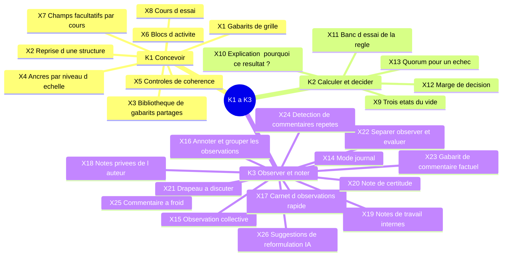
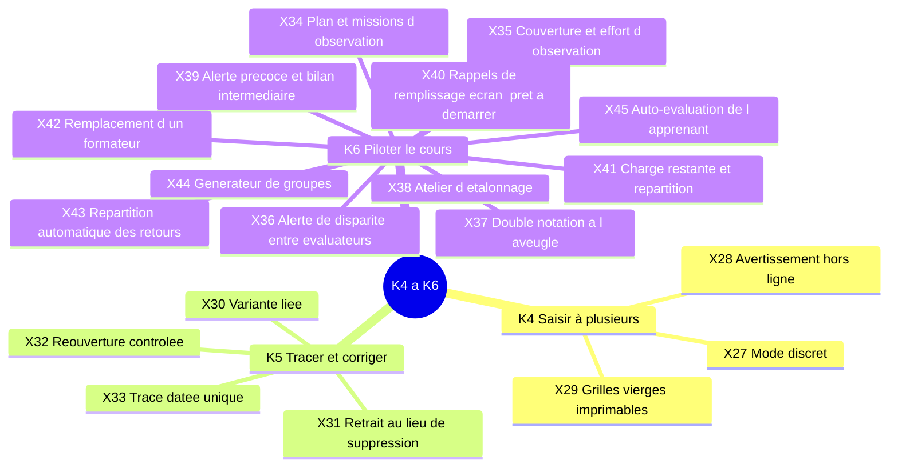
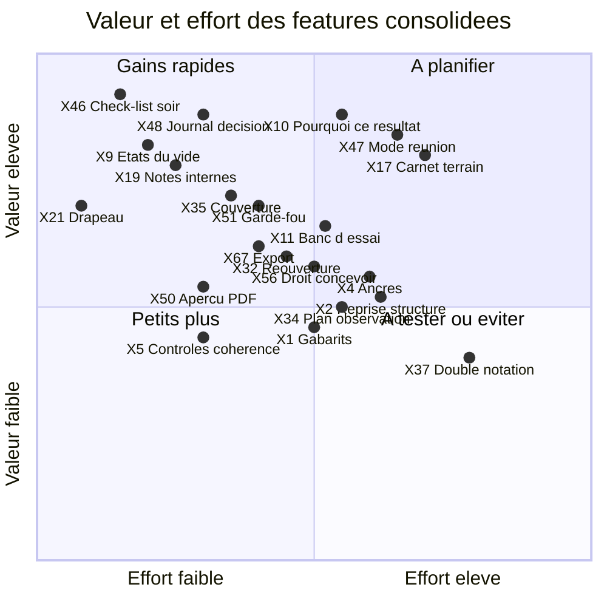

# Azimut — backlog consolidé des nouvelles features

Ce document réunit en un seul catalogue dédoublonné les 82 features proposées dans les analyses `01` à `06` (préfixes N-CF, N-MG, N-HA, N-PA, N-QX). Chaque feature consolidée reçoit un ID définitif `X1`, `X2`… Tout ce qui est ici est **proposé** : rien n'est décidé.

## TL;DR

- **82 IDs d'origine** deviennent **67 features consolidées** (X1 à X67) et **3 features rejetées** (X68 à X70). 12 fusions ont été faites ; aucun ID n'est perdu (voir l'index inverse, section 5).
- **15 features sont indispensables au premier cours**, 22 à faire tôt, 14 à tester, 16 pour plus tard.
- Le noyau indispensable tient en quatre blocs : **le dernier soir** (check-list, mode réunion, journal de décision), **la confiance dans le calcul** (états du vide, explication, banc d'essai), **le terrain et les notes** (carnet rapide, notes internes, drapeau, couverture d'observation) et **la protection des mineurs** (garde-fou, aperçu du PDF, droit « concevoir » et journal des accès, réouverture contrôlée, export).
- Les docs **convergent** sur le dernier soir (04 et 05) et sur l'effort d'observation (04 et 06). Ils **divergent** surtout sur la **durée d'avance** : 05 met en P1 des choses qui ne servent qu'après le premier cours (reprise de structure, anonymisation des commentaires, destinataire du PDF).
- Les trois idées rejetées : classement, décision automatique par IA, jeu des noms.

## 1. Méthode

- Lecture complète de `01` à `06` et de `00-inventaire.md` ; fusion quand deux idées visent le même besoin et le même geste métier, même si elles viennent d'agents différents.
- Chaque ID d'origine apparaît dans **une seule** ligne. Quand une idée d'origine couvre deux gestes (cas de N-MG2), elle est rangée dans la ligne principale et la seconde ligne le signale.
- La **priorité consolidée** suit cette règle : **Indispensable 1er cours** si une analyse la juge nécessaire au lancement (MVP ou P1), qu'aucune ne la conteste et qu'elle sert dès le premier cours ; sinon Tôt, À tester, Plus tard ou Rejeté. Les écarts à la règle sont justifiés ligne par ligne.
- Les échelles des docs diffèrent : 04 donne MVP, À tester, Plus tard, Rejeter ; 05 donne P1 (lancement), P2 (tôt après), P3 (plus tard) ; 06 donne seulement une **valeur** (haute, moyenne, faible) ; 02 et 01 ne chiffrent pas, ils recommandent. On les compare comme tels.

Sources : les analyses `01` à `06` de `docs/analyse/`. Légende des capacités : voir `01-carte-des-features.md`, section 2 (K1 à K9).

## 2. Table de dédoublonnage

Rangée par capacité métier. Les moments sont ceux de la matrice de `01` : Avant, Ouverture, Pendant, Dernier soir, Clôture, Après.


### K1 Concevoir

| ID | Nom court | Description | IDs d'origine fusionnés | Features liées | Moment | Acteur principal |
| --- | --- | --- | --- | --- | --- | --- |
| **X1** | Gabarits de grille | Partir de modèles types (points par exercice, 1 à 5 avec seuil, liste de contrôle) et de préréglages nommés en mots métier. | N-MG6 | S1, S3, S5, L1 | Avant | Concepteur |
| **X2** | Reprise d'une structure | Copier la structure d'un cours passé (sans personnes ni notes), voir ce qui a changé, garder les notes de conception. | N-PA7, N-QX13 | L1, L4, L8, L9, S8 | Avant | Concepteur |
| **X3** | Bibliothèque de gabarits partagés | Qualifications types par type de cours, avec ancres et règles, maintenues par l'association. | N-HA32 | L1, S8, P5 | Avant | Concepteur, association |
| **X4** | Ancres par niveau d'échelle | Une phrase décrit chaque niveau (1, 3, 5) et s'affiche au moment de noter. | N-HA4 | S1, S3 | Avant, Pendant | Concepteur, formateur |
| **X5** | Contrôles de cohérence | Avant de figer, signaler : regroupement décisif absent de la règle, élément compté deux fois, échelles incompatibles, poids nul, seuil hors échelle. | N-MG3 | S2, S9, S11, L2 | Avant | Concepteur |
| **X6** | Blocs d'activité | L'horaire du cours est une liste de blocs datés auxquels on rattache observations et retours. | N-QX1 | S10, S16, P3, P6 | Avant, Pendant | Concepteur, direction |
| **X7** | Champs facultatifs par cours | Les fonctions avancées (échelles, exigences, impressions) restent masquées tant qu'on ne les active pas. | N-QX11 | S1, S3, S14 | Avant | Concepteur |
| **X8** | Cours d'essai | Cours fictif pour apprendre l'outil et tester une structure, purgé à date fixe. | N-PA16 | L1, L4, L9 | Avant, Ouverture | Concepteur, formateur |

### K2 Calculer et décider

| ID | Nom court | Description | IDs d'origine fusionnés | Features liées | Moment | Acteur principal |
| --- | --- | --- | --- | --- | --- | --- |
| **X9** | Trois états du vide | Une case est « pas encore saisie », « non observé » ou « rien à signaler », avec un effet clair sur calcul et suivi. | N-HA9, N-MG1 | S5, S15, P2 | Pendant | Formateur |
| **X10** | Explication « pourquoi ce résultat ? » | Sur tout résultat, afficher la chaîne de calcul en clair (notes, vides, poids, arrondi, seuil). | N-HA25, N-MG2 | S2, S5, S7, S11 | Pendant, Dernier soir | Formateur, direction |
| **X11** | Banc d'essai de la règle | Tester la règle de décision sur des profils ou un apprenant fictifs avant de figer la structure. | N-HA26 | S11, L2, L4 | Avant | Concepteur, direction |
| **X12** | Marge de décision | Signaler les apprenants dont la décision change si une note bouge d'un cran ou à cause d'un arrondi. | N-HA7 | S5, S11 | Dernier soir | Direction |
| **X13** | Quorum pour un échec | Une décision d'échec ou un éliminatoire exige l'avis enregistré de deux formateurs et du responsable. | N-HA6 | S11, S12 | Dernier soir | Direction, équipe |

### K3 Observer et noter

| ID | Nom court | Description | IDs d'origine fusionnés | Features liées | Moment | Acteur principal |
| --- | --- | --- | --- | --- | --- | --- |
| **X14** | Mode journal | Un regroupement accepte plusieurs observations datées par indicateur, avec une règle de note retenue (la dernière). | N-MG7 | S16, S14, C7 | Pendant | Formateur |
| **X15** | Observation collective | Une observation peut viser plusieurs apprenants (travail de groupe) et avoir plusieurs auteurs. | N-QX6 | S16, A4, C1 | Pendant | Formateur |
| **X16** | Annoter et grouper les observations | Ajouter une précision à l'observation d'un collègue, ou grouper plusieurs observations en un fait. | N-QX7 | S16, C7 | Pendant | Formateur |
| **X17** | Carnet d'observations rapide | Noter en quelques secondes, sur téléphone et sur le terrain, un fait court, à rattacher plus tard ; tolère les coupures longues. | N-HA8, N-PA17 | S16, C1, C5, C6, C9 | Pendant | Formateur |
| **X18** | Notes privées de l'auteur | Brouillon visible de son seul auteur, publié à l'équipe sur demande. | N-PA12 | S16, C5 | Pendant | Formateur |
| **X19** | Notes de travail internes | À côté de chaque commentaire, un espace pour l'équipe, jamais imprimé, supprimé à la clôture. | N-HA18 | S6, L5, L6, L7, L9, T2 | Pendant, Dernier soir | Équipe |
| **X20** | Note de certitude | Marquer une note « sûre » ou « à confirmer » ; les « à confirmer » remontent dans la check-list. | N-HA10 | S16, X46 | Pendant | Formateur |
| **X21** | Drapeau « à discuter » | Poser un drapeau sur une note, un commentaire ou un apprenant ; les drapeaux forment l'ordre du jour de la réunion. | N-HA11 | L5, X47 | Pendant, Dernier soir | Formateur |
| **X22** | Séparer observer et évaluer | En phase d'observation, masquer interprétation et impression ; ne les montrer qu'en phase d'évaluation. | N-QX12 | C5, S14, S16 | Pendant, Dernier soir | Formateur |
| **X23** | Gabarit de commentaire factuel | Aide à écrire « fait observé, effet, piste », avec un guide qui rappelle de décrire un comportement. | N-HA14 | S6, L5 | Dernier soir | Formateur |
| **X24** | Détection de commentaires répétés | Signaler un commentaire identique ou presque chez plusieurs apprenants (sans bloquer). | N-HA15 | S6, L5 | Dernier soir | Formateur |
| **X25** | Commentaire à froid | Un commentaire écrit tard reste marqué « à relire » jusqu'à relecture le lendemain. | N-HA38 | L5, C5 | Dernier soir | Formateur |
| **X26** | Suggestions de reformulation (IA) | Un assistant propose une reformulation plus factuelle d'un commentaire. | N-HA17 | L5, T2 | Dernier soir | Formateur |

### K4 Saisir à plusieurs

| ID | Nom court | Description | IDs d'origine fusionnés | Features liées | Moment | Acteur principal |
| --- | --- | --- | --- | --- | --- | --- |
| **X27** | Mode discret | En un geste, masquer noms et notes à l'écran. | N-HA12 | T2 | Pendant | Formateur |
| **X28** | Avertissement hors ligne | Bandeau net quand le réseau manque, reprise du formulaire après déconnexion. | N-QX14 | C6, C9 | Pendant | Formateur |
| **X29** | Grilles vierges imprimables | Imprimer des grilles vides par apprenant ou activité pour noter au stylo, puis ressaisir. | N-HA35, N-QX10 | L7, C9, A6 | Avant, Pendant | Direction, formateur |

### K5 Tracer et corriger

| ID | Nom court | Description | IDs d'origine fusionnés | Features liées | Moment | Acteur principal |
| --- | --- | --- | --- | --- | --- | --- |
| **X30** | Variante liée | Une grille alternative lit les observations du cours sans les copier ; on compare les propositions des deux grilles. | N-MG4 | L4, L3, S8 | Pendant | Concepteur, direction |
| **X31** | Retrait au lieu de suppression | On retire un indicateur ou regroupement (réversible) ; les modifications de structure sont tracées. | N-MG5 | L3, L2, C7, S8 | Pendant | Concepteur, direction |
| **X32** | Réouverture contrôlée | Corriger après clôture avec justification, validation à deux, marque dans le PDF corrigé, nouvelle clôture. | N-PA3 | L6, C7, C8, L7 | Après | Direction |
| **X33** | Trace datée unique | Une seule trace (auteur, date, valeur) alimente historique, observations, évolution et statistiques. | N-CF1 | C7, S16, P6, P3, L9 | Pendant | Concepteur |

### K6 Piloter le cours

| ID | Nom court | Description | IDs d'origine fusionnés | Features liées | Moment | Acteur principal |
| --- | --- | --- | --- | --- | --- | --- |
| **X34** | Plan et missions d'observation | Répartir d'avance qui observe qui, dans quel bloc ou activité, avec rotation proposée et vue de poche. | N-HA13, N-QX2 | A4, A5, S10, P2 | Avant, Pendant | Direction |
| **X35** | Couverture et effort d'observation | Montrer qui a observé qui, combien de fois, avec seuils colorés ; signaler un apprenant vu par un seul formateur. | N-HA5, N-QX9 | S16, A5, P2, P4 | Pendant | Direction, formateur |
| **X36** | Alerte de disparité entre évaluateurs | Comparer les distributions de notes par groupe ou formateur et signaler un écart marqué à toute l'équipe. | N-HA2 | P4, A4, P3 | Pendant | Direction |
| **X37** | Double notation à l'aveugle | Deux formateurs notent le même rendu sans voir l'autre, puis l'équipe discute les écarts. | N-HA1 | P4, A4, S16 | Pendant | Équipe |
| **X38** | Atelier d'étalonnage | L'équipe note un apprenant fictif sur la grille en brouillon avant le cours et discute les écarts. | N-HA3 | L1, L4, S3 | Avant | Direction, équipe |
| **X39** | Alerte précoce et bilan intermédiaire | Signaler un apprenant sous un seuil en cours de cours et préparer un bilan à mi-cours. | N-HA27 | S4, P3, P1 | Pendant | Direction, référent |
| **X40** | Rappels de remplissage, écran « prêt à démarrer » | Alertes sur les indicateurs vides avant le soir ; contrôle de mise en place avant l'ouverture. | N-PA15 | P2, P4, A6, I1 | Avant, Pendant | Direction, formateur |
| **X41** | Charge restante et répartition | Estimer le travail restant par formateur et répartir les apprenants en retard. | N-HA24 | P2, A5 | Dernier soir | Direction |
| **X42** | Remplacement d'un formateur | Reprendre les apprenants suivis et les groupes d'une personne absente, avec trace. | N-PA13 | A4, A5 | Pendant | Direction |
| **X43** | Répartition automatique des retours | Répartir les apprenants entre formateurs selon vœux classés, capacité et paires interdites. | N-QX4 | A5 | Ouverture, Pendant | Direction |
| **X44** | Générateur de groupes | Proposer des groupes d'apprenants variés, avec préférences de taille. | N-QX5 | A4 | Ouverture | Direction |
| **X45** | Auto-évaluation de l'apprenant | L'apprenant s'évalue sur une version simplifiée ; on montre l'écart avec l'équipe. | N-HA28 | A1, P1 | Pendant | Apprenant |

### K7 Finaliser et clôturer

| ID | Nom court | Description | IDs d'origine fusionnés | Features liées | Moment | Acteur principal |
| --- | --- | --- | --- | --- | --- | --- |
| **X46** | Check-list du dernier soir | Générer la liste de ce qui reste : vides, commentaires manquants, éliminatoires sans justification, joker, drapeaux, notes à confirmer. | N-HA19 | L5, P2, S12, S13 | Dernier soir | Formateur, direction |
| **X47** | Mode réunion de qualification | Vue projetée qui passe les apprenants un par un : résultat, marge, drapeaux, avis individuels, décision. | N-HA20, N-PA6 | L5, S11, S13, P4 | Dernier soir | Direction, équipe |
| **X48** | Journal de décision | Chaque décision garde résultat calculé, ajustements (joker, éliminatoire), auteur, motif et écart avec le calcul. | N-HA21, N-PA4 | S11, S12, S13, C7 | Dernier soir | Direction |
| **X49** | Relecture croisée avant clôture | Un autre formateur relit et approuve ; statut « relu par », liste des commentaires non relus. | N-HA22, N-PA19 | L6, L7, C7 | Dernier soir, Clôture | Équipe |
| **X50** | Aperçu « comme l'apprenant le lira » | Voir à tout moment le texte tel qu'il sera dans le PDF, sans notes internes ni colonnes techniques. | N-HA23 | L7 | Dernier soir, Clôture | Formateur |
| **X51** | Garde-fou avant impression | Signaler les mots d'une liste de l'équipe (santé, famille, jugements, prénoms tiers) avant la clôture. | N-HA16 | L7, L9, T2 | Clôture | Direction |
| **X52** | Feed-forward | L'équipe formule deux ou trois objectifs de progression en fin de PDF. | N-HA29 | L5, L7 | Dernier soir | Équipe |
| **X53** | Restitution accompagnée | Le PDF n'est remis qu'après un entretien, noté avant l'envoi. | N-HA31 | L7, I3 | Clôture | Direction, référent |
| **X54** | Vérification du destinataire | Prévisualisation, confirmation de l'adresse, journal des envois, versions numérotées du PDF. | N-PA5 | I3, L7, T2 | Clôture | Direction |
| **X55** | Rétroaction en document | Un texte de retour par apprenant, avec insertion des observations concernées. | N-QX3 | S6, L5, L7 | Dernier soir, Clôture | Formateur |

### K8 Personnes et accès

| ID | Nom court | Description | IDs d'origine fusionnés | Features liées | Moment | Acteur principal |
| --- | --- | --- | --- | --- | --- | --- |
| **X56** | Droit « concevoir » et journal des accès | Rôle concepteur séparé de la saisie ; trace de qui a consulté ou exporté quoi ; pas de lecture sans trace par l'administrateur. | N-PA1, N-PA2 | A1, A2, A3, T2 | Avant, tout au long | Concepteur, DPO, admin |
| **X57** | Lecture limitée pour coach ou expert | Accès en lecture sur invitation, pour un cours, avec fin automatique. | N-PA8 | A2, A3 | Pendant | Direction, coach |
| **X58** | Expiration des droits | Accès de l'équipe limité à la durée utile ; retrait d'un membre. | N-PA11 | A2, A3, L8 | Clôture, Après | Direction, admin |
| **X59** | Conflit d'intérêts | Un formateur signale un lien avec un apprenant ; la direction réaffecte ; ses notes ne comptent pas sans validation. | N-PA20 | A4, A5, S16 | Avant, Pendant | Formateur, direction |
| **X60** | Accès par état et rôle | Une matrice rôle × cours × état couvre tous les cas d'accès, présents et futurs. | N-CF2 | A1, A2, A3, A4, A5, I3, P5 | Tout au long | Direction |

### K9 Données dans le temps

| ID | Nom court | Description | IDs d'origine fusionnés | Features liées | Moment | Acteur principal |
| --- | --- | --- | --- | --- | --- | --- |
| **X61** | Anonymisation des commentaires | Traiter les noms dans les textes libres à l'anonymisation ; suspendre la purge en cas de litige, visible du DPO. | N-PA10 | L9, S6, T2 | Après | DPO, direction |
| **X62** | Accès et rectification pour l'apprenant | Demande reçue par la direction, dossier exportable, correction via la réouverture, délai suivi. | N-PA14 | L9, L6, X32, T2 | Après | Apprenant, parent, DPO |
| **X63** | Statistiques entre cours sûres | Seuil d'effectif minimal, données anonymisées, export agrégé seulement. | N-PA9 | P5, L9, A2 | Après | Association, canton |
| **X64** | Bilan qualité de la qualification | Après le cours, lister les indicateurs jamais remplis, uniformes ou sans commentaire. | N-HA33 | P5, P2 | Après | Concepteur |
| **X65** | Passeport de progression | Transmettre les objectifs de progression au cours suivant avec l'accord de l'apprenant et des parents. | N-HA30 | L9, I4, T2 | Après | Direction, apprenant |
| **X66** | Cas d'école pour formateurs | Extraits anonymisés et relus pour apprendre à noter et à écrire. | N-HA34 | L9, T2 | Après | Formateur, association |
| **X67** | Export des données | Exporter structure et données dans un format ouvert, pour le recours, la panne et la réversibilité. | N-PA18, N-QX15 | L7, L8, C9 | Tout au long, Clôture | Direction |

### Rejetées

| ID | Nom court | Description | IDs d'origine | Features liées | Raison du rejet |
| --- | --- | --- | --- | --- | --- |
| **X68** | Classement des apprenants | Vue triée par moyenne générale. | N-HA36 | P3, P4 | La qualification mesure l'atteinte d'objectifs, pas une compétition ; l'état du cours (P4) suffit. |
| **X69** | Décision automatique par IA | Une IA lit notes et commentaires et propose la décision. | N-HA37 | S11, T2 | Opacité, mineurs, nLPD : l'outil calcule et explique, l'équipe décide. |
| **X70** | Jeu d'apprentissage des noms | Jeu pour mémoriser prénoms et noms de scout. | N-QX8 | — | Sans rapport avec la qualification ; coût de maintenance pour une petite équipe. |

## 3. Priorités croisées

Colonnes : priorité donnée par chaque doc d'origine (« — » : le doc ne dit rien), puis priorité **consolidée**. Pour 06, on indique la **valeur** (haute, moyenne, faible), car ce doc ne donne pas de priorité. Pour 01 et 02, on indique leur recommandation. Une ligne marquée **Divergence** dans la dernière colonne signale un désaccord entre docs.

| ID | Nom court | 01 / 02 | 04 | 05 | 06 | Consolidée | Remarque |
| --- | --- | --- | --- | --- | --- | --- | --- |
| X1 | Gabarits de grille | 02 : recommandé (parade au risque « tableur ») | — | — | — | **Tôt** | Seul 02 le propose, sans priorité chiffrée. Tôt : le premier cours peut démarrer avec une grille saisie à la main. |
| X2 | Reprise d'une structure | — | — | P1 | Haute | **Tôt** | Divergence : 05 dit P1, mais au premier cours il n'y a rien à reprendre (sauf un import des Excel). Tôt. |
| X3 | Bibliothèque de gabarits partagés | — | Plus tard (valeur H, effort L) | — | — | **Plus tard** | Gouvernance à définir ; dépend de X2. |
| X4 | Ancres par niveau d'échelle | — | MVP | — | — | **Tôt** | Je rétrograde le MVP de 04 : le champ est simple, mais la valeur dépend d'un travail de rédaction long. |
| X5 | Contrôles de cohérence | 02 : proposé (avant le figeage) | — | — | — | **Tôt** | Seul 02. Peu coûteux, évite le cas de la sphère oubliée de qualif2 ; complète X11. |
| X6 | Blocs d'activité | — | — | — | Haute | **Tôt** | Seul 06 (valeur haute) : donne les dates aux statistiques temporelles ; import eCamp plus tard. |
| X7 | Champs facultatifs par cours | — | — | — | Moyenne | **Tôt** | Seul 06 ; principe de conception, bon marché si posé dès le début. |
| X8 | Cours d'essai | — | — | P2 | — | **Tôt** | Seul 05 (P2). |
| X9 | Trois états du vide | 02 : retenu dans le modèle | MVP | — | — | **Indispensable 1er cours** | 04 et 02 convergent ; règle un problème constaté dans les Excel. |
| X10 | Explication « pourquoi ce résultat ? » | 02 : proposé (utile aussi en cours) | MVP | — | — | **Indispensable 1er cours** | MG2 contient aussi l'aperçu avec apprenant fictif, repris dans X11. |
| X11 | Banc d'essai de la règle | 02 : l'aperçu avec apprenant fictif (MG2) va dans le même sens | MVP | — | — | **Indispensable 1er cours** | Le premier cours fige une grille jamais testée : sans banc d'essai, l'erreur se découvre le dernier soir. |
| X12 | Marge de décision | — | Plus tard | — | — | **Plus tard** | Utile surtout avec X47 ; à construire une fois la règle stabilisée. |
| X13 | Quorum pour un échec | — | À tester | — | — | **À tester** | Lourdeur possible ; à valider avec une équipe. |
| X14 | Mode journal | 02 : option, besoin à vérifier sur une Posture remplie | — | — | — | **À tester** | 02 le dit incertain ; 01 (G5, G7) aussi : attendre une Posture remplie. |
| X15 | Observation collective | — | — | — | Haute | **Tôt** | Seul 06 (haute). Les exercices de groupe sont courants ; à décider avec S16. |
| X16 | Annoter et grouper les observations | — | — | — | Moyenne | **Plus tard** | Demandes ouvertes chez Qualix, pas de besoin constaté chez nous. |
| X17 | Carnet d'observations rapide | — | MVP | P1 | — | **Indispensable 1er cours** | 04 et 05 convergent (cause n°1 d'abandon du pre-mortem) ; lié au choix sur C9. |
| X18 | Notes privées de l'auteur | — | — | P2 | — | **Tôt** | Seul 05 ; à décider avec S16 et X19 (qui se recoupent). |
| X19 | Notes de travail internes | — | MVP | — | — | **Indispensable 1er cours** | Protège le mineur et réduit les données conservées. |
| X20 | Note de certitude | — | À tester | — | — | **À tester** | Risque : tout reste « à confirmer ». |
| X21 | Drapeau « à discuter » | — | MVP | — | — | **Indispensable 1er cours** | Très peu coûteux ; alimente X46 et X47. |
| X22 | Séparer observer et évaluer | — | — | — | Moyenne | **À tester** | Pratique romande ; touche la nature des champs d'un indicateur. |
| X23 | Gabarit de commentaire factuel | — | À tester | — | — | **À tester** | Risque de textes formatés. |
| X24 | Détection de commentaires répétés | — | Plus tard | — | — | **Plus tard** | Faux positifs possibles (travail de groupe). |
| X25 | Commentaire à froid | — | À tester | — | — | **À tester** | Rien n'est jamais « fini » ; voir X49. |
| X26 | Suggestions de reformulation (IA) | — | À tester (seulement si nLPD réglée) | — | — | **À tester** | Bloqué par la question nLPD et données de mineurs ; à ne pas lancer avant. |
| X27 | Mode discret | — | MVP | — | — | **Tôt** | Je rétrograde le MVP de 04 : confort sans dépendance, rapide à ajouter après le premier cours. |
| X28 | Avertissement hors ligne | — | — | — | Moyenne | **Tôt** | Seul 06 ; prolonge C6, déjà décidé. |
| X29 | Grilles vierges imprimables | — | À tester | — | Moyenne | **À tester** | Même idée des deux côtés ; à tester selon le réseau des lieux de cours. |
| X30 | Variante liée | 02 : proposé | — | — | — | **À tester** | Seul 02 ; dépend de la décision sur L4 et L3. |
| X31 | Retrait au lieu de suppression | 02 : proposé (principe) | — | — | — | **Tôt** | Seul 02 ; devient nécessaire dès qu'on autorise L3. |
| X32 | Réouverture contrôlée | — | — | P1 | — | **Indispensable 1er cours** | Seul 05 (P1), mais une erreur après clôture est certaine ; sinon l'équipe retouche le PDF. |
| X33 | Trace datée unique | 01 : plus tard (G7) | — | — | — | **Plus tard** | 01 : confondre correction et nouvelle observation ; revoir après X14. |
| X34 | Plan et missions d'observation | — | Plus tard (valeur M) | — | Haute | **Tôt** | Divergence : 04 Plus tard, 06 Haute. Je retiens Tôt : répond à « oubli ou rien à dire » ; version simple d'abord. |
| X35 | Couverture et effort d'observation | — | MVP | — | Haute | **Indispensable 1er cours** | 04 et 06 convergent ; mesure l'équilibre, pas seulement les vides. |
| X36 | Alerte de disparité entre évaluateurs | — | Plus tard | — | — | **Plus tard** | Valeur haute mais risque de méfiance ; après X37 et X38. |
| X37 | Double notation à l'aveugle | — | À tester | — | — | **À tester** | Charge de travail en plus. |
| X38 | Atelier d'étalonnage | — | À tester | — | — | **À tester** | Peu coûteux en outillage ; demande une heure de préparation. |
| X39 | Alerte précoce et bilan intermédiaire | — | À tester | — | — | **À tester** | Risque d'étiqueter trop tôt. |
| X40 | Rappels de remplissage, écran « prêt à démarrer » | — | — | P2 | — | **Tôt** | Seul 05 (P2) ; s'appuie sur P2. |
| X41 | Charge restante et répartition | — | Plus tard | — | — | **Plus tard** | Pression entre formateurs. |
| X42 | Remplacement d'un formateur | — | — | P2 | — | **Tôt** | Seul 05 (P2) ; dépend de la définition de A5. |
| X43 | Répartition automatique des retours | — | — | — | Moyenne | **Plus tard** | 06 précise « pas nécessairement dès la V1 ». |
| X44 | Générateur de groupes | — | — | — | Faible à moyenne | **Plus tard** | Hors cœur. |
| X45 | Auto-évaluation de l'apprenant | — | Plus tard | — | — | **Plus tard** | Contredit A1 si l'apprenant saisit lui-même. |
| X46 | Check-list du dernier soir | — | MVP | — | — | **Indispensable 1er cours** | Valeur et effort les plus favorables de 04 ; s'appuie sur P2. |
| X47 | Mode réunion de qualification | — | MVP | P1 | — | **Indispensable 1er cours** | 04 et 05 convergent ; version simple (liste des cas limites et des vides) pour commencer. |
| X48 | Journal de décision | — | MVP | P1 | — | **Indispensable 1er cours** | 04 et 05 convergent ; rend l'échec défendable. |
| X49 | Relecture croisée avant clôture | — | À tester | P2 | — | **Tôt** | Divergence : 04 À tester, 05 P2. Tôt, en version légère (statut « relu par »). |
| X50 | Aperçu « comme l'apprenant le lira » | — | MVP | — | — | **Indispensable 1er cours** | Seul 04 ; accompagne L7. |
| X51 | Garde-fou avant impression | — | MVP | — | — | **Indispensable 1er cours** | Seul 04 ; protège des données de mineurs dans le PDF. |
| X52 | Feed-forward | — | MVP | — | — | **Tôt** | Je rétrograde le MVP de 04 : L5 prévoit déjà « 3 points à améliorer ». |
| X53 | Restitution accompagnée | — | À tester | — | — | **À tester** | Retarde la remise. |
| X54 | Vérification du destinataire | — | — | P1 | — | **Tôt** | Divergence : 05 P1, mais utile seulement dès que l'envoi (I3) existe ; envoi manuel au début. |
| X55 | Rétroaction en document | — | — | — | Moyenne | **À tester** | Style Qualix ; à confronter au PDF et à X23. |
| X56 | Droit « concevoir » et journal des accès | — | — | P1 | — | **Indispensable 1er cours** | Seul 05 (P1). N-PA2 y est annoncé comme fusionné dans N-PA1. Preuve nLPD indispensable avec des mineurs. |
| X57 | Lecture limitée pour coach ou expert | — | — | P2 | — | **Tôt** | Seul 05 (P2). |
| X58 | Expiration des droits | — | — | P2 | — | **Tôt** | Seul 05 (P2) ; nécessaire avant la clôture du premier cours. |
| X59 | Conflit d'intérêts | — | — | P3 | — | **Plus tard** | Seul 05 (P3). |
| X60 | Accès par état et rôle | 01 : plus tard (G8) | — | — | — | **Plus tard** | 01 : dépend de la correspondance des rôles (A3). |
| X61 | Anonymisation des commentaires | — | — | P1 | — | **Tôt** | Divergence : 05 P1, mais l'échéance est à 3 mois après le premier cours. Tôt, avant J+3 mois. |
| X62 | Accès et rectification pour l'apprenant | — | — | P2 | — | **Tôt** | Seul 05 (P2) ; obligation nLPD. |
| X63 | Statistiques entre cours sûres | — | — | P2 | — | **Plus tard** | Divergence : 05 P2, mais P5 reste une idée et dépend de L9 ; Plus tard. |
| X64 | Bilan qualité de la qualification | — | Plus tard | — | — | **Plus tard** | Vérifiable seulement sur données réelles. |
| X65 | Passeport de progression | — | Plus tard | — | — | **Plus tard** | Étiquetage, consentement, nLPD. |
| X66 | Cas d'école pour formateurs | — | Plus tard | — | — | **Plus tard** | Risque de ré-identification. |
| X67 | Export des données | — | — | P2 | Haute | **Indispensable 1er cours** | Divergence : 05 P2, 06 « dès la V1 » (recours après échec). Je retiens 06 : confiance et panne le jour J. |
| X68 | Classement des apprenants | — | Rejeter (valeur B) | — | — | **Rejeté** | La qualification mesure l'atteinte d'objectifs, pas une compétition ; l'état du cours (P4) suffit. |
| X69 | Décision automatique par IA | — | Rejeter (valeur B) | — | — | **Rejeté** | Opacité, mineurs, nLPD : l'outil calcule et explique, l'équipe décide. |
| X70 | Jeu d'apprentissage des noms | — | — | — | valeur faible, hors périmètre | **Rejeté** | Sans rapport avec la qualification ; coût de maintenance pour une petite équipe. |

### Bilan par priorité consolidée

| Priorité | Nombre | IDs |
| --- | --- | --- |
| Indispensable 1er cours | 15 | X9, X10, X11, X17, X19, X21, X32, X35, X46, X47, X48, X50, X51, X56, X67 |
| Tôt | 22 | X1, X2, X4, X5, X6, X7, X8, X15, X18, X27, X28, X31, X34, X40, X42, X49, X52, X54, X57, X58, X61, X62 |
| À tester | 14 | X13, X14, X20, X22, X23, X25, X26, X29, X30, X37, X38, X39, X53, X55 |
| Plus tard | 16 | X3, X12, X16, X24, X33, X36, X41, X43, X44, X45, X59, X60, X63, X64, X65, X66 |
| Rejeté | 3 | X68, X69, X70 |

### Divergences marquantes

- **X2 Reprise d'une structure** : 05 la met en P1, mais au premier cours il n'y a rien à reprendre. Consolidée Tôt.
- **X34 Plan et missions d'observation** : 04 la repousse (plus tard), 06 la juge de valeur haute. Consolidée Tôt, en version simple.
- **X67 Export des données** : 05 P2, 06 « dès la V1 ». Consolidée Indispensable : recours, panne et peur du verrouillage.
- **X49 Relecture croisée** : 04 à tester, 05 P2. Consolidée Tôt, en version légère.
- **X54 Vérification du destinataire** : 05 P1, mais seulement utile quand l'envoi par mail (I3) existe, et 01 le range parmi les idées. Consolidée Tôt.
- **X61 Anonymisation des commentaires** : 05 P1, mais l'échéance tombe 3 mois après le premier cours. Consolidée Tôt.
- **X63 Statistiques entre cours sûres** : 05 P2, mais P5 reste une idée et dépend de L9. Consolidée Plus tard.
- **Rétrogradations de MVP (04)** : X4 Ancres, X27 Mode discret, X52 Feed-forward passent en Tôt. Ce sont des aides sans dépendance, dont la valeur ne se joue pas le premier jour.
- **Cas à part** : X26 (IA) reste À tester tant que la question nLPD n'est pas réglée ; X14 (mode journal) attend une Posture remplie.

## 4. Visualisations

### 4.1 Mindmap par capacité

Trois diagrammes pour rester lisibles.





```mermaid
mindmap
  root((K7 a K9))
    K7 Finaliser et cloturer
      X46 Check-list du dernier soir
      X47 Mode reunion de qualification
      X48 Journal de decision
      X49 Relecture croisee avant cloture
      X50 Aperçu  comme l apprenant le lira 
      X51 Garde-fou avant impression
      X52 Feed-forward
      X53 Restitution accompagnee
      X54 Verification du destinataire
      X55 Retroaction en document
    K8 Personnes et acces
      X56 Droit  concevoir  et journal des acces
      X57 Lecture limitee pour coach ou expert
      X58 Expiration des droits
      X59 Conflit d interets
      X60 Acces par etat et role
    K9 Donnees dans le temps
      X61 Anonymisation des commentaires
      X62 Acces et rectification pour l apprenant
      X63 Statistiques entre cours sûres
      X64 Bilan qualite de la qualification
      X65 Passeport de progression
      X66 Cas d ecole pour formateurs
      X67 Export des donnees
```

### 4.2 Valeur et effort

Les 21 features les plus importantes. Position **estimée** : valeur et effort viennent des tris de 04 (valeur et effort métier) et de mon jugement pour les autres.



## 5. Index inverse

ID d'origine, puis ID consolidé. Trié par préfixe puis par numéro.


| ID d'origine | ID consolidé | Nom court |
| --- | --- | --- |
| N-CF1 | X33 | Trace datée unique |
| N-CF2 | X60 | Accès par état et rôle |
| N-HA1 | X37 | Double notation à l'aveugle |
| N-HA2 | X36 | Alerte de disparité entre évaluateurs |
| N-HA3 | X38 | Atelier d'étalonnage |
| N-HA4 | X4 | Ancres par niveau d'échelle |
| N-HA5 | X35 | Couverture et effort d'observation |
| N-HA6 | X13 | Quorum pour un échec |
| N-HA7 | X12 | Marge de décision |
| N-HA8 | X17 | Carnet d'observations rapide |
| N-HA9 | X9 | Trois états du vide |
| N-HA10 | X20 | Note de certitude |
| N-HA11 | X21 | Drapeau « à discuter » |
| N-HA12 | X27 | Mode discret |
| N-HA13 | X34 | Plan et missions d'observation |
| N-HA14 | X23 | Gabarit de commentaire factuel |
| N-HA15 | X24 | Détection de commentaires répétés |
| N-HA16 | X51 | Garde-fou avant impression |
| N-HA17 | X26 | Suggestions de reformulation (IA) |
| N-HA18 | X19 | Notes de travail internes |
| N-HA19 | X46 | Check-list du dernier soir |
| N-HA20 | X47 | Mode réunion de qualification |
| N-HA21 | X48 | Journal de décision |
| N-HA22 | X49 | Relecture croisée avant clôture |
| N-HA23 | X50 | Aperçu « comme l'apprenant le lira » |
| N-HA24 | X41 | Charge restante et répartition |
| N-HA25 | X10 | Explication « pourquoi ce résultat ? » |
| N-HA26 | X11 | Banc d'essai de la règle |
| N-HA27 | X39 | Alerte précoce et bilan intermédiaire |
| N-HA28 | X45 | Auto-évaluation de l'apprenant |
| N-HA29 | X52 | Feed-forward |
| N-HA30 | X65 | Passeport de progression |
| N-HA31 | X53 | Restitution accompagnée |
| N-HA32 | X3 | Bibliothèque de gabarits partagés |
| N-HA33 | X64 | Bilan qualité de la qualification |
| N-HA34 | X66 | Cas d'école pour formateurs |
| N-HA35 | X29 | Grilles vierges imprimables |
| N-HA36 | X68 | Classement des apprenants |
| N-HA37 | X69 | Décision automatique par IA |
| N-HA38 | X25 | Commentaire à froid |
| N-MG1 | X9 | Trois états du vide |
| N-MG2 | X10 | Explication « pourquoi ce résultat ? » |
| N-MG3 | X5 | Contrôles de cohérence |
| N-MG4 | X30 | Variante liée |
| N-MG5 | X31 | Retrait au lieu de suppression |
| N-MG6 | X1 | Gabarits de grille |
| N-MG7 | X14 | Mode journal |
| N-PA1 | X56 | Droit « concevoir » et journal des accès |
| N-PA2 | X56 | Droit « concevoir » et journal des accès |
| N-PA3 | X32 | Réouverture contrôlée |
| N-PA4 | X48 | Journal de décision |
| N-PA5 | X54 | Vérification du destinataire |
| N-PA6 | X47 | Mode réunion de qualification |
| N-PA7 | X2 | Reprise d'une structure |
| N-PA8 | X57 | Lecture limitée pour coach ou expert |
| N-PA9 | X63 | Statistiques entre cours sûres |
| N-PA10 | X61 | Anonymisation des commentaires |
| N-PA11 | X58 | Expiration des droits |
| N-PA12 | X18 | Notes privées de l'auteur |
| N-PA13 | X42 | Remplacement d'un formateur |
| N-PA14 | X62 | Accès et rectification pour l'apprenant |
| N-PA15 | X40 | Rappels de remplissage, écran « prêt à démarrer » |
| N-PA16 | X8 | Cours d'essai |
| N-PA17 | X17 | Carnet d'observations rapide |
| N-PA18 | X67 | Export des données |
| N-PA19 | X49 | Relecture croisée avant clôture |
| N-PA20 | X59 | Conflit d'intérêts |
| N-QX1 | X6 | Blocs d'activité |
| N-QX2 | X34 | Plan et missions d'observation |
| N-QX3 | X55 | Rétroaction en document |
| N-QX4 | X43 | Répartition automatique des retours |
| N-QX5 | X44 | Générateur de groupes |
| N-QX6 | X15 | Observation collective |
| N-QX7 | X16 | Annoter et grouper les observations |
| N-QX8 | X70 | Jeu d'apprentissage des noms |
| N-QX9 | X35 | Couverture et effort d'observation |
| N-QX10 | X29 | Grilles vierges imprimables |
| N-QX11 | X7 | Champs facultatifs par cours |
| N-QX12 | X22 | Séparer observer et évaluer |
| N-QX13 | X2 | Reprise d'une structure |
| N-QX14 | X28 | Avertissement hors ligne |
| N-QX15 | X67 | Export des données |

## 6. Vérification d'exhaustivité

Commande utilisée, à relancer après toute modification des docs d'origine :

```
rg -o "N-[A-Z]{2}[0-9]+" -N --no-filename docs/analyse/0[1-6]*.md | sort -u
```

Elle donne 82 IDs distincts. Le tableau de l'index inverse en contient 82, sans doublon.
