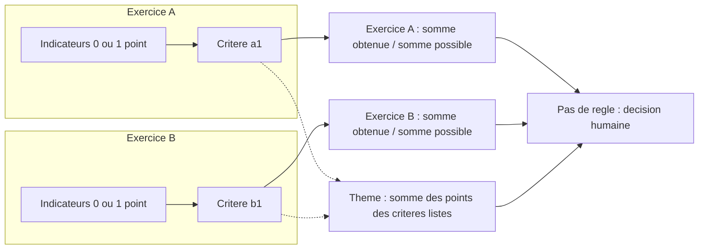

# Corpus de types de qualification

Ce document rassemble 19 types de qualification (archétypes), pris dans le scoutisme, la formation professionnelle, l'école, le sport et les certifications. Il sert de **banc d'essai** à un modèle générique : on y vérifie que le modèle sait exprimer des systèmes d'évaluation très différents, pas seulement les trois Excel actuels.

> **Statut : analyse antérieure aux décisions (3 octobre 2026).** Le modèle de qualification est fixé par [18 — Décisions définitives](18-decisions-definitives.md), qui fait foi en cas de contradiction. Le corpus reste un banc d'essai pour éprouver la couverture du modèle. Les besoins et conséquences de la section 4 sont des constats sur le corpus, pas des exigences : 18 retient notamment une note courante par case (pas d'évaluateurs multiples agrégés), le vide exclu sans pénalité, « non évalué » comme seul état de dispense et un calcul sur les valeurs courantes, sans logique à trois valeurs.

Convention : **[V]** = vérifié dans une source citée ou dans les fichiers du projet ; **[D]** = déduit ou issu de ma connaissance générale, à confirmer. Les chiffres des exemples sont des **cas d'école** : je les ai choisis pour illustrer une règle. Ce ne sont pas des données réelles.

## TL;DR

- **19 archétypes** : 3 viennent des Excel (qualif1, qualif2, qualif3), 3 du scoutisme et de J+S (RQF, pratique romande, cours à volets), 3 de la formation professionnelle et des certifications (CFC, brevet de sauvetage, multi-épreuves), 3 de l'école (maturité, promotion, échelles /20 et GPA), 6 de modèles transversaux (rubric, portfolio, jury, concours, 360, stage) et 1 cas de stress synthétique.
- Les trois Excel ne couvrent qu'une partie de l'espace. Ils n'ont **aucun** rattrapage calculé, **aucune** compensation bornée, **aucun** seuil qui dépend d'un autre résultat, **aucun** évaluateur multiple, **aucune** note de mesure avec unité.
- **Les besoins qui reviennent le plus hors des Excel** : un seuil par élément avec ET (10 archétypes sur 16 hors Excel), un « vide » qui bloque la décision (10), plusieurs évaluateurs ou sources (10), le temps avec tentatives et progression (8), le comptage d'éléments réussis (8).
- **Les cas qui cassent les hypothèses implicites** : une note qui dépend de l'ordre des tentatives, une compensation limitée à n notes insuffisantes, un seuil qui dépend d'un autre résultat, un résultat qui dépend des autres apprenants (classement), un poids qui vient de l'instance (difficulté d'un plongeon), un nombre de membres variable (retrait des extrêmes).
- **Le même regroupement peut être indicatif dans une grille et décisif dans une autre.** Le statut est donc un réglage de la grille, pas une propriété du regroupement. qualif1 le montre déjà avec ses thèmes.
- La **décision humaine** (aucune règle, ou un dernier mot de l'équipe, ou un second décideur) est fréquente : un modèle qui n'offre qu'un calcul automatique est trop étroit.
- 15 scénarios de test chiffrés sont donnés à la fin (section 5), avec les résultats attendus.

## 1. Sources

Les sources web ont été survolées par recherche, souvent sans lecture intégrale des documents : les points issus de ces pages sont marqués [V] seulement quand la page le dit clairement dans l'extrait lu.

- Scoutisme et J+S :
  - Brochure PBS « Rückmelden, Qualifizieren und Fördern im Ausbildungskurs » (RQF) : <https://pfadi.swiss/de/publikationen-downloads/downloads/detail/57/ruckmelden-qualifizieren-und-fordern-im-ausbildungskurs>. Je n'ai pas lu le PDF. Ce que j'en dis vient de `docs/analyse/06-benchmark-qualix.md` (qui cite la brochure) et de ma connaissance générale [D].
  - Cours J+S, règle « compétences minimales de sortie » : <https://www.jugendundsport.ch/dam/de/sd-web/EbabhSyxC4PX/JS_Ski_SB_LK_KNW_info_de.pdf> (extrait lu : le moniteur doit avoir suivi le cours en entier et rempli les compétences minimales dans trois domaines, la recommandation vient du coach J+S) [V].
  - Pratique romande en % d'indicateurs : issue Qualix n°151, citée dans `docs/analyse/06-benchmark-qualix.md` [V, de seconde main].
- Formation professionnelle suisse :
  - Note par points « points × 5 + 1 », notes entières ou demi-notes : <https://hotelgastro.ch/wp-content/uploads/2026/02/05_Wegleitung_zum_Qualifikationsverfahren_Systemgastronomiefachfrau_EFZSystemgastronomiefachmann_EFZ.pdf> [V, extrait].
  - Conditions de réussite et pondération (pharma EFZ) : <https://www.fr.ch/de/kbs/qualifikationsverfahren-fachfraufachmann-apotheke-efz> [V, résumé de la page].
  - Notenberechnung Kaufleute EFZ : <https://bbzolten.so.ch/fileadmin/bbz-olten/KBS/QV/Notenberechnung_Kaufleute_EFZ_ab_JG2023.pdf> (PDF illisible par l'outil, non exploité).
- École :
  - Double compensation et maximum de 4 notes insuffisantes (maturité) : ordonnance de reconnaissance <https://edudoc.ch/record/38114/files/VO_MAR_f.pdf?version=4> et <https://www.vd.ch/typo3temp/assets/pdfs/la-nouvelle-evaluation-nengendre-pas-davantage-dechecs-931452906.pdf> [V, extraits de recherche].
  - Échelle /20, lettres, GPA : connaissance générale [D].
- Niveaux de compétence (Dreyfus : novice, débutant avancé, compétent, performant, expert) : <https://www.fhft.nhs.uk/media/2682/11-novice-to-expert-skills-acquisition_dreyfus.pdf> [V pour les niveaux].
- Concours : plongeon, 7 juges, on retire les 2 meilleures et les 2 pires notes, on additionne les 3 restantes, puis on multiplie par le coefficient de difficulté : <https://www.nss-sports.com/en/lifestyle/46358/how-diving-scoring-works-rules> [V].
- Sauvetage (Société Suisse de Sauvetage) : <https://www.slrg.ch/fr/cours> (prérequis BLS-AED, examen pratique ; détail des épreuves non lu) [V partiel].
- Les fichiers du projet : `docs/FEATURES.md`, une première analyse des Excel (retirée depuis), `docs/analyse/06-benchmark-qualix.md`, et `.scratch/exemple qualif a analyser/qualif1.xlsx` (relu).

## 2. Les 19 archétypes

Légende des rubriques : **Contexte** · **Structure** (niveaux, regroupements, chemins multiples) · **Barème** (et valeur du vide) · **Agrégation** · **Seuils** · **Décision** · **Hors calcul** · **Temps** · **Évaluateurs** · **Vues**.

### A01. qualif1 : points, exercices et thèmes transversaux (Excel actuel) [V]

- **Contexte** : cours Top, expert J+S (`Synthèse!C2`, `I4` « TOP - Expert·e J+S »).
- **Structure** : arbre principal = 7 exercices, puis objectifs, critères, indicateurs. Un même objectif revient dans plusieurs exercices (4.1 dans 4, 2.1 dans 3). **Chemins multiples** : en plus de l'arbre, 4 thèmes transversaux (listes de critères pris dans plusieurs exercices) et 2 moyennes d'un objectif sur plusieurs exercices.
- **Barème** : points de 0 à 1 par indicateur. **Vide = 0 point** : les points possibles sont comptés même si la case est vide (`'Système de qualif'!K12 = SUM(F13:F14)`, la somme des poids).
- **Agrégation** : somme des points obtenus / somme des points possibles, à chaque niveau (`'Système de qualif'!O11 = N11/M11`, `O7 = N7/M7`).
- **Thèmes calculés** [V, relu dans le fichier] :
  - La feuille `Synthèse` contient un bloc « détail » par thème : en-têtes en `C65`, `C82`, `C99`, `C116`. Chaque bloc a 15 lignes de saisie (lignes 66 à 80, 83 à 97, 100 à 114, 117 à 131).
  - Une ligne de thème = un **nom d'exercice** (colonne C, ex. « Système de qualif ») et un **code de critère** (colonne D, ex. `3.4.5`). Le code est cherché dans la feuille de l'exercice par `VLOOKUP` + `INDIRECT` (`H66`, `I66`, `J66`).
  - `I66` ramène les points **possibles** du critère (colonne 9 de la plage C:M, soit `K` de la feuille de l'exercice). `J66` ramène les points **obtenus** (colonne 10, soit `L`). Une ligne sans code vaut 0.
  - Total du thème : `I65 = SUM(I66:I80)`, `J65 = SUM(J66:J80)`, **`K65 = J65/I65`**. Même schéma en `K82`, `K99`, `K116`.
  - Affichage : `Synthèse!C44 = K65` (thème « Élaboration des supports », titre en `C43`), `I44 = K82` (« Conception pédagogique et réflexion stratégique », `I43`), `C49 = K99` (« Animation et transmission », `C48`), `I49 = K116` (« Accompagnement et évaluation des participants », `I48`). Aucun seuil, aucune couleur de réussite lue dans ces formules (la mise en forme n'a pas été analysée).
  - Les deux **moyennes d'objectif** sont d'une autre nature : `C55 = AVERAGE(C56:C59)` (objectif 4.1 pris dans 4 exercices, `D56:D59`, code en `M56`) et `I55 = AVERAGE(I56:I58)` (objectif 2.1 dans 3 exercices, `H56:H58`, code en `N56`). C'est une **moyenne simple de pourcentages**, alors que le thème est un **rapport de sommes** : un critère de 8 indicateurs pèse deux fois un critère de 4 dans un thème (poids implicite = taille).
- **Seuils** : aucun. Les % sont colorés, rien n'est testé par formule.
- **Décision** : **aucune règle**. Décision humaine. Les motifs éliminatoires sont d'abord un avertissement, puis l'élimination en cas de récidive.
- **Hors calcul** : motifs éliminatoires, commentaire général.
- **Temps** : une seule note par indicateur et par exercice. Les exercices ont une date implicite.
- **Évaluateurs** : un seul champ par cellule.
- **Vues** : par exercice, par thème, objectif sur plusieurs exercices, synthèse imprimable.
- **Exemple chiffré** : critère 2.6.5 de l'exercice « PdC filmé » : 4 indicateurs, 3 à 1 point, 1 vide : 3/4 = 75 %. Thème « Conception pédagogique » = ce critère (3/4) + critère 2.4 de « Planif PdC OZR » (3/3) : 6/7 = **85,7 %**. L'objectif 4.1 vaut 100 %, 75 %, 50 %, 100 % dans 4 exercices : moyenne **81,25 %**.

### A02. qualif2 : o/k et 1 à 5 mélangés, sécurité transversale (Excel actuel) [V d'après une première analyse des Excel, retirée]

- **Contexte** : cours de moniteurs J+S, 4 sphères + Posture.
- **Structure** : sphères, objectifs, critères, indicateurs. **Chemin multiple décisif** : l'objectif « 0. sécurité » regroupe des critères d'autres objectifs et compte lui-même dans la sphère (double comptage).
- **Barème** : o/k ou 1 à 5, **réglé par critère**. Vide : exclu en 1 à 5 (mais un critère entièrement vide vaut **1**), **compté comme « non »** en o/k.
- **Agrégation** : o/k → part de « o » → table de paliers propre au critère → note 1 à 5. Puis moyennes pondérées arrondies à l'entier (objectif, sphère).
- **Seuils** : sphère réussie si ≥ 3.
- **Décision** : règle ET « 4 sphères réussies sur 4 » (l'Excel n'en teste que 3). Moyenne globale indicative à côté.
- **Hors calcul** : Posture, éliminatoires et joker (non branchés), remédiation moyennée avec la tentative initiale.
- **Temps** : planification individuelle puis en groupe = deux éléments distincts ; une remédiation est moyennée (peut-être à tort).
- **Évaluateurs** : un seul.
- **Vues** : par sphère, par apprenant, taux de remplissage par objectif.
- **Exemple chiffré** : critère o/k de 14 indicateurs, 10 « o » : 71,4 % → palier « 70 et plus » → **4**. Objectif des notes 4, 3, 2 avec poids 1, 2, 1 : (4 + 6 + 2) / 4 = 3 → sphère réussie. Une sphère brute de 2,5 s'arrondit à 3, donc réussie.

### A03. qualif3 : moyennes pondérées, conversion non linéaire, veto (Excel actuel) [V d'après une première analyse des Excel, retirée]

- **Contexte** : cours de moniteurs J+S, 3 sphères + Posture.
- **Structure** : sphères, objectifs, critères, indicateurs. Chemins indicatifs : méta-axes de la Posture, table de couverture des objectifs officiels.
- **Barème** : 1 à 5 (décimales permises en A et B, entiers seulement en C). Vide exclu.
- **Agrégation** : moyennes pondérées (poids 1 ou 2). La sphère moyenne les objectifs **bruts**, puis convertit : 1 → 0 %, 3 → 100 %, 5 → 150 %.
- **Seuils** : chaque sphère ≥ 80 % (soit 2,6 sur 5).
- **Décision** : 3 sphères sur 3 ET aucun motif éliminatoire (**veto**).
- **Hors calcul** : Posture.
- **Temps** : colonne « Quand » en texte libre (Posture).
- **Joker** : un demi-point, une sphère, une seule fois, avec justification. Appliqué à la main.
- **Vues** : synthèse par sphère, attestation.
- **Exemple chiffré** : critères 3,4 / 3,0 / 2,5 avec poids 1 / 1 / 2 : 2,85 → (2,85 − 1) / 2 = **92,5 %**. Deux objectifs 1 et 5 : moyenne brute 3 = 100 % ; la moyenne des % donnerait 75 % : **l'ordre conversion / agrégation change la décision**.

### A04. RQF et J+S : exigences minimales, rempli / non rempli [V pour le principe J+S, D pour les détails]

- **Contexte** : cours de base, panorama, cours J+S de moniteur (Leiterkurs, formation continue). La brochure RQF de la PBS décrit deux méthodes : qualification **en deux points** (grand retour à la fin) et qualification **continue** (petits retours dès qu'une exigence est démontrée) [D, via `06-benchmark-qualix.md`]. J+S : le moniteur doit avoir suivi le cours en entier **et** rempli les compétences minimales de sortie dans trois domaines ; la recommandation est faite par le coach J+S [V, jugendundsport.ch].
- **Structure** : liste **plate** de 5 à 10 exigences minimales (la doctrine recommande 10 au plus [V, Qualix], plafond technique de Qualix 40). Des observations datées servent de preuves. Pas d'arbre.
- **Barème** : statut ordinal défini par le cours (ex. « pas encore », « en cours », « remplie »), **choisi à la main**. Pas de valeur numérique.
- **Agrégation** : aucune. On lit les statuts.
- **Seuils** : par élément : chaque exigence minimale doit être remplie **pour elle-même** (non compensatoire, doctrine citée par Qualix).
- **Décision** : ET sur les exigences minimales, par un humain. **Deux décideurs en série** : l'équipe de cours qualifie, puis le coach J+S recommande [D]. Vide = « pas encore évalué » → incomplet, pas échoué.
- **Hors calcul** : observations, rétroaction écrite.
- **Temps** : un statut peut passer de « pas encore » à « remplie » pendant le cours (qualification continue). Le moment compte (rondes de retour en milieu et fin de cours).
- **Évaluateurs** : plusieurs observateurs, plusieurs apprenants par observation.
- **Vues** : matrice apprenants × exigences (état d'avancement), aide-mémoire par bloc, retour écrit par apprenant.
- **Exemple chiffré** : 8 exigences minimales. À mi-cours : 5 « remplie », 2 « en cours », 1 « pas encore » → proposition **incomplet**. En fin de cours : 7 « remplie », 1 « en cours » → **non qualifié** (une seule exigence non remplie suffit).

### A05. Pratique romande : exigence = % d'indicateurs remplis [V de seconde main : Qualix #151, D pour les seuils]

- **Contexte** : cours romands. L'issue Qualix #151 dit que les critères sont des **pourcentages d'indicateurs remplis**, et que toutes les exigences ne sont pas à 100 % ; le texte cite des seuils de 66 % ou 75 % [V via `06-benchmark-qualix.md`]. Observer et évaluer sont deux phases distinctes.
- **Structure** : exigence → indicateurs observables (oui / non). Un indicateur peut venir de plusieurs observations et de plusieurs blocs.
- **Barème** : binaire par indicateur (rempli ou non). Vide = pas encore observé.
- **Agrégation** : part des indicateurs remplis (comptage / total).
- **Seuils** : **par exigence**, différents d'une exigence à l'autre (ex. 66 % pour « animation », 100 % pour « sécurité »).
- **Décision** : ET sur les exigences, validé par l'équipe.
- **Hors calcul** : impression (0, 1, 2) et commentaires.
- **Temps** : **deux phases** : on observe (faits), puis on évalue (statut). L'évaluation n'a pas lieu avant la fin d'une période.
- **Évaluateurs** : plusieurs.
- **Vues** : exigence × apprenant avec le % et le seuil ; liste des indicateurs manquants.
- **Exemple chiffré** : exigence de 12 indicateurs, 9 remplis, 1 « non », 2 pas encore évalués, seuil 75 %. Vides ignorés : 9/10 = 90 %, remplie. Vides comptés comme « non » : 9/12 = 75 %, **remplie** (seuil atteint, ≥). Vides bloquants : résultat vide, **incomplet**.

### A06. Cours à volets : minimales + recommandées, deux parcours (type cours Top) [D]

- **Contexte** : le cours Top de la PBS a deux volets (expert, coach). Qualix #124 demande de grouper les exigences en volets [V via `06-benchmark-qualix.md`]. Le détail des règles est déduit.
- **Structure** : 2 volets, chacun avec ses exigences. Certaines exigences sont **minimales**, d'autres **recommandées**. Une exigence peut compter dans les deux volets (chemins multiples décisifs).
- **Barème** : ordinal (remplie, en cours, non remplie).
- **Agrégation** : comptage.
- **Seuils** : volet réussi si toutes les minimales sont remplies **et** au moins n recommandées sur m.
- **Décision** : ET entre les volets, ou volets indépendants (un cours peut valider un seul volet). Mixte : non compensatoire sur les minimales, **n sur m** sur les autres.
- **Temps, évaluateurs** : comme A04.
- **Vues** : matrice par volet.
- **Exemple chiffré** : volet « expert » : 6 minimales (6 remplies) + 4 recommandées (2 remplies), règle « au moins 2 sur 4 » → volet réussi. Volet « coach » : 5 minimales (4 remplies) → volet non réussi. Le cours valide un volet sur deux.

### A07. CFC / AFP : note par points, compétences opérationnelles, conditions de réussite [V]

- **Contexte** : procédure de qualification d'un apprentissage suisse (CFC ou AFP).
- **Structure** : domaines de qualification (travail pratique, connaissances professionnelles, culture générale, note d'expérience) ; sous-positions ; en pharma, **12 notes de compétences opérationnelles** [V, fr.ch].
- **Barème** : points par position, convertis en note de 1 à 6 par `points / maximum × 5 + 1`, **arrondie à une note entière ou à une demi-note** [V, hotelgastro.ch]. La note finale est arrondie à **1 décimale** [V, fr.ch].
- **Agrégation** : moyennes pondérées. Exemple pharma : note de compétences ×2, travail pratique ×2, connaissances ×2, langue locale ×1, langue étrangère ×1, économie-droit-société ×1 [V, fr.ch]. Autre exemple : 30 % pratique, 30 % connaissances, 40 % note d'expérience [V, hotelgastro.ch].
- **Seuils** : par domaine (travail pratique ≥ 4,0, connaissances ≥ 4,0) **et** global ≥ 4,0 [V]. Pharma : toutes les notes de compétences ≥ 4,0 [V, fr.ch, résumé]. Les règles varient selon la profession [V].
- **Décision** : **mixte** : compensatoire à l'intérieur d'un domaine et pour la note globale, **non compensatoire** entre domaines clés. Rattrapage : on répète la procédure (hors du corpus de calcul).
- **Hors calcul** : commentaires, rapport d'expert.
- **Temps** : la note d'expérience vient des semestres de l'année.
- **Évaluateurs** : 2 experts pour le travail pratique, souvent [D].
- **Vues** : fiche de notes, détail par position.
- **Exemple chiffré** : 38 points sur 50 → 38/50 × 5 + 1 = 4,8 → **5,0** (demi-note la plus proche). Note finale : compétences 4,7 (×2), pratique 4,5 (×2), connaissances 4,0 (×2), langue 5,0, langue étrangère 4,0, ECS 4,5 : (9,4 + 9 + 8 + 5 + 4 + 4,5) / 9 = 39,9 / 9 = 4,433 → **4,4**, réussi.

### A08. Maturité gymnasiale : double compensation et nombre de notes insuffisantes [V]

- **Contexte** : maturité gymnasiale suisse.
- **Structure** : liste de branches notées de 1 à 6, par demi-points.
- **Barème** : numérique borné, demi-points. Une note < 4 est insuffisante. Vide = pas de résultat (bloquant).
- **Agrégation** : somme des écarts à 4.
- **Seuils / règle** : le certificat est obtenu si le **double** de la somme des écarts **vers le bas** n'excède pas la somme des écarts **vers le haut**, **et** s'il n'y a pas plus de **4 notes insuffisantes** [V, ordonnance MAR]. Égalité acceptée (« n'est pas supérieur »).
- **Décision** : compensatoire **borné** (le nombre de notes insuffisantes est limité, la profondeur est pondérée ×2). Le cas des branches à pondération différente n'est pas détaillé ici [D].
- **Temps** : examens répétables dans certains cantons [D].
- **Vues** : liste des notes, total des écarts, nombre d'insuffisances.
- **Exemple chiffré** : 11 notes 5,5 / 5 / 5 / 4,5 / 4,5 / 4,5 / 4 / 4 / 3,5 / 3,5 / 3. Écarts hauts = 1,5 + 1 + 1 + 0,5 × 3 = 5. Écarts bas = 0,5 + 0,5 + 1 = 2, doublés = 4. 4 ≤ 5 et 3 insuffisantes : **réussi**. Avec 2,0 à la place de 3 : bas = 3, doublé 6 > 5 : **échoué**.

### A09. Promotion scolaire : moyennes pondérées, arrondis, branches principales [D]

- **Contexte** : promotion annuelle, école obligatoire ou secondaire. Les règles varient selon le canton [D].
- **Structure** : branches → contrôles (avec coefficients) → moyenne de semestre → moyenne annuelle. Les branches ont deux statuts : principales (français, maths, langue étrangère) ou secondaires.
- **Barème** : 1 à 6 par demi-points (échelle suisse). Non applicable pour une branche non notée.
- **Agrégation** : moyenne pondérée des contrôles, **arrondie** au demi-point ou au dixième selon l'usage. Moyenne des deux semestres.
- **Seuils** : moyenne ≥ 4 par branche ; ou somme des écarts ; ou **compensation** limitée : une insuffisance dans une branche secondaire est compensée, pas dans une branche principale.
- **Décision** : **mixte** (seuil conditionnel au type de branche, compensation simple). Un examen complémentaire est possible en cas d'échec léger (Vaud [V] : insuffisance sur une ou deux notes seulement).
- **Temps** : semestres, notes datées.
- **Vues** : bulletin, courbe de l'élève.
- **Exemple chiffré** : contrôles 4 / 5 / 3,5 de coefficients 1 / 2 / 1 : (4 + 10 + 3,5) / 4 = 4,375. Arrondi au **demi-point** : 4,5. Arrondi au **dixième** : 4,4. Le choix de l'arrondi est un paramètre explicite.

### A10. Échelles externes : /20 français, lettres A à F, GPA [D]

- **Contexte** : bulletins français, systèmes anglo-saxons, équivalences entre pays.
- **Structure** : disciplines avec coefficient (France) ou crédits (GPA).
- **Barème** : note sur 20 ; ou lettre (ordinal) ; ou pourcentage. **Conversion par table** : lettre ↔ plage de % (ex. A ≥ 90 %), lettre → points GPA (A = 4, B = 3, C = 2…), non linéaire et non unique selon l'établissement.
- **Agrégation** : moyenne pondérée par les coefficients ou les crédits. La lettre se déduit **après** le calcul.
- **Seuils** : 10/20 pour réussir ; mentions par paliers (ex. ≥ 12 « assez bien », ≥ 14 « bien », ≥ 16 « très bien »).
- **Décision** : seuil sur la moyenne (compensatoire). Une discipline non notée est non applicable, pas zéro.
- **Vues** : bulletin, relevé, conversion d'une échelle à l'autre.
- **Exemple chiffré** : maths 14 (coef 4), français 11 (coef 4), anglais 9 (coef 2), EPS 16 (coef 1) : (56 + 44 + 18 + 16) / 11 = 134 / 11 = **12,18** → mention « assez bien ». GPA : A (3 crédits), B (4), C (2) → (4×3 + 3×4 + 2×2) / 9 = 28 / 9 = **3,11**.

### A11. Grille critériée (rubric) : niveaux descriptifs [V pour les niveaux Dreyfus, D pour la règle]

- **Contexte** : évaluation par compétences, école ou formation d'adultes. Niveaux de type Dreyfus (novice, débutant avancé, compétent, performant, expert) ou « non acquis, en cours, acquis, expert » [V].
- **Structure** : critères × niveaux. **Chaque cellule (critère, niveau) a son descriptif** : le texte du niveau dépend du critère.
- **Barème** : ordinal symbolique avec descriptif. Valeur numérique cachée possible (0 à 3).
- **Agrégation** : comptage par niveau (combien de critères ≥ « acquis »).
- **Seuils** : par critère (niveau requis, parfois différent selon le critère).
- **Décision** : règle composée : « aucun critère non acquis **et** au plus un critère en cours ». Pas de moyenne.
- **Hors calcul** : commentaires qualitatifs.
- **Évaluateurs** : un ou deux ; auto-évaluation possible (A17).
- **Vues** : grille imprimable avec la colonne du niveau choisi surlignée.
- **Exemple chiffré** : 5 critères aux niveaux 2 / 2 / 1 / 3 / 2 (0 = non acquis, 1 = en cours, 2 = acquis, 3 = expert). Aucun non acquis, un seul « en cours » : **réussi**. Deux « en cours » : échoué.

### A12. Portfolio et progression dans le temps [D]

- **Contexte** : portfolio de compétences, formation continue, stage long.
- **Structure** : compétences → preuves (activités, rendus, observations), **chaque preuve datée et située dans un contexte** (chemin multiple : une preuve compte pour plusieurs compétences).
- **Barème** : ordinal avec descriptifs (niveaux Dreyfus).
- **Agrégation** : par compétence, **dernier niveau atteint** (pas la moyenne), ou **meilleur niveau** (max), ou médiane des N dernières ; plus un comptage de **contextes distincts** où le niveau a été atteint.
- **Seuils** : « niveau 3 atteint dans au moins 2 contextes différents ».
- **Décision** : par compétence, sans moyenne globale. Compétence sans preuve : exclue.
- **Temps** : **central**. Série d'observations, tendance (progression ou régression), pas de rattrapage mais une trajectoire.
- **Évaluateurs** : plusieurs, avec des dates.
- **Vues** : courbe par compétence, matrice compétences × périodes, évolution entre deux dates.
- **Exemple chiffré** : compétence observée 4 fois : 2, 2, 3, 4. Dernier = **4**, max = 4, médiane = 2,5, moyenne = 2,75. Si les deux dernières observations sont dans le même contexte, « 2 contextes distincts » n'est pas atteint.

### A13. Brevet de sauvetage : check-list tout ou rien et épreuves mesurées [V partiel, D pour les valeurs]

- **Contexte** : brevets de sauvetage (Société Suisse de Sauvetage), brevets de secourisme ou sportifs. Examen pratique, prérequis BLS-AED [V, slrg.ch].
- **Structure** : liste d'épreuves, chacune une réussite ou un échec. Prérequis documentaires (certificat valide) qui ne sont pas évalués.
- **Barème** : binaire, **ou une mesure avec unité** (temps, distance, nombre de répétitions) comparée à un seuil dont le **sens** est « plus petit est mieux » pour un temps.
- **Agrégation** : toutes les épreuves réussies (ET). Pas de moyenne.
- **Seuils** : par épreuve, sur la valeur mesurée (ex. ≤ 4 min 00 s pour 200 m).
- **Décision** : strictement non compensatoire. **Rattrapage** : on peut repasser une épreuve échouée (nombre limité, délai).
- **Hors calcul** : durée de validité du brevet, obligation de recyclage [D].
- **Temps** : tentatives successives par épreuve.
- **Évaluateurs** : un examinateur par épreuve.
- **Vues** : liste cochée imprimable, résumé « tout est vert ».
- **Exemple chiffré** : 6 épreuves, 5 réussies, la nage chronométrée à 4 min 20 s (seuil 4 min 00). Résultat : **non réussi**. Au rattrapage (2e essai) : 3 min 55 s → épreuve réussie → brevet délivré. Le certificat BLS-AED valide est un prérequis non évalué.

### A14. Certification à épreuves multiples, avec rattrapage [D]

- **Contexte** : certifications professionnelles (informatique, langues, etc.). Plusieurs épreuves (théorie, pratique, oral), 2 ou 3 tentatives.
- **Structure** : épreuves en parallèle, chacune avec ses tentatives.
- **Barème** : points sur 100 par épreuve, seuil de 60.
- **Agrégation** : pour chaque épreuve, **règle de note retenue** : meilleure tentative, dernière tentative, ou meilleure plafonnée (au rattrapage, la note est plafonnée au seuil, par exemple 60).
- **Seuils** : par épreuve (60) et parfois sur la moyenne.
- **Décision** : ET sur les épreuves ; chaque épreuve échouée se rattrape séparément.
- **Temps** : **l'ordre et le nombre des tentatives changent le résultat.**
- **Évaluateurs** : un seul par épreuve, parfois second correcteur.
- **Vues** : historique des tentatives, état « à repasser ».
- **Exemple chiffré** : théorie : tentative 1 = 55 (seuil 60), tentative 2 = 72, plafond 60 : « meilleure plafonnée » = 60, **réussi**. Autre élève : tentative 1 = 70, tentative 2 = 55 : « meilleure » = 70 (réussi) ; « dernière » = 55 (**échoué**).

### A15. Jury à plusieurs évaluateurs : moyenne, médiane, consensus, écart max [D]

- **Contexte** : soutenance, oral de diplôme, jury de cours, Qualix « plusieurs observateurs » [V pour l'existence, N-QX6 de `06-benchmark-qualix.md`].
- **Structure** : un critère évalué par 3 jurés indépendants.
- **Barème** : 1 à 5 avec descriptifs.
- **Agrégation** : moyenne, médiane, minimum, **écart maximum** entre jurés, ou **note de consensus** décidée en commun.
- **Seuils** : seuil conditionnel : si l'écart max > 1, un consensus est **exigé** avant de calculer.
- **Décision** : calculée sur la note finale du critère (consensus ou médiane). Un juré manquant : on calcule avec 2.
- **Évaluateurs** : l'identité de chaque juré est conservée ; les notes des autres peuvent être **masquées** jusqu'à la fin de la saisie (indépendance).
- **Vues** : tableau jurés × critères, drapeau de désaccord.
- **Exemple chiffré** : notes 4, 4, 2 : moyenne **3,33**, médiane **4**, écart max **2** → « consensus requis ». Consensus saisi = 3 → critère = 3.

### A16. Concours à notes de juges : retrait des extrêmes, coefficient de difficulté [V]

- **Contexte** : plongeon, gymnastique, concours de jeunesse ; 7 juges notent l'exécution de 1 à 10 par demi-points [V].
- **Structure** : série d'éléments, chacun avec **son coefficient de difficulté** (de 1,2 à 3,6 en plongeon) et ses 7 notes.
- **Barème** : numérique de 0 à 10 par demi-point.
- **Agrégation** : on **retire** les 2 plus hautes et les 2 plus basses notes, on additionne les 3 restantes, on multiplie par le coefficient [V]. Puis somme sur la série.
- **Décision** : **classement** : le résultat est un **rang** parmi les concurrents, pas un seuil. Il dépend des autres dossiers.
- **Temps** : une note par essai, plusieurs essais dans un ordre fixé.
- **Évaluateurs** : jury de 7 (ou 5 : on retire 1 plus haute et 1 plus basse [D]).
- **Vues** : tableau juges × essais, classement.
- **Exemple chiffré** [V, nss-sports.com] : notes 7,5 / 8,0 / 7,0 / 7,5 / 8,5 / 7,0 / 8,0. On retire 7,0, 7,0, 8,5 et un 8,0. Reste 7,5 + 7,5 + 8,0 = 23. 23 × 3,5 = **80,5**.

### A17. Évaluation à 360 degrés : pairs, auto-évaluation, formateur [D]

- **Contexte** : cours de leadership, retours entre participants.
- **Structure** : un même critère est noté par **plusieurs sources** (soi, pairs, formateur), chacune avec un **rôle**.
- **Barème** : 1 à 5.
- **Agrégation** : d'abord **dans** chaque source (moyenne des pairs), puis **entre** les sources (pondération ou une seule source décisive).
- **Seuils** : un résultat n'est montré que si **au moins n** pairs ont répondu (anonymat).
- **Décision** : le plus souvent **indicatif** : l'auto-évaluation et les pairs n'entrent pas dans la décision, seul le formateur décide. L'**écart** entre auto et formateur est le résultat utile.
- **Hors calcul** : auto-évaluation, commentaires anonymes.
- **Évaluateurs** : sources multiples, avec **visibilité** différente (le formateur voit la moyenne des pairs, pas les notes individuelles).
- **Vues** : radar auto / pairs / formateur, écart.
- **Exemple chiffré** : critère « collaboration » : auto 4 ; pairs 3, 3, 2, 4 (moyenne 3) ; formateur 3. Décision = formateur = **3**. Écart auto − formateur = **+1** (indicatif). Avec 2 pairs seulement, la moyenne des pairs est masquée.

### A18. Évaluation de stage : appréciation qualitative seule [D]

- **Contexte** : stage, période d'essai, accompagnement.
- **Structure** : quelques rubriques (savoir-être, autonomie, qualité du travail), chacune un texte structuré.
- **Barème** : aucun, ou une appréciation globale à 3 niveaux choisie à la main (insuffisant, satisfaisant, très bon). **Aucun calcul.**
- **Décision** : **humaine** : le maître de stage propose, le responsable valide ; signature des deux.
- **Hors calcul** : tout.
- **Temps** : bilan à mi-stage et en fin de stage ; le second peut citer le premier.
- **Évaluateurs** : deux, avec des rôles et des signatures.
- **Vues** : document imprimable, comparaison mi-stage / fin.
- **Exemple chiffré** : 4 rubriques commentées, aucun chiffre. Appréciation globale « satisfaisant », recommandation « poursuivre ». Le dossier est complet quand les 4 rubriques sont remplies **et** que les deux signatures sont posées.

### A19. Cas de stress : seuil qui dépend d'un autre résultat, plus une présence [D, synthétique]

- **Contexte** : cas inventé pour tester le modèle. Il s'inspire de la compensation bornée (maturité, joker) et de conditions non évaluatives (présence, A04).
- **Structure** : 2 sphères A et B notées de 1 à 5, plus un **taux de présence** (jours présents / jours du cours), qui n'est pas une note.
- **Seuils** : sphère B ≥ 3. **Mais** si A ≥ 4,5, le seuil de B descend à 2,5 (compensation bornée). Présence ≥ 90 % dans tous les cas (veto).
- **Décision** : (A ≥ 3 ET B ≥ seuil_B(A)) ET présence ≥ 90 %.
- **Vues** : la proposition doit expliquer **quel seuil** s'applique à B et pourquoi.
- **Exemple chiffré** : A = 4,6, B = 2,7, présence 95 % → seuil B = 2,5, **réussi**. A = 4,4, B = 2,7 → seuil B = 3, **échoué**. A = 4,6, B = 2,4 → **échoué**. A = 4,6, B = 3,5, présence 85 % → **échoué** (veto de présence).

## 3. Matrice archétypes × primitives

Une case « X » veut dire que l'archétype **utilise** la primitive (ou la permet). La matrice est un seul tableau découpé en 4 tranches de colonnes, pour rester lisible. Les lignes sont identiques dans les 4 tranches. Les chemins multiples sont notés « indicatifs » (calculés, sans effet sur la décision) ou « décisifs » (ils entrent dans la règle).

**Tranche 1 : Barèmes et conversions**

| Archétype | Binaire | Ordinal symb. | Num. borné | Points | % | Descriptif par niveau | Mesure + unité | Conv. linéaire | Conv. points d'appui | Conv. table/paliers | Arrondi |
| --- | :---: | :---: | :---: | :---: | :---: | :---: | :---: | :---: | :---: | :---: | :---: |
| A01 qualif1 (points, thèmes) |  |  |  | X | X |  |  | X |  |  |  |
| A02 qualif2 (o/k + 1-5, sécurité) | X |  | X |  |  |  |  |  |  | X | X |
| A03 qualif3 (1-5, conversion, veto) |  |  | X |  | X |  |  |  | X |  | X |
| A04 RQF / J+S exigences minimales |  | X |  |  |  | X |  |  |  |  |  |
| A05 Pratique romande, % d'indicateurs | X |  |  |  | X |  |  | X |  |  |  |
| A06 Cours à volets (type Top) | X | X |  |  |  |  |  |  |  |  |  |
| A07 CFC / AFP |  |  | X | X | X |  |  | X |  |  | X |
| A08 Maturité gymnasiale |  |  | X |  |  |  |  |  |  |  | X |
| A09 Promotion scolaire, notes pondérées |  |  | X |  |  |  |  |  |  |  | X |
| A10 /20, lettres, GPA |  | X | X |  | X |  |  |  |  | X | X |
| A11 Grille critériée (rubric) |  | X |  |  |  | X |  |  |  |  |  |
| A12 Portfolio, progression |  | X |  |  |  | X |  |  |  |  |  |
| A13 Brevet de sauvetage, check-list | X |  |  |  |  |  | X |  |  | X |  |
| A14 Multi-épreuves avec rattrapage |  |  | X | X | X |  |  | X |  |  |  |
| A15 Jury à plusieurs évaluateurs |  |  | X |  |  | X |  |  |  |  |  |
| A16 Concours, notes de juges |  |  | X |  |  |  |  |  |  |  |  |
| A17 Évaluation 360 |  | X | X |  |  |  |  |  |  |  |  |
| A18 Stage, appréciation qualitative |  | X |  |  |  |  |  |  |  |  |  |
| A19 Seuil dépendant d'un autre résultat |  |  | X |  |  |  |  | X |  |  |  |

**Tranche 2 : Agrégations**

| Archétype | Moy. pondérée | Somme | Min | Max | Médiane | Comptage de réussis | n sur m | Meilleure tentative | Dernière tentative | Retrait extrêmes | Consensus | Poids propre à l'instance |
| --- | :---: | :---: | :---: | :---: | :---: | :---: | :---: | :---: | :---: | :---: | :---: | :---: |
| A01 qualif1 (points, thèmes) | X | X |  |  |  |  |  |  |  |  |  |  |
| A02 qualif2 (o/k + 1-5, sécurité) | X |  |  |  |  | X | X | X |  |  |  |  |
| A03 qualif3 (1-5, conversion, veto) | X |  |  |  |  | X | X |  |  |  |  |  |
| A04 RQF / J+S exigences minimales |  |  |  |  |  | X |  |  |  |  |  |  |
| A05 Pratique romande, % d'indicateurs | X |  |  |  |  | X |  |  |  |  |  |  |
| A06 Cours à volets (type Top) |  |  |  |  |  | X | X |  |  |  |  |  |
| A07 CFC / AFP | X | X |  |  |  |  |  |  |  |  |  |  |
| A08 Maturité gymnasiale |  | X |  |  |  | X |  |  |  |  |  |  |
| A09 Promotion scolaire, notes pondérées | X | X |  |  |  |  |  |  |  |  |  |  |
| A10 /20, lettres, GPA | X |  |  |  |  |  |  |  |  |  |  | X |
| A11 Grille critériée (rubric) |  |  | X |  |  | X | X |  |  |  |  |  |
| A12 Portfolio, progression |  |  |  | X | X | X |  |  | X |  |  |  |
| A13 Brevet de sauvetage, check-list |  |  |  |  |  | X |  | X |  |  |  |  |
| A14 Multi-épreuves avec rattrapage | X |  |  |  |  |  |  | X | X |  |  |  |
| A15 Jury à plusieurs évaluateurs | X |  | X | X | X |  |  |  |  |  | X |  |
| A16 Concours, notes de juges |  | X |  |  |  |  |  |  |  | X |  | X |
| A17 Évaluation 360 | X |  |  |  |  |  |  |  |  |  |  |  |
| A18 Stage, appréciation qualitative |  |  |  |  |  |  |  |  |  |  | X |  |
| A19 Seuil dépendant d'un autre résultat | X |  |  |  |  | X |  |  |  |  |  |  |

**Tranche 3 : Seuils, règles, chemins**

| Archétype | Seuil par nœud | Seuil par élément | Seuil conditionnel | ET | OU | n sur m (règle) | Compensation bornée | Veto | Rattrapage | Chemins indicatifs | Chemins décisifs | Rang relatif |
| --- | :---: | :---: | :---: | :---: | :---: | :---: | :---: | :---: | :---: | :---: | :---: | :---: |
| A01 qualif1 (points, thèmes) |  |  |  |  |  |  |  |  |  | X |  |  |
| A02 qualif2 (o/k + 1-5, sécurité) | X |  |  | X |  | X |  |  | X | X | X |  |
| A03 qualif3 (1-5, conversion, veto) | X |  |  | X |  | X | X | X |  | X |  |  |
| A04 RQF / J+S exigences minimales |  | X |  | X |  |  |  | X |  |  |  |  |
| A05 Pratique romande, % d'indicateurs |  | X | X | X |  |  |  |  |  |  |  |  |
| A06 Cours à volets (type Top) | X | X |  | X |  | X |  |  |  |  | X |  |
| A07 CFC / AFP | X | X |  | X |  |  | X | X | X |  |  |  |
| A08 Maturité gymnasiale |  | X |  | X |  |  | X |  | X |  |  |  |
| A09 Promotion scolaire, notes pondérées | X |  | X |  | X |  | X |  | X |  |  |  |
| A10 /20, lettres, GPA | X |  | X |  |  |  |  |  |  |  |  |  |
| A11 Grille critériée (rubric) |  | X |  | X |  | X |  |  |  | X |  |  |
| A12 Portfolio, progression |  | X |  | X |  |  |  |  |  | X |  |  |
| A13 Brevet de sauvetage, check-list |  | X |  | X |  |  |  |  | X |  |  |  |
| A14 Multi-épreuves avec rattrapage |  | X |  | X |  |  |  |  | X |  |  |  |
| A15 Jury à plusieurs évaluateurs |  |  | X |  |  |  |  |  |  |  |  |  |
| A16 Concours, notes de juges |  |  |  |  |  |  |  |  |  |  |  | X |
| A17 Évaluation 360 |  |  | X |  |  |  |  |  |  |  |  |  |
| A18 Stage, appréciation qualitative |  |  |  |  |  |  |  |  |  |  |  |  |
| A19 Seuil dépendant d'un autre résultat | X |  | X | X | X |  | X | X |  |  |  |  |

**Tranche 4 : Vide, temps, évaluateurs, hors calcul**

| Archétype | Vide exclu | Vide = valeur | Vide bloquant | Non applicable | Temps | Plusieurs évaluateurs | Qualitatif seul | Hors calcul | Décision humaine |
| --- | :---: | :---: | :---: | :---: | :---: | :---: | :---: | :---: | :---: |
| A01 qualif1 (points, thèmes) |  | X |  |  |  |  |  | X | X |
| A02 qualif2 (o/k + 1-5, sécurité) | X | X |  |  | X |  |  | X |  |
| A03 qualif3 (1-5, conversion, veto) | X |  |  |  | X |  |  | X |  |
| A04 RQF / J+S exigences minimales |  |  | X |  | X | X |  | X | X |
| A05 Pratique romande, % d'indicateurs | X | X | X |  | X | X |  |  | X |
| A06 Cours à volets (type Top) |  |  | X |  |  | X |  |  | X |
| A07 CFC / AFP |  |  | X |  | X | X |  |  |  |
| A08 Maturité gymnasiale |  |  | X |  |  |  |  |  |  |
| A09 Promotion scolaire, notes pondérées | X |  |  | X | X |  |  |  |  |
| A10 /20, lettres, GPA | X |  |  | X |  |  |  |  |  |
| A11 Grille critériée (rubric) |  |  | X |  |  | X |  |  |  |
| A12 Portfolio, progression | X |  |  |  | X | X |  | X |  |
| A13 Brevet de sauvetage, check-list |  |  | X | X | X |  |  |  |  |
| A14 Multi-épreuves avec rattrapage |  |  | X |  | X |  |  |  |  |
| A15 Jury à plusieurs évaluateurs | X |  |  |  |  | X |  |  |  |
| A16 Concours, notes de juges |  |  | X |  | X | X |  |  |  |
| A17 Évaluation 360 | X |  |  |  |  | X |  | X |  |
| A18 Stage, appréciation qualitative |  |  |  |  |  | X | X | X | X |
| A19 Seuil dépendant d'un autre résultat |  |  | X | X |  |  |  |  |  |

## 4. Ce que le corpus impose à un modèle générique

### 4.1 Besoins qui dépassent les trois Excel, classés par fréquence

La fréquence compte les archétypes **hors qualif1 à 3** (16 au total) qui utilisent le besoin (d'après la matrice).

| Rang | Besoin | Archétypes (sur 16) | Qui |
| --- | --- | --- | --- |
| 1 | **Seuil par élément avec ET** : chaque élément doit passer, sans compensation | 10 (ET), 9 (seuil par élément) | A04, A05, A06, A07, A08, A11, A12, A13, A14, A19 |
| 2 | **Vide bloquant** : une absence de donnée rend la décision incomplète, pas échouée | 10 | A04 à A08, A11, A13, A14, A16, A19 |
| 3 | **Plusieurs évaluateurs ou sources**, avec leur rôle, leur visibilité, et une règle pour combiner (moyenne, médiane, consensus, écart max) | 10 | A04, A05, A06, A07, A11, A12, A15, A16, A17, A18 |
| 4 | **Dimension temporelle** : tentatives, observations répétées, progression | 8 | A04, A05, A07, A09, A12, A13, A14, A16 |
| 5 | **Comptage d'éléments réussis** (part d'indicateurs binaires, nombre de critères ≥ niveau) | 8 | A04, A05, A06, A08, A11, A12, A13, A19 |
| 6 | **Échelle ordinale avec descriptif propre à chaque critère et niveau** | 7 (ordinal), 4 (descriptif) | A04, A06, A10, A11, A12, A17, A18 (ordinal) ; A04, A11, A12, A15 (descriptif) |
| 7 | **Seuil conditionnel** (qui dépend du type d'élément, d'un autre résultat, d'un écart entre évaluateurs) | 6 | A05, A09, A10, A15, A17, A19 |
| 8 | **Règle de note retenue** pour des tentatives (meilleure, dernière, max, plafonnée) et **rattrapage** | 5 (rattrapage), 3 (meilleure ou dernière) | A07, A08, A09, A13, A14 |
| 9 | **Compensation bornée** : double compensation, somme d'écarts, nombre maximal de notes insuffisantes | 4 | A07, A08, A09, A19 |
| 10 | **Décision humaine ou sans règle**, parfois à deux niveaux (équipe puis coach) | 4 | A04, A05, A06, A18 |
| 11 | **Non applicable** et conditions non évaluatives (présence, prérequis, certificat) | 4 | A09, A10, A13, A19 |
| 12 | **Arrondis de plusieurs sortes** (entier, demi-point, dixième, centième) à des endroits choisis | 4 | A07, A08, A09, A10 |
| 13 | **Hors calcul** explicite (observations, commentaires, auto-évaluation) | 4 | A04, A12, A17, A18 |
| 14 | **Mesure avec unité et sens** (temps ≤, distance ≥) | 1 | A13 |
| 15 | **Poids propre à l'instance** (coefficient de difficulté par essai) | 2 | A10, A16 |
| 16 | **Retrait des extrêmes** (k plus hautes, k plus basses) | 1 | A16 |
| 17 | **Résultat relatif** (rang, classement) qui dépend des autres dossiers | 1 | A16 |
| 18 | **Appréciation qualitative seule**, sans valeur numérique | 1 | A18 |

Un point à noter : les rangs 14 à 18 sont rares dans le corpus, mais ils **cassent** des hypothèses de structure (voir 4.2). Leur faible fréquence ne veut pas dire que le modèle peut les ignorer s'il vise « tous les types de qualification ».

### 4.2 Les cas qui cassent les hypothèses implicites

| Hypothèse implicite | Cas qui la casse | Archétype |
| --- | --- | --- |
| Une note par élément et par apprenant | Plusieurs tentatives ou observations : **le résultat dépend de la règle de note retenue** et, pour « dernière », de l'**ordre** | A12, A14 |
| Les tentatives s'ajoutent comme des moyennes | « Meilleure plafonnée » : le rattrapage ne donne jamais plus que le seuil | A14 |
| La compensation est une moyenne | Compensation **bornée** : somme d'écarts doublés **et** nombre maximal de notes insuffisantes | A08 |
| Un seuil est une constante | Le seuil de B **dépend du résultat de A** | A19 |
| Un seuil porte sur une note du modèle | Le seuil porte sur un **comptage non évalué** (présence) ou une **valeur mesurée** (4 min 00 s) | A13, A19 |
| Un résultat se calcule dossier par dossier | Le **rang** dépend des autres apprenants | A16 |
| Un poids est une propriété de la grille | Le poids vient de **l'instance** (difficulté de ce plongeon) | A16 |
| Le nombre de membres est connu | Le **retrait des extrêmes** dépend du nombre de notes **présentes** (7 notes : on retire 4 ; 5 notes : on retire 2 ; moins de 3 notes : cas à décider) | A16 |
| Un vide est ignoré ou nul | Un vide est un **dénominateur** : 9/10 ou 9/12 change la réussite à un seuil de 75 % | A05 |
| L'arrondi est un détail d'affichage | L'arrondi **dans le calcul** change la décision (2,5 → 3) | A02, A09 |
| La conversion est monotone et sans effet | L'ordre **moyenne puis conversion** donne 100 %, **conversion puis moyenne** donne 75 % | A03 |
| Il y a une seule décision | **Deux décideurs** en série (équipe, puis coach) | A04 |
| Le résultat est la racine d'un arbre | Le résultat est une **règle sur plusieurs résultats**, parfois sans règle | A01, A04 |
| Un indicatif ne décide jamais | Le **même thème** est indicatif dans une grille et **décisif** dans une autre : le statut est un réglage de la grille | A01 vs test T10 |
| L'échelle est la même pour tous les critères | Les **descriptifs** dépendent du critère ; les seuils de conversion aussi | A02, A11 |
| Un élément appartient à un contexte | Une preuve compte pour plusieurs compétences, et il faut compter les **contextes distincts** | A12 |
| Le résultat est un nombre ou un état | Le résultat est une **appréciation textuelle** avec signatures | A18 |
| Les évaluateurs sont interchangeables | Des **rôles** (pair, auto, formateur, juré) avec des **visibilités** différentes | A15, A17 |

### 4.3 Conséquences pour le modèle (propositions)

1. **Séparer la valeur retenue de la liste des observations.** Une règle de note retenue (dernière, meilleure, médiane, plafonnée) se règle par élément.
2. **Distinguer trois états de sortie** pour toute règle : réussi, échoué, incomplet. « Vide bloquant » donne « incomplet », jamais « échoué ».
3. **Un seuil est une expression, pas une constante.** Il peut référencer le type de l'élément ou un autre résultat. Sans formule libre : une liste ordonnée de conditions « si résultat de A ≥ x, alors seuil = y ».
4. **Le statut décisif ou indicatif est un réglage de la grille.**
5. **Le résultat peut être un rang ou un texte**, pas seulement un nombre.
6. **Les évaluateurs ont des rôles** et des règles de visibilité.
7. **Les règles de décision acceptent la compensation bornée** comme une primitive, avec ses deux paramètres (facteur sur les écarts, nombre maximal de notes insuffisantes).

## 5. Cas de test

Chaque cas donne les entrées, la configuration à poser, et le résultat attendu. « Vide » veut dire « pas d'observation ». Les arrondis sont ceux de l'archétype cité.

**T1. Tout vide (A01, A03).**
Entrée : grille de 3 sphères, aucune note. Configuration 1 : points avec « vide = 0 » (qualif1). Configuration 2 : moyenne avec « vide ignoré » (qualif3).
Attendu : config 1, chaque niveau vaut **0 %** (0 / points possibles). Config 2, chaque résultat est **vide**, la proposition est **incomplet** (pas échoué, pas 0 %). Aucune division par zéro.

**T2. Un seul élément (A02, A07).**
Entrée : un regroupement avec un seul indicateur noté 4 sur 1 à 5, poids 1. Règle de décision « au moins 1 sur 1 » avec seuil ≥ 3.
Attendu : résultat **4**, réussi. Le résultat ne dépend pas d'un nombre minimal de membres.

**T3. Poids nul (A03).**
Entrée : critères notés 5 (poids 0), 3 (poids 2), 4 (poids 0). Puis la variante où **tous** les poids valent 0.
Attendu : (0 + 6 + 0) / 2 = **3**. Variante : le dénominateur est nul, le résultat est **vide** (pas 0, pas une erreur), la proposition est incomplet.

**T4. Notes mixtes (o/k et 1 à 5) avec vides (A02).**
Entrée : critère A en o/k, 14 indicateurs : 9 « o », 1 « k », 4 vides. Paliers 0 → 1, 30 → 2, 45 → 3, 70 → 4, 85 → 5. Critère B en 1 à 5 : notes 4, 5, vide, 3. Objectif = moyenne pondérée, poids A = 1, B = 3, arrondi entier. Seuil de réussite ≥ 3.
Attendu :
- Vide = « non » pour A : 9/14 = 64,3 % → palier 45 → **3**. B (vide ignoré) = 4,0. Objectif = (3 + 12) / 4 = 3,75 → arrondi **4**, réussi.
- Vide ignoré pour A : 9/10 = 90 % → **5**. Objectif = (5 + 12) / 4 = 4,25 → **4**.
- Vide bloquant pour A : A vide, objectif **vide**, incomplet.

**T5. Position de l'arrondi (A02, A09).**
Entrée : deux critères notés 2 et 3, poids 1, seuil ≥ 3.
Attendu : moyenne 2,5. Arrondi **dans le calcul** (au demi vers le haut, entier) : 3, **réussi**. Sans arrondi : 2,5, **échoué**. Contrôle supplémentaire : 4,375 arrondi au demi-point = **4,5**, au dixième = **4,4**.

**T6. Conversion avant ou après la moyenne (A03).**
Entrée : deux objectifs notés 1 et 5, poids 1. Conversion 1 → 0 %, 3 → 100 %, 5 → 150 %. Seuil ≥ 80 %.
Attendu : conversion **après** la moyenne : moyenne 3 → 100 %, **réussi**. Conversion **avant** : (0 + 150) / 2 = 75 %, **échoué**. Le modèle doit permettre de choisir l'ordre et l'afficher.

**T7. Vide et dénominateur d'un pourcentage (A05).**
Entrée : exigence de 12 indicateurs : 9 remplis, 1 « non », 2 non évalués. Seuil ≥ 75 %.
Attendu : vides ignorés : 9/10 = 90 %, **remplie**. Vides comptés « non » : 9/12 = **75 %**, **remplie** (le seuil exact passe). Vides bloquants : **incomplet**. Avec 8 remplis au lieu de 9 : 8/10 = 80 % remplie, 8/12 = 66,7 % **non remplie**.

**T8. Rattrapage et ordre des tentatives (A14).**
Entrée : épreuve notée sur 100, seuil 60. Le plafond (60) ne s'applique qu'aux tentatives de rattrapage (n ≥ 2). Élève X : tentative 1 = 55, tentative 2 = 72. Élève Y : tentative 1 = 70, tentative 2 = 55.
Attendu :
- « Meilleure, avec plafond sur le rattrapage » : X = min(72, 60) = **60**, réussi. Y = max(70, min(55, 60)) = **70**, réussi.
- « Dernière tentative, avec plafond » : X = **60**, réussi. Y = **55**, **échoué**.
- « Meilleure, sans plafond » : X = 72, Y = 70.
Le modèle doit exprimer « plafond sur la tentative n ≥ 2 » et la différence entre meilleure et dernière tentative.

**T9. Double compensation (A08).**
Entrée : 11 notes 5,5 / 5 / 5 / 4,5 / 4,5 / 4,5 / 4 / 4 / 3,5 / 3,5 / 3, puis des variantes sur la dernière note.
Attendu : écarts hauts 5, écarts bas 2 → doublé 4 ≤ 5, 3 insuffisantes : **réussi**. Dernière note 2,5 : bas 2,5 → doublé 5 = 5 : **réussi** (l'égalité passe). Dernière note 2,0 : doublé 6 > 5 : **échoué**. Autre jeu : 6 notes à 6 (écarts hauts 12) et 5 notes à 3,5 (bas 2,5, doublé 5 ≤ 12), mais **5 insuffisantes > 4** : **échoué**, malgré la compensation.

**T10. Chemins multiples, tous deux décisifs (A01).**
Entrée : exercice A = critère a1 (3 points sur 4). Exercice B = critère b1 (1 sur 3) + critère b2 (3 sur 3). Thème T = {a1, b1}. Règle : exercice ≥ 60 % **et** thème ≥ 60 %.
Attendu : exercice A = 75 %, exercice B = 4/6 = 66,7 %, thème T = (3 + 1) / (4 + 3) = **57,1 %**. Si T est **décisif** : **échoué** (T < 60 %). Si T est **indicatif** : **réussi**. Le modèle doit afficher la même valeur dans les deux cas et ne changer que la décision. Contrôle : la même grille avec la moyenne simple des % (75 + 33,3) / 2 = 54,2 % donne une autre valeur : la fonction d'agrégation est un réglage.

**T11. Veto et justification (A03).**
Entrée : 3 sphères à 85 %, 90 %, 82 % (seuil 80 %). Motif éliminatoire « plagiat » actif.
Attendu : effet **veto** : **échoué**. Effet **information** : **réussi**, avec un avertissement affiché. Motif activé **sans justification** : saisie refusée, ou proposition **incomplet** tant que la justification manque.

**T12. Jury et consensus (A15).**
Entrée : 3 jurés notent 4, 4, 2 un même critère. Règle : si l'écart max > 1, un consensus est exigé.
Attendu : moyenne **3,33**, médiane **4**, min 2, écart max **2** → état « consensus requis », critère sans résultat décisif. Consensus saisi = 3 → critère = **3**. Si le juré 3 manque : moyenne de 4 et 4 = **4**, écart 0, pas de consensus, mais l'état « 2 jurés sur 3 » est affiché.

**T13. Retrait des extrêmes (A16).**
Entrée : 7 notes 7,5 / 8,0 / 7,0 / 7,5 / 8,5 / 7,0 / 8,0, retrait des 2 plus hautes et 2 plus basses, coefficient 3,5.
Attendu : on garde 7,5, 7,5, 8,0 : somme 23, résultat 23 × 3,5 = **80,5**. Variante : 5 notes avec retrait de 1 + 1 : on garde 3. Variante : 4 notes présentes, règle configurée « incomplet si moins de 5 » : résultat **vide**, incomplet. Les égalités aux frontières (deux 8,0, un seul retiré) ne changent pas la somme.

**T14. CFC : arrondi, pondération, note éliminatoire (A07).**
Entrée : 38 points sur 50 → note de position. Puis les notes finales : compétences 4,7 (×2), pratique 4,5 (×2), connaissances 4,0 (×2), langue 5,0, langue étrangère 4,0, ECS 4,5.
Attendu : 38/50 × 5 + 1 = 4,8 → demi-note **5,0**. Note finale (9,4 + 9 + 8 + 5 + 4 + 4,5) / 9 = 4,433 → **4,4**, réussi. Variante : pratique 3,5 : (9,4 + 7 + 8 + 5 + 4 + 4,5) / 9 = 37,9 / 9 = 4,211 → 4,2, **échoué** quand même, car la pratique est < 4,0 (condition par domaine, non compensatoire).

**T15. Seuil dépendant d'un autre résultat et présence (A19).**
Entrée : sphère A, sphère B, présence. Seuil de B = 3, abaissé à 2,5 si A ≥ 4,5. Présence ≥ 90 %.
Attendu : (A 4,6, B 2,7, présence 95 %) **réussi**. (A 4,4, B 2,7, 95 %) **échoué**. (A 4,6, B 2,4, 95 %) **échoué**. (A 4,6, B 3,5, 85 %) **échoué** (veto de présence). Si A est vide : le seuil de B ne peut pas être déterminé, la proposition est **incomplet**, pas échoué.

## 6. Limites

- Les trois Excel sont vierges : les valeurs réelles (vides, ajustements) restent à vérifier avec un dossier rempli.
- Plusieurs règles externes (promotion scolaire, mentions du /20, GPA, brevet de sauvetage, certification, stage, jury, 360) sont **déduites** de pratiques courantes. Elles servent à tester le modèle, pas à décrire une réglementation exacte. À vérifier avant de les présenter à un utilisateur.
- La brochure RQF n'a pas été lue en entier : ce qui est dit de l'exigence minimale vient de la documentation de Qualix.
- Une validation par des formateurs romands et alémaniques reste utile, en particulier pour A04 à A06.
