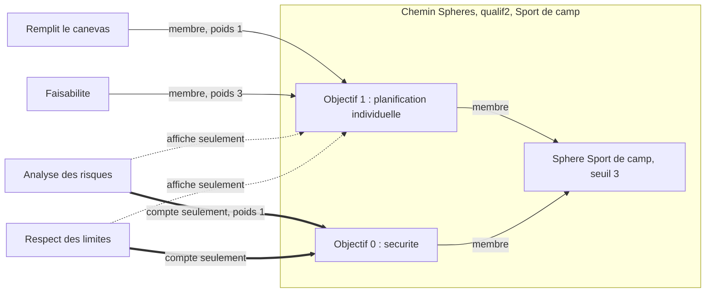
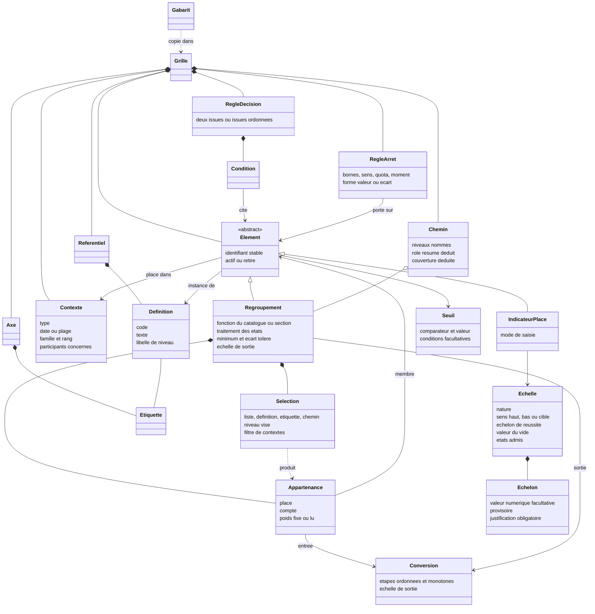
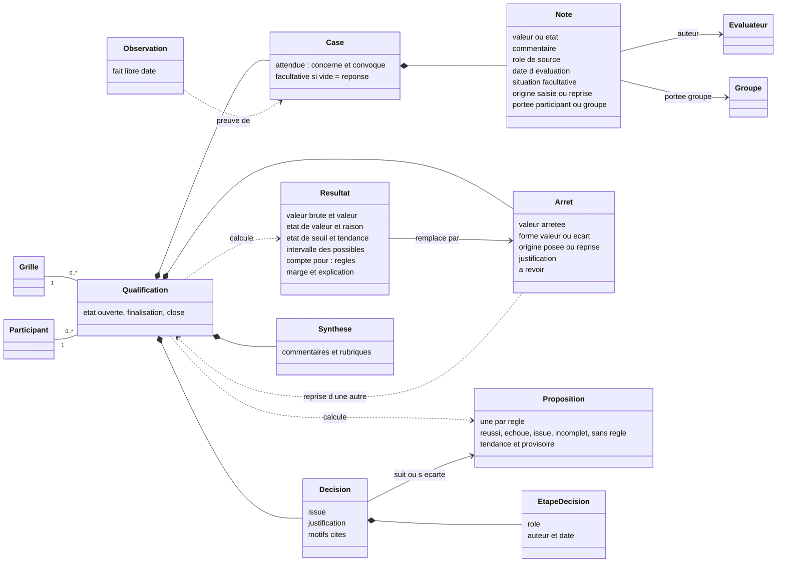
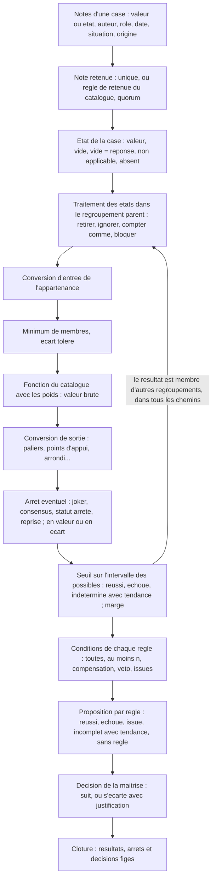
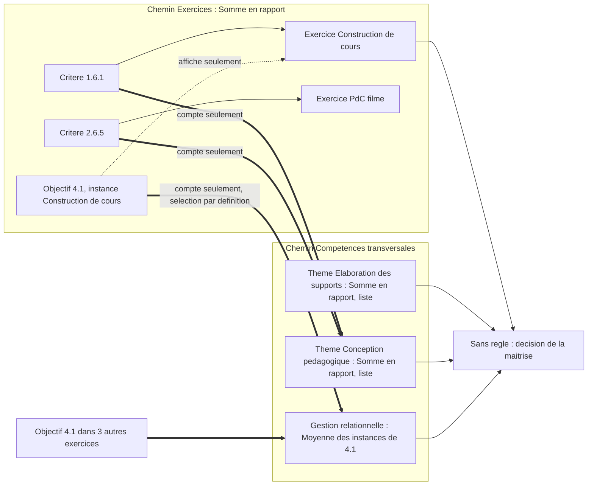
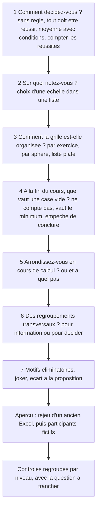

# Modèle générique de l'évaluation

Ce document donne le **modèle conceptuel générique** de l'évaluation dans Azimut : les concepts, les règles de calcul et les primitives qui permettent d'exprimer n'importe quel type de qualification, pas seulement les trois Excel actuels. Il **remplace le document 02** comme référence.

Il reprend ce qui tient dans 02, corrige ce que 07 a démenti, et s'éprouve sur le corpus de 09 (19 archétypes, 15 cas de test) et sur les 16 cas inédits de 12. Il reste dans le domaine métier : pas de technologie. Mais il se veut précis comme une spécification : avec ce texte, on doit pouvoir calculer un résultat à la main.

> **Cadrage du porteur du projet (2026-10-03).** Les trois Excel sont le système **actuel**, pas la cible. Azimut doit être **générique** et compatible avec **tous** les types de qualification. Le « modèle minimal » de 07 (un seul arbre de calcul, pas d'axes, pas de n-n décisif) **n'est pas retenu**. Ses faits vérifiés restent vrais, et sa critique de l'« effet tableur » est traitée à la section 10.

**Statut.** Tout est **proposé**, sauf ce qui est marqué **constaté** (dans `FEATURES.md`, dans les Excel ou dans les analyses 07, 09 et 12). Le vocabulaire suit les arbitrages du README et celui de 11 (voir §2).

## Révision 2 (après 12)

Le document 12 a relu ce modèle. Les chiffres tenaient ; plusieurs règles non. Cette révision corrige les règles sans réduire le périmètre.

- **La certitude promise est tenue.** Tant que la qualification est ouverte, une condition se juge sur l'**intervalle des possibles** de ses entrées. Trois notes sur 219 ne donnent plus « réussi » (§6.3 ; 12 R03, CI1, priorité 1).
- **Le vide a deux sens.** « Pas encore noté » relève du traitement du vide du regroupement. « Le vide est une réponse » se déclare sur l'échelle (un motif non coché vaut « non retenu »). L'ordre des échelons est écrit : du moins bon au meilleur (§3.1, §3.3 ; R16, CI3, priorité 2).
- **« Sans membre » n'est plus « non applicable ».** Une sphère vidée ne sort plus de la règle en silence (§5.3 ; R14, CI2, priorité 3).
- **Chaque fonction et chaque conversion déclarent leur échelle de sortie.** L'arrondi se règle par rapport au sens de l'échelle (§3.4, §5.1 ; R04, R10, priorité 4).
- **Le statut se lit par règle** (« compte pour : Réussite ; Mention »). Une règle peut avoir des **issues ordonnées**. Le rôle d'un chemin n'est plus qu'un résumé (§4.4, §4.7, §6.2 ; R15, EC1, EC12, priorité 5).
- **Vocabulaire sans collision** : **échelon** (échelle), **niveau** (chemin), **section**, **affiché seulement**, **compte seulement** (§2 ; CI12, EC10, priorité 6).
- **Utilisabilité** : un questionnaire de gabarit qui part de la décision, le vide visible avec un défaut par gabarit, des alertes groupées, « sans règle » sans justification obligatoire (§10 ; U1 à U10, priorité 7).
- **La vie du cours passe par les données** : convocation au rattrapage, situation sur une note, note ou arrêt **repris** d'une autre qualification, « corriger le placement » ou « évaluer ailleurs » (§4.1, §6.4, §7 ; R06, R09, R12, R13, priorité 8).
- **Multiplicité juste et options ajoutées** : double comptage bloqué seulement le long de fonctions linéaires, poids effectif d'une Somme corrigé, F9 devenue la moyenne par rang, F11 écart signé, sens « cible », écart en crans, quorum par rôle, arrêt en écart, « au moins n » au prorata (priorités 9 et 10 ; R01, R02, R05, R07, R08, R11, CI6, CI7).
- **Validation** : les 16 cas de 12 entrent au §9.6 : 7 couverts, 9 couverts avec un réglage avancé, aucun non couvert. Cinq nouvelles décisions pour le porteur du projet (D16 à D20) et D10 révisée (§11).

## TL;DR

- **Six primitives qui se composent** : l'**échelle** (les valeurs possibles d'une note, du moins bon au meilleur, avec un sens et une valeur du vide facultative), la **case** (un participant × un indicateur placé, qui reçoit une ou plusieurs notes), le **regroupement** (une fonction d'un catalogue fermé, avec une échelle de sortie déclarée), la **conversion** (une chaîne d'étapes monotones), la **condition** (un seuil, un comptage ou une compensation, combinés par ET, OU, au moins n) et l'**arrêt** (une valeur posée par un humain à la place du calcul, bornée et justifiée). Le joker, le consensus d'un jury, la décision finale et la reprise d'un acquis sont des réglages de l'arrêt.
- **Plusieurs chemins, un seul graphe de calcul.** Un chemin est une hiérarchie nommée qui **place** des éléments (thème, exercice, sphère, objectif officiel). Une **appartenance** dit séparément si le membre est **placé** sous le regroupement (il s'y affiche) et s'il y est **compté** (il entre dans le calcul). La sécurité de qualif2 (affichée seulement sous l'objectif 1, compte seulement dans l'objectif 0) devient un cas ordinaire.
- **Le statut n'est pas un réglage.** Un résultat **compte pour** une règle s'il est cité par elle, directement ou non. Sinon il est **pour information**. Le même thème est indicatif dans une grille et décisif dans une autre (cas T10). Une sphère oubliée dans la règle (Trekking) devient visible.
- **Double comptage contrôlé** : pour chaque résultat, on compte combien de chemins de calcul mènent d'une case à lui. Plus d'un le long de fonctions linéaires (moyenne, somme), c'est une erreur, sauf si la grille le déclare voulu. Le long de Meilleure, Médiane ou Comptage, c'est un simple avertissement.
- **Pas de formule libre.** Le catalogue d'agrégations est fermé (11 fonctions), les conversions aussi (6 étapes), et la règle se lit comme une phrase. On ajoute une fonction par une version du produit, avec sa fiche et ses cas de test, jamais dans une grille.
- **Le vide est explicite, et la logique a trois valeurs.** Une case est vide, non applicable, absente ou a une valeur. Une condition est réussie ou échouée seulement si **toutes** les valeurs encore possibles donnent la même réponse. Sinon elle est indéterminée, avec une tendance « pour l'instant », et la proposition est **incomplète**. Un dossier vide ne réussit jamais (bug F12 de qualif3).
- **Validation** : les **15 cas de test** de 09 passent. Les **16 cas inédits** de 12 passent aussi : 7 avec les réglages visibles, 9 avec un réglage avancé. Hors modèle, par choix : le classement entre participants, la notation relative à la moyenne du cours, et la visibilité des notes entre évaluateurs (qui relève des droits).
- **Contre l'effet tableur** : un questionnaire qui part de la décision, des réglages **par niveau**, des défauts propres à chaque gabarit, la règle en phrases, un aperçu avec des participants fictifs et le rejeu d'un ancien Excel, l'explication de chaque chiffre, et des contrôles groupés qui posent une question.

## Ce qui change par rapport à 02

| Sujet | 02 | Ici | Raison |
| --- | --- | --- | --- |
| Vocabulaire | modèle, grille, dossier, apprenant, observation | **grille**, **qualification** de [participant], **gabarit**, **participant**, **maîtrise**, **case**, **note**, **échelon** ; « observation » réservé au fait libre | README, 07 X1 à X3, 11, 12 U3 |
| Arbre principal | chaque indicateur a un parent dans l'arbre principal, qui sert à la fois au calcul et à l'affichage | **chemins** de placement, plusieurs par grille ; l'appartenance distingue **placé** et **compté** | 07 F5, F7 : afficher ici, compter ailleurs |
| Statut | décisif, indicatif ou organisationnel, posé sur le regroupement | **dérivé** des règles, **par règle** ; « section » = regroupement sans fonction | 09 §4.3, 07 X7, 12 R15 |
| Double comptage | autorisé, avec une alerte | **multiplicité** calculée par résultat ; refusée le long de fonctions linéaires, sauf déclaration | 07 F5, 12 R02 |
| Échelle | toujours numérique en dessous | numérique **ou** ordinale ; sens (haut, bas, cible) ; échelon de réussite ; échelons provisoires ; valeur du vide | 07 F13, §3.3 ; 12 R05, R16 |
| Conversions | points d'appui, paliers, arrondi ; à la sortie | + linéaire, table d'échelons, bornage ; **à l'entrée**, à la sortie, ou format d'affichage ; échelle de sortie déclarée | 07 §3.3, 09 A07, A14, 12 R04 |
| Agrégations | 3 primitives (moyenne pondérée, nombre de réussis, minimum) | **11 fonctions** fermées, avec des paramètres communs | 09 §4.1, 12 §5 |
| Règle | liste de conditions en ET | grammaire ET, OU, au moins n, compensation, seuil conditionnel, issues ordonnées ; logique à trois valeurs sur l'intervalle des possibles | 09 A08, A19, 12 R03, R15 |
| Écart avec le calcul | seulement par joker | **arrêt** : joker, consensus, écart justifié, reprise, avec trace | 07 X4, 12 R13 |
| Tentatives | maximum « à confirmer » | contextes ordonnés d'une même famille ; convocation comme donnée | 09 A13, A14, 12 R06 |
| Plusieurs évaluateurs | non traité | plusieurs notes par case, note retenue, quorum, écart toléré, arrêt | 09 A15 à A17, 11 EX12, 12 R11 |
| Remédiation qualif2 | « moyennée » | affichée seulement, non comptée (fait F6) | 07 F6 |

---

## 1. Principes de conception

1. **Peu de primitives, qui se composent.** Six primitives (échelle, case, regroupement, conversion, condition, arrêt) et deux concepts de structure (définition et contexte). Tout le reste en est une composition : le thème, la sécurité, la Posture, la note CFC, le joker, le rattrapage, le jury, la reprise d'un acquis. Un nouveau besoin doit d'abord être exprimé avec l'existant. On n'ajoute une primitive que si la composition devient illisible. La révision 2 n'en ajoute aucune : elle ajoute des **attributs** (sens cible, valeur du vide, situation et origine d'une note, forme d'un arrêt).

2. **Tout résultat est explicable.** Chaque fonction, conversion et condition a une **phrase type**. L'explication d'un résultat est la suite de ces phrases, avec les valeurs réelles : « Moyenne pondérée de 3,4 (×1), 3,0 (×1) et 2,5 (×2) = 2,85 ; convertie par points d'appui (1 → 0 %, 3 → 100 %, 5 → 150 %) = 92,5 % ; seuil 80 % atteint, marge + 12,5 points ». Un résultat qu'on ne sait pas expliquer en phrases est refusé par le modèle.

3. **Le vide est explicite.** Un vide n'est jamais transformé en valeur au moment de la saisie. Ce qu'il vaut se décide de façon visible : dans l'échelle quand le vide est une réponse (« vide = non retenu »), sinon dans chaque regroupement. Un 0 n'est jamais un vide.

4. **Catalogue fermé, pas de formule libre.** Tranché : **pas de formule libre, ni de « formule contrôlée »**.
   - **Pour** le catalogue fermé : chaque fonction a une explication type, un traitement des vides défini, des cas de test, et une propriété de monotonie qui permet la logique à trois valeurs (§6.3). On peut traduire la grille en phrases et la vérifier avant le cours. On évite les erreurs vues dans les Excel : `#REF!`, dénominateur faux (07 F9), plage oubliée (F2, F11), sphère oubliée (F10).
   - **Contre** la formule contrôlée (un petit langage avec quelques opérateurs) : elle demande quand même des explications type, elle laisse passer des erreurs de sens qu'aucun contrôle ne voit, et elle déplace la programmation chez le formateur. C'est l'effet tableur, en plus étroit.
   - **Le prix** : certains systèmes exotiques ne s'expriment pas (§9.5). La soupape est double : la **décision humaine justifiée** (§6.5), et l'**ajout d'une fonction** au catalogue par une version du produit (§5.5).

5. **Le calcul est déterministe.** Un résultat ne dépend que de la structure de la grille, des notes et des arrêts de la qualification concernée, et de son **état** (ouverte, en finalisation, close). Les notes de groupe qui la concernent et les valeurs reprises d'une autre qualification en font partie : elles sont copiées comme des données, jamais relues ailleurs au moment du calcul. Un résultat ne dépend jamais des autres participants ni de l'heure de saisie. On peut donc recalculer à tout moment, de façon incrémentale, et reconstituer l'état à une date (11 EX11).

6. **Calcul exact, arrondi déclaré.** Les calculs se font en valeurs exactes (fractions ou décimales exactes). Un arrondi n'a lieu que là où la grille le déclare. Les comparaisons à un seuil portent sur la valeur exacte. Exemple : 9/12 = 0,75 atteint un seuil de 75 % (cas T7). Autre exemple : (2,59 − 1) / 2 = 0,795 s'arrondit à 0,80 au centième, alors qu'un calcul en virgule flottante donne 0,79499… et arrondit à 0,79. Le seuil de qualif3 en dépend (07 F3).

7. **Proposer, puis décider.** Le calcul produit une **proposition** par règle. La maîtrise enregistre une **décision**. Elle peut s'en écarter, avec une justification et une trace (§6.5).

8. **Identifiants stables partout.** Rien ne se lie par un libellé, un code ou une position (11 EX1). Renommer, déplacer ou recopier ne casse aucun lien.

9. **Généricité à la demande.** La grille la plus simple (un chemin, une échelle, une moyenne, un seuil) se crée sans voir les chemins multiples, les sélections, les arrêts ni les tentatives. Chaque concept avancé reste caché tant qu'on ne s'en sert pas (§10). Exception voulue : ce qui **change le résultat** sans se voir (le vide, l'arrondi intermédiaire) est toujours une question visible.

---

## 2. Glossaire

### 2.1 Choix de vocabulaire

| Question | Choix | Justification | Rejetés |
| --- | --- | --- | --- |
| La structure d'un cours | **grille** | Accord de 02, 07, 11 et du README. Les formateurs disent déjà « grille d'observation ». | arbre (faux), formulaire |
| La structure réutilisable, hors cours | **gabarit** | « Modèle » entre en collision avec ce document (« modèle générique ») et avec le modèle Excel. Un gabarit est un point de départ, pas une contrainte. | modèle, template |
| Les données d'un participant | **qualification** de [participant] | Le mot du terrain (« la qualif de Léa »). « Dossier » désigne déjà des documents en J+S (07 X2). Le README l'a arbitré. | dossier, fiche, bulletin |
| La personne évaluée | **participant** (participant·e dans l'interface) | Mot des fichiers (« La·e participant·e ») et rôle MiData. Assez générique pour le corpus. | apprenant (mot de concepteur), candidat |
| L'équipe qui évalue et décide | **maîtrise** ; la personne : **formateur** ; le rôle de saisie : **évaluateur** | « Maîtrise » est le mot des fichiers (07 X3). « Évaluateur » couvre aussi le juré, l'expert, le pair et l'auto-évaluation (09 A15, A17). | équipe de cours, jury (cas particulier) |
| Les valeurs possibles d'une note | **échelle** | Mot de `FEATURES.md` et de 11. « Barème » désigne la **table** de conversion nommée (« barème CFC », §3.4). | — |
| Un cran d'une échelle (« ++ », « acquis ») | **échelon** | « Niveau » sert déjà aux étages d'un chemin (sphère, objectif). Deux sens pour un mot, c'est le premier obstacle d'un concepteur (12 §6.3). | niveau |
| Ce qu'on saisit | **note** (valeur ou état), dans une **case** | Aligné sur 11 : la case est l'atome des données, la note est ce qu'on y écrit. « Note » vaut aussi pour « acquis » ou « o ». | saisie, relevé, observation |
| Le fait libre | **observation** | Sens de Qualix et de la brochure RQF (07 X1). Une observation peut servir de preuve à une case, mais n'entre dans aucun calcul. | — |
| Le niveau le plus fin de la structure | **indicateur** | Mot de `FEATURES.md` et de 11. Dans un gabarit CFC, son libellé peut être « position » ; dans un concours, « note de juge ». | point d'évaluation, item |
| La valeur posée par un humain à la place du calcul | **arrêt** ; à l'écran : « **valeur arrêtée** » | Usage scolaire suisse : on « arrête » une note. Un seul mot pour le joker, le consensus, l'écart justifié et la reprise, qui ont la même forme. | dérogation, ajustement, correction |
| L'élément calculé | **regroupement** (le « nœud » de 11) | Mot de 02, compris sans jargon. 11 garde « nœud » à l'écran et appelle sa primitive de vue « découpage », pour éviter la collision (12 EC10). | agrégat |
| Un regroupement sans fonction | **section** | Il range sans calculer. « Rangement » avait trois sens (12 CI12). | rangement |
| Les appartenances incomplètes | **affiché seulement** (placé, non compté) ; **compte seulement** (compté, non placé) | Le nom dit ce qui se passe. « Rangé » et « référence » ne parlaient pas (12 §6.3). | rangé, référence |

**Mots de l'interface.** Le concept garde son nom dans ce document. L'écran parle le langage du gabarit (12 §6.3, U3) :

| Concept | À l'écran |
| --- | --- |
| contexte | le libellé du gabarit : « exercice », « épreuve », « rendu » |
| indicateur placé | « le critère 2.6.5 **dans** l'exercice PdC filmé » ; « ajouter à l'exercice » |
| chemin | « façon de regrouper » (« par exercice », « par thème ») |
| Somme en rapport ; Part des réussis | « total des points en % » ; « % d'indicateurs réussis » |
| conversion | « barème » (par points de repère, par tranches, formule fédérale CFC) |
| lecture « résultat par contexte » / « cases mises en commun » | « chaque exercice pèse pareil » / « chaque point pèse pareil » |
| multiplicité 2 | « compté 2 fois dans [résultat] » |
| compte pour une règle ; indicatif | « compte pour la décision » ; « pour information » |
| indéterminé | « en attente » (« 3 cases vides »), avec la tendance « réussi pour l'instant » |

### 2.2 Termes

**Structure (la grille)**

| Terme | Définition |
| --- | --- |
| **Référentiel** | La liste des définitions d'une grille. |
| **Définition** | Un objectif, un critère ou un indicateur rédigé une fois, avec un code (« 2.6.5 »), un texte et des étiquettes. Une définition peut contenir d'autres définitions. |
| **Contexte** | La situation **planifiée** dans laquelle on évalue : exercice, rendu, épreuve, essai, entretien, période. Il a un type, une date ou une plage, un ordre, éventuellement une **famille** et un **rang** (tentatives), et les participants **concernés**. Libellé par défaut dans les gabarits scouts : « exercice ». |
| **Élément** | Tout ce qui a un résultat dans une qualification : un indicateur placé ou un regroupement. |
| **Indicateur placé** | Une définition d'indicateur placée dans un contexte (ou hors contexte). Le couple (définition, contexte) est unique dans la grille, mais l'**identité** de l'indicateur placé est son identifiant : corriger son contexte ne crée pas un autre indicateur (§4.1). |
| **Regroupement** | Un élément calculé. Il a des membres (ses appartenances), une **fonction** du catalogue, des paramètres et une **échelle de sortie** déduite. Il peut être l'instance d'une définition (l'objectif 4.1 dans « Construction de cours »). Sans fonction, c'est une **section** : il place sans calculer. |
| **Appartenance** | Le lien entre un regroupement et un membre. Elle dit si le membre est **placé** (il s'affiche sous ce regroupement) et s'il est **compté** (il entre dans le calcul), avec un **poids** et une **conversion d'entrée** facultative. |
| **Sélection** | Une règle qui produit des appartenances : par liste, par définition, par étiquette, par chemin, avec un filtre facultatif sur les contextes. Elle se recalcule quand la structure change. |
| **Chemin** | Une hiérarchie nommée de regroupements, qui **place** chaque élément au plus une fois. Il a des niveaux nommés, une **couverture** et un **rôle** résumé, tous deux déduits. |
| **Axe**, **étiquette** | Un axe est une classification plate (thème, type de critère, objectif officiel). Une étiquette est une valeur d'un axe posée sur un élément ou une définition. |
| **Échelle** | Les valeurs possibles d'une note : des échelons ordonnés ou un intervalle, un sens, l'échelon de réussite, la valeur du vide (§3). |
| **Échelle de sortie** | L'échelle du résultat d'une fonction ou d'une conversion : minimum, maximum, sens, capacité, échelon de réussite éventuel. Toujours déclarée, déduite le plus souvent (§3.4, §5.1). |
| **Conversion** | Une chaîne d'étapes qui transforme une valeur : linéaire, points d'appui, paliers, table d'échelons, arrondi, bornage (§3.4). Une conversion nommée s'appelle un **barème**. |
| **Seuil** | La condition qu'un élément doit remplir pour être **réussi**. Un élément a au plus un seuil. Il peut dépendre d'un autre résultat (seuil conditionnel). |
| **Règle de décision** | Une expression de conditions qui produit une proposition. Facultative, et il peut y en avoir plusieurs (volets, mention). Elle a deux issues (réussie, échouée) ou des **issues ordonnées** (§6.2). |
| **Motif éliminatoire** | Un indicateur à l'échelle « retenu, non retenu », où « retenu » exige une justification et où le vide vaut « non retenu ». Cité par une règle, il a un effet de veto ; non cité, il informe. |
| **Règle d'arrêt** | Ce que la grille permet d'arrêter à la main : sur quel élément, par qui, quand, dans quelles bornes, sous quelle forme (valeur ou écart), combien de fois. |

**Données (une qualification)**

| Terme | Définition |
| --- | --- |
| **Case** | Un participant × un indicateur placé. Elle existe si elle est **attendue** : indicateur actif, contexte qui concerne le participant, et pour un rattrapage, participant **convoqué** (§7.3). Une case dont l'échelle déclare une valeur du vide est **facultative** : on n'attend pas qu'elle soit remplie. |
| **Note** | Ce qu'un évaluateur écrit dans une case : une **valeur** de l'échelle ou un **état** (non applicable, absent), un commentaire, un auteur, un rôle, une date d'écriture, et en option une date d'évaluation et une **situation**. Son **origine** est « saisie » (défaut) ou « reprise » d'une autre qualification. Une case vide n'a aucune note. |
| **Situation** | Une donnée facultative sur une note : où la preuve a été vue, quand elle ne correspond à aucun contexte planifié (« jeu improvisé, mardi soir »). Texte court ou choix dans une liste ouverte. Ce n'est pas de la structure (§7.2). |
| **Note retenue** | La valeur qui représente la case dans le calcul. Avec une seule note, c'est elle. Avec plusieurs (jury, journal), une règle de retenue la tire (§7.2). |
| **Résultat** | La valeur calculée d'un élément pour une qualification, avec son état, sa raison si vide, son seuil, sa marge, son **intervalle des possibles** tant que la qualification est ouverte, et son explication. Jamais saisi. |
| **Résultat restreint** | Le résultat d'un regroupement recalculé sur une partie seulement de ses cases (par exemple un seul contexte). Marqué « partiel », jamais cité par une règle (§4.9). |
| **Arrêt** | Une valeur posée par un humain sur un élément calculé, qui remplace le résultat pour la suite du calcul. Avec un auteur, une date, une justification, une **forme** (valeur ou écart) et une **origine** (posé ou repris). |
| **Proposition** | Ce que calcule une règle de décision : réussi, échoué (ou une issue), incomplet avec une tendance, ou sans règle. Une par règle. |
| **Décision** | Ce que la maîtrise enregistre, en une ou plusieurs étapes (visa). |
| **Commentaire de synthèse**, **rubrique libre** | Les textes d'un regroupement ou de la qualification entière (commentaire général, 3 points positifs, 3 à améliorer). Hors calcul. |
| **Observation** | Un fait libre, daté, attribué, éventuellement lié à des cases comme preuve. Hors calcul. |
| **Drapeau** | Un marqueur sur une note (« plagiat », « à revoir »). Hors calcul (07 F13). |

---

## 3. Échelles et conversions

### 3.1 Un modèle unique d'échelle

Une échelle a une **nature** parmi trois :

| Nature | Ce qu'elle contient | Exemples |
| --- | --- | --- |
| **Échelons** | une liste **ordonnée** d'échelons, **du moins bon au meilleur**. Chaque échelon a un code court, un libellé, un descriptif facultatif et une valeur numérique facultative. | o/k, OUI/NON, --/-/+/++, non acquis / en cours / acquis, Dreyfus, lettres F à A, statut RQF |
| **Continue** | un intervalle numérique : minimum, maximum, **pas de saisie** (1, 0,5, 0,1 ou libre), **unité**, **sens** (voir ci-dessous). Des **ancres** nommées peuvent décrire certaines valeurs. | 1 à 5, 1 à 6 par demi-points, /20, points de 0 à un maximum, %, temps, durée cible, angle |
| **Texte** | aucune valeur. La case se commente seulement. | appréciation de stage, éléments commentés sans note (S15) |

**Sens** d'une échelle continue :

- **plus haut = mieux** (défaut) ;
- **plus bas = mieux** (un chrono) ;
- **cible** : une valeur c est la meilleure, et l'on s'en écarte dans les deux directions (un exposé de 10 minutes, une marche au temps imposé). Option **circulaire** pour un angle (période 360°). On saisit la valeur x ; le modèle en dérive l'**écart** d = |x − c|, ou l'écart circulaire min(|x − c|, 360 − |x − c|), qui est « plus bas = mieux ». Toutes les fonctions, conversions et seuils portent sur d. L'affichage montre les deux : « 8:30 (écart 1:30, trop court) ». Ainsi la monotonie (§3.4) reste vraie, et un besoin courant entre dans le modèle (12 R05). Exemple circulaire : un azimut estimé à 350° pour une cible à 10° a un écart de 20°.

Chaque échelle porte aussi :

- **L'échelon de réussite** : la valeur la moins bonne qui compte comme réussie (« o », « + », « acquis », « 3 », « ≤ 4 min 00 s », « écart ≤ 1 min »). Facultatif. Il sert de seuil par défaut aux indicateurs, et aux fonctions qui comptent des réussites. Une définition ou un indicateur placé peut le **surcharger** (une exigence à 66 %, une autre à 100 %, 09 A05).
- **Les échelons provisoires** (nature « échelons ») : un échelon marqué provisoire (« pas encore », « en cours ») est une information, pas une conclusion. Tant que la qualification est ouverte, il compte comme une valeur encore incertaine (§6.3). À la finalisation, il compte pour ce qu'il est : non réussi. C'est la qualification continue de la RQF (09 A04).
- **La justification obligatoire** par échelon : choisir cet échelon exige un commentaire (« retenu » pour un motif éliminatoire, « non acquis » si la grille le veut).
- **Les états admis** : « non applicable » est toujours admis, avec une justification. « Absent » est admis si la grille le prévoit.
- **La valeur du vide** (facultative) : quand une case **sans note** est une réponse, l'échelle le dit (« vide = non retenu » pour un motif, « vide = 0 » pour un ajustement individuel). Voir §3.3.
- **Le maximum propre à l'indicateur** (échelle continue en points) : chaque indicateur peut avoir son propre maximum (une position CFC sur 12 points, une autre sur 20). Il se saisit sur l'indicateur placé, dans la liste du référentiel (une colonne de l'import, §10.8).
- **Les descriptifs propres à la définition** (nature « échelons ») : le texte d'un échelon peut changer d'un critère à l'autre. C'est la grille critériée (09 A11).

**Capacité de calcul** (déduite, pas réglée) :

| Capacité | Quand | Fonctions permises (§5) |
| --- | --- | --- |
| **Numérique** | échelle continue, ou échelle à échelons dont **tous** les échelons ont une valeur numérique | toutes |
| **Ordinale** | échelle à échelons sans valeurs numériques | Meilleure, Moins bonne, Médiane, Dernière, Comptage, Part des réussis ; Étendue et Écart signé **en crans** |
| **Aucune** | échelle texte | aucune ; la case compte seulement pour le suivi (remplie ou non) |

Un **cran** est la distance d'un échelon au suivant. L'écart entre « - » et « ++ » vaut 2 crans. Sur une échelle continue, on compte en valeurs (12 R11 d, EC8).

C'est la réponse à 07 (§3.3) : on ne fait pas la moyenne de « + » et de « - » sans le dire. Si une équipe veut une moyenne sur --/-/+/++, elle donne des valeurs aux échelons, et l'explication les affiche (« valeurs choisies par la grille : -- = 1, - = 2, + = 3, ++ = 4 »). La moyenne sort alors sur une échelle **continue** de 1 à 4, pas sur les échelons (§5.1).

### 3.2 Couverture des échelles courantes

| Échelle | Nature | Réglage | Capacité | Réussite |
| --- | --- | --- | --- | --- |
| o/k (qualif2) | échelons | k, o ; valeurs 0 et 1 | numérique | o |
| Motif éliminatoire | échelons | retenu, non retenu ; justification obligatoire sur « retenu » ; **vide = non retenu** | ordinale | non retenu |
| --/-/+/++ | échelons | --, -, +, ++ ; sans valeurs par défaut | ordinale | + |
| Acquis | échelons | non acquis, en cours, acquis, expert ; descriptifs par critère | ordinale (ou valeurs 0 à 3) | acquis |
| Statut RQF | échelons | pas encore (provisoire), en cours (provisoire), remplie | ordinale | remplie |
| 1 à 5 (qualif2, qualif3) | continue | 1 à 5, pas 1 (ou 0,1 en qualif3 A et B) ; ancres 1 « insuffisant », 3 « minimum requis », 5 « au-delà des attentes » | numérique | 3 |
| 1 à 6 par demi-points | continue | 1 à 6, pas 0,5 | numérique | 4 |
| 1 à 10, /20 | continue | 1 à 10 ou 0 à 20, pas au choix | numérique | au choix (10/20) |
| Points (qualif1, CFC) | continue | 0 au maximum de l'indicateur, pas 0,5 | numérique | facultative |
| Pourcentage | continue | 0 à 1 (affiché en %), maximum 1,5 possible | numérique | au choix |
| Temps chronométré | continue | 0 à 10 min, unité min:s, **plus bas = mieux** | numérique | ≤ 4:00 |
| Durée cible | continue | 0 à 30 min, unité min:s, **cible 10:00** | numérique (sur l'écart) | écart ≤ 1:00 |
| Angle estimé | continue | 0 à 360°, **cible circulaire** | numérique (sur l'écart) | écart ≤ 10° |
| Ajustement individuel | continue | − 1 à + 1, pas 0,5, **vide = 0** | numérique | — |
| Lettres A à F | échelons | F, E, D, C, B, A ; valeurs GPA facultatives | ordinale ou numérique | au choix |
| Appréciation de stage | échelons | insuffisant, satisfaisant, très bon | ordinale | satisfaisant |
| Texte seul | texte | — | aucune | — |

Les échelons sont **toujours ordonnés**, du moins bon au meilleur. L'échelon de réussite et tous ceux qui le suivent sont réussis. Une classification sans ordre (« type d'erreur ») n'est pas une échelle : c'est un axe, ou une observation.

### 3.3 Les états d'une case

| État | Sens | Comment on l'obtient | Effet dans un calcul | Réglable |
| --- | --- | --- | --- | --- |
| **Vide** | pas encore de note | aucune note | selon le traitement du vide du regroupement (§5.2) ; tant que la qualification est ouverte, le vide entre dans l'intervalle des possibles (§6.3) | oui : ignorer, compter comme une valeur, bloquer |
| **Valeur** | une note de l'échelle | saisie | compte | — |
| **Non applicable** | ne concerne pas ce participant (dispensé, arrivé en cours, exercice annulé pour son groupe) | état saisi avec justification ; portée : une case, un contexte, un groupe | **retiré** : sort du calcul et du suivi | non |
| **Absent** | aurait dû être évalué, ne l'a pas été par son fait (non rendu, non présenté) | état saisi | compte comme l'échelon le **moins bon**, **définitif** : non réussi, même si cet échelon est provisoire (RQF : « pas encore », sans attendre la finalisation) (12 S6) | oui : comme le vide |

**Vide = réponse.** Si l'échelle déclare une **valeur du vide**, une case **sans note** vaut cette valeur partout : dans les regroupements comme dans les conditions. Ce n'est pas une incertitude, donc elle ne compte pas dans l'intervalle des possibles. La case est **facultative** : elle sort du remplissage (11 §4.2). Cas type : un motif éliminatoire que personne ne coche est « non retenu » ; un cours sans incident donne 24 « réussi », pas 24 « incomplet » (12 R16). Sans valeur du vide déclarée, un vide est toujours « pas encore noté ».

**Hors périmètre** n'est pas un état. C'est la raison pour laquelle une case **n'existe pas** pour un participant : contexte qui ne le concerne pas, rattrapage où il n'est pas convoqué, élément couvert par une reprise (§6.4). Une case qui n'existe pas n'entre ni dans le calcul ni dans le suivi (12 CI10).

Règles :

- Une note dont la justification obligatoire manque compte comme **vide**, avec la raison « justification manquante » (cas T11). Ce n'est pas une case sans note : la valeur du vide ne s'applique pas.
- « Rien à signaler » reste une option (README, 11 §1.5) : c'est un marqueur sur le commentaire, pas un état de la note.
- « Absent » est **proposé** au-delà de la version initiale de 11 : le CFC donne la note 1 à une épreuve non présentée sans excuse, ce qui n'est ni un vide ni un non applicable [D, 09 A07]. Si une qualification remplie montre qu'il ne sert pas, on le retire.

### 3.4 Les conversions

Une **conversion** est une chaîne ordonnée d'étapes. Chaque étape est l'une des six suivantes. Une conversion nommée et réutilisable s'appelle un **barème**.

| Étape | Définition exacte | Exemple |
| --- | --- | --- |
| **Linéaire** | deux points (x₁, y₁) et (x₂, y₂) : y = y₁ + (x − x₁) × (y₂ − y₁) / (x₂ − x₁) | CFC : proportion de points p → note : (0 → 1), (1 → 6), soit p × 5 + 1 |
| **Points d'appui** | des points (x₁, y₁) … (xₙ, yₙ), x croissants. Entre deux points : linéaire. Sous x₁ : y₁. Au-dessus de xₙ : yₙ. | qualif3 : (1 → 0 %), (3 → 100 %), (5 → 150 %) |
| **Paliers** | des seuils s₁ < … < sₙ avec des valeurs y₁ … yₙ. Résultat : yₖ pour le plus grand k tel que x ≥ sₖ. s₁ doit être le minimum de l'échelle d'entrée. Option : seuils stricts (x > sₖ). Sur une entrée « plus bas = mieux » (chrono, écart à une cible), les paliers se lisent dans son sens : « x ≤ sₖ ». | qualif2 : % de « o » 0 → 1, 30 → 2, 45 → 3, 70 → 4, 85 → 5 ; mentions /20 ; lettre depuis un % |
| **Table d'échelons** | une correspondance échelon → valeur, ou échelon → échelon | lettres → points GPA (A = 4, B = 3, C = 2) ; changement d'échelle en cours de cours (1 à 5 → o/k) |
| **Arrondi** | un pas p (1, 0,5, 0,1, 0,01…) et un mode **relatif au sens de l'échelle** : **au plus proche, égalité en faveur du participant** (défaut) ; au plus proche, égalité en sa défaveur ; toujours en faveur ; toujours en défaveur | qualif2 : entier ; CFC : demi-note, puis dixième ; chrono à la seconde |
| **Bornage** | un plancher et/ou un plafond : y = min(max(x, plancher), plafond) | rattrapage plafonné à 60 (09 A14) ; % limité à 150 % ; note bornée de 1 à 6 |

**Le mode d'arrondi suit le sens.** « En faveur du participant » veut dire vers le haut sur une échelle « plus haut = mieux », vers le bas sur une échelle « plus bas = mieux » ou sur un écart à une cible. Un mode purement numérique (« égalité vers le haut ») défavoriserait en silence un nageur chronométré (12 R10 b). Sur les échelles usuelles (plus haut = mieux), le défaut donne les mêmes chiffres qu'avant. Ce défaut est à confirmer (D10).

**Monotonie obligatoire.** Une conversion doit être croissante (valeurs y non décroissantes) ou décroissante. Une conversion décroissante **inverse le sens** (un temps → des points). Une table non monotone est refusée (C9). Pour une durée cible, la conversion porte sur l'écart d, donc elle reste monotone. Cette règle garantit deux choses : la logique à trois valeurs reste juste (§6.3), et l'app peut toujours montrer le **seuil équivalent** dans l'échelle d'entrée (« 80 % ⇔ moyenne brute ≥ 2,59 avec l'arrondi au centième »).

**Échelle de sortie.** Chaque conversion déclare l'échelle qu'elle produit, déduite de ses étapes : une linéaire envoie [min, max] sur [y(min), y(max)] ; des paliers produisent leurs valeurs y₁ … yₙ (des paliers vers 1 à 5 sont compatibles avec une échelle 1 à 5) ; une table produit ses valeurs ou ses échelons ; un arrondi garde l'échelle et fixe le pas ; un bornage la resserre. Le sens suit : une conversion décroissante l'inverse. L'échelon de réussite de la sortie est le seuil de l'élément, s'il en a un. Les contrôles C7 et C10, les fonctions F7 et F8, et le traitement de l'absent s'appuient sur cette échelle (12 §3.4).

**Arrondi : exemples.** 2,5 au pas 1 → 3. 4,375 au pas 0,5 → 4,5 (4,5 est plus proche que 4,0). 4,375 au pas 0,1 → 4,4. 4,25 au pas 0,5 → 4,5 (égalité en faveur). 0,795 au pas 0,01 → 0,80. Chrono 4:00,5 à la seconde, plus bas = mieux → 4:00 (égalité en faveur) : un seuil ≤ 4:00 est atteint ; avec « égalité en défaveur », 4:01, échoué.

**Un « bonus » est un décalage de paliers.** qualif2 ajoute +1,5 au % avant la table (07 F2). Dans le modèle, on n'ajoute pas de bonus : on décale le palier (« 5 à partir de 83,5 % » au lieu de « + 1,5 puis 85 % »). Le résultat est le même, et le seuil réel est lisible.

**Barèmes nommés.** Le concepteur choisit un nom dans une liste, pas des points (x, y) (12 U8) :

| Barème | Étapes |
| --- | --- |
| Formule fédérale CFC | linéaire (0 → 1, 1 → 6) sur la proportion de points, puis arrondi au demi |
| 1 à 5 vers % (qualif3) | points d'appui (1 → 0 %, 3 → 100 %, 5 → 150 %), arrondi au centième |
| Tranches de % vers une note | paliers |
| Total au prorata des notes présentes | Somme en rapport, puis linéaire (0 → 0, 1 → total maximal) : trois jurés sur 20, un absent, 15 + 14 = 29 sur 40 → 29/40 × 60 = **43,5** (12 R11 b) |

### 3.5 Où s'applique une conversion

| Position | Ce qu'elle transforme | Ce que voient les parents et les seuils | Usage |
| --- | --- | --- | --- |
| **À l'entrée** (sur l'appartenance) | la valeur d'un membre, avant la fonction du parent | — | mélanger 1 à 10 et 1 à 5 dans un critère ; plafond d'une tentative de rattrapage ; conversion avant la moyenne (T6) |
| **À la sortie** (sur le regroupement) | la valeur produite par la fonction | la valeur **convertie** | note CFC depuis des points ; paliers de qualif2 ; arrondi dans le calcul ; % de sphère de qualif3 |
| **Format d'affichage** | rien | la valeur **non convertie** | % affiché d'un objectif de qualif3, dont la sphère moyenne les valeurs brutes |

Il n'y a **jamais de conversion implicite**. Si une fonction reçoit des membres dont les échelles de sortie sont incompatibles, la grille est incohérente (contrôle C7, §10.6) tant qu'une conversion d'entrée n'est pas posée.

Une conversion de sortie peut être posée **par regroupement** : chaque critère o/k de qualif2 a sa propre table de paliers (constaté). C'est un réglage local, marqué comme exception (§10.2).

**L'ordre compte, et il se voit.** Constaté dans qualif3 (07 F4) : deux objectifs à 1 et 5. Moyenne puis conversion : 3 → 100 %, réussi. Conversion puis moyenne : (0 % + 150 %) / 2 = 75 %, échoué. Le modèle exprime les deux (sortie de la sphère, ou entrée des objectifs). L'explication montre l'ordre choisi (cas T6).

---

## 4. Structure : référentiel, contextes, regroupements et chemins

### 4.1 Définitions et indicateurs placés

**Constaté** : un même objectif est évalué dans plusieurs exercices, avec des notes indépendantes (qualif1 : 4.1 dans 4 exercices, 2.1 dans 3). La clé réelle est (exercice, critère).

**Proposé** :

1. Le **référentiel** contient les définitions, en arbre (objectif 4.1 ⊃ critère 4.1.2 ⊃ indicateurs). Une définition porte : code, texte, libellé de niveau, étiquettes, et pour un indicateur son échelle, ses descriptifs et son échelon de réussite propres.
2. **Placer** une définition dans un contexte crée une **instance** : un indicateur placé, ou un regroupement placé. On choisit quelles sous-définitions sont placées (un exercice n'évalue pas toujours tous les critères d'un objectif).
3. Placer une définition composée crée, par défaut, des appartenances **placées et comptées** qui suivent l'arbre du référentiel. On règle ensuite les exceptions (« affiché seulement » pour la sécurité de qualif2, §4.4) (12 S1).
4. Le couple **(définition, contexte)** est unique dans une grille. Une définition sans contexte se place une seule fois.
5. Une instance **hérite** de sa définition (texte, échelle, étiquettes, réussite). Elle peut surcharger un réglage ; la surcharge est marquée.
6. Une **case** existe pour chaque participant concerné et chaque indicateur placé actif. C'est l'atome des données (11 §1.1).

**Modifier la structure pendant le cours** (12 R09). Deux opérations, nommées, parce qu'elles disent deux intentions :

| Opération | Intention | Effet sur les notes |
| --- | --- | --- |
| **Corriger le placement** | « on s'est trompé de place » : le critère était dans l'exercice A, il appartient à B | même identifiant ; le contexte change ; les notes **suivent** ; trace au journal |
| **Évaluer ailleurs** | « on l'évaluera dans B » | l'instance de A est **retirée** (ses notes restent, hors calcul) ; une nouvelle instance est créée dans B, vide |

Toute modification de structure pendant le cours montre, avant d'être publiée, la **liste des participants dont la proposition change** et les contrôles rejoués (C5 en particulier). Un instantané (bilan intermédiaire) garde la version de la structure et les statuts du moment : un PDF imprimé avec « pour information » reste lisible tel qu'il était (11 EX11).

### 4.2 Contextes

Un contexte a : un nom, un **type** (exercice, rendu, épreuve, essai, entretien, période), une date ou une plage, un **ordre**, un bloc du programme éventuel, et les **participants concernés** (tous, un groupe, une liste). Les contextes d'une **famille** sont les tentatives d'une même épreuve : « Théorie, tentative 1 », « Théorie, tentative 2 ». Leur **rang** (1, 2, 3) est l'horloge « tentative » de 11 (§1.4).

La grille déclare le **nombre maximal de tentatives** d'une famille. Pour un rang ≥ 2, une case n'est attendue que si le participant est **convoqué** (§7.3).

Un contexte est aussi, par défaut, un regroupement du chemin « par contexte », qui place toutes ses instances (§4.4). Par défaut, ce regroupement est une **section** : il range sans calculer. Seul un gabarit qui calcule par exercice (« Points par exercice ») lui donne une fonction (12 S2). Sinon, une grille à livrables verrait apparaître des % par livrable que personne n'a demandés.

Un contexte est **planifié**. Une preuve vue hors de tout contexte planifié (un jeu improvisé un soir) ne crée pas de contexte : elle porte une **situation** sur la note (§7.2).

### 4.3 Regroupements et appartenances

Un regroupement a :

- des **appartenances**, listées ou produites par des sélections (§4.5) ;
- une **fonction** du catalogue (§5), ou aucune (c'est alors une **section**) ;
- des **paramètres** : traitement des états, minimum de membres, écart toléré, conversion de sortie, format d'affichage ;
- une **échelle de sortie**, déduite de la fonction et de la conversion de sortie (§3.4, §5.1) ;
- un **seuil** facultatif (§6.1) ;
- une **règle d'arrêt** facultative (§6.4).

Une **appartenance** relie un regroupement R à un membre M (indicateur placé ou regroupement). Elle porte :

| Attribut | Valeurs | Sens |
| --- | --- | --- |
| **Placé** | oui, non | M s'affiche sous R dans le chemin de R. |
| **Compté** | oui, non | M entre dans le calcul de R. |
| **Poids** | nombre ≥ 0 (défaut 1), ou **lu dans une case** de la même qualification | Le poids de M dans R. Le poids lu sert au coefficient de difficulté d'un plongeon (09 A16). |
| **Conversion d'entrée** | facultative | Transforme la valeur de M avant la fonction de R. |
| **Origine** | listée, ou sélection S | Une appartenance produite par une sélection change si la sélection change. |

Les quatre combinaisons de placé et compté :

| Placé | Compté | Nom | À l'écran | Exemple |
| --- | --- | --- | --- | --- |
| oui | oui | **membre** | — | un critère dans son objectif |
| oui | non | **affiché seulement** | « affiché ici, compte ailleurs » (ou « hors calcul ») | « Analyse des risques » sous l'objectif 1 de qualif2 ; l'objectif 4.1 dans l'exercice « Construction de cours » de qualif1 ; la remédiation de qualif2 |
| non | oui | **compte seulement** | « compte ici, affiché ailleurs » | « Analyse des risques » dans l'objectif 0 Sécurité ; un critère dans un thème |
| non | non | (sans objet) | — | interdit |

Un **poids nul** et « non compté » ne sont pas la même chose. Un membre de poids 0 compte pour la complétude (un vide bloquant le bloque) et pour les fonctions qui ignorent les poids (Meilleure, Médiane). Un membre non compté n'existe pas pour le calcul. Quand un poids vaut 0, le contrôle C4 **propose** : « Voulez-vous l'afficher seulement ? » (07 §3.2 relevait que 02 aurait signalé à tort une pratique voulue).

### 4.4 Chemins

Un **chemin** est un ensemble nommé de regroupements qui forme une **forêt de placement** : dans un chemin, chaque élément est **placé au plus une fois**. Un élément peut être placé dans autant de chemins qu'on veut, et compter (sans être placé) dans autant de regroupements qu'on veut.

Un chemin a :

- un **nom** et des **niveaux nommés** (« sphère », « objectif », « critère ») ;
- un **ordre** des enfants dans chaque regroupement ;
- une **couverture**, déduite : **totale** si chaque indicateur placé actif y est placé, sinon **partielle**, avec la liste des indicateurs non placés (12 CI10) ;
- un **rôle**, déduit, qui n'est qu'un **résumé** : **affichage** si aucun de ses regroupements n'a de fonction ; sinon « compte pour : [règles] » (l'union des statuts de ses résultats, §4.7) ou « pour information ». Le statut réel se lit **par résultat** : qualif2 a dans le même chemin des sphères qui comptent pour la réussite et une moyenne globale pour information (12 EC1).

Le chemin ne contraint **pas** le calcul. Un regroupement peut compter des membres placés dans d'autres chemins. Le calcul suit le **graphe des appartenances comptées**, qui traverse les chemins.

Trois façons de créer un chemin :

| Façon | Comment | Exemple |
| --- | --- | --- |
| **Par contexte** (automatique) | chaque contexte est une section (ou un regroupement, selon le gabarit) qui place ses instances, dans l'ordre du référentiel | les 7 exercices de qualif1 |
| **Construit** | on crée les regroupements et on place les éléments | sphère → objectif → critère de qualif2 et qualif3 |
| **Depuis un axe** | un regroupement par valeur d'étiquette, membres choisis par sélection. Permis seulement si l'axe a **une valeur par élément** : sinon un élément serait placé deux fois. Avec un axe à plusieurs valeurs, les regroupements reçoivent des membres **compte seulement**, et l'axe reste un axe (11 l'affiche avec des reflets) (12 EC4). | objectifs officiels MSdS (qualif3), méta-axes de la Posture ; thèmes qui se recoupent : compte seulement |

**Afficher sous un chemin, compter sous un autre.** C'est la combinaison d'un placement et d'une appartenance « compte seulement », sans cas spécial. Dans qualif2, « Analyse des risques » a deux appartenances dans le chemin « Sphères » : affichée seulement sous l'objectif 1, compte seulement dans l'objectif 0. La vue par objectif l'affiche sous l'objectif 1, avec le marqueur « compte dans : Objectif 0 Sécurité » (11 MC5), et sous l'objectif 0 comme reflet cité (11 MC8). Le résultat de l'objectif 1 ne la contient pas, et son explication le dit.



*Constaté (07 F5), exprimé ici : chaque critère est compté une seule fois. La première version de 11 décrivait ce cas comme « deux chemins » (affichage et calcul) ; 11 s'aligne désormais sur un chemin plus des appartenances « compte seulement ».*

### 4.5 Sélections

Une **sélection** produit des appartenances (comptées, par défaut non placées). Elle sert aux regroupements **transversaux** ; pour grouper un exercice, le chemin par contexte suffit (12 §3.3). Ses critères se combinent par ET, avec une liste d'exceptions :

| Critère | Ce qu'il retient | Exemple |
| --- | --- | --- |
| **Liste** | des éléments nommés un par un | les 4 thèmes de qualif1 : couples (exercice, code de critère) |
| **Par définition** | les instances d'une définition D | « objectif 4.1 dans tous les exercices » ; « Théorie, toutes tentatives » |
| **Par étiquette** | les éléments d'un **niveau** donné qui portent l'étiquette E (directement, ou par leur définition) | « les critères étiquetés sécurité de la sphère » |
| **Par chemin** | les éléments d'un niveau donné sous un regroupement d'un chemin | « toutes les sphères » |

Chaque critère accepte un **filtre de contextes** : une liste, un type, ou une borne de date (« les contextes avant le jour 3 »). C'est la forme permise des conditions sur le temps de l'évaluation (12 §5).

Règles :

- Une sélection **précise toujours le niveau** (indicateurs, critères, objectifs…). Le niveau change le résultat pour une moyenne (§4.6).
- Une sélection exclut d'office le regroupement lui-même et ses ancêtres comptés.
- Une sélection se **recalcule** quand la structure change. Un nouvel élément étiqueté rejoint donc le thème. Pendant le cours, c'est une modification de structure tracée, avec aperçu de l'impact (§4.1).
- Les étiquettes **héritent** de la définition vers ses instances, et d'un élément vers ses descendants placés. Comme la sélection précise le niveau, cet héritage ne crée pas de doublon.

### 4.6 Regroupement par définition

« L'objectif 4.1 sur tous les exercices » est un regroupement dont les membres viennent d'une sélection **par définition**. Deux lectures possibles, à choisir :

| Lecture | À l'écran | Membres | qualif1, objectif 4.1 [D, chiffres d'exemple] |
| --- | --- | --- | --- |
| **Résultat par contexte** | « chaque exercice pèse pareil » | les 4 résultats de l'objectif 4.1 (un par exercice) | 4 % : 100, 75, 50, 100 ; Moyenne = **81,25 %** (c'est `Synthèse!C55 = AVERAGE(C56:C59)`, constaté) |
| **Cases mises en commun** | « chaque point pèse pareil » | tous les indicateurs placés des 4 instances | avec 4/4, 3/4, 1/2, 4/4 points : Somme en rapport = 12/14 = **85,7 %** |

Avec **Somme** (en rapport), les deux lectures donnent le même résultat : la somme est associative. Avec **Moyenne**, elles diffèrent : la moyenne des moyennes donne le même poids à chaque exercice, quelle que soit sa taille. 09 (A01) le relève : dans un thème de qualif1, un critère de 8 indicateurs pèse deux fois un critère de 4 ; dans la moyenne de 4.1, chaque exercice pèse pareil. Le modèle exprime les deux, et l'explication dit laquelle est choisie.

Le même mécanisme sert aux **tentatives** (§7.3) : « Théorie retenue » est un regroupement par définition sur les contextes de la famille « Théorie ».

### 4.7 Statut : pour quelle règle un résultat compte

Trois réponses possibles à la question « où vit le statut ? » :

| Option | Problème |
| --- | --- |
| Propriété du **regroupement** (02) | Il faut le régler, et il peut contredire la règle : une sphère « décisive » oubliée dans la règle (Trekking, 07 F10) reste fausse en silence. |
| Propriété du **chemin** | qualif2 a dans le même chemin des sphères décisives et une moyenne globale indicative. qualif1 a deux chemins indicatifs. Le chemin est trop gros. |
| **Dérivé des règles** | Rien à régler, aucune contradiction possible. |

**Choix** : le statut d'un résultat est l'**ensemble des règles** dans le **cône de dépendance** desquelles il se trouve. Un résultat est dans le cône d'une règle s'il est cité par elle, ou compté (directement ou non) par un résultat cité, ou utilisé par le seuil conditionnel ou le poids lu d'un résultat du cône. L'écran dit « **compte pour : Réussite** », « compte pour : Réussite ; Mention », ou « **pour information** » si l'ensemble est vide. Un regroupement sans fonction est une **section** (12 R15, EC12).

Pourquoi par règle : une moyenne globale qui sert seulement à une mention (« Mention bien : moyenne globale ≥ 5,0 ») ne décide pas de la réussite. L'afficher « décisive » au même titre que les sphères serait faux.

Conséquences :

- Le même thème est indicatif dans une grille et compte pour la réussite dans une autre, avec la même valeur (cas T10, 09 §4.3).
- Un élément qui a un seuil **déclaré** mais qu'aucune règle ne cite déclenche le contrôle C3 : « La sphère Trekking a un seuil, mais la règle ne la cite pas. L'ajouter à la règle ? La garder pour information ? ». Le choix « pour information » est tracé et tait l'alerte.
- Si une règle cite ensuite un élément marqué « pour information voulu » (la direction ajoute « Posture ≥ 2,5 » le jour 2), le contrôle bloquant C21 exige de retirer le marqueur dans la même modification. L'équipe voit que la Posture compte désormais (12 R15 a).
- Un résultat entré dans le cône par un seuil conditionnel le dit dans l'explication : « Sécurité compte maintenant pour la décision : il fixe le seuil de B » (12 R03).
- Un élément pour information peut être cité comme **motif** dans la justification d'une décision (la Posture, 07 §3.3).

### 4.8 Cycles et double comptage

**Pas de cycle.** Le graphe de dépendance doit être sans cycle. Il a deux sommets par élément : sa **valeur** et son **seuil**. Les appartenances comptées et les poids lus relient des valeurs ; un seuil conditionnel relie la valeur citée au **seuil** de l'élément. Aucune valeur ne dépend d'un seuil. Ainsi deux seuils croisés (le seuil de A lit B, le seuil de B lit A) se calculent et ne sont pas un cycle. Un regroupement ne peut pas dépendre de sa propre valeur, même par une sélection. C'est un contrôle bloquant (C1) (12 R03).

**Multiplicité.** Pour une case c et un résultat R, la **multiplicité** m(c, R) est le nombre de chemins distincts d'appartenances **comptées** qui mènent de c à R.

- m = 0 : c ne compte pas dans R.
- m = 1 : cas normal.
- m ≥ 2, et au moins deux de ces chemins ne traversent que des fonctions **linéaires** (Moyenne pondérée, Somme) : **double comptage**. Refusé par défaut (contrôle C2), accepté si la grille le déclare **voulu** sur R, avec un motif. L'explication de R l'affiche alors (« compté 2 fois »).
- m ≥ 2 autrement (un chemin traverse Meilleure, Moins bonne, Médiane, Dernière, Comptage, Part des réussis ou la moyenne par rang) : **usage multiple**, simple avertissement. La notion de poids n'a pas de sens à travers ces fonctions (12 R02). Exemple : « le final remplace le partiel s'il est meilleur » s'écrit Moyenne (Meilleure (P, F), F) ; F atteint la moyenne deux fois, dont une à travers Meilleure : avertissement seulement (chiffres au §9.6).

Le double comptage concerne **un même résultat**. Qu'un critère compte dans son exercice **et** dans un thème n'est pas un double comptage : ce sont deux résultats différents, et deux conditions qui posent deux questions. L'explication d'une proposition le signale quand même : « c1 intervient dans 2 conditions : Exercice 1 et Thème T » (12 R01).

**Quand le double comptage est-il voulu ?** Rarement. Exemple plausible : une école qui compte des compétences transversales dans la moyenne générale, en plus des matières [D]. Mieux vaut souvent un **poids** explicite, plus lisible. **Constaté** : aucun des trois Excel ne double-compte (07 F5, F7).

**Poids effectif.** Pour les fonctions linéaires, le poids effectif d'une case c dans R est la somme, sur les chemins de c à R, du produit des **poids normalisés** le long du chemin. Il se calcule sur l'état présent (les vides ignorés changent la normalisation).

- Dans une **Moyenne pondérée** (F1), le poids normalisé d'un membre est w / Σw. Exemple : un critère de poids 2 sur 4 dans un objectif de poids 2 sur 9 dans une sphère pèse 0,5 × 2/9 = **11,1 %** de la sphère.
- Dans une **Somme** (F2), un membre pèse aussi par ses points possibles : poids normalisé = w × possible / Σ (w × possible). Exemple : un thème de qualif1 avec un critère de 8 indicateurs et un de 4 (1 point chacun) : 8/12 = **66,7 %** et 4/12 = **33,3 %**, pas 50 % et 50 % (12 CI6).

L'explication le montre : c'est la meilleure réponse à « pourquoi cet indicateur compte-t-il si peu ? ». Le message de C2 chiffre de la même façon : « Le critère c1 compte 2 fois dans Note globale : par Exercice 1 (16,7 %) et par Thème T (16,7 %). C'est voulu ? Sinon, retirez-en un, ou réglez un poids. » (G = Moyenne de 3 résultats, c1 vaut 4 points possibles sur 8 dans E1 et dans T : 1/3 × 4/8 = 16,7 % par chemin.)

### 4.9 Résultat restreint

Une vue peut demander le résultat d'un regroupement **sur une partie de ses cases** : le thème « Animation » pour le seul rendu 2 (11 ME5, VF8). Définition :

1. On garde les cases du regroupement qui satisfont le filtre (un contexte, une plage de dates, un rôle d'évaluateur).
2. On recalcule de bas en haut avec les **mêmes** fonctions, conversions et traitements des états. Un regroupement intermédiaire sans aucune case retenue disparaît (il n'est ni vide ni bloquant).
3. Le minimum de membres est ramené à 1. Les arrêts ne s'appliquent pas : ils portent sur le résultat complet.
4. Le résultat est marqué **partiel**. Il n'est jamais cité par une règle, et il est explicable.

Fonctions **restreignables** : toutes celles du catalogue, sauf la moyenne par rang quand le nombre de membres retenus sort de sa table (le résultat est alors vide). Les **conditions** de règle (au moins n sur m, compensation) ne sont pas restreignables : une vue ne montre pas « 3 sphères sur 3 » sur une partie des sphères (11 EX10).

Un résultat restreint n'est **pas** une part du résultat complet. Pour une Somme en rapport, le total d'un thème n'est pas la moyenne de ses résultats partiels : chaque rendu pèse selon ses points possibles. La vue doit le dire (12 EC13).

---

## 5. Agrégations

### 5.1 Le catalogue

Notation : les membres retenus (après traitement des états, §5.3) ont des valeurs v₁ … vₙ et des poids w₁ … wₙ. « Meilleure » respecte le **sens** de l'échelle. Chaque fonction déclare son **échelle de sortie** (12 §3.4, R04).

| # | Fonction | Définition exacte | Capacité requise | Échelle de sortie | Paramètres propres |
| --- | --- | --- | --- | --- | --- |
| F1 | **Moyenne pondérée** | Σ wᵢvᵢ / Σ wᵢ. Si Σ wᵢ = 0 : vide (raison « poids total nul »). | numérique, membres sur la même échelle | **continue**, mêmes bornes, sens et réussite que les membres. Sur des échelons valorisés, bornée par leurs valeurs : « échelon L ou mieux » se lit « ≥ valeur de L ». | — |
| F2 | **Somme** | total = Σ wᵢvᵢ ; possible = Σ wᵢ × maxᵢ. Un membre qui est lui-même une Somme sans conversion de sortie apporte son total et son possible. | numérique | lecture **total** : continue de Σ wᵢ minᵢ à Σ wᵢ maxᵢ ; lecture **rapport** : continue de 0 à 1. Pas d'échelon de réussite. | lecture |
| F3 | **Meilleure** | la meilleure valeur | ordinale | celle des membres | — |
| F4 | **Moins bonne** | la moins bonne valeur | ordinale | celle des membres | — |
| F5 | **Médiane** | la valeur centrale. Nombre pair : moyenne des deux valeurs centrales (numérique) ; sur des échelons sans valeurs, la moins bonne des deux (défaut) ou la meilleure. | ordinale | celle des membres ; continue si numérique et nombre pair | égalité : moins bonne ou meilleure |
| F6 | **Dernière** | la valeur du membre renseigné de plus grand rang. Rang : rang du contexte (tentative), puis date d'évaluation de la note (à défaut, la date du contexte). Deux notes à égalité : vide, raison « à arbitrer ». Jamais la date d'écriture. | ordinale | celle des membres | ordre |
| F7 | **Comptage** | le nombre de membres réussis, ou à l'échelon L ou mieux. Option « contextes ou situations distincts » : le nombre de contextes (ou de situations, §7.2) différents où c'est le cas. | ordinale ; échelles mélangées permises | entier de 0 à n | échelon compté (défaut : réussite) ; distincts |
| F8 | **Part des réussis** | Σ wᵢ × [réussiᵢ] / Σ wᵢ | ordinale ; échelles mélangées permises | continue de 0 à 1 | échelon compté |
| F9 | **Moyenne par rang** | on trie les valeurs de la meilleure à la moins bonne ; une **table** donne un poids ρₖ à chaque rang k, selon le nombre de valeurs présentes ; puis base Moyenne (Σ ρₖvₖ / Σ ρₖ) ou base Somme (Σ ρₖvₖ). Un nombre absent de la table : vide, raison « pas assez de notes ». Les égalités n'ont pas d'effet. | numérique | base Moyenne : celle des membres ; base Somme : continue de Σ ρₖ × min à Σ ρₖ × max | table des poids par rang ; base |
| F10 | **Étendue** | max − min, **en valeurs** (numérique) ou **en crans** (échelons) | ordinale (en crans) ou numérique | nombre ≥ 0 | unité : valeurs ou crans |
| F11 | **Écart signé** | A − B, pour deux membres ordonnés A et B, en valeurs ou en crans | ordinale (en crans) ou numérique | nombre signé | unité |

**F9 remplace la « moyenne réduite »** et la généralise (12 R02, CI7). Une seule fonction, monotone (les poids ρ sont ≥ 0), une seule appartenance par membre :

| Usage | Table des poids par rang |
| --- | --- |
| retrait des extrêmes (concours, 09 A16) | 7 notes → 0, 0, 1, 1, 1, 0, 0 ; 5 notes → 0, 1, 1, 1, 0 ; moins de 5 → vide |
| la meilleure de deux notes compte double | 2 notes → 2, 1 ; base Moyenne : partiel 3,0 et final 4,6 → (2 × 4,6 + 3,0) / 3 = **4,07** |
| on retire la plus basse | n notes → 1, …, 1, 0 |
| les N meilleures | 1 sur les N premiers rangs, 0 ensuite |

Chaque note compte une fois, selon son rang : pas d'alerte de double comptage.

Précisions :

- F3 à F6, F9, F10 et F11 **ignorent les poids** des appartenances (F9 a ses poids par rang). Un poids différent de 1 déclenche une alerte (C19).
- F7 et F8 acceptent des membres sur des échelles différentes, parce que chaque membre sait s'il est réussi. C'est ce qui rend exprimable « au moins 75 % des indicateurs à 3 ou plus » (07 §3.3) sans créer un regroupement par indicateur.
- Un membre est **réussi** selon son propre seuil (§6.1), sinon selon l'échelon de réussite de son échelle de sortie. Si le regroupement fixe un **échelon compté**, celui-ci l'emporte sur le seuil propre du membre, et l'explication le dit (12 S5). Sans l'un ni l'autre, F7 et F8 ne peuvent pas compter le membre (contrôle C8).
- **Somme en rapport** reproduit le calcul de qualif1 à tous les niveaux : un critère, un objectif, un exercice et un thème font la somme des points obtenus sur la somme des points possibles (`K65 = J65/I65`, constaté).
- **F10 et F11** ne sont pas monotones. F10 sert au désaccord d'un jury (paramètre « écart toléré », §5.2) et aux résultats pour information ; F11 sert à l'écart entre l'auto-évaluation et le formateur (09 A17). Aucune des deux ne peut être citée dans une règle (contrôle C15).
- Sur des échelons **valorisés**, la Moyenne sort sur une échelle continue : --, +, +, ++ avec les valeurs 1 à 4 donne 2,75, et « + ou mieux » se lit « ≥ 3 ». La Médiane des mêmes notes donne « + ». Le choix de la fonction est le choix de la lecture (12 R04, §9.6).

### 5.2 Paramètres communs

| Paramètre | Valeurs | Défaut | Effet |
| --- | --- | --- | --- |
| **Poids** | sur chaque appartenance : nombre ≥ 0, ou lu dans une case | 1 | §4.3 |
| **Traitement du vide** | ignorer ; compter comme v (une valeur de l'échelle du membre) ; bloquer | **selon le gabarit** (§10.1) ; sans gabarit : ignorer | §5.3. Il s'applique tel quel à la finalisation. Tant que la qualification est ouverte, un vide reste une valeur incertaine (§6.3). C'est une **question visible**, jamais un réglage replié. |
| **Traitement de l'absent** | compter comme v ; ignorer ; bloquer | l'échelon le moins bon, définitif (§3.3) | §5.3 |
| **Minimum de membres renseignés** | un nombre, ou une part des membres comptés **restants après les non applicables** | 1 | sous le minimum, le résultat est vide (raison « pas assez de membres renseignés ») (12 S4) |
| **Écart toléré** | une valeur e, ou e crans, ou aucun | aucun | si l'étendue (F10) des valeurs retenues dépasse e : résultat vide, raison « à arbitrer ». Le même réglage rend l'arrêt **requis** (§6.4) : on ne règle le consensus qu'à un endroit. |
| **Conversion d'entrée** | sur chaque appartenance, ou sur une sélection avec une condition sur le rang (« à partir du rang 2 : plafond 60 ») | aucune | §3.5 |
| **Conversion de sortie** | une chaîne d'étapes | aucune | §3.5 |
| **Format d'affichage** | une conversion d'affichage | aucun | n'entre dans aucun calcul |

**Pourquoi le minimum reste à 1.** Avec la logique sur l'intervalle des possibles (§6.3), un résultat calculé sur une seule note n'est plus jamais « acquis » tant que d'autres notes peuvent venir. Le minimum sert à masquer un résultat trop maigre (une moyenne de pairs sur une note), pas à protéger la décision (12 CI1).

**Arrondi intermédiaire ou final.** Il n'y a pas de paramètre spécial. Un arrondi est une étape de la conversion de sortie d'un regroupement. Il est **intermédiaire** si ce regroupement alimente un autre calcul qui compte pour une règle (qualif2 : objectifs arrondis à l'entier, puis moyennés dans la sphère). Un élément cité par une règle **et** membre d'une moyenne pour information n'a donc qu'un arrondi final (12 CI11). Le contrôle C12 signale un arrondi intermédiaire, parce qu'il change des décisions (cas T5). Il se confirme **une fois par niveau**. Un gabarit qui pose un arrondi réglementaire (CFC : demi-note par position) le marque « voulu, source : règlement » (12 R10 a).

### 5.3 Algorithme : calculer un regroupement à la main

Pour un regroupement R et une qualification Q :

1. **Membres.** Résoudre les appartenances de R (listées et sélections). Garder les **comptées**. Si R n'a **aucun membre compté dans la structure**, R est **vide**, raison « regroupement sans membre ». On s'arrête. Ce n'est pas un non applicable : une sphère vidée en cours de route ne doit pas sortir de la règle en silence (12 R14, CI2).
2. **Valeur de chaque membre.** Pour un indicateur placé : la note retenue de la case (§7.2), ou son état. Une case qui n'existe pas pour ce participant (hors périmètre) n'est pas un membre pour lui. Une case sans note dont l'échelle déclare une valeur du vide prend cette valeur. Pour un regroupement : son résultat final (étape 10), ou son état. Un résultat vide garde sa raison.
3. **Traitement des états**, dans cet ordre :
   1. non applicable : le membre est **retiré** ;
   2. absent : traitement de l'absent ;
   3. vide (y compris « à arbitrer », « justification manquante », « quorum non atteint ») : traitement du vide. « Compter comme v » remplace le vide par v. « Bloquer » rend R **vide**, raison « membre manquant : [nom] ». On s'arrête.
4. **Tout retiré.** Si R a des membres comptés mais qu'ils sont **tous retirés pour ce participant** (non applicables, ou cases qui n'existent pas pour lui), R est **non applicable**. On s'arrête.
5. **Minimum.** Si le nombre de membres retenus est sous le minimum, R est **vide** (raison « aucun membre renseigné » s'il n'y en a aucun, « pas assez de membres renseignés » sinon). On s'arrête.
6. **Conversion d'entrée** de chaque appartenance.
7. **Écart toléré.** S'il est dépassé, R est vide, raison « à arbitrer », sauf arrêt présent.
8. **Fonction** avec les poids → **valeur brute**.
9. **Conversion de sortie** → **valeur**. Un arrêt « avant conversion » remplace la valeur brute avant cette étape ; un arrêt « après conversion » remplace la valeur après (§6.4).
10. **Résultat final** : la valeur, éventuellement arrêtée (en valeur ou en écart).
11. **Seuil** : réussi, échoué ou indéterminé (§6.1), et la **marge** (écart au seuil, dans l'échelle du résultat, et en seuil équivalent brut si une conversion monotone existe).
12. **Intervalle des possibles**, tant que la qualification est ouverte (§6.3).
13. **Complétude** : k membres comptés renseignés sur n, affichée avec le résultat, avec la part retirée par des non applicables (« exercice 5 retiré : dispense »).

L'**état** d'un résultat a deux axes (11 s'y aligne, 12 EC7) :

- la **valeur** : **complète** ; **partielle** (des vides ont été ignorés) ; **vide**, avec sa raison (sans membre, membre manquant, aucun membre renseigné, pas assez de membres renseignés, à arbitrer, justification manquante, quorum non atteint, poids total nul) ; **non applicable** ;
- le **seuil** : réussi, échoué, indéterminé (avec une tendance), non applicable, ou sans seuil.

Le parent traite un résultat vide comme un vide, et un résultat non applicable comme un non applicable. La récursion est donc uniforme.

**Exemple pas à pas (qualif2, cas T4).** Critère A, échelle o/k, 14 indicateurs : 9 « o », 1 « k », 4 vides. Fonction Part des réussis, vide compté comme « k ». Étape 3 : 4 vides deviennent « k ». Étape 8 : 9/14 = 0,642857… Étape 9 : paliers (0 → 1, 0,30 → 2, 0,45 → 3, 0,70 → 4, 0,85 → 5) : 0,6429 ≥ 0,45 et < 0,70 → **3**. Critère B, 1 à 5, notes 4, 5, vide, 3, vide ignoré : (4 + 5 + 3) / 3 = **4**. Objectif : Moyenne pondérée, poids A = 1, B = 3 : (3 + 12) / 4 = 3,75 ; arrondi au pas 1 → **4** ; seuil 3 → réussi, marge + 1. À la finalisation, c'est acquis. Pendant le cours, les 5 vides peuvent encore changer A et B : l'étape 12 dit si 4 reste certain (§6.3).

### 5.4 Ce qui est dedans, ce qui est dehors

**Dedans** : chaque fonction répond à au moins un archétype de 09 ou un cas de 12, et toutes sauf F10 et F11 sont **monotones** (augmenter la valeur d'un membre ne fait jamais baisser le résultat, au sens de l'échelle). Cette propriété permet la logique à trois valeurs (§6.3).

| Besoin du corpus (09, 12) | Fonction |
| --- | --- |
| moyenne simple ou pondérée (A02, A03, A07, A09, A10) | F1 |
| total de points, points / possibles (A01, A07, A16) | F2 |
| meilleure tentative, meilleur échelon (A12, A13, A14) | F3 |
| « un seul KO suffit » (motif de qualif1), minimum (A11, A15) | F4 |
| médiane d'un jury, d'un portfolio (A12, A15) | F5 |
| dernière tentative, dernier échelon atteint (A12, A14) | F6 |
| nombre de critères ≥ échelon, contextes ou situations distincts (A06, A11, A12) | F7 |
| part d'indicateurs remplis (A02, A05) | F8 |
| retrait des extrêmes, N meilleures, la meilleure compte double (A16, R02) | F9 |
| désaccord entre jurés (A15, R11) | F10 |
| auto-évaluation moins formateur (A17) | F11 |

**Dehors**, avec la raison :

| Exclu | Pourquoi | Où le besoin va |
| --- | --- | --- |
| **Rang, classement** | dépend des autres participants : casse le principe 5, pose des questions d'équité et de protection des données. Un concours n'est pas une qualification. | tri par marge à l'écran ; un classement seulement comme vue de suivi, désactivée par défaut, réservée à la direction, jamais dans l'attestation (11 Q8) |
| **Notation normative** (seuil relatif à la moyenne du cours, courbe) | même raison que le classement ; on la demandera | — |
| Écart type, variance, distribution, tendance | ce sont des mesures de suivi, pas des résultats | catalogue des mesures de 11 (§4.2) |
| Produit, quotient, moyenne géométrique | aucun cas d'évaluation ; un coefficient multiplicatif passe par un poids ou une conversion linéaire ; une vitesse se mesure comme une valeur | — |
| Mode (échelon le plus fréquent), médiane pondérée, percentile | rares, pas vus. Le mode est le premier candidat, pour les échelles ordinales | extension par version (§5.5) |
| Formule libre | principe 4 | — |
| Fonction choisie selon une condition (« si … alors moyenne, sinon minimum ») | illisible pour un concepteur ; le seuil conditionnel et la règle à issues couvrent les cas vus | — |
| « Consensus » comme fonction | ce n'est pas un calcul, c'est une valeur posée par des humains | écart toléré + arrêt (§6.4) |
| « n sur m » comme fonction | c'est une condition | grammaire de la règle (§6.2) ; Comptage seulement pour un résultat affiché |

### 5.5 Ajouter une fonction plus tard

Une fonction entre dans le catalogue par une **version du produit**, jamais par une grille. Elle doit avoir une **fiche** :

1. la définition exacte, comme au §5.1 ;
2. la capacité requise et l'échelle de sortie ;
3. le comportement avec 0 et 1 membre, avec des poids nuls, avec des égalités ;
4. sa monotonie (si elle n'est pas monotone, elle ne peut pas être citée par une règle) ;
5. le calcul de ses **bornes** pour l'intervalle des possibles (§6.3) ;
6. la possibilité de la restreindre (§4.9) ;
7. sa phrase d'explication type ;
8. au moins trois cas de test chiffrés.

Une fonction publiée ne change **jamais** de définition. Pour changer, on crée une nouvelle fonction. Une grille close garde ainsi ses résultats, même des années après.

---

## 6. Seuils, règles et décision

### 6.1 Seuils

Un **seuil** se pose sur un élément (indicateur placé ou regroupement). Il a un comparateur (≥, >, ≤, <, ou « échelon L ou mieux ») et une valeur dans l'**échelle de sortie** de l'élément (après conversion de sortie). Sans seuil déclaré, un indicateur prend l'échelon de réussite de son échelle : c'est un seuil **hérité**, que le contrôle C3 ne regarde pas (12 CI8).

**Un élément a au plus un seuil.** On le règle sur l'élément ou dans la règle : c'est le même réglage, et l'éditeur montre le même champ aux deux endroits. C'est lui qui donne l'état « réussi » affiché, la marge et la couleur. Une règle peut aussi comparer un élément à une autre valeur (« moyenne globale ≥ 5,0 » pour une mention) : c'est une condition de cette règle, pas le seuil de l'élément (12 §3.3).

Le seuil donne un état : **réussi**, **échoué**, **indéterminé** (résultat vide, ou intervalle des possibles de part et d'autre du seuil, §6.3), ou **non applicable**.

**Seuil conditionnel.** Une liste ordonnée « si [condition] alors seuil = x ; … ; sinon seuil = y ». Les conditions peuvent citer un autre résultat (09 A19 : « si A ≥ 4,5, le seuil de B est 2,5 ») ou une étiquette de l'élément (09 A09 : branche principale ou secondaire). Évaluation :

1. On prend la première condition **réussie**. Son seuil s'applique.
2. Si une condition est **indéterminée** avant la première réussie, on teste l'élément avec chaque seuil encore possible. Si tous donnent la même réponse, c'est elle. Sinon, le seuil est indéterminé.

Exemple (cas T15) : A vide, B = 2,7. Seuils possibles 2,5 et 3 : réussi avec l'un, échoué avec l'autre → **indéterminé**. Avec B = 3,5, réussi dans les deux cas → réussi. Le résultat cité par une condition entre dans le cône de la règle (§4.7), et l'explication le dit.

### 6.2 Grammaire de la règle de décision

Une règle se lit comme une phrase. Voici sa grammaire, en termes métier (les crochets sont des choix dans des listes, pas du texte libre) :

```text
règle        ::= « [Nom de la règle] est réussie si » expression
               | « [Nom de la règle] : » issue « si » expression
                   { « , sinon » issue « si » expression }
                   « , sinon » issue
expression   ::= condition
               | « toutes les conditions suivantes sont remplies : » liste
               | « au moins une des conditions suivantes est remplie : » liste
               | « au moins [n] des conditions suivantes sont remplies : » liste
condition    ::= « [élément] est réussi »
               | « [élément] [≥ | > | ≤ | <] [valeur] »
               | « au moins [n] [ensemble] sont réussis » [« , exigence au prorata »]
               | « tous les [ensemble] sont réussis »
               | « au plus [k] [ensemble] sont échoués »
               | « aucun [ensemble] n'est à l'échelon [L] ou moins »
               | « compensation [pondérée] sur [ensemble] : référence [r],
                   facteur [f], au plus [k] insuffisances, aucune sous [p] »
               | « aucun motif éliminatoire n'est retenu »
ensemble     ::= une liste d'éléments, ou une sélection (« les sphères »,
                 « les critères étiquetés minimale du volet Expert »)
```

Précisions :

- « [élément] est réussi » utilise le seuil de l'élément, conditionnel ou non. « [élément] ≥ [valeur] » dans la règle principale **écrit** ce seuil (§6.1).
- **« Au moins n »** a deux formes : **exigence fixe** (n ne bouge pas quand des éléments sont non applicables ; défaut proposé, D17) ou **au prorata** (n devient ⌈n × restants / total⌉). Effet d'un non applicable et question de l'éditeur : §6.3.
- **Comptage + seuil** et « au moins n sont réussis » disent la même chose. La condition de la règle est la forme normale ; un Comptage sert quand on veut **afficher** le nombre comme un résultat.
- **Compensation** sur un ensemble de valeurs v : S⁺ = Σ wᵢ max(0, vᵢ − r), S⁻ = Σ wᵢ max(0, r − vᵢ), n⁻ = nombre de v < r. Sans « pondérée », tous les wᵢ valent 1. La condition est remplie si f × S⁻ ≤ S⁺, n⁻ ≤ k, et aucune v < p. Avec f = 1 : compensation simple ; f = 2 : **double compensation** (maturité, 09 A08). Sans k ni p : compensation libre. k seul : nombre maximal d'insuffisances. La forme pondérée sert quand les branches n'ont pas toutes le même poids [D] (12 §5).
- **Veto** : « aucun motif éliminatoire n'est retenu » est la condition « au plus 0 motifs sont échoués ». Un motif est réussi quand il n'est pas retenu, et une case de motif vide vaut « non retenu » (§3.3). Combinée par « toutes », elle domine : un veto donne « échoué » même si le reste est incomplet. Ce n'est pas une primitive à part.
- **Issues ordonnées** (12 R15 c) : « Mention : très bien si moyenne globale ≥ 5,5, sinon bien si ≥ 5,0, sinon assez bien si ≥ 4,5, sinon aucune ». On prend la première issue dont l'expression est réussie, toutes celles d'avant étant échouées. Si une expression d'avant est indéterminée, la proposition est indéterminée et liste les issues encore possibles (« bien ou très bien »), comme le seuil conditionnel (§6.1).
- **Plusieurs règles** par grille sont permises : une par volet, par certificat ou par mention (09 A06). Chacune produit **sa** proposition (12 S9), et le statut des résultats se lit par règle (§4.7).

**Limites voulues de la grammaire** :

- Pas d'arithmétique entre résultats dans la règle (« A + B ≥ 7 »). On crée un regroupement Somme, qui devient explicable et visible.
- Pas de négation générale (« NON … »). « Au plus k échoués » et « aucun … à l'échelon L ou moins » couvrent les cas vus.
- Pas de condition sur le temps de saisie, ni sur les autres participants. Le temps de l'évaluation passe par le filtre de contextes d'une sélection (§4.5).
- Profondeur conseillée : deux niveaux d'imbrication. Au-delà, l'éditeur avertit (lisibilité).
- Une règle ne cite que des éléments de la même grille. Un acquis d'un autre cours entre par une reprise (§6.4), pas par une citation.

### 6.3 Logique à trois valeurs et intervalle des possibles

Chaque condition vaut **réussie**, **échouée** ou **indéterminée**. Principe : une condition est réussie (échouée) si elle est vraie (fausse) **quelle que soit** la valeur future de ses entrées encore incertaines. Sinon elle est indéterminée.

**Entrées incertaines.** Tant que la qualification est ouverte : chaque case **vide** (sans valeur du vide déclarée), quel que soit le traitement du vide de son regroupement, et chaque **échelon provisoire**. Une case vide peut rester vide ou recevoir n'importe quelle valeur de son échelle. À la finalisation, la revue des vides (D4) tranche : chaque vide qui compte pour une règle est rempli, déclaré non applicable, ou **confirmé**. Un vide confirmé prend son traitement (ignoré, compté comme v, bloquant) et n'est plus incertain. Les échelons provisoires deviennent non réussis.

**Intervalle des possibles** (12 R03, CI1). Pour chaque résultat, on calcule la plus basse et la plus haute valeur qu'il peut encore atteindre, en jouant sur chaque entrée incertaine : sa moins bonne valeur, sa meilleure, ou rester vide. Comme toutes les fonctions et conversions citables sont monotones, il suffit de pousser chaque entrée vers un extrême. La fiche de chaque fonction dit comment calculer ses bornes (§5.5). En pratique :

- pour F1 à F8, quand les vides sont sur une même échelle, trois calculs suffisent : la **valeur actuelle** (tout reste vide), **tous les vides à la moins bonne valeur**, **tous à la meilleure** ; on garde le plus bas et le plus haut des trois. La valeur actuelle compte parce que « rester vide » peut être le plus bas (Somme en lecture total, minimum de l'échelle > 0) ;
- pour F9, dont la table change avec le nombre de notes, on refait ces calculs pour chaque nombre de notes encore possible (12 CI7) ;
- un parent prend les bornes de ses membres comme leurs extrêmes : l'intervalle remonte de regroupement en regroupement.

| Forme | Réussie si | Échouée si | Sinon |
| --- | --- | --- | --- |
| élément réussi | tout l'intervalle du résultat passe le seuil | aucune valeur de l'intervalle ne le passe | indéterminée (résultat vide, intervalle à cheval) |
| au moins n parmi m | réussis ≥ n | réussis + indéterminés < n | indéterminée |
| au plus k échoués | échoués + indéterminés ≤ k | échoués > k | indéterminée |
| toutes | toutes réussies | au moins une échouée | indéterminée |
| au moins une | au moins une réussie | toutes échouées | indéterminée |
| compensation | remplie avec chaque entrée incertaine à sa borne basse | non remplie avec chaque entrée incertaine à sa borne haute | indéterminée |

**Tendance.** Une condition indéterminée a une **tendance** : ce qu'elle donnerait avec la valeur actuelle, les vides étant traités selon leur regroupement. L'écran dit « réussi pour l'instant, 216 cases vides ». La tendance aide à suivre le cours ; elle n'est jamais une proposition (D16).

**Exemple (12 R03).** Sphère B (1 à 5) = 2,7, complète. Thème Sécurité, Moyenne, vide ignoré : 5 critères, un seul noté, à 5. Seuil de B : « si Sécurité ≥ 4 alors 2,5, sinon 3 ». Qualification ouverte : Sécurité vaut 5 pour l'instant, mais son intervalle va de (5 + 4 × 1) / 5 = **1,8** à **5**. « Sécurité ≥ 4 » est indéterminée. Les seuils possibles de B sont 2,5 et 3 ; 2,7 passe l'un et pas l'autre : B est **indéterminé**, tendance réussi. Avant la révision, B était « réussi ».

**Même mécanisme dans qualif3 (12 CI1).** Un seul critère noté 4 dans une sphère donne 1 + (4 − 3) × 0,25 = 125 % pour l'instant. Mais les autres critères peuvent encore tomber à 1 : la sphère reste indéterminée. Trois notes sur 219 ne font plus une proposition « réussi ».

**Non applicables.** Ils sont retirés de leur ensemble. « Tous » porte alors sur les restants. « Au moins n » garde n (exigence fixe) ou se réduit au prorata, selon la règle (§6.2). Avec un non applicable, « au moins 5 réussis sur 7 » et « au plus 2 échoués » ne disent plus la même chose (12 R08). Léa, dispensée de l'exercice 5, réussit 4 des 6 autres et en échoue 2 : « au moins 5 » est échouée (4 < 5 ; au prorata ⌈5 × 6/7⌉ = ⌈4,29⌉ = 5, échouée aussi) ; « au plus 2 échoués » est réussie (2 ≤ 2). Dès qu'une grille admet un non applicable de portée contexte, l'éditeur demande donc : « Si un participant est dispensé d'un exercice, l'exigence reste "5 réussis", devient "au plus 2 échecs", ou se réduit au prorata ? ». Un ensemble vide rend « toutes » réussie et « au moins une » échouée : le contrôle C16 le signale.

### 6.4 Arrêt : joker, consensus, écart justifié, reprise

Un **arrêt** est une valeur posée par un humain sur un élément calculé. Elle remplace le résultat pour tout ce qui en dépend. Le résultat calculé reste visible à côté (« calculé 2,4 · arrêté 2,9 (joker) »).

La **règle d'arrêt** de la grille dit :

| Réglage | Valeurs | Exemple |
| --- | --- | --- |
| Porte sur | un regroupement, un ensemble de regroupements, une case à plusieurs notes, une règle de décision | les sphères |
| Autorisé ou **requis** | requis : le résultat reste vide tant qu'il n'y a pas d'arrêt (consensus d'un jury, statut RQF) | — |
| Quand | toujours ; seulement si l'écart toléré est dépassé (§5.2) ; seulement à la finalisation | finalisation |
| Qui | un rôle (direction, jury, maîtrise) | maîtrise |
| **Forme** | **valeur** : la valeur arrêtée remplace le calcul ; **écart** : le calcul plus un décalage, qui suit les notes | consensus : valeur ; joker : écart (à confirmer, D20) |
| Bornes | amplitude maximale \|arrêté − calculé\| ; **sens** (hausse, baisse, les deux) | + 0,5, hausse seulement |
| Point d'application | avant ou après la conversion de sortie | avant (sur la moyenne brute) |
| Quota | nombre maximal d'arrêts de ce type par qualification | 1 |
| Justification | obligatoire toujours, ou si l'arrêt diffère du calcul | toujours |
| **Origine** | posé ; ou **repris** d'une autre qualification | — |

**Quand le calcul change après un arrêt** (une note arrive) (12 S3) :

- un arrêt en **valeur** passe à l'état « **à revoir** ». Il **reste appliqué**, il est marqué partout, et il bloque la clôture jusqu'à ce qu'on le confirme ou le modifie ;
- un arrêt en **écart** s'applique au nouveau calcul. Il passe « à revoir » seulement si le résultat sort des bornes ou de l'échelle.

Exemple : joker posé sur une sphère brute à 2,4 (arrêtée à 2,9). Une note arrive, la brute passe à 2,6. En valeur : 2,9 (+ 0,3), à revoir. En écart : 2,6 + 0,5 = 3,1, sans autre action.

Quatre usages, une seule forme :

| Usage | Réglage |
| --- | --- |
| **Joker** de qualif3 | sur les sphères, à la finalisation, + 0,5 au plus, hausse seulement, avant conversion, quota 1, justification toujours. Exemple : sphère brute 2,4 → (2,4 − 1) / 2 = 70 %, échouée ; joker + 0,5 → 2,9 → 95 %, réussie. |
| **Consensus** d'un jury (09 A15) | sur une case à plusieurs notes, en valeur, requis si l'étendue dépasse l'écart toléré, rôle jury |
| **Statut arrêté** (RQF, pratique romande) | sur une exigence calculée en % d'indicateurs : le % est une aide, l'équipe arrête le statut |
| **Reprise** d'un acquis (12 R13) | sur un regroupement ou une case, origine « reprise », sans bornes, en lecture seule ; voir ci-dessous |

**Sens du joker.** Le texte de qualif3 dit qu'il sert à donner la licence « alors que la qualification non » (07 §3.3). Le réglage « hausse seulement » le traduit. Même ainsi, un participant à 2,0 (50 %) + 0,5 arrive à 75 % et échoue quand même : le modèle le montre dans l'aperçu.

**Reprise d'un acquis.** Une note (sur une case) ou un arrêt (sur un regroupement) d'origine **reprise** porte une valeur copiée d'une autre qualification : son identifiant, le cours, la date. Il est en lecture seule, justifié, et marqué « reprise » partout, attestation comprise. Sous un regroupement repris, les cases ne sont plus attendues pour ce participant (raison « couvert par une reprise ») : celles qui ont déjà une note restent visibles, sans compter. La valeur doit appartenir à l'échelle de sortie de l'élément ; si la source utilisait une autre échelle, la personne qui reprend saisit la valeur correspondante, et la source reste citée. Le principe 5 reste vrai : la valeur est copiée comme une donnée, on ne relit pas l'autre qualification au moment du calcul. Usages : un module J+S validé dans un cours antérieur (l'attestation dit « acquis le … au cours … », pas « non applicable ») ; la note d'un domaine gardée par un répétant CFC [D, selon l'ordonnance] (§9.6, R13). Les sources admises et le rôle qui peut reprendre sont à décider (D18).

### 6.5 Proposition et décision

**Proposition** : la valeur de l'expression d'une règle. Une par règle.

| Proposition | Quand |
| --- | --- |
| **Réussi** | l'expression est réussie |
| **Échoué** | l'expression est échouée (de façon certaine) |
| **[Issue]** | règle à issues ordonnées : la première issue réussie (« bien ») |
| **Incomplet** | l'expression est indéterminée. La proposition donne sa **tendance** (« réussi pour l'instant ») et liste **ce qui manque** : les conditions indéterminées et les cases vides en dessous. |
| **Sans règle** | la grille n'a pas de règle (qualif1, stage) |

Tant que la qualification est ouverte, la proposition est marquée **provisoire** : une note peut encore être corrigée. Mais un « réussi » provisoire ne dépend plus d'aucun vide.

**Décision** : la maîtrise l'enregistre à la finalisation. Elle a une issue (réussi, échoué, une issue ordonnée, ou une issue propre à la grille : « volet expert seulement »), un auteur, une date, une justification, et les éléments cités comme motifs.

- **Suivre** la proposition : justification facultative.
- **S'écarter** de la proposition : justification **obligatoire**, trace dans le journal (07 X4). C'est un arrêt sur la règle, sans bornes. Recommandation : le permettre par défaut. L'interdire pousse à modifier les notes pour obtenir la décision voulue, ce qui détruit la trace. Une grille peut l'interdire (décision D8).
- **Décider sans règle** : justification **facultative** proposée ; le commentaire général tient lieu de motif. Sinon, une grille sans règle de 24 participants impose 24 justifications le dernier soir (12 U10 ; D19).
- **Étapes** : une décision peut demander plusieurs visas en série : la maîtrise propose, le coach J+S recommande (09 A04) ; le maître de stage propose, le responsable valide (09 A18). Chaque étape a un rôle, un auteur, une date.

À la clôture, les résultats, les arrêts, les propositions et les décisions sont **figés** avec la qualification (02 §3.3, règle 8, qui reste valable).

---

## 7. Temps, tentatives, plusieurs évaluateurs

### 7.1 Une note par case, par défaut

Par défaut, une case a **une** note. La corriger la remplace ; l'ancienne valeur va dans l'historique (C7). L'historique sert à **corriger**, pas à lire une **progression** : une correction n'est pas un progrès (02 §8, 11 §1.4).

Le temps a trois horloges, comme dans 11 : le temps de l'**évaluation** (date du contexte, ou date d'évaluation d'une note), la **tentative** (rang du contexte dans sa famille), et le temps de la **saisie** (historique). Le calcul n'utilise que les deux premières.

### 7.2 Plusieurs notes dans une case

Une case peut accepter **plusieurs notes** (11 EX12). Chaque note a un auteur, un **rôle de source** (formateur, juré, expert, pair, auto-évaluation), une **date d'évaluation** (à défaut, la date du contexte) et une **situation** facultative. Le **mode** de la case (réglé sur l'indicateur, ou hérité de son regroupement placé) est l'un de :

| Mode | Notes | Note retenue par défaut |
| --- | --- | --- |
| **Unique** (défaut) | une | elle |
| **Plusieurs évaluateurs** | une par évaluateur | réglée par la grille |
| **Journal** | autant qu'on veut, datées | Dernière (par date d'évaluation) |

**Ramené aux primitives** : une case à plusieurs notes est un **regroupement implicite dont les membres sont ses notes**. La **règle de retenue** se règle avec le même catalogue et les mêmes paramètres :

- une fonction : Moyenne, Médiane, Meilleure, Moins bonne, Dernière, Moyenne par rang ;
- un **filtre** sur les notes : par rôle de source, les k dernières ;
- le **nombre de notes attendues** et le **quorum** : un minimum (« 2 jurés sur 3 suffisent »), avec une contrainte de rôle facultative (« au moins 2, dont le rôle Président »). Sous le quorum, la case est vide, raison « quorum non atteint » (12 R11 c) ;
- l'**écart toléré**, en valeurs ou en crans, et un **arrêt** requis au-delà (consensus). Exemple : notes +, - et ++, écart toléré 1 cran : « - » est au rang 2, « ++ » au rang 4, l'écart vaut 2 crans : arrêt requis (12 R11 d).

On peut aussi définir des **lectures** d'une case : d'autres regroupements implicites sur ses notes, avec leur propre filtre et leur propre fonction (« moyenne des pairs », « nombre de situations à acquis »). Une règle peut les citer.

Concepts ajoutés : **la note porte un rôle de source, une date d'évaluation et une situation**. Le reste existe déjà.

**Sur un élément qui compte pour une règle, faut-il qu'un humain choisisse la note retenue ?** 07 (§3.3) et la première version de 11 (EX12) le recommandaient. Proposé ici, et suivi par 11 : une règle de retenue **déclarée dans la grille avant le cours** (médiane de 3 jurés, moyenne de 2 experts) est légitime : c'est la pratique des jurys et des concours (09 A15, A16). L'humain intervient quand l'écart toléré est dépassé (D14). Pour le **journal**, « Dernière » lit la **date d'évaluation**, à défaut la date du contexte, jamais la date d'écriture. Deux notes à la même date : vide, raison « à arbitrer » (12 CI4). Sinon une note du matin saisie le soir change le résultat.

**Une case en journal reste ouverte.** Tant que la qualification est ouverte, une nouvelle note peut toujours arriver. L'intervalle des possibles en tient compte : une lecture d'un journal n'est jamais acquise avant la finalisation, sauf si aucune note future ne peut la changer (§6.3).

**Situation** (12 R12, CI5). Un contexte est planifié. Une preuve vue ailleurs (un jeu improvisé un soir) ne doit pas forcer une modification de structure à chaque observation. Elle porte une **situation** : un texte court, ou un choix dans une liste ouverte que les formateurs complètent pendant le cours. F7 sait compter les **situations distinctes** (un contexte compte comme une situation). Un portfolio s'écrit alors : case en journal, note retenue Dernière, et une lecture « au moins 2 situations distinctes à acquis ou mieux » (exemple chiffré au §9.6, R12).

### 7.3 Tentatives et rattrapage

**Ramené aux primitives** : une tentative est un **contexte** d'une famille, avec un rang. Le même indicateur (ou la même épreuve entière) est placé dans chaque tentative. La **note retenue** de l'épreuve est un **regroupement par définition** sur les contextes de la famille (§4.6) :

| Règle du corpus | Fonction | Conversion d'entrée |
| --- | --- | --- |
| meilleure tentative | Meilleure | — |
| dernière tentative | Dernière (par rang) | — |
| meilleure, rattrapage plafonné au seuil | Meilleure | bornage plafond 60, « à partir du rang 2 » |
| dernière, rattrapage plafonné | Dernière | idem |
| moyenne des tentatives | Moyenne | — |

Pourquoi des contextes plutôt que plusieurs notes dans une case : on rattrape souvent une **épreuve entière** (plusieurs indicateurs), et la meilleure tentative se choisit alors sur le **résultat** de l'épreuve. Les contextes le permettent ; plusieurs notes par case, non.

**Note retenue par indicateur ou par critère** (12 R06). Certains règlements ne font repasser que les critères échoués, et retiennent la meilleure note **par critère**. La famille a alors un réglage : « note retenue **par critère** : Meilleure, plafond 4 à partir du rang 2 ». Le modèle génère les regroupements par critère ; le concepteur ne les crée pas un par un. Exemple : épreuve de 4 critères notés de 1 à 6, réussie si la moyenne est ≥ 4. Tentative 1 : 5, 5, 3, 2 → 3,75, échouée. Le rattrapage ne repasse que les critères 3 et 4 : 4,5 et 4,0, plafonnés à 4. Retenus : 5, 5, 4, 4 → **4,5**, réussie. (Avec la meilleure tentative sur l'épreuve entière, on aurait max (3,75 ; min (4,25 ; 4)) = 4,0 : même réussite, autre note.)

**La convocation est une donnée** (12 R06, EC9). Pour un rang ≥ 2, une case n'est **attendue** que si le participant est **convoqué** : automatiquement, quand l'élément (l'épreuve, ou le critère si la note est retenue par critère) est échoué de façon certaine au rang précédent et qu'une tentative reste disponible ; ou à la main, par la maîtrise, avec une trace. Une case non convoquée n'existe pas : elle n'entre ni dans le calcul ni dans le remplissage (11 PE4). L'état « **à convoquer** » se déduit et s'affiche dans les vues (11 VX3).

**qualif2** : la remédiation de « Situations d'urgence » est aujourd'hui **hors calcul** (07 F6). Le modèle l'affiche seulement. Si les auteurs veulent qu'elle compte comme rattrapage, il suffit d'en faire la tentative 2 de la même famille, avec Meilleure.

### 7.4 Progression

La progression se lit sur des contextes (ou des situations) ordonnés par le temps de l'évaluation : une compétence observée dans 4 contextes (09 A12). Le calcul n'a besoin que de **Dernière**, **Meilleure** ou **Médiane** (avec le filtre « les k dernières »). La **tendance** d'une progression est une mesure de vue (11 §4.2), pas un résultat.

Les **observations** libres (au sens de Qualix) restent hors calcul. Elles peuvent être liées à des cases comme **preuves**. Elles ne changent jamais un résultat.

### 7.5 Plusieurs évaluateurs et sources

| Archétype | Expression |
| --- | --- |
| Jury de 3 (09 A15) | mode « plusieurs évaluateurs », 3 notes attendues, quorum 2 (avec ou sans rôle Président), Médiane (ou Moyenne), écart toléré 1, arrêt requis au-delà. Médiane de 5 et 3 avec un juré malade : 4 (12 R11 a). |
| Jury qui note un total | trois jurés sur 20, total sur 60 : barème « total au prorata des notes présentes » (§3.4). Un juré absent : 29 sur 40 → **43,5**, et non 29 (12 R11 b). |
| Deux experts CFC | idem, 2 attendues, Moyenne, arrondi à la demi-note |
| 360 (09 A17) | notes avec rôles auto, pair, formateur. **Lectures** : « Collaboration, pairs » : Moyenne filtrée sur le rôle pair, minimum 3 (sinon vide, donc masquée). « Collaboration, formateur » : la seule citée par la règle. « Auto − formateur » : F11, pour information. |
| Masquer les notes des autres jurés jusqu'à la fin | **hors calcul** : la note porte un attribut « visible à partir de », que seules les règles de droits et de vue utilisent (11 §5.5) |

### 7.6 Note de groupe

Une note peut avoir une **portée de groupe** (11 EX13) : saisie une fois pour un groupe d'évaluation, elle vaut pour chaque membre du groupe. Une **dérogation individuelle** la remplace pour un participant. Pour chaque case, la valeur effective est : la dérogation si elle existe, sinon la note du groupe. L'explication dit d'où vient la valeur (« héritée du groupe Renard »).

Corriger la note du groupe la corrige pour tous les membres sans dérogation. Chaque **dérogation** passe alors « **à revoir** », comme un arrêt en valeur : elle reste appliquée, marquée, et bloque la clôture (12 R07, S10).

Si l'intention est un **écart** au groupe (« Léa a porté le groupe : + 0,5 »), le gabarit « note de groupe + ajustement individuel » l'exprime sans dérogation : un indicateur « part du groupe » (portée groupe, 1 à 6), un indicateur « ajustement individuel » (− 1 à + 1, vide = 0), une Somme en total, puis un bornage de 1 à 6. Exemple (12 R07) : groupe Renard 4,0 ; Léa + 0,5 ; Max − 1. La maîtrise corrige ensuite la note du groupe à 4,5 : Léa 4,5 + 0,5 = **5,0**, Max 4,5 − 1 = **3,5**, les deux autres **4,5**, sans rien ressaisir.

Le groupe pris en compte est celui du participant **au premier jour du contexte** (11 EX16). Si un participant change de groupe au milieu d'un contexte de plusieurs jours (un raid), la maîtrise pose une dérogation (12 S7).

De même, l'état **non applicable** peut avoir la portée d'un groupe ou d'un contexte (exercice annulé pour un groupe à cause de la météo).

### 7.7 Synthèse

| Cas | Ramené à | Concept ajouté |
| --- | --- | --- |
| Observations répétées | plusieurs notes, règle de retenue = catalogue | rôle de source et date d'évaluation sur la note |
| Preuves non planifiées | notes avec situation, F7 « situations distinctes » | situation sur la note |
| Tentatives | contextes d'une famille + regroupement par définition | rang du contexte |
| Rattrapage plafonné, par épreuve ou par critère | conversion d'entrée conditionnée par le rang ; réglage de famille | — |
| Convocation | donnée de la qualification ; case attendue si convoquée | — |
| Progression | Dernière, Médiane des k dernières ; tendance en vue | — |
| Jury, experts | plusieurs notes, quorum, écart toléré, arrêt requis | contrainte de rôle sur le quorum |
| Consensus | arrêt en valeur | — |
| 360 | lectures filtrées par rôle sur les notes | — |
| Note de groupe | portée de la note, dérogation | portée |
| Acquis d'un autre cours | note ou arrêt d'origine « reprise » | origine |
| Deux décideurs en série | étapes de décision | étape |
| Qualification continue (RQF) | échelons provisoires | échelon provisoire |

---

## 8. Modèle conceptuel

### 8.1 La grille (structure)



### 8.2 La qualification (données et résultats)



### 8.3 Le flux de calcul



---

## 9. Validation

### 9.1 Les 15 cas de test de 09

Les cas sont lus **à la finalisation** : les vides sont confirmés et ne sont plus incertains (§6.3). Qualification ouverte, une condition qui dépend encore d'un vide donne « incomplet », avec la même tendance.

| Cas | Expression dans le modèle | Résultat obtenu | Conforme |
| --- | --- | --- | --- |
| **T1** Tout vide | Config 1 : indicateurs en points 0 à 1, Somme en rapport, vide compté comme 0, à tous les niveaux. Config 2 : Moyenne, vide ignoré ; règle « toutes les sphères sont réussies » (seuil 80 %). | Config 1 : chaque niveau = 0 / possible = **0 %** (le possible est > 0 ; un regroupement sans membre serait vide, raison « regroupement sans membre », jamais une division par zéro). Config 2 : chaque résultat **vide** (raison « aucun membre renseigné »), conditions indéterminées, proposition **incomplet**. | Oui |
| **T2** Un seul élément | Moyenne, un membre 4, poids 1, minimum 1 ; règle « au moins 1 sur 1 réussi », seuil 3 | **4**, réussi ; proposition réussi | Oui |
| **T3** Poids nul | Moyenne pondérée, poids 0, 2, 0 sur 5, 3, 4. Variante : tous les poids à 0 | (0 + 6 + 0) / 2 = **3**. Variante : Σw = 0 → **vide** (raison « poids total nul »), proposition incomplet. Le contrôle C4 propose « affiché seulement » pour les poids 0. | Oui |
| **T4** o/k et 1 à 5 avec vides | §5.3 : A en Part des réussis + paliers ; B en Moyenne, vide ignoré ; objectif Moyenne pondérée 1 et 3, arrondi au pas 1, seuil 3. Troisième variante : « vide bloquant » réglé sur l'objectif et **hérité** par A. | Vide = « k » : A = 3, B = 4, objectif 3,75 → **4**, réussi. Vide ignoré : A = 9/10 = 90 % → 5, objectif 4,25 → **4**. Vide bloquant : A vide, objectif **vide**, incomplet. | Oui. Note : si seul A bloque et que l'objectif ignore les vides, l'objectif vaut B = 4. Le modèle montre les deux ; 09 attend la propagation, d'où l'héritage. |
| **T5** Position de l'arrondi | Moyenne de 2 et 3 ; avec ou sans étape d'arrondi (pas 1) en sortie ; seuil 3 | Avec arrondi : 2,5 → **3**, réussi. Sans : **2,5**, échoué. 4,375 au pas 0,5 → **4,5** ; au pas 0,1 → **4,4**. Si ce regroupement alimente un calcul qui compte, C12 signale l'arrondi intermédiaire. | Oui |
| **T6** Conversion avant ou après | Points d'appui (1 → 0, 3 → 1, 5 → 1,5). Après : en sortie de la sphère. Avant : en entrée des appartenances. Seuil 80 %. | Après : moyenne 3 → **100 %**, réussi. Avant : (0 + 1,5) / 2 = **75 %**, échoué. L'explication affiche l'ordre. | Oui |
| **T7** Dénominateur d'un % | Binaire, Part des réussis, seuil ≥ 75 % ; trois traitements du vide | Ignoré : 9/10 = **90 %**, remplie. Compté « non » : 9/12 = **75 %** exactement, remplie (calcul exact, principe 6). Bloquant : **incomplet**. Avec 8 : 8/10 = 80 % remplie ; 8/12 = 66,7 % **non remplie**. | Oui |
| **T8** Rattrapage | Famille « Épreuve » de 2 contextes ; regroupement par définition ; conversion d'entrée « bornage plafond 60 à partir du rang 2 » ; Meilleure ou Dernière ; seuil 60 | Meilleure + plafond : X = max(55, min(72, 60)) = **60**, réussi ; Y = max(70, min(55, 60)) = **70**, réussi. Dernière + plafond : X = **60**, réussi ; Y = **55**, échoué. Meilleure sans plafond : X = **72**, Y = **70**. | Oui |
| **T9** Double compensation | Condition « compensation sur les branches : référence 4, facteur 2, au plus 4 insuffisances » ; vide bloquant | S⁺ = 5, S⁻ = 2, 2 × 2 = 4 ≤ 5, n⁻ = 3 : **réussi**. Dernière note 2,5 : S⁻ = 2,5, 5 ≤ 5 : **réussi**. Dernière note 2,0 : 6 > 5 : **échoué**. Six 6 et cinq 3,5 : 5 ≤ 12 mais n⁻ = 5 > 4 : **échoué**. | Oui |
| **T10** Deux chemins décisifs | Chemin « Exercices » (par contexte) et chemin « Thèmes » (T compte seulement a1 et b1). Indicateurs en points, Somme en rapport. Règle 1 : « A, B et T sont réussis » (seuils 60 %). Règle 2 : « A et B sont réussis ». | A = 3/4 = **75 %**, B = 4/6 = **66,7 %**, T = 4/7 = **57,1 %**. Règle 1 : **échoué**. Règle 2 : **réussi** ; T passe « pour information » tout seul, avec la même valeur. Moyenne des % de a1 et b1 : (75 + 33,3) / 2 = **54,2 %** : autre fonction, autre valeur. Multiplicité de a1 dans A = 1, dans T = 1 : pas de double comptage. | Oui |
| **T11** Veto et justification | Motif « plagiat » : échelle « retenu, non retenu », vide = non retenu, « retenu » exige une justification. Règle : « toutes les sphères sont réussies » et « aucun motif éliminatoire n'est retenu ». Variante information : le motif n'est pas cité, et il est marqué « à signaler dans la proposition ». | Veto : **échoué**. Information : **réussi**, avec l'alerte « plagiat retenu » affichée sur la proposition. Retenu sans justification : la note compte comme vide, raison « justification manquante » ; la valeur du vide ne s'applique pas à une note invalide → condition indéterminée → **incomplet**. Motif sans aucune note : « non retenu » → réussi (12 R16). | Oui. Note : l'alerte d'un élément pour information est un réglage d'affichage de la proposition. |
| **T12** Jury et consensus | Case en mode « plusieurs évaluateurs », 3 attendues, quorum 2 ; Moyenne ; écart toléré 1 ; arrêt requis au-delà | 4, 4, 2 : étendue 2 > 1 → **à arbitrer** (vide), l'explication montre moyenne **3,33**, médiane **4**, min 2. Consensus arrêté à 3 → **3**. Juré 3 absent : 4 et 4, étendue 0, moyenne **4**, complétude « 2 sur 3 » affichée. | Oui |
| **T13** Retrait des extrêmes | Essai : moyenne par rang, base Somme, table « 7 notes → 0, 0, 1, 1, 1, 0, 0 ; 5 notes → 0, 1, 1, 1, 0 ; moins de 5 → vide ». Série : Somme, poids **lu** dans la case « coefficient de difficulté » de l'essai. | On garde 7,5, 7,5, 8,0 → **23** ; 23 × 3,5 = **80,5**. 5 notes présentes : la ligne « 5 » garde 3 notes, dans la même grille. 4 notes : hors de la table → **vide**, incomplet. Égalité (deux 8,0, un retiré) : somme inchangée. | Oui. Note : la variante à 5 juges n'est plus une autre grille, c'est une ligne de la table (12 CI7) ; avec 6 notes, la grille doit dire sa ligne. Poids lu : réglage avancé. |
| **T14** CFC | Position : Somme en rapport, puis barème « formule fédérale CFC » (linéaire 0 → 1, 1 → 6, arrondi au pas 0,5). Note finale : Moyenne pondérée (2, 2, 2, 1, 1, 1), arrondi au pas 0,1. Règle : « toutes : note finale ≥ 4,0, pratique ≥ 4,0, connaissances ≥ 4,0 ». | 38/50 = 0,76 → 4,8 → **5,0**. Finale 39,9 / 9 = 4,433 → **4,4**, réussi. Variante pratique 3,5 : 37,9 / 9 = 4,211 → 4,2, mais pratique < 4,0 → **échoué**. | Oui |
| **T15** Seuil conditionnel et présence | Seuil de B : « si A ≥ 4,5 alors 2,5, sinon 3 ». Présence : Part des réussis sur les cases « présent » de chaque jour (binaire), seuil 90 %. Règle : « toutes : A ≥ 3, B réussi, présence réussie ». | (4,6 ; 2,7 ; 95 %) **réussi**. (4,4 ; 2,7) **échoué**. (4,6 ; 2,4) **échoué**. (4,6 ; 3,5 ; 85 %) **échoué**. A vide : A ≥ 3 indéterminé, seuil de B indéterminé (§6.1) → **incomplet**. | Oui |

**Bilan : 15 sur 15 conformes.** Trois demandent un réglage avancé : l'héritage du vide bloquant (T4), le poids lu et la moyenne par rang (T13), l'alerte d'un motif non cité (T11).

### 9.2 qualif1 : deux chemins, sans règle

**Constaté** (`Synthèse` relue) : 7 exercices ; 6 « compétences transversales ». 4 sont des **thèmes** listés (couples exercice × code de critère, en rapport de sommes : `K65 = J65/I65`, `K82`, `K99`, `K116`). 2 sont des **moyennes d'objectif** sur plusieurs exercices (`C55 = AVERAGE(C56:C59)` pour 4.1, « Gestion relationnelle de l'équipe » ; `I55` pour 2.1, « Capacité d'évaluation et réflexivité »). Le dernier objectif de chaque exercice (4.1 ou 2.1) est hors du % de l'exercice (07 F7). Pas de règle.

| Concept | Expression |
| --- | --- |
| Échelle | points de 0 à 1 (maximum propre à l'indicateur, toujours 1 ici) |
| Contextes | 7 exercices ; chemin « Exercices » créé par contexte, avec une fonction (gabarit « Points par exercice ») |
| Fonction | Somme en rapport à tous les niveaux, vide compté comme 0 (constaté, 07 F1) : posé par le gabarit, visible dans le questionnaire |
| 4.1 et 2.1 dans l'exercice | **affichés seulement** (placés, non comptés) |
| Chemin « Compétences transversales » | 6 regroupements. 4 thèmes : sélection par **liste** de critères (compte seulement), Somme en rapport. 2 moyennes : sélection **par définition** (4.1 sur 4 exercices, 2.1 sur 3), lecture « chaque exercice pèse pareil », Moyenne. |
| Statut | tout est **pour information** (aucune règle) |
| Règle, décision | aucune règle : proposition « sans règle » ; décision de la maîtrise, justification facultative (D19) |
| Motifs éliminatoires | petits regroupements d'indicateurs à l'échelle motif (vide = non retenu), Moins bonne (« un seul KO suffit », 07 F16) ; information |



**Alertes** : vide = 0 point est exprimé, mais à confirmer (0 et vide indiscernables, 07 F1) ; les deux logiques de la Synthèse (rapport de sommes et moyenne de %) sont exprimées telles quelles, et l'explication les distingue.

### 9.3 qualif2 et qualif3

| Concept | qualif2 | qualif3 |
| --- | --- | --- |
| Échelles | o/k (numérique 0/1) et 1 à 5, par critère | 1 à 5, pas 0,1 en A et B, pas 1 en C ; ancres de la feuille « Echelle » ; motifs « retenu, non retenu », vide = non retenu |
| Chemin qui compte pour la réussite | « Sphères » : sphère → objectifs 0 à 4 → critères | « Sphères » : sphère → objectifs → critères |
| Critères | o/k : Part des réussis, vide compté « k », paliers propres au critère en sortie. 1 à 5 : Moyenne, vide ignoré. | Moyenne, vide ignoré |
| Objectifs | Moyenne pondérée (poids 1 à 4), arrondi au pas 1 | Moyenne pondérée (1 ou 2), format d'affichage en % |
| Sphère | Moyenne pondérée, arrondi au pas 1, seuil 3 | Moyenne pondérée des objectifs bruts ; sortie : points d'appui (1 → 0, 3 → 1, 5 → 1,5) puis arrondi 0,01 ; seuil 80 % (seuil équivalent brut 2,59) |
| Sécurité | objectif 0 : critères de sécurité en **compte seulement**, affichés seulement sous leur objectif (§4.4) | — |
| Règle | « toutes les sphères sont réussies », sélection par chemin (les 4, Trekking compris) | « toutes les sphères sont réussies » et « aucun motif éliminatoire n'est retenu » ; un cours sans incident donne « réussi », pas « incomplet » (12 R16) |
| Pour information | moyenne globale (Moyenne des sphères, non citée) ; Posture | Posture (chemin depuis l'axe « méta-axe », une valeur par critère) ; chemin « Objectifs MSdS » (sections, couverture affichée) |
| Arrêt | aucun (joker non branché) | joker : §6.4 (forme à confirmer, D20) |
| Motifs | information (non branchés) | veto |
| Différences avec l'Excel (voulues) | Trekking compté ; Topographie calculée (07 F11) ; dénominateur juste (F9) ; ligne 55 comptée (F2) ; pas de repli à 1 : un critère vide est vide ; bonus +1,5 remplacé par un palier à 83 % **si** l'intention (5 sur 6 donne 5) est confirmée ; le palier littéral équivalent (83,5 %) garderait le bug | un dossier vide est **incomplet**, plus « Réussi » (F12), et un dossier presque vide aussi tant que la qualification est ouverte (§6.3) ; colonne d'ajustement cosmétique (F15) remplacée par l'arrêt ou le commentaire |

### 9.4 Autres archétypes

| Archétype (09) | Expression | Limite |
| --- | --- | --- |
| **A04 RQF** | exigences = indicateurs, échelle « pas encore (provisoire), en cours (provisoire), remplie » ; règle « toutes les exigences sont réussies » ; décision en 2 étapes (maîtrise, coach J+S) ; observations liées comme preuves | À mi-cours : 5 remplies, 2 en cours, 1 pas encore → les provisoires sont incertains → **incomplet**. En fin de cours (finalisation) : 7 remplies, 1 en cours → **échoué**. Conforme à 09. |
| **A05 Pratique romande** | exigence = regroupement, Part des réussis sur des indicateurs binaires, seuil propre à chaque exigence (66 %, 100 %) ; arrêt facultatif du statut | Conforme (cas T7). |
| **A06 Volets** | deux règles (« Volet expert », « Volet coach ») ; étiquettes « minimale » et « recommandée » ; « tous les critères étiquetés minimale du volet sont réussis » et « au moins 2 critères étiquetés recommandée sont réussis » ; une exigence peut compter pour les deux volets | Exemple de 09 : expert réussi, coach échoué ; décision avec l'issue « volet expert seulement ». |
| **A07 CFC** | cas T14 ; absent = note 1 (traitement de l'absent) ; deux experts : plusieurs notes, Moyenne ; répétant : note d'un domaine reprise (§6.4) | La règle du rattrapage (dernière ou meilleure) et la reprise dépendent de l'ordonnance [D] : les deux s'expriment. |
| **A08 Maturité** | cas T9 | Conforme. |
| **A09 Promotion** | Moyenne pondérée des contrôles, arrondi ; « toutes les branches étiquetées principale sont réussies » et « au plus 1 branche étiquetée secondaire est échouée » ; examen complémentaire = nouveau contexte | Conforme. |
| **A10 /20, GPA** | Moyenne pondérée par coefficients ; mention = règle à issues ordonnées (12, 14, 16), ou paliers en format d'affichage si elle ne décide rien ; GPA : table d'échelons (A = 4…) en entrée, Moyenne pondérée par crédits | (4×3 + 3×4 + 2×2) / 9 = 28 / 9 = 3,11. Conforme. |
| **A11 Grille critériée** | échelle « non acquis, en cours, acquis, expert », descriptifs par critère, ordinale ; règle « aucun critère n'est à l'échelon non acquis ou moins » et « au plus 1 critère est échoué » (réussite = acquis) | 2/2/1/3/2 → réussi ; deux « en cours » → échoué. Conforme. |
| **A12 Portfolio** | case en mode journal, notes avec date d'évaluation et **situation** ; note retenue Dernière ; lecture « Comptage, situations distinctes, échelon 3 ou mieux » ≥ 2 | 2, 2, 3, 4 : Dernière 4, Meilleure 4, Médiane 2,5 (si valeurs numériques). Conforme ; la contradiction des « contextes distincts » des notes d'une case est levée (12 CI5). |
| **A13 Brevet** | épreuves binaires et temps (plus bas = mieux, seuil ≤ 4:00) ; tentatives par famille, Meilleure ; prérequis « BLS-AED valide » = indicateur binaire cité par la règle | 4:20 échoue, 3:55 au rattrapage réussit. Conforme. |
| **A14 Rattrapage** | cas T8 ; rattrapage ciblé : convocation et note retenue par critère (§7.3) | Conforme. |
| **A15 Jury** | cas T12 ; quorum par rôle ; masquage des notes : droits (hors calcul) | Conforme pour le calcul. |
| **A16 Concours** | cas T13 (moyenne par rang) | Le **classement** est hors modèle : vue de suivi. |
| **A17 360** | §7.5 ; écart auto − formateur : F11, pour information | Visibilité : droits. |
| **A18 Stage** | rubriques texte ; appréciation globale = indicateur ordinal saisi à la main ; sans règle ; décision en 2 étapes avec visas | « Complet » = 4 rubriques remplies et 2 visas : mesure de suivi et étapes de décision. Conforme. |
| **A19 Stress** | cas T15 | Conforme. |

### 9.5 Ce qui ne rentre pas, ou mal

| Point | Pourquoi | Ce qu'on propose |
| --- | --- | --- |
| **Classement** (A16), **notation normative** | dépendent des autres participants (principe 5) | exclus du calcul ; tri par marge à l'écran ; vue de suivi désactivée par défaut, jamais dans l'attestation |
| **Visibilité** entre évaluateurs, anonymat des pairs | ce sont des droits, pas du calcul | attribut « visible à partir de » sur la note ; 11 §5.5 ; le minimum de membres masque déjà une moyenne de pairs trop petite |
| Conditions sur le **temps de saisie** | ce n'est pas un fait d'évaluation | exclues. Le temps de l'**évaluation** entre par le filtre de contextes d'une sélection (§4.5) et par F7 « situations distinctes » |
| **Avertissement puis récidive** (motifs de qualif1 et qualif2) | une procédure dans le temps | gabarit, sans primitive : indicateur « avertissement » en mode journal, lecture qui compte les avertissements, règle « au plus 1 avertissement » ; l'explication montre les dates. La maîtrise peut aussi saisir « retenu » sur le motif. |
| **Repli à 1** de qualif2, **bonus** codés en dur, **ajustements cosmétiques** de qualif3 | incohérents ou cachés | exprimables (« compter comme 1 », palier décalé, arrêt), mais non reproduits par défaut |
| Mode, médiane pondérée, percentile, produit, quotient | pas de cas | hors catalogue ; extension par version si un cas réel se présente (§5.5) |
| Usage réel | les trois Excel sont vierges (constat 13) | rejouer le modèle sur une qualification remplie avant de figer les défauts |
| Règles externes de 09 (A07 à A18) et pratiques de 12 (R02, R05, R10 b, R11, R13 b) | souvent déduites [D] | le modèle les exprime telles que décrites ; à vérifier avant de les montrer à un utilisateur |

### 9.6 Les 16 cas inédits de 12

12 a inventé 16 cas pour casser des règles précises (12 §2 ; données complètes là-bas). Verdicts : **couvert** (bon résultat avec les réglages visibles), **avancé** (avec un réglage replié ou un montage), **non couvert**, **ambigu**.

| Cas | Expression (révision 2) | Résultat | Verdict 12 → révisé |
| --- | --- | --- | --- |
| **R01** Deux chemins décisifs, un critère partagé | Somme en rapport ; règle A « exercices et T ≥ 60 % » ; variante B : G = Moyenne (E1, E2, T) | A : E1 = 5/8 = 62,5 %, E2 = 75 %, T = 4/8 = 50 % → **échoué**, « c1 intervient dans 2 conditions ». B : G = 62,5 % ; m(c1, G) = 2 le long de F1 et F2 → C2 bloque (16,7 % par chemin), sauf « voulu » | avancé → **avancé** (§4.8) |
| **R02** Le final remplace le partiel | Moyenne (Meilleure (P, F), F) ; variante : moyenne par rang (2, 1) | Léa (3,0 ; 4,6) → **4,6** ; Max (5,0 ; 4,0) → **4,5** ; avertissement « usage multiple ». Variante : Léa **4,07**, sans alerte | avancé, alerte fausse → **avancé**, alerte juste (§4.8, F9) |
| **R03** Seuil lié à un résultat partiel | intervalle des possibles | Sécurité de 1,8 à 5 ; seuils possibles de B : 2,5 et 3 ; B = 2,7 **indéterminé**, tendance réussi ; « Sécurité fixe le seuil de B » | ambigu → **couvert** (§6.3 ; affichage : D16) |
| **R04** --/-/+/++ sans valeurs | Médiane ordinale (égalité réglable) ; ou valeurs 1 à 4 et Moyenne | --, +, +, ++ : médiane « + », **réussi** ; Moyenne 2,75 < 3, **échoué**. Paire --, -, +, ++ : « - » (ou « + ») | couvert → **couvert** (§5.1, C6) |
| **R05** Durée cible | sens **cible** 10:00 ; paliers sur l'écart d : ≤ 1:00 → 2 ; ≤ 2:00 → 1 ; sinon 0 | Léa 8:30 (d 1:30) → **1** ; Max 11:40 (d 1:40) → **1** ; Zoé 10:10 (d 0:10) → **2** | non couvert → **avancé** (§3.1) |
| **R06** Rattrapage partiel par critère | réglage de famille par critère ; convocation automatique | 5, 5, 4, 4 → **4,5**, réussie ; seules les cases des critères 3 et 4 existent au rang 2 | avancé, lourd → **avancé** (§7.3) |
| **R07** Note de groupe nuancée, puis corrigée | gabarit « groupe + ajustement » ; dérogations « à revoir » | groupe corrigé à 4,5 : Léa **5,0**, Max **3,5**, autres **4,5** ; des dérogations en valeur passent « à revoir » | avancé → **avancé** (§7.6) |
| **R08** Participant dispensé | « au moins 5 », fixe ou au prorata ; question de l'éditeur | fixe : 4 < 5, **échoué** ; prorata ⌈5 × 6/7⌉ = 5, **échoué** ; « au plus 2 échoués » : **réussi** ; la part retirée s'affiche | ambigu → **couvert** (§6.3 ; défaut : D17) |
| **R09** Grille modifiée à mi-cours | « corriger le placement » ou « évaluer ailleurs » ; aperçu ; instantané | les notes suivent, ou restent sur l'instance retirée ; le bilan reste lisible tel qu'annoncé | ambigu → **couvert** (§4.1 ; le concepteur choisit l'opération : pas une décision du porteur) |
| **R10** Demi-points et arrondi | arrondi relatif au sens ; C12 une fois par niveau, « voulu, source : règlement » | (a) 3,74 → 3,5 ; 4,20 → 4,0 ; 3,75 → **3,8**, échoué, comme le règlement. (b) 4:00,5 → **4:00**, réussi | ambigu → **couvert** (§3.4 ; défaut : D10) |
| **R11** Jury, un évaluateur manque | quorum par rôle ; écart en crans ; total au prorata | (a) **4** ; (b) 29/40 × 60 = **43,5**, réussi ; (c) sans président : « quorum non atteint » ; (d) 2 crans > 1 : arrêt requis | non couvert → **avancé** (§7.2, §3.4) |
| **R12** Portfolio, preuves non planifiées | journal ; situation sur la note ; Dernière ; « au moins 2 situations à acquis » | Dernière « en cours », 1 situation à acquis : **échoué** à la finalisation, incomplet avant | ambigu → **avancé** (§7.2 ; CI5 levée) |
| **R13** Acquis d'un cours antérieur | note ou arrêt d'origine « reprise » | module **réussi**, « acquis le … au cours … » ; 4,8 dans la moyenne, en lecture seule, avec son origine | non couvert → **avancé** (§6.4 ; D18) |
| **R14** Regroupement vide | « sans membre » ≠ « tous retirés » ; C5 rejoué | Réflexivité : alerte, vide ; Raid : **non applicable** ; Trekking vidé : **incomplet**, jamais réussi | ambigu → **couvert** (§5.3) |
| **R15** Règle qui cite un « indicatif » ; mention | statut par règle ; C21 ; issues ordonnées | Posture citée : C21 ; moyenne globale « compte pour : Mention » ; une issue parmi trois, ou « bien ou très bien » | avancé → **avancé** (§4.7, §6.2) |
| **R16** Motifs que personne ne remplit | échelle « retenu, non retenu », vide = non retenu | **24 réussi** ; aucun motif dans la revue des vides ni dans le remplissage | avancé, défaut faux → **couvert** (§3.3) |

**Bilan** : 7 couverts (R03, R04, R08, R09, R10, R14, R16), 9 couverts avec un réglage avancé (R01, R02, R05, R06, R07, R11, R12, R13, R15), aucun non couvert, aucun ambigu. Quatre points restent suspendus à une décision du porteur du projet : l'affichage de R03 (D16), le défaut de R08 (D17), celui de R10 (D10) et les sources de R13 (D18).

---

## 10. Rendre la généricité utilisable

07 a raison sur le risque : si chaque nœud demande une fonction, des poids, une conversion et un traitement des vides, on a recréé Excel avec moins de liberté. 12 l'a mesuré : environ 50 décisions et 40 choix de membres pour reconstruire qualif1, 25 décisions et 30 valeurs pour un CFC [D, estimation] (12 §6). Les parades ne doivent pas déplacer le travail : elles doivent le **réduire**, et rendre visible ce qui change le résultat. Le levier principal est de **régler par niveau**, pas nœud par nœud.

### 10.1 Gabarits par archétype, et un questionnaire qui part de la décision

On ne part jamais d'une grille vide. Un gabarit fournit : les échelles, un chemin type avec ses niveaux nommés, les réglages de chaque niveau, une règle en phrases, des participants fictifs pour l'aperçu, et ses **réponses par défaut** au questionnaire.

Le questionnaire commence par la **décision**, parce que c'est elle qui dit quels réglages comptent (le cône du §4.7, sans le nommer). L'ordre « échelle, chemin, fonction, poids, seuil, règle » part du bas et fait régler des choses qui ne décident rien (12 U1).



Gabarits et réponses par défaut (12 U2). Chaque réponse s'affiche et se change ; aucune n'est repliée.

| Gabarit | Archétype | Ce qu'il règle | Vide (question 4) | Arrondi (question 5) | Absent | Motifs |
| --- | --- | --- | --- | --- | --- | --- |
| **Points par exercice** | qualif1 | contextes = exercices, avec une fonction ; points 0 à 1 ; Somme en rapport partout ; sans règle | vaut 0 | aucun | — | vide = non retenu |
| **Sphères notées 1 à 5 avec seuil** | qualif2, qualif3 | sphère → objectif → critère → indicateur ; Moyenne ; seuil 3 par sphère ; « toutes les sphères » ; motifs en veto | ne compte pas, revue à la finalisation | aucun (qualif2 : entier, marqué « voulu ») | l'échelon le moins bon | vide = non retenu |
| **Exigences minimales** | RQF | liste plate ; statut avec échelons provisoires ; « toutes réussies » ; 2 étapes de décision | empêche de conclure | — | « pas encore », définitif | — |
| **Indicateurs en % par exigence** | pratique romande | binaire ; Part des réussis ; seuil par exigence | ne compte pas, revue à la finalisation | — | — | — |
| **Liste de contrôle tout ou rien** | brevet | binaire ou chrono ; « toutes » ; 2 tentatives, Meilleure, convocation automatique | empêche de conclure | chrono : en faveur du participant | l'échelon le moins bon | — |
| **Notes 1 à 6 avec conditions** | CFC, école | positions : barème « formule fédérale CFC » ; Moyenne pondérée ; conditions par domaine ; deux experts s'accordent avant de saisir (une note par case en V1) | **empêche de conclure** | demi puis dixième, « voulu, source : règlement » | note 1, activé | — |
| **Grille critériée** | rubric | échelons avec descriptifs par critère ; « aucun non acquis, au plus 1 en cours » | ne compte pas, revue à la finalisation | — | — | — |
| **Appréciation sans calcul** | stage | rubriques texte ; appréciation globale ; visas | — | — | — | — |
| **Note de groupe + ajustement individuel** | exercices de groupe | part du groupe, ajustement (vide = 0), Somme, bornage (§7.6) | ne compte pas | — | — | — |
| **Copier la grille d'un cours précédent** | tous | tout, avec la trace de l'origine | comme la source | comme la source | comme la source | comme la source |

Les alertes « voulu » posées par un gabarit (arrondi réglementaire) sont **pré-confirmées**, avec leur source (12 U7).

### 10.2 Réglages par niveau et héritage

- Un réglage se pose sur un **niveau** d'un chemin (« tous les critères : Moyenne, vides ignorés ») ou sur le chemin entier. Tous les regroupements du niveau en héritent. Une grille de 290 indicateurs se règle alors en 4 lignes, une par niveau.
- Un regroupement peut **surcharger** un réglage. La surcharge est marquée d'un signe visible, et listée dans une vue « exceptions de la grille » (les tables de paliers propres aux critères de qualif2 y apparaissent).
- Le traitement du vide, l'arrondi et la conversion d'entrée héritent aussi vers les membres quand c'est demandé (cas T4).

### 10.3 Valeurs par défaut sûres

| Réglage | Défaut | Pourquoi |
| --- | --- | --- |
| Vide | celui du gabarit (§10.1) ; sans gabarit : ignorer, avec complétude affichée. Pendant le cours, une condition reste incertaine tant qu'un vide peut changer sa réponse. À la finalisation, revue des vides qui comptent : les remplir, les déclarer non applicables, ou confirmer | suivre l'avancement sans laisser un vide décider en silence (D4, D16) |
| Vide = réponse | aucun ; posé par les gabarits des motifs et de l'ajustement individuel | un vide n'est une réponse que si l'échelle le dit |
| Non applicable | retiré, justification obligatoire | sens fixe |
| Absent | l'échelon le moins bon, définitif | un non-rendu ne doit pas être neutre |
| Minimum de membres | 1 | jamais de résultat sans donnée ; la décision est protégée par l'intervalle (§5.2) |
| Arrondi | aucun dans le calcul ; mode au plus proche, égalité en faveur du participant ; affichage à 1 ou 2 décimales | l'arrondi intermédiaire change des décisions (T5) ; D10 |
| Conversion | aucune | pas de surprise |
| Poids | 1 | — |
| Seuil d'un indicateur | l'échelon de réussite de l'échelle | — |
| « Au moins n » avec non applicable | exigence fixe, avec la question de l'éditeur | D17 |
| Double comptage | refusé le long de fonctions linéaires | 07 F5, 12 R02 |
| Écart avec la proposition | permis, justification obligatoire | 07 X4 |
| Décider sans règle | justification facultative | 12 U10, D19 |
| Mode de case | une note | simple d'abord |

### 10.4 Règle écrite en phrases

L'éditeur de règle montre une phrase à trous, pas une formule :

> La qualification est **réussie** si **toutes** les conditions suivantes sont remplies :
> - **toutes** les **sphères** sont réussies ;
> - **aucun motif éliminatoire** n'est retenu.

Une règle à issues s'écrit de même : « La mention est **très bien** si la **moyenne globale** ≥ **5,5**, sinon **bien** si … , sinon **aucune** ». Chaque mot en gras est une liste de choix. La phrase s'imprime telle quelle sur la vue de la grille et dans l'explication de la proposition.

### 10.5 Aperçu et explication

- **Le rejeu d'un ancien Excel est la première étape de l'aperçu** quand il existe, avec la liste des écarts **expliqués** : « Trekking compte maintenant dans la décision (bug F10 corrigé) », « le vide vaut 0 comme dans l'Excel ». Sans explication, le concepteur croit qu'Azimut se trompe (12 U9).
- **Participants fictifs**, générés : tout vide, presque vide (une note par sphère), tout au seuil, tout juste sous le seuil, un seul échec isolé, un profil au hasard. Le concepteur voit les résultats et la proposition de chacun avant de figer. Il peut aussi rejouer une qualification d'un cours passé.
- **Explication de chaque chiffre** : la chaîne de phrases (§1, principe 2), les membres avec leurs valeurs, les vides ignorés, les conversions, les arrondis, les arrêts (forme et origine), le seuil, la marge, le **seuil équivalent** brut, le **poids effectif** de chaque case, l'**intervalle des possibles**, et les éléments qui interviennent dans plusieurs conditions.
- **Ce qui manque** : pour une proposition incomplète, sa tendance, la liste des conditions indéterminées et des cases vides qui les bloquent, avec un lien vers la saisie.

### 10.6 Contrôles de cohérence

Bloquant (B) : la grille ne peut pas être figée, ni une modification publiée pendant le cours. Avertissement (A) : on peut confirmer, et la confirmation est tracée. Une alerte se confirme **une fois par niveau**, avec la liste des éléments concernés (12 S8, U7).

Chaque message **pose une question et propose une sortie** (12 U4). Exemples : C6 « Les échelons ++, +, -, -- n'ont pas de valeur chiffrée. Voulez-vous : compter les échelons réussis (recommandé) ; prendre l'échelon du milieu ; donner une valeur à chaque échelon ? » ; C5 « Le thème Réflexivité n'a encore aucun critère. Il ne sera pas calculé. Ajouter des critères maintenant ou plus tard ? » ; C12 « Les 12 positions sont arrondies au demi avant la moyenne. Cela change la décision de 2 participants fictifs sur 5 (voir). C'est la règle de votre règlement ? ».

| # | Contrôle | Niveau |
| --- | --- | --- |
| C1 | Cycle dans le graphe des valeurs et des seuils (§4.8) | B |
| C2 | Double comptage non déclaré le long de fonctions linéaires ; usage multiple ailleurs | B ; A |
| C3 | Seuil **déclaré** qui ne compte pour aucune règle (cas Trekking) | A |
| C4 | Poids 0 : propose « affiché seulement » | A |
| C5 | Regroupement sans membre compté, ou sélection vide ; rejoué à chaque modification pendant le cours | A ; B sur un élément qui compte pour une règle |
| C6 | Fonction numérique sur une échelle ordinale | B |
| C7 | Membres dont les échelles de sortie sont incompatibles, sans conversion d'entrée | B |
| C8 | Comptage ou Part sur un membre sans seuil ni échelon de réussite | B |
| C9 | Conversion non monotone ; paliers qui ne commencent pas au minimum de l'échelle | B |
| C10 | Seuil hors de l'échelle de sortie, ou inatteignable | B |
| C11 | « Au moins n » avec n plus grand que l'ensemble | B |
| C12 | Arrondi intermédiaire (l'élément alimente un calcul qui compte) ; l'aperçu montre les participants dont la proposition change | A |
| C13 | Règle de décision qui ne cite aucun élément | B |
| C14 | Arrêt sans borne, joker sans sens, ou forme (valeur, écart) non choisie | A |
| C15 | Fonction non monotone (Étendue, Écart signé) citée par une règle | B |
| C16 | Ensemble qui peut devenir vide par des non applicables ; « au moins n » sans choix entre exigence fixe et prorata alors qu'un non applicable de portée contexte est permis | A |
| C17 | Échelle texte comptée par un regroupement | B |
| C18 | Sélection dont le résultat change pendant le cours (nouvel élément étiqueté) | A |
| C19 | Poids sur une fonction qui l'ignore (Meilleure, Médiane…) | A |
| C20 | Indicateur placé actif placé dans aucun chemin (couverture) | A |
| C21 | Élément marqué « pour information voulu » cité par une règle | B |
| C22 | Indicateur cité en veto dont l'échelle n'a pas de valeur du vide : « Un motif vide rendra la proposition incomplète. Voulez-vous "vide = non retenu" ? » | A |

### 10.7 Ce qui est visible par défaut, ce qui est avancé

| Visible par défaut | Avancé (replié) | Réservé aux gabarits (expert) |
| --- | --- | --- |
| échelle (choix dans une liste), maximum par indicateur | traitement de l'absent | création d'échelles : descriptifs par critère, sens cible, valeur du vide |
| chemin principal et ses niveaux | minimum de membres, écart toléré, quorum | nouveaux barèmes (paliers, points d'appui) |
| fonction (préréglage nommé : « Moyenne des notes », « Total des points en % », « % d'indicateurs réussis », « Tous réussis ») | conversions d'entrée et de sortie, format d'affichage | moyenne par rang, poids lu dans une case |
| **que vaut une case vide** ; **arrondi en cours de calcul** | chemins supplémentaires, sélections par étiquette ou par définition | double comptage voulu |
| poids, seuil | seuils conditionnels, compensation, « au moins n » au prorata | échelons provisoires |
| règle en phrases (toutes, au moins n, veto) | arrêts, joker, reprise | plusieurs règles (volets, mention), issues ordonnées, étapes de décision |
| non applicable | plusieurs notes par case, situations, note de groupe, tentatives et convocation | — |

### 10.8 Import et placement

- La saisie du référentiel se fait par **copier-coller** d'une liste numérotée (« 1.6.1 Listing des contenus… ») ou d'un tableau, avec une colonne par étiquette et une pour le maximum de points.
- **Définitions répétées.** Quand le même code et le même texte reviennent dans plusieurs exercices, l'import propose **une** définition placée dans N exercices. Sinon un Excel à une feuille par exercice crée quatre définitions « 4.1 », et le regroupement « 4.1 sur tous les exercices » n'en trouve qu'une, sans alerte (12 U5).
- **Écran de placement en matrice** : définitions en lignes, exercices en colonnes, une case à cocher par placement, et une 2e coche « compte dans le % de l'exercice ». C'est la forme que les Excel ont déjà (12 U6).
- La migration d'un Excel existant reste un accompagnement (07 A3) : le gabarit le plus proche, puis l'import du référentiel, puis la comparaison par rejeu, écarts expliqués.

---

## 11. Décisions à prendre

| # | Décision | Options | Recommandation | Pourquoi |
| --- | --- | --- | --- | --- |
| **D1** | Expressivité du calcul | formule libre ; formule contrôlée ; **catalogue fermé** | Catalogue fermé de 11 fonctions et 6 étapes de conversion, extensible par version | Explication, vérification, logique à trois valeurs ; principe 4 |
| **D2** | Où vit le statut | regroupement ; chemin ; **dérivé des règles** | Dérivé, **par règle** (« compte pour : Réussite ; Mention »), avec « pour information voulu » pour taire C3 | Aucune contradiction possible ; cas Trekking ; T10 ; 12 R15 |
| **D3** | Afficher ici, compter ailleurs | deux arbres séparés (07) ; **appartenance placé / compté** + chemins de placement | Appartenance à deux attributs (« affiché seulement », « compte seulement ») ; multiplicité ≤ 1 le long de fonctions linéaires, par défaut | Exprime qualif1, qualif2 et les thèmes décisifs sans cas spécial |
| **D4** | Défaut du vide | ignorer ; bloquer ; **défaut du gabarit + incertain pendant le cours + revue à la finalisation** | Le questionnaire pose la question avec le défaut du gabarit ; un vide reste incertain tant que la qualification est ouverte ; revue des vides qui comptent à la finalisation ; « vide = réponse » seulement si l'échelle le déclare | Pas de vide qui décide en silence (12 CI1, R16) ; le défaut juste dépend de l'archétype (12 U2) |
| **D5** | Moyenne sur une échelle à échelons | permise ; **interdite sans valeurs explicites** | Interdite tant que la grille ne donne pas de valeurs aux échelons ; C6 propose les sorties | 07 §3.3 ; pratique « on compte, on ne moyenne pas » |
| **D6** | Tentatives | plusieurs notes par case ; **contextes d'une famille** | Contextes d'une famille, regroupement par définition ; réglage « par critère » ; convocation comme donnée | On rattrape des épreuves entières, parfois seulement des critères (12 R06) |
| **D7** | Plusieurs notes par case (jury, journal) | absent du modèle ; **dans le modèle, activé plus tard** | Concept dans le modèle ; une note par case en V1 | Le modèle reste stable quand on l'active ; 07 X5 |
| **D8** | S'écarter de la proposition | interdit sauf joker (02) ; **permis avec justification** | Permis par défaut, interdiction possible par grille ; joker = arrêt borné | 07 X4 ; évite de truquer les notes |
| **D9** | Vocabulaire | voir §2.1 | grille, qualification, gabarit, participant, maîtrise, case, note, échelle, **échelon**, arrêt, **section**, **affiché seulement**, **compte seulement** ; observation = fait libre | Mots du terrain, sans collision avec 11 (12 EC10) ; à valider avec 2 ou 3 maîtrises, dont une germanophone |
| **D10** | Calcul et arrondi | virgule flottante ; **exact** ; mode d'arrondi numérique ou **relatif au sens** | Calcul exact ; arrondi au plus proche, **égalité en faveur du participant**. **À confirmer** : sur un chrono, c'est un choix d'équité (4:00,5 → 4:00 réussi, ou 4:01 échoué) | Seuils exacts (T7) ; 0,795 → 0,80 (qualif3) ; 12 R10 |
| **D11** | Plusieurs règles par grille | une ; **plusieurs** | Plusieurs (volets, certificats, mention), et règles à issues ordonnées | 09 A06 ; 12 R15 |
| **D12** | État « absent » | non ; **oui** | Oui, en option ; vaut l'échelon le moins bon, définitif | CFC ; à retirer si une qualification remplie montre qu'il ne sert pas |
| **D13** | Reproduire l'Excel à l'identique | oui ; **non** | Non : bugs corrigés, différences listées, expliquées au rejeu et acceptées avec les auteurs | 07 F9 à F12 |
| **D14** | Règle de retenue sur un élément qui compte, à plusieurs évaluateurs | toujours humaine (07) ; **déclarée d'avance, humaine au-delà de l'écart toléré** | Déclarée d'avance, avec quorum (et rôle requis éventuel) ; écart en valeurs ou en crans | Pratique des jurys et des concours ; 12 R11 |
| **D15** | Résultat restreint | refusé ; **permis, marqué partiel** | Permis, jamais dans une règle | 11 ME5 ; VF8, VX2 |
| **D16** | Ce que montre la proposition pendant le cours | « réussi provisoire » dès que la valeur actuelle passe ; **« incomplet » avec la tendance (« réussi pour l'instant ») tant qu'un vide peut changer la réponse** | Incomplet avec la tendance | Tient la promesse de certitude ; évite le bug F12 en plus doux (3 notes sur 219, 12 CI1). Le prix : presque tout le monde est « incomplet » jusqu'au dernier soir. L'équipe doit l'accepter, et les vues doivent montrer la tendance (11 VF10). |
| **D17** | « Au moins n » quand un participant est dispensé | exigence fixe ; au prorata ; reformuler en « au plus k échecs » | Exigence fixe par défaut, et question obligatoire de l'éditeur dès qu'un non applicable de portée contexte est permis | Le métier hésite (12 R08) ; le défaut ne doit pas décider en silence |
| **D18** | Reprise d'un acquis d'un autre cours | interdite ; seulement depuis une qualification close dans Azimut ; aussi depuis une attestation externe (pièce citée) | Les deux, marquées différemment (« reprise Azimut », « reprise externe : pièce … ») ; réservée à la direction du cours ; justification obligatoire ; imprimée dans l'attestation | Modules J+S, répétants CFC, équivalences (12 R13). La trace remplace une saisie à la main sans origine. Qui peut reprendre, et sur quelle preuve, est un choix de responsabilité. |
| **D19** | Décider sans règle | justification obligatoire (version 1 de ce document) ; **facultative** | Facultative ; le commentaire général tient lieu de motif ; obligatoire seulement pour s'écarter d'une proposition | Sinon 24 justifications le dernier soir pour une grille comme qualif1 (12 U10) |
| **D20** | Forme du joker | valeur ; **écart** | Écart (« + 0,5 » suit les notes) ; le consensus reste en valeur | Le joker « ajoute » ; en valeur, une note tardive le transforme en + 0,3 ou le met « à revoir » (12 S3). À confirmer avec les auteurs de qualif3. |

Les trois plus structurantes : **D1** (catalogue fermé), **D3** (appartenance placé / compté avec chemins de placement), **D2** (statut dérivé des règles). Elles fixent la forme de tout le reste. Parmi les nouvelles, **D16** change le plus ce que voit l'équipe pendant le cours.

---

## 12. Réponse aux exigences de 11 (EX1 à EX17)

Le document 11 (§6) liste ce que les vues attendent du modèle. Réponse, exigence par exigence.

| # | Exigence de 11 | Réponse du modèle |
| --- | --- | --- |
| EX1 | Identifiants stables partout | Oui : principe 8. Participant, groupe, définition, contexte, indicateur placé, regroupement, chemin, axe, étiquette, échelle, conversion, règle, auteur, situation. |
| EX2 | Chemins nommés, rôle, couverture, ordre ; un élément placé au plus une fois par chemin ; plusieurs chemins | Oui (§4.4). Le rôle est **déduit** et n'est qu'un résumé (affichage, compte pour [règles], pour information) ; le statut réel se lit par résultat et par règle (§4.7). « Au plus une fois » s'entend par **placement** ; un élément peut en plus compter ailleurs sans être placé. |
| EX3 | Membres comptés distincts des membres affichés | Oui : attributs placé et compté de l'appartenance (§4.3). Les listes « affichés seulement » et « compte seulement » se lisent pour chaque regroupement (11 MC5, MC8). |
| EX4 | Axes : valeurs, ordre, une ou plusieurs par élément, héritage | Oui (§4.5) : héritage de la définition vers l'instance, et vers les descendants placés. Un chemin peut être créé depuis un axe seulement si l'axe a une valeur par élément ; sinon l'axe produit des appartenances « compte seulement » (§4.4). Un axe ne calcule pas seul. |
| EX5 | Contextes : type, date, bloc, ordre, lien de tentative, participants concernés | Oui (§4.2) : famille et rang pour les tentatives ; convocation pour les rangs ≥ 2 (§7.3). |
| EX6 | Cases attendues | Oui (§2.2, §4.1) : indicateur actif, contexte qui concerne le participant, convocation pour un rattrapage. Une case n'existe pas sinon (« hors périmètre » est une raison, pas un état). Une case est **facultative** si son échelle déclare une valeur du vide. |
| EX7 | États de case, portée du non applicable | Oui (§3.3) : vide, valeur, non applicable (portée case, contexte, groupe), **absent** en option. « Vide = réponse » si l'échelle le déclare. « Rien à signaler » : marqueur facultatif sur le commentaire. |
| EX8 | Échelles : échelons, descripteurs, réussite, numérique ou ordinale | Oui (§3.1) : capacité déduite (numérique, ordinale, aucune), descriptifs par définition, échelons provisoires, sens (haut, bas, cible), crans. |
| EX9 | Résultats, statut, état, seuil, marge, explication | Oui (§5.3) : **un résultat par regroupement**, quel que soit le chemin ; statut par règle ; état sur deux axes (valeur et seuil) avec la raison du vide ; tendance et intervalle des possibles ; seuil, marge, seuil équivalent, complétude, explication. |
| EX10 | Agrégations applicables à un sous-ensemble | Oui (§4.9) : résultat restreint ; toutes les fonctions sont restreignables ; les conditions de règle ne le sont pas. |
| EX11 | Auteur et date de chaque écriture, état à une date, instantanés | Hors calcul, mais permis par le principe 5 (déterminisme) : on recalcule l'état à une date à partir de l'historique et de la version de la structure. Un instantané fige des résultats, leurs statuts et la version de la grille (§4.1). |
| EX12 | Plusieurs notes par case, note retenue | Oui (§7.2), en option. La note retenue est automatique si la règle est déclarée d'avance ; un humain la fixe (arrêt) au-delà de l'écart toléré (D14). Quorum avec rôle requis ; écart en crans. |
| EX13 | Note de groupe, origine de chaque valeur | Oui (§7.6) : portée de groupe, dérogation « à revoir » quand le groupe change, origine dans l'explication. |
| EX14 | Variantes de calcul en lecture seule | Oui par construction : une variante est une autre version des réglages appliquée aux mêmes cases. Le modèle ne demande rien de plus. |
| EX15 | Où vivent synthèses, rubriques, éliminatoires, joker, décision | Commentaires de synthèse : sur tout regroupement, quel que soit son chemin. Rubriques : sur la qualification. Motifs : des indicateurs (donc des cases facultatives, vide = non retenu). Joker et reprise : des arrêts. Décision : sur la qualification, une par règle. |
| EX16 | Groupes datés, référent, exclusions | Hors calcul, sauf deux usages : la portée d'une note ou d'un non applicable, et les participants concernés par un contexte. Le groupe pris en compte est celui du premier jour du contexte (§7.6). |
| EX17 | Éléments retirés | Oui : un élément a l'état actif ou retiré. Retiré, il sort du calcul comme s'il n'était pas dans la structure (ce n'est pas un non applicable). Ses cases et leurs notes sont gardées (« évaluer ailleurs », §4.1). |

**Vocabulaire aligné avec 11** : case, indicateur placé, note, note retenue, échelle, échelon, cran, chemin, couverture, axe, contexte, section, affiché seulement, compte seulement, résultat restreint, valeur arrêtée, trois horloges. 11 garde « nœud » pour un regroupement à l'écran et appelle « découpage » sa primitive de vue. Les 13 écarts relevés par 12 (EC1 à EC13) sont tranchés dans 11 §6.1 : 10 fait référence pour le calcul, 11 pour les vues.
