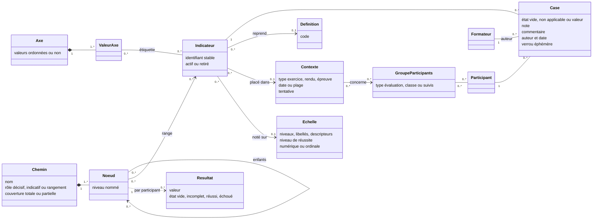
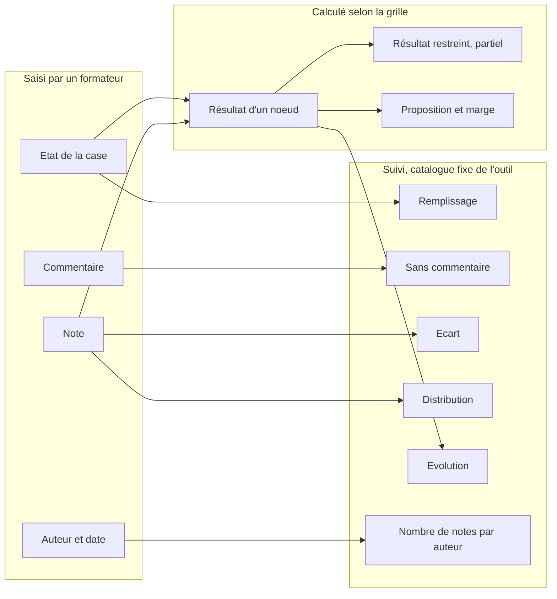
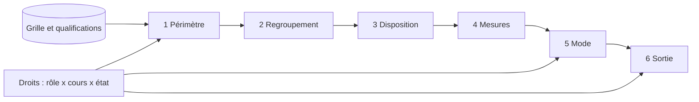
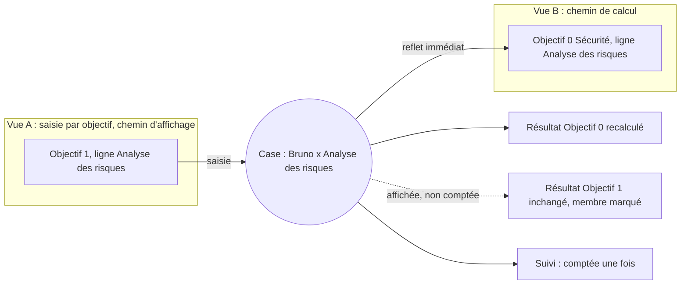
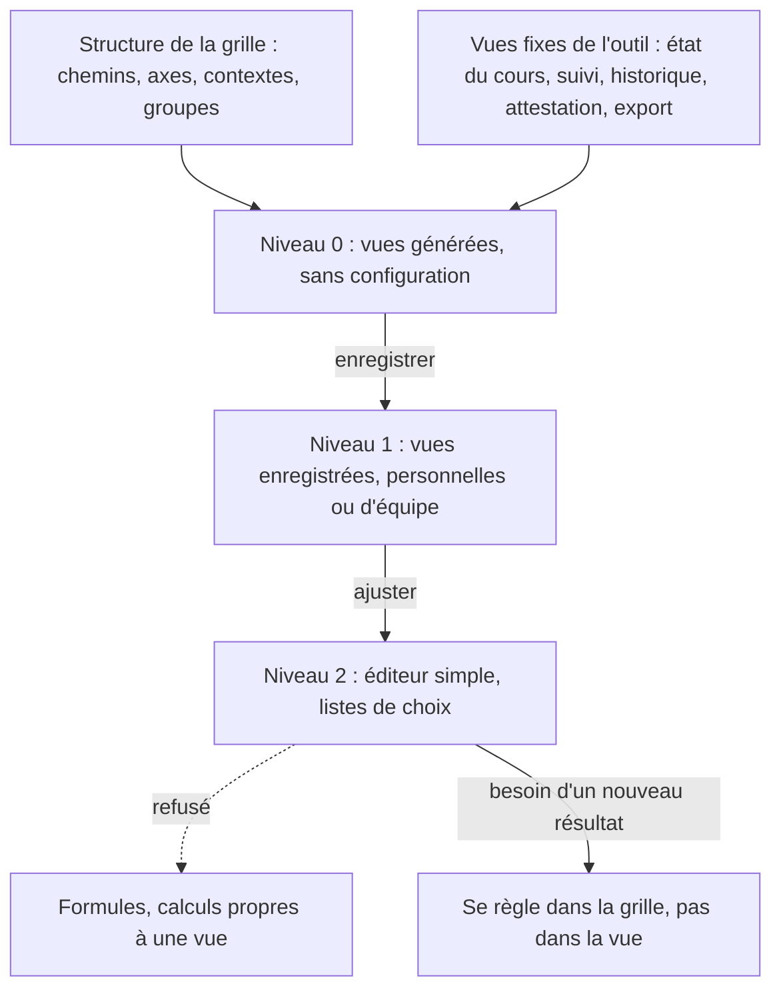

# Projections et vues sur les données d'une qualification

But : décrire de façon générique comment on regarde, saisit, compare et sort les données d'une qualification, quelle que soit la grille, avec un petit nombre de primitives.

> **Cadrage du porteur du projet (2026-10-03).** Les trois Excel décrivent le système **actuel**, pas la cible. Azimut doit être **générique** et couvrir tous les types de qualification. Il faut donc des généralisations pour les calculs, les barèmes, les regroupements, les seuils **et les vues**. Ce document garde les remarques de 07 sur l'utilisabilité (l'effet « programmer un tableur »). Il ne reprend **pas** ses réductions de périmètre : vues fixes seulement, pas d'axes, un seul chemin de calcul.

**Vocabulaire.** Ce document suit les arbitrages du README : la **grille** est la structure d'un cours, la **qualification de [participant]** désigne ses données, le **participant** est l'apprenant de `FEATURES.md`. Sur un indicateur, on parle de **note** et de **commentaire**. « Observation » reste réservé au fait libre. Un terme nouveau : la **case** (voir 1.1).

**Statut.** Tout est **proposé**, sauf ce qui est marqué **constaté** (dans `FEATURES.md`, les Excel ou les analyses 01 à 07).

## TL;DR

- Les données d'une qualification forment un **espace à plusieurs dimensions** : participant, groupe, indicateur, contexte (exercice, rendu, épreuve), chemins de regroupement, axes, temps, auteur et état. L'atome est la **case** : un participant × un indicateur placé dans un contexte.
- Une **vue** se compose de **six primitives** : **périmètre**, **regroupement**, **disposition**, **mesures**, **mode** et **sortie**. Les droits s'appliquent toujours en plus : une vue ne montre jamais plus que ce que le rôle permet.
- Une grille a **plusieurs chemins de regroupement** nommés (arbre principal, thèmes, sécurité, Posture…) et des **axes** plats. Chaque chemin et chaque axe donne des vues sans configuration. Une case affichée sous deux chemins reste **une seule case** : la saisie faite dans l'un se voit dans l'autre, et le suivi la compte une fois.
- **Règle de saisie** : on ne saisit que des cases et des champs de qualification (commentaire de synthèse, rubriques, décision). Une cellule saisissable désigne **exactement une case** : participant et indicateur fixés, contexte visible. Il n'est pas nécessaire de limiter la saisie à un exercice à la fois.
- Une vue **ne crée pas de résultat**. Elle montre les résultats définis par la grille, des **résultats restreints** (la règle d'un nœud appliquée au sous-ensemble d'une cellule, marqués « partiel ») et des **mesures de suivi** prises dans un catalogue fixe (remplissage, sans commentaire, écart, distribution, évolution).
- **Validation** : les 11 exemples de `FEATURES.md`, 10 besoins des parcours de 05 et 12 vues pour d'autres types de qualification (grille critériée, portfolio, rattrapage, jury, calibration, couverture, variantes…) s'expriment tous avec ces six primitives.
- **Contre l'effet tableur**, trois niveaux : des **vues générées** depuis la structure (trois questions : quoi, qui, pour quoi faire ; la disposition est déduite), des **vues enregistrées** et partagées, et un **éditeur simple** par listes de choix. Jamais de formule dans une vue.
- **Exigences pour le modèle** (doc 10) : des identifiants stables partout, des chemins nommés avec un rôle et une couverture, des axes, des contextes datés et liés (tentatives), des **cases attendues** par participant, plusieurs notes par case pour un jury, des échelles qui disent si elles sont numériques, et des résultats par chemin, explicables et applicables à un sous-ensemble.

---

## 1. Ce qu'on projette

### 1.1 La case, atome des données

**Constaté** : chaque Excel a une case par indicateur, dans un classeur par participant. Il n'existe jamais de matrice participants × indicateurs (`FEATURES.md`, « Ce qui est commun »).

**Proposé** : une **case** est l'intersection d'un **participant** et d'un **indicateur placé**. Un indicateur placé est une définition du référentiel placée dans un contexte (règle 2 du doc 02 : le couple définition × exercice est unique). Le critère 2.6.5 de qualif1 placé dans « PdC filmé » et dans « Anim PdC OZR » donne donc deux cases par participant.

Une case porte :

- un **état** : vide, non applicable ou valeur (voir 1.5) ;
- une **note** sur l'échelle de l'indicateur, si l'indicateur a une échelle ;
- un **commentaire** ;
- l'**auteur** et la **date** de la dernière écriture, plus l'historique complet (C7) ;
- un **verrou** éphémère pendant qu'un formateur l'édite (C3).

Option, pour les grilles à plusieurs évaluateurs : **une note par auteur** dans la même case, plus une **note retenue** (voir VX4 et EX12).

D'autres choses se saisissent sans être des cases. On les appelle des **champs de qualification** : le commentaire de synthèse d'un nœud pour un participant (S6), les rubriques libres (commentaire général, 3 points positifs, 3 points à améliorer), l'activation d'un motif éliminatoire et sa justification, le joker, la décision. Les vues les traitent comme des cases attachées à un nœud ou à la qualification entière.

### 1.2 Les dimensions

| Dimension | Valeurs | Forme | Vient de | Constaté |
| --- | --- | --- | --- | --- |
| **Participant** | les personnes évaluées du cours | plate | le cours (MiData) | 10 à 40 par cours |
| **Groupe de participants** | groupe d'évaluation, classe, participants suivis par un référent | plate ; un participant est dans plusieurs groupes de types différents | le cours | A4, A5 ; pas vu dans les Excel |
| **Indicateur placé** | les feuilles notées ou commentées | rangé par les chemins | la grille | 156, 289 et 219 indicateurs |
| **Définition** | le référentiel (objectif 4.1, critère 2.6.5) | plate, avec un code | la grille | qualif1 : 4.1 dans 4 exercices |
| **Contexte** | exercice, rendu, épreuve, entretien, période | ordonnée dans le temps | la grille, daté par le cours | qualif1 : 7 exercices ; qualif3 : livrables cachés dans les libellés |
| **Chemin de regroupement** | des hiérarchies nommées sur les indicateurs | arbre ; plusieurs par grille | la grille | voir 1.3 |
| **Axe** | thème, type de critère, objectif officiel, livrable, méta-axe | plate ; une ou plusieurs valeurs par élément | la grille | qualif3 : objectifs MSdS, méta-axes de la Posture |
| **Temps** | date du contexte, bloc, tentative, date de saisie | ordonnée | le contexte et l'historique | voir 1.4 |
| **Auteur** | le formateur qui a écrit | plate | la saisie | pas vu dans les Excel (constat 12) |
| **État** | de la case, de l'indicateur, de la qualification, du résultat | énumérée | la saisie, la grille, le cycle de vie | voir 1.5 |
| **Variante** | la grille réelle, une variante de calcul | plate | la grille | L4 |
| **Cours** | ce cours ; d'autres cours du même type | plate | MiData | P5 ; sous conditions strictes (AC6) |

Une vue n'utilise pas toujours toutes les dimensions. Une **vue de structure** n'a pas de participant (VP1, VX6). Une vue de suivi entre cours n'a pas de case visible (VP9).

### 1.3 Chemins et axes

**Chemin de regroupement.** Un chemin est une hiérarchie nommée qui range des indicateurs dans des nœuds : sphère → objectif → critère → indicateur, ou exercice → objectif → critère, ou thème → critère. Chaque chemin a :

- un **nom** et des **niveaux nommés** (« sphère », « objectif »…) ;
- un **rôle** : **calcul décisif** (ses résultats peuvent entrer dans la règle de décision), **calcul indicatif** (ses résultats sont affichés mais ne décident rien) ou **rangement** (il ordonne l'affichage et ne calcule rien) ;
- une **couverture** : **totale** (tous les indicateurs y sont) ou **partielle** (une partie seulement) ;
- un **ordre** des enfants dans chaque nœud.

Dans un chemin, un indicateur apparaît **au plus une fois**. Il peut apparaître dans plusieurs chemins.

**Constaté** dans les trois Excel :

| Grille | Chemins | Axes |
| --- | --- | --- |
| qualif1 | **exercices** → objectifs → critères (calcul en %, sans décision) ; **thèmes transversaux** (4 thèmes, couverture partielle, calcul indicatif) ; **objectif à travers les exercices** (moyennes de 4.1 sur 4 exercices et de 2.1 sur 3, indicatif) | code de la définition |
| qualif2 | **affichage** sphère → objectif → critère (les critères de sécurité y sont sous leur objectif) ; **calcul** sphère → objectif, où les critères de sécurité comptent seulement dans l'objectif 0 (07, F5) ; **Posture** (indicatif) | échelle o/k ou 1 à 5, portée par le critère |
| qualif3 | **sphères** → objectifs → critères (décisif) ; **Posture** → méta-axes (indicatif) | livrable (dans les libellés) ; objectif officiel MSdS (table de couverture) |

qualif2 montre le cas le plus instructif : **deux chemins sur les mêmes indicateurs**, l'un pour afficher, l'autre pour compter. qualif1 montre trois chemins, dont deux transversaux.

**Axe.** Un axe est une classification **plate** : un nom et une liste de valeurs, ordonnées ou non. On pose une ou plusieurs valeurs sur un indicateur, un nœud ou une définition. Exemples : thème, type de critère (« savoir-faire », « attitude »), objectif officiel, livrable, sécurité, moment du cours.

**Chemin ou axe ?** Un axe dont les valeurs calculent un résultat équivaut à un chemin d'un seul niveau. Pour les vues, la différence ne compte pas : chemins, axes et autres dimensions (participant, groupe, contexte, auteur, temps) sont tous des **regroupeurs**. Une vue regroupe, filtre ou met en lignes et en colonnes selon n'importe quel regroupeur. La différence compte pour le modèle de calcul (doc 10) : un chemin a des niveaux et des règles d'agrégation, un axe est d'abord une étiquette.

### 1.4 Le temps : trois horloges

| Horloge | Ce qu'elle date | Sert à | Ne sert pas à |
| --- | --- | --- | --- |
| **Temps de l'évaluation** | le contexte : date ou plage d'un exercice, d'un rendu, bloc du programme | l'**évolution** d'un participant d'un rendu à l'autre (projection 4) | savoir quand quelqu'un a saisi |
| **Tentative** | le rang d'un contexte dans une suite liée : première tentative, rattrapage, remédiation | les épreuves avec rattrapage (VX3), la remédiation de qualif2 | l'ordre chronologique seul |
| **Temps de la saisie** | chaque écriture dans une case (historique) | le suivi du travail : ordre de remplissage (P6), « nouveau depuis ma dernière visite », état à une date, correction après clôture | mesurer une **progression** : une correction n'est pas un progrès (doc 02, §8) |

**Règle** : l'évolution d'un participant se lit sur le temps de l'évaluation, jamais sur le temps de la saisie.

### 1.5 Les états

| Porte sur | États | Remarque |
| --- | --- | --- |
| **Case** | **vide** (non observé), **non applicable** (justifié, sort du calcul et du suivi), **valeur** ; en option, **rien à signaler** (README : seulement si une qualification remplie montre le besoin) | Un 0 n'est jamais un vide. Dans qualif1, ils sont indiscernables (07, F1). |
| **Case, éphémère** | **verrouillée par X** | Visible partout où la case s'affiche. |
| **Indicateur ou nœud** | **actif**, **retiré** (doc 02, N-MG5) | Un élément retiré reste visible dans les vues historiques et dans l'historique. |
| **Qualification du participant** | en cours, en finalisation, clôturée, rouverte | Décide si la vue peut être en mode saisie. |
| **Résultat** | **vide**, **incomplet**, **réussi**, **échoué**, ou sans seuil | L'état « incomplet » corrige le bug de qualif3, où un dossier vide affiche « Réussi » (07, F12). |
| **Proposition et décision** | réussi, échoué, incomplet, sans règle ; décision à prendre ou prise | Doc 02, §6.2. |

### 1.6 Les mesures

Une **mesure** est ce qu'on affiche dans une cellule de vue. Elle porte sur une case, ou sur un ensemble de cases (celles qui tombent dans la cellule).

| Mesure | Porte sur | Type | Famille |
| --- | --- | --- | --- |
| Note saisie | une case | valeur de l'échelle | **saisie** |
| Commentaire | une case, un nœud × participant | texte | **saisie** |
| Présence d'un commentaire | une case | oui ou non | saisie |
| État de la case | une case | vide, non applicable, valeur | saisie |
| Auteur, date | une case, une écriture | personne, date | saisie |
| **Résultat** d'un nœud | un nœud d'un chemin × un participant | valeur et état | **grille** |
| **Résultat restreint** | un nœud × un participant, limité aux cases de la cellule | valeur marquée « partiel » | **grille** (règle du nœud) |
| Proposition, marge au seuil | un participant, un nœud qui a un seuil | état, écart | grille |
| **Taux de remplissage** | un ensemble de cases | proportion | **suivi** |
| Nombre de vides, de non applicables | un ensemble de cases | nombre | suivi |
| Nombre de cases sans commentaire | un ensemble de cases | nombre | suivi |
| **Écart** | deux valeurs ou plus (auteurs, participant et groupe, variantes, dates) | différence, en crans ou en points | suivi |
| **Évolution** | une suite de contextes ordonnés | suite de valeurs, tendance | suivi |
| **Distribution** | les notes d'un ensemble de cases | répartition par niveau | suivi |
| Statistiques descriptives | les notes d'un ensemble de cases | moyenne brute, médiane, écart type | suivi (échelles numériques seulement) |
| Nombre de notes, d'auteurs | un ensemble de cases | nombre | suivi |

Les trois familles :

- **Saisie** : ce qu'un formateur écrit. Rien n'est calculé.
- **Grille** : ce que les règles de la grille calculent (doc 02 et doc 10). Ces nombres peuvent finir dans l'attestation.
- **Suivi** : ce que l'outil calcule **à travers** les participants ou **sur le travail** de l'équipe. Ce catalogue est fixe et le même pour toutes les grilles. Il ne finit jamais dans l'attestation.



*L'espace des données vu par les vues. Ce n'est pas le modèle de calcul : le doc 10 en décide.*



*Trois familles de mesures. Seule la famille « grille » peut entrer dans l'attestation.*

---

## 2. Ce qu'est une vue

### 2.1 Définition

Une **vue** est une composition de six primitives, appliquée aux données de la grille et des qualifications :

1. **Périmètre** : quelles cases on prend.
2. **Regroupement** : comment on les range.
3. **Disposition** : comment on les place à l'écran ou sur la page.
4. **Mesures** : ce qu'on affiche dans chaque cellule.
5. **Mode** : ce qu'on peut faire (saisir, lire, comparer, présenter).
6. **Sortie** : où ça va (écran, projection, impression, PDF, export).

Les **droits** (rôle × cours × état de la qualification) ne sont pas une primitive. Ils s'appliquent toujours, au périmètre et au mode.



*Une vue est une lentille. Les droits limitent ce qu'elle prend, ce qu'elle permet et où elle peut sortir.*

### 2.2 Périmètre

**Options :**

| Sur | Choix |
| --- | --- |
| Participants | tous ; un ou plusieurs groupes ; mes participants suivis ; un participant ; une **liste dynamique** définie par une mesure (incomplets, sous le seuil, avec drapeau, éliminatoire actif) |
| Éléments | tout ; un chemin entier ; un nœud et ses descendants ; une valeur d'axe ; une définition à travers ses contextes (« le 4.1 partout ») ; une liste choisie |
| Contexte | un ; plusieurs ; tous ; une tentative |
| Période | toute ; un intervalle du temps de l'évaluation ; **état à la date de** (via l'historique) ; un instantané nommé (bilan intermédiaire) |
| États | inclure ou non les non applicables, les éléments retirés |
| Variante | la grille réelle ; une variante de calcul |

**Règles :**

- **PE1** — Le périmètre est l'intersection de tous les choix et des droits du lecteur.
- **PE2** — La vue **dit son périmètre en clair**, en tête : « Randonnée · groupe Castor · 5 participants · 23 indicateurs ».
- **PE3** — **Rien ne disparaît en silence.** Si un regroupement à couverture partielle laisse des cases de côté, la vue l'indique (« 12 indicateurs hors de ce chemin ») et propose de les voir.
- **PE4** — Le périmètre ne prend que les **cases attendues** : une case d'un exercice de groupe n'existe que pour les participants de ce groupe ; une case de rattrapage n'existe que pour ceux qui y sont convoqués (EX6).
- **PE5** — Une liste dynamique est **stable pendant la saisie**. Si le filtre est « cases vides », la case qu'on vient de remplir ne disparaît pas sous le curseur. La liste se met à jour quand on le demande ou quand on change de page.
- **PE6** — « État à la date de » est toujours en **lecture**. On ne saisit pas dans le passé.

### 2.3 Regroupement

**Options :** par un **chemin** (jusqu'au niveau choisi), par un **axe**, par **contexte**, par **participant**, par **groupe**, par **auteur**, par **temps** (date, bloc, tentative), ou **aucun** (liste plate). On peut emboîter **deux regroupeurs au plus** de chaque côté (lignes ou colonnes). Au-delà, la vue devient illisible : c'est le début de l'effet tableur.

**Règles :**

- **RG1** — Un chemin à couverture partielle produit un groupe « **hors de ce chemin** », replié par défaut (PE3).
- **RG2** — Un axe à plusieurs valeurs par élément place l'élément **dans chaque groupe** qui le concerne. Chaque apparition est un **reflet** de la même case (voir 2.8).
- **RG3** — L'en-tête d'un groupe affiche le **résultat du nœud** seulement si ce chemin calcule à ce niveau. Un chemin de rangement n'affiche que des mesures de suivi (remplissage, sans commentaire).
- **RG4** — L'ordre suit l'ordre du chemin, l'ordre déclaré de l'axe (ou l'ordre alphabétique s'il n'en a pas), et l'ordre chronologique pour les contextes et les tentatives.
- **RG5** — Le regroupement ne change **aucun résultat**. Regrouper par thème ne recalcule pas l'objectif : il le range ailleurs.

### 2.4 Disposition

| Disposition | Description | Usage typique |
| --- | --- | --- |
| **Tableau** | un regroupeur en lignes, un en colonnes ; la cellule est leur intersection | indicateurs × participants, participants × sphères, thèmes × rendus |
| **Fiche** | une entité à la fois (un participant, un indicateur, un groupe), avec suivant et précédent et une liste latérale | rendu individuel avec des flèches, mode réunion, saisie sur téléphone |
| **Liste** | une ligne par entité, des mesures en colonnes, triable | cas à discuter, historique, couverture |
| **Cartes** | une tuile par participant ou par groupe, avec quelques mesures | accueil, état du cours au mur |
| **Rubrique** | indicateurs en lignes, **niveaux de l'échelle** en colonnes, avec leurs descripteurs | grille critériée par niveaux (VX1) |
| **Graphique** | distribution, évolution, carte de chaleur | statistiques de suivi |
| **Document** | mise en page linéaire, paginée, qui suit un chemin | attestation, fiche de retour, grille vierge |

**Règles :**

- **DI1** — Passer de **tableau** à **fiche** sur le même périmètre est une **bascule**, pas une autre vue. C'est le choix de la projection 3 (« un à la fois avec des flèches, ou tous avec un défilement »).
- **DI2** — Les en-têtes de lignes et de colonnes restent visibles quand on fait défiler.
- **DI3** — En **rubrique**, l'échelle de l'indicateur est un regroupeur de colonnes. Tous les indicateurs d'une rubrique doivent donc partager une même échelle, sinon la vue bascule en tableau.
- **DI4** — Une disposition **graphique** n'est jamais en mode saisie.
- **DI5** — Un **document** doit tenir sur des pages : une fiche par participant devient une page par participant ; un tableau trop large se coupe en blocs de colonnes, avec les en-têtes répétés.
- **DI6** — Aucune information ne passe par la couleur seule. Chaque couleur a aussi un symbole ou un texte (07, A12 : qualif3 est pensé comme une « échelle de couleur »).

### 2.5 Mesures affichées

**Options :** une **mesure principale** par cellule, prise dans le tableau de 1.6, plus des **marqueurs** discrets : commentaire présent, non applicable, verrou, reflet, drapeau, initiales de l'auteur, valeur héritée d'une note de groupe.

**Règles :**

- **ME1** — Une mesure doit avoir un sens pour l'échelle. Moyenne brute et écart type sont permis seulement sur une échelle **numérique**. Sur une échelle **ordinale** (++/+/-/--), on montre une distribution, une médiane, la part au niveau de réussite ou plus, ou un écart **en crans** (07, §3.3).
- **ME2** — Tout résultat affiché porte son **statut** (décisif ou indicatif) et son **état** (incomplet, réussi, échoué). Un résultat indicatif a un marquage visible et constant.
- **ME3** — Tout nombre de la famille « grille » est **explicable** : un clic montre la chaîne de calcul (X10).
- **ME4** — Les mesures de suivi comptent des **cases distinctes**, jamais des apparitions (voir 2.8).
- **ME5** — **Résultat restreint.** Quand une cellule ne contient qu'une partie des membres d'un nœud (thème × rendu, par exemple), la vue peut appliquer **la règle du nœud** aux seuls membres de la cellule. La valeur est marquée « **partiel** », elle n'entre jamais dans la règle de décision et elle est explicable. La vue n'invente pas de règle : elle emprunte celle du nœud. Si la règle n'a pas de sens sur un sous-ensemble (« 3 sphères réussies sur 3 »), la cellule reste vide (EX10).
- **ME6** — Une vue ne crée **aucun résultat nouveau**. Si une équipe veut une « moyenne par type de critère » qui compte, elle la déclare dans la grille, comme résultat indicatif d'un axe. La vue peut seulement montrer une statistique descriptive (moyenne brute), étiquetée « statistique » et jamais imprimée dans l'attestation.

### 2.6 Mode

| Mode | Ce qu'on peut faire | Exemple |
| --- | --- | --- |
| **Saisie** | écrire dans les cases et les champs de qualification du périmètre | évaluer une randonnée |
| **Lecture** | voir, ouvrir l'explication, ouvrir l'historique | préparer un retour |
| **Comparaison** | voir deux sources côte à côte, avec leur écart : deux auteurs, deux variantes, deux dates, un participant et son groupe | jury, variantes, avant et après une correction |
| **Réunion** | une personne tient la plume, les autres suivent sa navigation ; affichage lisible de loin | dernier soir |

**Règles :**

- **MO1** — On ne saisit **que** des cases et des champs de qualification. Résultats, résultats restreints et mesures de suivi sont toujours en lecture, quel que soit le mode.
- **MO2** — En saisie, chaque cellule saisissable désigne **exactement une case** : le participant et l'indicateur placé sont fixés, par la ligne, la colonne, le périmètre ou la fiche. Une cellule qui agrège plusieurs cases est en lecture.
- **MO3** — **Le contexte d'une case saisissable est toujours visible ou fixé.** C'est la seule contrainte sur les exercices. Une vue de saisie peut montrer plusieurs exercices à la fois (le portfolio VX2, le « 4.1 partout ») pourvu que chaque ligne dise à quel exercice elle appartient. **Proposé** : les vues générées de saisie fixent un seul contexte par défaut, parce que c'est le cas le plus courant (on évalue une activité).
- **MO4** — Le mode saisie se **dégrade** en lecture, cellule par cellule, là où les droits ou l'état ne permettent pas d'écrire (qualification clôturée, rôle sans droit de saisie, participant exclu pour conflit d'intérêts). La vue le signale.
- **MO5** — En **comparaison**, les deux sources sont en lecture. Seule exception : la **note retenue** d'un jury, qui est une saisie (VX4).
- **MO6** — En **réunion**, une seule personne écrit à la fois ; les autres voient la même fiche. La plume se passe explicitement. Cela répond à la friction « tout le monde tape en même temps » du parcours 4.4 de 05.

### 2.7 Sortie

| Sortie | Ce qu'elle produit | Règle |
| --- | --- | --- |
| **Écran** | la vue vivante, mise à jour en temps réel (C2) | — |
| **Projection** | la même vue en grand pour une salle | **SO1** : le mode discret (X27) masque en un geste les noms et les notes |
| **Impression** | la vue en document, avec un en-tête : qui, quand, périmètre, « données au … » | **SO2** : variante **vierge**, avec les valeurs masquées, pour noter au stylo (X29) |
| **PDF** | un document figé | **SO3** : l'**attestation** est une sortie prédéfinie. La grille décide de son contenu, il n'y a pas de colonnes techniques, et elle est figée à la clôture (L6, L7). |
| **Export** | les données du périmètre dans un format ouvert | **SO4** : jamais plus que périmètre ∩ droits ; l'export est un droit à part, tracé (05, M6) |

**SO5** — Une impression ou un PDF garde les marquages : « indicatif », « partiel », « incomplet ». Un chiffre imprimé ne perd jamais son statut.

### 2.8 Chemins multiples : une case, plusieurs places

**Constaté** : dans qualif2, « Analyse des risques » s'affiche sous l'objectif 1 et compte dans l'objectif 0 (07, F5). Dans qualif1, un critère compte dans son exercice et apparaît dans un thème. Les auteurs des Excel **affichent à un endroit et comptent ailleurs**.

**Proposé** : une case qui apparaît à plusieurs places reste **une seule case**. Les règles :

- **MC1** — **Identité.** Toutes les apparitions d'une case sont des **reflets**. Une saisie dans l'une se voit immédiatement dans les autres, comme une saisie d'un collègue (C2).
- **MC2** — **Marqueur.** Une case qui a un autre reflet **dans la même vue** porte un marqueur « aussi sous [nœud] ». Survoler ou sélectionner l'une met l'autre en évidence.
- **MC3** — **Verrou et historique.** Le verrou et l'historique appartiennent à la case. Un verrou posé depuis une vue se voit dans toutes les autres.
- **MC4** — **Suivi.** Le remplissage, les vides et les cases sans commentaire comptent des cases distinctes (ME4). Un indicateur rangé sous deux thèmes ne compte pas double dans le remplissage du cours. Il compte une fois dans chaque thème si l'on regarde les thèmes séparément.
- **MC5** — **Affiché mais non compté.** Sous un nœud qui affiche un résultat, chaque membre affiché qui ne compte **pas** dans ce résultat porte un marqueur (« compte dans : Objectif 0 Sécurité »). Le résultat de l'objectif 1 de qualif2 ne contient pas les critères de sécurité affichés sous lui, et la vue le dit.
- **MC6** — **Recalcul.** Une saisie recalcule les résultats de **tous** les chemins qui comptent cette case, dans toutes les vues ouvertes.
- **MC7** — **Ordre de saisie.** L'ordre d'une vue de saisie est celui du chemin qui la regroupe. Changer de chemin change l'ordre, jamais les données.



*qualif2, Sport de camp : la même case vue sous deux chemins.*

---

## 3. Validation

Légende des colonnes : **Pér.** périmètre, **Reg.** regroupement, **Disp.** disposition, **Mes.** mesures. « Chemin principal » désigne le chemin décisif de la grille (sphères ou exercices).

### 3.1 Les exemples de `FEATURES.md`

| # | Vue | Périmètre | Regroupement | Disposition | Mesures | Mode | Sortie |
| --- | --- | --- | --- | --- | --- | --- | --- |
| VF1 | Saisie par participant (C1) | un participant ; tous les éléments ; tous les contextes | chemin principal | fiche, navigation entre participants | note, commentaire ; résultats des nœuds en en-tête | saisie | écran |
| VF2 | Saisie par sphère (C1) | tous les participants ; un nœud de premier niveau | chemin principal sous ce nœud | tableau : indicateurs en lignes, participants en colonnes ; bascule en fiche | note, marqueur de commentaire ; résultat du nœud par participant | saisie | écran |
| VF3 | Saisie par sphère et groupe (C1) | comme VF2, limité à un groupe | idem | idem | idem | saisie | écran |
| VF4 | Évaluer un exercice de groupe (projection 1) | un contexte (randonnée) ; le groupe évalué ; cases attendues | chemin principal restreint au contexte | tableau indicateurs × participants | note, commentaire, verrou | saisie | écran ; impression vierge |
| VF5 | Préparer un retour sur un thème (projection 2) | un participant suivi ; une valeur d'axe ou un nœud du chemin « thèmes » ; tous les contextes | par contexte, dans l'ordre chronologique | liste ou document | note, commentaire avec auteur et date ; résultat du thème (indicatif) ; évolution | lecture | écran ; impression (fiche de retour interne) |
| VF6 | Activité rendue individuellement (projection 3) | un contexte (rendu) ; tous les participants | chemin principal restreint au contexte | tableau indicateurs × participants, ou fiche avec flèches (DI1) | note, commentaire | saisie | écran |
| VF7 | Réussite : moyenne par sphère et notes des objectifs (projection 4) | un participant | chemin principal, deux niveaux | liste | résultat de la sphère, résultats des objectifs, seuil, proposition | lecture | écran ; PDF |
| VF8 | Réussite : rendus × thèmes (projection 4) | un participant ; chemin « thèmes » | thèmes en lignes, contextes en colonnes (chronologique) | tableau | **résultat restreint** par cellule ; résultat du thème en fin de ligne | lecture | écran |
| VF9 | Réussite : seuil par thème et moyennes par type de critère (projection 4) | un participant | bloc 1 : chemin « thèmes » (décisif) ; bloc 2 : axe « type de critère » (indicatif) | liste en deux blocs | résultat, seuil, état, marge ; résultats indicatifs de l'axe | lecture | écran ; PDF |
| VF10 | État de tout le cours (projection 5) | tous les participants ; tous les éléments | participants en lignes, nœuds de premier niveau en colonnes ; ligne de total par groupe | tableau (carte de chaleur) ou cartes | au choix : remplissage, résultat, sans commentaire, proposition | lecture | écran ; projection |
| VF11 | Statistiques de suivi : non remplis, sans commentaire, par participant | tous les participants | par participant ; au choix par nœud ou par auteur | liste triable ; graphique | nombre de vides, sans commentaire, écart type (échelle numérique), évolution sur les contextes | lecture | écran ; export |

**À noter.** VF9 suppose un chemin transversal **décisif** (les thèmes servent de seuil de réussite). C'est exactement ce que la réduction de 07 (« étiquettes jamais décisives ») interdirait. VF8 a besoin du résultat restreint (ME5) : sans lui, la matrice thèmes × rendus ne peut pas se remplir.

### 3.2 Les besoins des parcours de 05

| # | Parcours (05) | Périmètre | Regroupement | Disposition | Mesures | Mode | Sortie |
| --- | --- | --- | --- | --- | --- | --- | --- |
| VP1 | Concevoir à partir de l'an dernier (4.1) | la grille, **sans participant** ; et la grille de l'an dernier | chemin au choix | liste en arbre | échelle, poids, seuil, membres comptés, étiquettes ; différences entre les deux grilles | comparaison | écran ; impression pour relecture |
| VP2 | Tester la grille avec des notes fictives (4.1, M1) | un participant fictif (cours d'essai, X8) | chemin principal | fiche | note ; résultats, proposition, explication | saisie | écran |
| VP3 | Randonnée sur le terrain (4.2) | un contexte ; mon groupe | chemin principal restreint | fiche par participant, grosses cibles | note, marqueur de commentaire | saisie | écran de téléphone ; impression vierge |
| VP4 | Le soir : voir ce que les collègues ont saisi et ce qui manque (4.2) | mes groupes ; période « depuis ma dernière visite » (temps de saisie) | par participant puis auteur | liste | nouvelles valeurs, auteur, date ; vides restants | lecture | écran |
| VP5 | Préparer l'entretien de retour (4.3) | mes participants suivis, puis un participant ; une valeur d'axe | par contexte | document | notes et commentaires avec auteurs ; évolution ; vides et sans commentaire ; écart entre auteurs si la case a plusieurs notes | lecture | impression (fiche de retour, distincte de l'attestation) |
| VP6 | Dernier soir : cas à discuter (4.4) | tous les participants ; liste dynamique : incomplets, marge faible (X12), drapeau, éliminatoire actif | aucun | liste triée par marge | proposition, marge, nombre de vides, décision | lecture | écran ; projection |
| VP7 | Dernier soir : passer un participant à la fois, puis relire (4.4) | un participant à la fois | chemin principal, puis champs de qualification | fiche | résultats, commentaires de synthèse, éliminatoires, joker, proposition, décision ; statut « relu » | réunion (une plume) | projection, puis PDF |
| VP8 | Corriger après la clôture (4.5) | un participant ; toute la période | par temps de saisie | liste chronologique | valeur avant et après, auteur, date, motif | lecture ; comparaison avant et après | écran ; PDF corrigé numéroté |
| VP9 | Un canton compare les taux de réussite (4.6) | plusieurs cours d'un même type ; agrégats anonymisés ; effectif minimal | par cours | tableau ; graphique | taux de réussite, effectif, différences de règle entre grilles | lecture | écran ; export agrégé |
| VP10 | Accueil personnalisé (P7) et écran « prêt à démarrer » (M2) | le cours actuel ; mes groupes ; mes suivis | par groupe | cartes | remplissage, cas à discuter ; état de la mise en place | lecture | écran |

VP9 reste soumis aux réserves de 07 (aucun demandeur identifié, risque nLPD). Il s'exprime quand même avec les mêmes primitives, à condition de respecter AC6.

### 3.3 Vues pour d'autres types de qualification

Ces vues ne viennent pas des trois Excel. Elles testent la généricité.

| # | Vue | Périmètre | Regroupement | Disposition | Mesures | Mode | Sortie |
| --- | --- | --- | --- | --- | --- | --- | --- |
| VX1 | **Grille critériée par niveaux** (rubrique) | un participant ; un contexte | critères en lignes, niveaux de l'échelle en colonnes | rubrique | descripteur choisi, commentaire | saisie (clic sur un descripteur) | écran ; impression |
| VX2 | **Portfolio dans le temps** | un participant ; tous les contextes | compétences (chemin) en lignes, contextes chronologiques en colonnes | tableau ; graphique d'évolution | note ou résultat restreint ; dernier niveau atteint ; évolution | saisie (dernière colonne) ou lecture | écran ; PDF |
| VX3 | **Épreuves avec rattrapage** | tous les participants ; les épreuves et leurs tentatives | participants en lignes ; épreuves × tentatives en colonnes | tableau | résultat par tentative ; résultat retenu (selon la grille) ; « à convoquer » | lecture ; saisie sur la tentative ouverte | écran ; liste des convoqués imprimée |
| VX4 | **Jury à plusieurs évaluateurs, avec écarts** | un rendu ; un participant (fiche) ou tous | indicateurs en lignes ; auteurs en colonnes | tableau | note de chaque auteur, écart en crans, note retenue | comparaison, avec saisie de la note retenue (MO5) | écran ; procès-verbal PDF |
| VX5 | **Calibration entre formateurs** | le cours, ou un participant fictif en atelier (X38) | par auteur ; au choix par indicateur | graphique (distribution par auteur) ; tableau auteurs × indicateurs | distribution, médiane, écart à l'équipe, effectif | lecture | écran (direction, AC5) |
| VX6 | **Couverture des objectifs officiels** | la grille, sans participant ; puis le cours | objectifs officiels (axe) en lignes, contextes en colonnes | tableau | nombre d'indicateurs rattachés ; avec données : remplissage par objectif officiel | lecture | écran ; impression pour l'autorité de formation |
| VX7 | **Comparaison de deux variantes de calcul** | tous les participants ; grille réelle et variante | participants en lignes | liste | proposition A, proposition B, écart ; filtre « change de décision » | comparaison | écran |
| VX8 | **Couverture d'observation** (qui a noté qui, X35) | tous les participants ; période | participants en lignes, formateurs en colonnes | tableau (carte de chaleur) | nombre de notes saisies par auteur ; alerte « vu par un seul formateur » | lecture | écran (direction) |
| VX9 | **Liste de contrôle de groupe avant le départ** (o/k, sécurité) | un contexte ; un groupe ; une **note de groupe** si la grille en a | indicateurs en lignes | fiche du groupe | o ou k, héritage aux membres, dérogation individuelle | saisie | téléphone ; impression vierge |
| VX10 | **Alerte précoce et marge de décision** (X39, X12) | tous les participants ; liste dynamique « sous le seuil ou à un cran du seuil » | par nœud décisif | liste | résultat, seuil, marge, nombre de cases encore vides | lecture | écran ; bilan intermédiaire imprimé (instantané) |
| VX11 | **Bilan qualité de la grille après le cours** (X64) | un cours clôturé ; tous les participants | chemin principal | liste en arbre | par indicateur : remplissage, distribution (uniforme ?), part sans commentaire | lecture | écran (concepteur) ; export |
| VX12 | **Qualification par compétences sans calcul** (commentaires seulement) | un participant ; tous les contextes | compétences (chemin de rangement) | document | commentaires datés et attribués ; nombre de commentaires par compétence | lecture ; saisie | écran ; PDF |

### 3.4 Maquettes

Les maquettes montrent la disposition et les marqueurs, pas un design.

**VF4 — Évaluer un exercice de groupe (saisie, tableau)**

```text
Saisir · Randonnée (mardi 14) · Groupe Castor · 5 participants · 23 indicateurs
Chemin : principal v    Mesure : note v    [ Tableau | Fiche ]
------------------------------------------------------------------------------
                                     Alice   Bruno   Chloé   David   Emma
Obj. 2 Conduire un groupe            3,5     2,8     -       3,0     4,0
  Crit. 2.1 Itinéraire
    2.1.1 Respecte l'horaire          4 *     3       n/a     3       4
    2.1.2 Adapte le rythme            3       2 *     n/a     .       [Bruno]
  Crit. 2.3 Sécurité  (aussi sous : Objectif 0 Sécurité)
    2.3.1 Fait l'appel aux pauses     o       o       n/a     o       .
------------------------------------------------------------------------------
Remplies 13/15 attendues · sans commentaire 11 · 3 non applicables (Chloé, malade)
*  commentaire présent    .  vide    n/a  non applicable    [Bruno]  verrou
```

**VF8 — Rendus × thèmes pour un participant (lecture, résultats restreints)**

```text
Alice · Thèmes × rendus                                              Lecture
                            Concept   PdC filmé   Anim OZR   Rapport   Thème
                            (12.04)   (19.04)     (03.05)    (17.05)   (indicatif)
Conception pédagogique      55 % p    70 % p      .          80 % p    68 %
Animation et transmission   .         60 % p      75 % p     .         67 %
Organisation                40 % p    .           65 % p     70 % p    58 %
p  résultat partiel : règle du thème appliquée aux seuls critères de ce rendu
.  ce thème n'a aucun critère dans ce rendu
```

**VX4 — Jury à trois évaluateurs (comparaison)**

```text
Mémoire de fin · Bruno · 3 évaluateurs                             Comparaison
                           Anne   Marc   Zoé    Écart   Note retenue
Problématique claire       4      4      3      1       4
Méthode adaptée            2      4      3      2 !     [ à fixer ]
Sources citées             3      3      3      0       3
Écart : note la plus haute moins la plus basse, en crans.  ! = 2 crans ou plus
Seule la colonne « Note retenue » se saisit.
```

**VF10 — État du cours (lecture, projection)**

```text
État du cours · 24 participants · jeudi 21:40                 Lecture · Projection
Mesure : remplissage v   (autres : résultat, sans commentaire, proposition)
                 Sport camp   Activité   Trekking   Urgence   Proposition
Alice            100 %        90 %       85 %       100 %     réussi
Bruno             60 %        40 %       20 %        75 %     incomplet
Chloé            100 %       100 %       95 %       100 %     échoué (Trekking 2)
...
Groupe Castor     82 %        71 %       58 %        90 %
Cours             88 %        80 %       66 %        93 %
Clic sur une cellule : la saisie de ce nœud pour ce participant (VF1).
```

**VX1 — Grille critériée par niveaux (saisie, rubrique)**

```text
Présentation orale · Emma                                                Saisie
                  1 Insuffisant     2 En progrès        3 Atteint            4 Excellent
Structure         Pas de plan       Plan peu suivi     [Plan clair, suivi]   Plan au service du propos
Voix, posture     Inaudible         Audible par moments Audible, regard       [Captive le public]
Supports          Absents           Illisibles          Lisibles, utiles      Lisibles et intégrés
Clic sur un descripteur = la note. Le descripteur choisi est entre crochets.
```

### 3.5 Ce que la validation apprend

Exprimer ces 33 vues a fait apparaître des besoins qui ne viennent pas des trois Excel :

1. **Les cases attendues** (PE4). Sans elles, le remplissage d'un exercice de groupe ou d'un rattrapage est faux.
2. **Le résultat restreint** (ME5). Sans lui, VF8 et VX2 sont impossibles.
3. **Plusieurs notes par case** (VX4, VX5, VP5). C'est une option du modèle, pas un réglage de vue.
4. **Les vues sans participant** (VP1, VX6). La structure se projette aussi.
5. **La note de groupe** (VX9, 07 §3.3). Les vues doivent montrer d'où vient une valeur : propre ou héritée.
6. **Le temps de saisie comme périmètre** (VP4, VP8) et l'**état à une date** (instantané d'un bilan, 07 §3.3).
7. **Le mode réunion** (VP7). C'est une règle sur qui écrit, pas une nouvelle disposition.

---

## 4. Statistiques et suivi comme vues

### 4.1 Mesure ou vue ?

- Une **mesure** est une fonction : elle prend un ensemble de cases et rend une valeur. « Taux de remplissage » est une mesure.
- Une **vue de suivi** est une vue ordinaire dont les cellules affichent des mesures de suivi. « Remplissage par participant et par sphère » est une vue : périmètre = le cours, regroupement = participants × sphères, disposition = tableau, mesure = remplissage.

Il n'existe donc pas de module de statistiques à part. Chaque statistique se décrit avec les six primitives. Le seul objet propre au suivi est le **catalogue de mesures**, fixe et commun à toutes les grilles.

### 4.2 Catalogue des mesures de suivi

| Mesure | Définition précise | Échelles | Remarque |
| --- | --- | --- | --- |
| **Remplissage** | cases avec une valeur ÷ cases attendues ; les non applicables sortent du numérateur et du dénominateur | toutes | **Constaté** : qualif2 le calcule par objectif, qualif3 compte les vides |
| **Vides** | nombre de cases attendues encore vides | toutes | — |
| **Sans commentaire** | nombre de cases avec une valeur et sans commentaire | toutes | Ambigu tant que « rien à signaler » n'existe pas (constat 8) |
| **Écart entre auteurs** | pour une case à plusieurs notes : la plus haute moins la plus basse | crans sur toutes ; points sur une échelle numérique | — |
| **Disparité entre participants** | distribution des résultats d'un nœud sur les participants ; repère des valeurs extrêmes | numérique : écart type ; ordinale : répartition | — |
| **Disparité entre groupes ou entre auteurs** | distribution des notes par groupe ou par auteur, comparée à celle du cours | idem | Effectif affiché, règle ST1 |
| **Évolution** | suite des résultats (ou résultats restreints) sur des contextes ordonnés par le temps de l'évaluation | toutes | Jamais sur le temps de saisie (1.4) |
| **Distribution d'un indicateur** | répartition des notes d'un indicateur sur les participants | toutes | Un indicateur uniforme ne discrimine pas (VX11) |
| **Couverture d'observation** | nombre de cases écrites par chaque auteur pour chaque participant | — | Mesure sur les formateurs (AC5) |
| **Marge** | distance entre un résultat et son seuil, en unités de l'échelle | numérique ; en crans sinon | X12 |
| **Écart dû à l'arrondi** | résultat brut moins résultat arrondi | numérique | **Constaté** : colonne technique de qualif3 |

### 4.3 Vues de suivi types

| Vue | Périmètre | Regroupement | Disposition | Mesure |
| --- | --- | --- | --- | --- |
| Remplissage | le cours | participants × nœuds de premier niveau | tableau (carte de chaleur) | remplissage |
| Commentaires manquants | le cours ou un groupe | par participant, puis par nœud | liste | sans commentaire |
| Disparités entre participants | le cours | participants × nœuds décisifs | graphique ; tableau | résultat, distribution |
| Disparités entre groupes | le cours | groupes × nœuds | tableau | distribution, écart au cours |
| Disparités entre évaluateurs | le cours | auteurs × nœuds | graphique | distribution par auteur |
| Évolution d'un participant | un participant | contextes chronologiques × nœuds | graphique ; tableau | évolution |
| Distribution d'un indicateur | le cours ; un indicateur ou un nœud | niveaux de l'échelle | graphique | distribution |

### 4.4 Règles

- **ST1** — Une comparaison entre groupes ou entre auteurs affiche toujours l'**effectif**. Sous un effectif minimal (à fixer, par exemple 5 notes), la vue montre les valeurs sans conclure à une disparité.
- **ST2** — Sur une échelle ordinale, pas de moyenne ni d'écart type (ME1).
- **ST3** — Les non applicables sortent de toutes les mesures. Les vides comptent dans le remplissage et nulle part ailleurs.
- **ST4** — Une mesure de suivi n'apparaît **jamais** dans l'attestation (SO3).
- **ST5** — Les mesures **sur les auteurs** (disparités, calibration, couverture d'observation) jugent des formateurs. Elles suivent la règle d'accès AC5.

---

## 5. Qui compose les vues

### 5.1 Une gradation en trois niveaux

L'objectif est double : toute grille doit avoir ses vues sans travail, et personne ne doit « programmer un tableur » pour regarder ses données.



### 5.2 Niveau 0 : vues générées

**Règles de génération.** Dès qu'une grille existe, chaque élément de sa structure donne des vues, sans réglage :

| À partir de | Vues générées |
| --- | --- |
| chaque **chemin** | la fiche d'un participant selon ce chemin ; chaque nœud de premier niveau pour tous les participants ; les résultats de ce chemin pour tout le cours |
| chaque **axe** | une valeur pour un participant (préparer un retour) ; l'axe × les contextes pour un participant (évolution) ; un filtre par valeur dans toute vue |
| chaque **contexte** | la saisie de ce contexte pour les participants concernés, par groupe |
| chaque **groupe** | la restriction de toutes les vues ci-dessus |
| l'outil, toujours | état du cours, remplissage, cas à discuter, historique d'une case, attestation, export |

**Trois questions plutôt qu'un menu.** Les vues générées ne forment pas une liste. On y arrive en répondant à trois questions, ou en cliquant sur un en-tête :

1. **Quoi ?** Un nœud d'un chemin, un contexte, une valeur d'axe, ou tout.
2. **Qui ?** Un participant, un groupe, mes suivis, ou tous.
3. **Pour quoi faire ?** Saisir, relire, suivre, comparer, présenter, imprimer.

**La disposition est déduite**, jamais demandée :

| Quoi | Qui | Pour quoi | Disposition déduite |
| --- | --- | --- | --- |
| un nœud ou un contexte | un participant | saisir | fiche ; indicateurs en lignes ; flèches vers le participant suivant |
| un nœud ou un contexte | plusieurs | saisir | tableau indicateurs × participants ; fiche si les colonnes ne tiennent pas (téléphone) |
| tout | un | relire | document qui suit le chemin principal |
| tout | plusieurs | suivre | tableau participants × nœuds de premier niveau ; mesure : remplissage |
| une valeur d'axe | un | relire | liste par contexte, dans l'ordre chronologique |
| un axe entier | un | suivre | tableau valeurs × contextes ; résultats restreints |
| un nœud | plusieurs | comparer | tableau avec deux sources (auteurs, variantes ou dates) |
| tout | un à la fois | présenter | fiche en mode réunion |
| au choix | au choix | imprimer | document paginé par participant |

**Pivoter par un clic.** Dans une vue, cliquer sur un en-tête change le point de départ. Depuis la fiche d'Alice, un clic sur le thème « Organisation » ouvre « Organisation pour tous les participants ». Depuis l'état du cours, un clic sur une cellule ouvre la saisie de ce nœud pour ce participant. On navigue dans l'espace des données sans jamais configurer.

### 5.3 Niveau 1 : vues enregistrées

- Toute vue atteinte peut être **enregistrée** sous un nom : pour soi (**personnelle**) ou pour l'équipe (**d'équipe**).
- La direction peut marquer des vues d'équipe comme **recommandées pour un moment** (« Dernier soir », « Bilan intermédiaire »). L'accueil (P7) les met en avant au bon moment.
- Une vue enregistrée référence les éléments par leurs **identifiants stables**. Si un élément est retiré, la vue reste valable et signale ce qui manque.
- Une vue d'équipe peut devenir une partie de la grille : elle est alors copiée avec la grille vers le cours suivant (X2).

### 5.4 Niveau 2 : éditeur simple

L'éditeur expose les six primitives sous forme de **listes de choix**, avec un aperçu sur les vraies données :

- périmètre : cases à cocher (groupes, contextes, nœuds, valeurs d'axe) ;
- regroupement : au plus deux regroupeurs par côté ;
- disposition : les sept du tableau 2.4 ;
- mesures : une mesure principale du catalogue, plus les marqueurs ;
- mode et sortie : selon les droits.

**Ce que l'éditeur refuse** : une formule, une mesure hors catalogue, un résultat nouveau (ME6), plus de deux regroupeurs par côté, une saisie sur autre chose qu'une case. Si une équipe a besoin d'un nouveau résultat, il se déclare **dans la grille** (un chemin ou un axe indicatif), où il est visible par tous, expliqué, et copié avec la grille.

**Usage attendu** (proposé, à vérifier au pilote) : la plupart des formateurs n'ouvrent jamais l'éditeur. Les niveaux 0 et 1 suffisent. L'éditeur sert à la direction ou au concepteur, une ou deux fois par cours.

### 5.5 Règles d'accès

- **AC1** — **Une vue est une lentille, pas un droit.** Ce qu'elle montre = périmètre ∩ droits du lecteur, recalculé pour chaque lecteur.
- **AC2** — Partager une vue partage sa **définition**, jamais des données. Une vue d'équipe ouverte par un formateur qui a moins de droits montre moins.
- **AC3** — Si les droits réduisent le périmètre, la vue le dit (« périmètre réduit par vos droits ») sans détailler ce qui est caché.
- **AC4** — Le mode saisie dépend du rôle, de l'état de la qualification et du participant (MO4). Un participant exclu pour conflit d'intérêts (X59) sort du périmètre de la personne concernée.
- **AC5** — Les vues qui portent **sur les auteurs** (calibration, disparités entre évaluateurs, couverture d'observation) sont visibles par la direction. Chaque formateur voit ses propres données. Les montrer à toute l'équipe est un choix explicite de la direction.
- **AC6** — Les vues **entre cours** ne montrent que des agrégats anonymisés, au-dessus d'un effectif minimal (X63). Jamais une case, jamais un commentaire.
- **AC7** — Les vues **sans participant** (structure) ne contiennent pas de données personnelles. Elles peuvent être partagées au-delà du cours, par exemple pour reprendre une grille (X2).
- **AC8** — L'**export** et le **PDF** sont des droits à part, tracés (SO4). Imprimer une vue d'écran donne le même contenu que l'écran, avec un en-tête (qui, quand, périmètre).
- **AC9** — Une vue « à la date de » obéit aux droits d'**aujourd'hui**, pas à ceux de la date regardée.

### 5.6 Nouvelles features proposées

| ID | Feature | Liens |
| --- | --- | --- |
| N-PV1 | Vues générées depuis la structure, avec les trois questions et la disposition déduite | C1, P1, S10, X1 |
| N-PV2 | Vues enregistrées, personnelles ou d'équipe, recommandées par moment | P7, X47 |
| N-PV3 | Éditeur simple de vue, par listes de choix, sans formule | P1 |
| N-PV4 | Résultat restreint, marqué « partiel » | S2, S10, P1 |
| N-PV5 | Reflets d'une case sous plusieurs chemins, et marqueur « affiché, non compté » | S9, C2, X10 |
| N-PV6 | Vue « à la date de » et instantanés nommés | C7, X39 |
| N-PV7 | Mode réunion : une plume, les autres suivent | L5, X47 |
| N-PV8 | Catalogue fixe de mesures de suivi, avec effectif minimal | P2, P3, P4, X35, X36 |

---

## 6. Liens avec le modèle de calcul

Ce que les vues exigent du modèle générique (`10-modele-generique.md`). Chaque exigence dit **pourquoi**.

| # | Exigence | Pourquoi (vues concernées) |
| --- | --- | --- |
| EX1 | **Identifiants stables** pour : participant, groupe, définition, contexte, indicateur placé, chemin, nœud, axe, valeur d'axe, échelle, auteur, variante. Rien ne se lie par un libellé ou une position. | Vues enregistrées (5.3), pivots par clic, reflets (MC1), vues historiques |
| EX2 | **Chemins nommés** : nom, niveaux nommés, **rôle** (décisif, indicatif, rangement), **couverture** (totale ou partielle), ordre des enfants. Un indicateur au plus une fois par chemin, et **plusieurs chemins** par grille. | RG1 à RG4, VF8, VF9, vues générées |
| EX3 | Pour chaque nœud qui calcule : la liste des **membres comptés**, lisible, distincte des membres **affichés** dans un chemin de rangement. | MC5 (qualif2, sécurité), explication (ME3) |
| EX4 | **Axes** : nom, valeurs, ordonnées ou non, une ou plusieurs valeurs par élément, posées sur un indicateur, un nœud ou une définition, avec une règle d'**héritage** (une étiquette sur un critère vaut-elle pour ses indicateurs ?). Avec ou sans agrégation. | Filtres, regroupements, VF9, VX6 |
| EX5 | **Contextes** : type, date ou plage, bloc, ordre chronologique, **lien de tentative** (« rattrapage de… »), participants **concernés**. | Évolution (1.4), VX3, VF4 |
| EX6 | **Cases attendues** : pour chaque participant, quelles cases existent (contexte qui le concerne, indicateur actif, pas de non applicable). | Remplissage (4.2), état « incomplet », PE4 |
| EX7 | **États de case** : vide, non applicable (avec justification et portée : une case, un contexte, un groupe), valeur ; « rien à signaler » en option. La même sémantique sert au calcul et au suivi. | ST3, marqueurs |
| EX8 | **Échelles** : niveaux ordonnés, libellés, **descripteurs**, niveau de réussite, et **numérique ou ordinale**. Le type décide des mesures permises. | ME1, rubrique (VX1), distributions |
| EX9 | **Résultats** par nœud × participant, pour **chaque** chemin qui calcule, avec statut (décisif ou indicatif), état (vide, incomplet, réussi, échoué), seuil, marge et explication. | VF7, VF9, VF10, VX10 |
| EX10 | **Agrégations applicables à un sous-ensemble** de membres, ou déclarées non restreignables. | Résultat restreint (ME5) : VF8, VX2 |
| EX11 | **Auteur et date de chaque écriture** (historique complet), reconstitution de l'état à une date, **instantanés nommés** (bilan intermédiaire). | VP4, VP8, N-PV6 |
| EX12 | En option, **plusieurs notes par case**, une par auteur, avec une **note retenue** et une règle qui dit laquelle compte (choisie par un humain pour un élément décisif, 07 §3.3). | VX4, VX5, VP5 |
| EX13 | En option, **note de groupe** : une case portée par un groupe, héritée par ses membres, avec dérogation individuelle. Le modèle dit d'où vient chaque valeur. | VX9, marqueur « hérité » |
| EX14 | **Variantes de calcul** : les résultats d'une variante sur les mêmes cases, identifiés et en lecture seule. | VX7, mode comparaison |
| EX15 | **Champs de qualification** : où vivent les commentaires de synthèse (sur quels nœuds de quels chemins), les rubriques libres, les éliminatoires, le joker et la décision. | VF1, VP7, attestation |
| EX16 | **Groupes** : types, appartenance (datée si un participant change de groupe), lien référent ↔ suivis, exclusions pour conflit d'intérêts. | Périmètre, AC4, VP5 |
| EX17 | **Éléments retirés** identifiables, avec leurs cases. | Vues historiques, vues enregistrées (5.3) |

**Ce que les vues ne demandent pas au modèle** : des formules, des résultats propres à une vue, des mises en page. La disposition reste du côté des vues. Le calcul reste du côté de la grille.

---

## 7. Questions ouvertes pour le porteur du projet

1. **Vues générées comme navigation principale.** Les trois questions (quoi, qui, pour quoi faire) et le pivot par clic suffisent-ils à la plupart des formateurs, sans menu de vues ? À tester sur une maquette pendant le pilote.
2. **Vues personnelles.** Faut-il permettre à chaque formateur d'enregistrer ses vues, ou seulement des vues d'équipe ? Les vues personnelles risquent de fragmenter la façon dont l'équipe regarde les données.
3. **Résultat restreint.** Accepte-t-on d'afficher des résultats « partiels » (thème × rendu), même marqués ? Ou faut-il que la grille déclare explicitement chaque croisement qu'elle veut voir ?
4. **Statistique ou résultat.** Une vue peut-elle montrer une moyenne brute non prévue par la grille, étiquetée « statistique » (ME6), ou faut-il l'interdire pour éviter la confusion avec un résultat ?
5. **Plusieurs notes par case.** Les grilles visées ont-elles des jurys ou des doubles notations (VX4, X37) ? Si oui, qui fixe la note retenue, et comment ?
6. **Note de groupe.** Faut-il pouvoir noter un groupe une fois, avec héritage et dérogation (VX9) ?
7. **Mesures sur les formateurs.** Qui voit la calibration et les disparités entre évaluateurs (AC5) ? Toute l'équipe, la direction, chacun pour soi ?
8. **Trier par résultat.** Le classement des participants est rejeté (X68). Mais trier la liste des cas à discuter par marge est utile le dernier soir. Où passe la limite : tri permis à l'écran, jamais dans une sortie ?
9. **Saisie sur plusieurs exercices.** La règle MO3 (contexte visible ou fixé) suffit-elle, ou les équipes veulent-elles qu'une vue de saisie ne montre qu'un exercice à la fois ?
10. **Indicateur sous deux valeurs d'un même axe.** Un indicateur peut-il porter deux thèmes à la fois (RG2) ? Dans qualif1, les listes de thèmes se recoupent-elles ?
11. **Attestation.** Le contenu du PDF est-il fixé par la grille (SO3), ou chaque équipe compose-t-elle sa mise en page comme une vue ?
12. **Vues sur téléphone.** Lesquelles doivent marcher sur un petit écran (VP3, VX9) ? La bascule en fiche suffit-elle ?
13. **État à une date et instantanés.** Le besoin de revoir « ce qu'on a annoncé au bilan intermédiaire » existe-t-il vraiment ?
14. **Vues entre cours.** Y a-t-il un demandeur réel (VP9) ? Sinon, on garde la règle AC6 et on n'en construit aucune.
15. **Participants.** Les participants verront-ils un jour une vue d'eux-mêmes (auto-évaluation, X45) ? Si oui, les règles AC1 à AC9 suffisent-elles, ou faut-il un mode « lecture participant » ?
