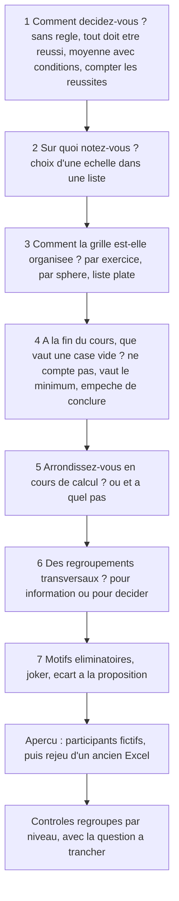

# Contre-analyse du modèle générique (10) et des vues (11)

Ce document attaque les documents 10 (modèle de calcul) et 11 (vues). Il cherche ce qui est faux, flou, contradictoire ou difficile à utiliser, et propose des corrections. Le but n'est pas de réduire le périmètre, mais de rendre la généralisation **juste, complète et utilisable**.

> **Cadrage du porteur du projet (2026-10-03).** Les trois Excel sont le système **actuel**, pas la cible. Azimut doit être un outil **générique**, compatible avec **tous** les types de qualification : calculs, barèmes, regroupements (plusieurs chemins), seuils et vues. Ce document ne propose donc **aucune** réduction au niveau des Excel. Quand un cas n'est pas couvert, la correction proposée **élargit** ou **précise** le modèle.

**Conventions.** **[V]** = vérifié : calculé à la main (et recalculé en script), ou cité d'un document du dossier avec sa section. **[D]** = déduit, ou issu d'une pratique courante non vérifiée dans une source. Les chiffres des cas inédits sont des cas d'école : je les ai choisis pour illustrer une règle. Les IDs propres à ce document : **R01 à R16** (cas inédits), **CI1 à CI12** (cohérence interne de 10), **EC1 à EC13** (écarts entre 10 et 11), **U1 à U10** (corrections d'utilisabilité).

## TL;DR

- **Les chiffres de 10 sont justes.** J'ai refait 12 calculs du document (T4, T9, T10, T13, T14, qualif3, joker, poids effectif, objectif 4.1, arrondi exact) : tous conformes [V]. Les défauts sont dans les **règles**, pas dans l'arithmétique.
- **16 cas inédits** : 1 couvert, 6 couverts avec un réglage avancé, 3 non couverts, 6 ambigus. Les trous : la durée cible (conversion non monotone), le quorum d'un jury par rôle et l'écart en crans, la note reprise d'un cours antérieur.
- **Deux défauts par défaut donnent des propositions fausses.** (1) Avec « vide ignoré » et un minimum d'un membre, **3 notes sur 219** suffisent à une proposition « réussi » provisoire dans qualif3, alors que 10 promet « réussi seulement si c'est certain » (CI1, R03). (2) Un motif éliminatoire que personne ne remplit est **vide**, donc indéterminé : un cours sans incident donne « incomplet » à tout le monde (R16).
- **Un regroupement sans membre devient « non applicable » et sort de la règle en silence.** Une sphère vidée en cours de route ne bloque plus la décision : c'est le bug Trekking (07 F10) par une autre porte (CI2, R14).
- **10 et 11 divergent sur 13 points.** Les plus graves : le statut décisif est dérivé par résultat dans 10, mais posé par chemin dans 11 ; un axe à plusieurs valeurs place un élément plusieurs fois dans 11, alors qu'un chemin le place une seule fois dans 10 ; 11 ne sait pas afficher une « référence » (comptée, non placée), si bien que l'objectif 0 Sécurité de qualif2 s'affiche vide.
- **Le vocabulaire se marche dessus** : « niveau » a trois sens, « rangement » trois, « regroupement » deux (le nœud de 10 et une primitive de vue de 11), « rubrique » et « mesure » deux. Pour un concepteur non informaticien, c'est le premier obstacle.
- **Construire qualif1 demande environ 50 décisions et 40 choix de membres ; un CFC environ 25 décisions et 30 valeurs.** Les pièges : le traitement du vide est replié dans « avancé » alors qu'il change le résultat, les alertes C3 et C12 tombent par centaines, et « sans règle » impose une justification par participant.
- **Corrections prioritaires** : un intervalle des possibles pour les résultats partiels, une valeur du vide déclarée par l'échelle, une échelle de sortie explicite pour chaque regroupement, la séparation « sans membre » et « non applicable », et un statut par règle aligné entre 10 et 11 (§7).

---

## 1. Méthode

1. Lecture de 10 et 11 en entier, de 09 (corpus et cas T1 à T15), de 07 (faits F1 à F20, critique §3).
2. Recalcul de chaque exemple chiffré de 10 qui tient en une ligne, par écrit puis en script Python (fractions exactes et virgule flottante).
3. Invention de cas qui ne sont **pas** dans 09, choisis pour casser une règle précise de 10. Pour chacun : le résultat que le métier attend, l'expression dans 10 avec ses propres règles, puis un verdict.
4. Confrontation de 10 et 11, terme par terme et règle par règle.
5. Construction mentale de deux grilles (qualif1, CFC) par un concepteur qui n'est pas informaticien, en suivant 10 §10 et 11 §5.

**Verdicts.** **Couvert** : le modèle donne le bon résultat avec les réglages visibles par défaut. **Couvert avec réglage avancé** : il le donne, mais avec un réglage replié ou un montage de plusieurs primitives. **Non couvert** : il ne le donne pas, ou seulement par un contournement qui perd une information. **Ambigu** : les règles de 10 se contredisent, ou ne disent pas quoi faire.

---

## 2. Cas inédits

### 2.1 Vue d'ensemble

| # | Cas | Ce qu'il attaque | Verdict | Correction clé |
| --- | --- | --- | --- | --- |
| R01 | Deux chemins décisifs qui partagent un critère, puis une note globale qui les agrège | multiplicité, double comptage | couvert avec réglage avancé | dire « double exigence » ; corriger le poids effectif d'une Somme |
| R02 | Le final remplace le partiel s'il est meilleur ; la meilleure note compte double | multiplicité sur des fonctions non linéaires | couvert avec réglage avancé (alerte fausse) | multiplicité seulement le long de fonctions linéaires ; pondération par rang |
| R03 | Seuil qui dépend d'un résultat partiel d'un autre chemin | logique à trois valeurs, vide ignoré | **ambigu** | intervalle des possibles |
| R04 | ++/+/-/-- sans valeurs : moyenne, médiane paire | capacité ordinale | couvert | règle d'égalité de la médiane ; échelle de sortie de F1 |
| R05 | Durée cible (exposé de 10 min, marche au temps imposé) | monotonie des conversions | **non couvert** | sens « cible » de l'échelle |
| R06 | Rattrapage partiel par critère, note plafonnée | tentatives par épreuve entière | couvert avec réglage avancé (lourd) | note retenue par indicateur sur la famille ; convocation comme donnée |
| R07 | Note de groupe nuancée par participant, puis corrigée | dérogation absolue | couvert avec réglage avancé | dérogation « à revoir » ; gabarit groupe + ajustement |
| R08 | Participant dispensé d'un exercice entier | « au moins n » et non applicable | **ambigu** | demander « exigence fixe ou au prorata » |
| R09 | Grille modifiée à mi-cours | identité d'un indicateur placé | **ambigu** | « corriger le placement » et « évaluer ailleurs » |
| R10 | Demi-points, arrondi au plus proche ou vers le haut, chrono | modes d'arrondi, sens de l'échelle | **ambigu** | modes relatifs au sens : « en faveur du participant » |
| R11 | Jury de 3, un évaluateur manque | minimum, Somme, rôle, échelle ordinale | **non couvert** | quorum par rôle ; écart en crans ; total au prorata |
| R12 | Portfolio : seule la dernière preuve compte, preuves non planifiées | notes sans contexte | **ambigu** | « situation » facultative sur la note |
| R13 | Compétence acquise dans un cours antérieur | principe 5, provenance | **non couvert** | note ou arrêt de type « reprise » |
| R14 | Regroupement vide | algorithme §5.3 étapes 4 et 5 | **ambigu** | « sans membre » ≠ « non applicable » |
| R15 | Règle qui cite un résultat « indicatif » ; mention à trois issues | statut dérivé, plusieurs règles | couvert avec réglage avancé | statut par règle ; règle à issues ordonnées |
| R16 | Motifs éliminatoires que personne ne remplit | vide dans une condition | couvert avec réglage avancé (défaut faux) | valeur du vide déclarée par l'échelle |

**Bilan** : 1 couvert, 6 couverts avec réglage avancé, 3 non couverts, 6 ambigus. Le verdict retenu est le plus mauvais des sous-cas.

### R01. Deux chemins décisifs qui partagent un critère

- **Données.** Points de 0 à 1 par indicateur, Somme en rapport partout. Critère c1 (exercice E1 **et** thème T) : 1 sur 4. Critère c2 (E1) : 4 sur 4. Critère c3 (exercice E2 **et** thème T) : 3 sur 4. Règle A : « tous les exercices ≥ 60 % et T ≥ 60 % ». Variante B : on ajoute une note globale G = Moyenne (E1, E2, T), et la règle exige G ≥ 60 %.
- **Attendu.** E1 = 5/8 = **62,5 %**, E2 = **75 %**, T = 4/8 = **50 %** → règle A **échouée** [V]. Le critère faible c1 pèse dans deux conditions. C'est voulu : chaque condition pose une autre question. Le CFC fait pareil : une position compte dans son domaine, le domaine dans la note globale, et les deux ont une condition (09 A07) [V]. Ce n'est **pas** un double comptage. Variante B : G = (62,5 + 75 + 50) / 3 = **62,5 %** [V]. c1 arrive dans G par E1 **et** par T : là, c'est un vrai double comptage dans un même résultat. Il est légitime si l'équipe le veut (une école qui compte des compétences transversales dans la moyenne générale [D]).
- **Dans 10.** §4.8 : la multiplicité se compte par résultat. Règle A : m(c1, E1) = m(c1, T) = 1, pas d'alerte. Variante B : m(c1, G) = 2 → contrôle C2 bloquant, sauf déclaration « voulu » avec un motif.
- **Verdict.** A couvert ; B **couvert avec réglage avancé**. Le refus par défaut est juste.
- **Faiblesses.** (1) L'explication d'un échec ne dit pas qu'un même critère intervient dans deux conditions. La maîtrise le demandera en relisant un échec. (2) Le poids effectif de c1 dans G se calcule mal avec la formule de §4.8 dès que les critères n'ont pas le même nombre d'indicateurs (CI6).
- **Correction.** Une ligne d'information dans l'explication de la proposition : « c1 intervient dans 2 conditions : Exercice 1 et Thème T ». Un message C2 qui chiffre : « c1 compte 2 fois dans Note globale : par Exercice 1 (poids effectif 16,7 %) et par Thème T (16,7 %). Voulu ? Sinon, retirez un des deux de la note globale, ou réglez un poids. » (1/3 × 4/8 = 16,7 % par chemin [V].)

### R02. Le final remplace le partiel s'il est meilleur

- **Données.** Échelle 1 à 6. Note = Moyenne (max(P, F), F) : le final F remplace le partiel P s'il est meilleur (règle courante à l'université [D]). Léa : P = 3,0, F = 4,6. Max : P = 5,0, F = 4,0. Variante « la meilleure de deux notes compte double » : (2 × max + min) / 3.
- **Attendu.** Léa = (4,6 + 4,6) / 2 = **4,6**. Max = (5,0 + 4,0) / 2 = **4,5**. Variante, Léa : (9,2 + 3,0) / 3 = **4,07** [V].
- **Dans 10.** R1 = Meilleure (P, F) ; N = Moyenne (R1, F). F atteint N par R1 et directement : m(F, N) = 2 → C2 bloque. Variante : Moyenne pondérée (Meilleure (P, F) × 2, Moins bonne (P, F) × 1) : m(P) = m(F) = 2 → C2 bloque, alors que chaque note compte **une fois**, selon son rang.
- **Verdict.** **Couvert avec réglage avancé** (déclarer « voulu »), mais l'alerte est fausse dans la variante.
- **Correction.** (a) La multiplicité n'a de sens que le long de fonctions **linéaires** (F1, F2, la base de F9). Quand un chemin traverse Meilleure, Moins bonne, Médiane, Dernière, Comptage ou Part des réussis, C2 devient un avertissement « usage multiple », pas un blocage. (b) Généraliser F9 en **moyenne pondérée par rang** : on trie les valeurs, puis on donne un poids à chaque rang. Poids (2, 1) : « la meilleure compte double ». Poids (0, 0, 1, 1, 1, 0, 0) : le plongeon (09 A16). Poids (1, …, 1, 0) : « on retire la plus basse ». Une seule fonction, monotone, et une seule appartenance par membre.

### R03. Un seuil qui dépend d'un résultat partiel d'un autre chemin

- **Données.** Sphère B (1 à 5) = 2,7, complète. Thème Sécurité (chemin « Thèmes », Moyenne, vide ignoré) : 5 critères, un seul noté, à 5. Seuil de B : « si Sécurité ≥ 4 alors 2,5, sinon 3 ». La qualification est ouverte.
- **Attendu.** B n'est **pas acquis**. Si les 4 critères vides arrivent à 3, Sécurité = (5 + 4 × 3) / 5 = 3,4 < 4 : le seuil de B devient 3 et B échoue. Sécurité peut aller de (5 + 4 × 1) / 5 = 1,8 à 5 [V]. La proposition honnête est « incertaine ».
- **Dans 10.** §6.1 : Sécurité a une valeur (partielle) de 5, la condition est réussie, le seuil de B vaut 2,5, B est réussi. §6.3 : « élément réussi si résultat ≥ seuil ». Proposition : **réussi** (provisoire). Or le TL;DR de 10 et le principe de §6.3 disent : « réussie seulement si c'est **certain** ». Sécurité entre dans le cône de décision et devient décisif sans que personne ne l'ait réglé : c'est juste, mais l'écran ne le dit pas.
- **Verdict.** **Ambigu** (contradiction CI1).
- **Correction.** (1) Tant que la qualification est ouverte, calculer pour chaque résultat partiel l'**intervalle des possibles** : chaque vide ignoré peut rester vide ou prendre n'importe quelle valeur de son échelle. Pour F1, F3 à F8, le cas « reste vide » tombe entre les deux extrêmes, donc deux calculs suffisent. Pour F9 sur une base Somme, ce n'est pas vrai (CI7) : il faut le traiter à part. Une condition est **acquise** si tout l'intervalle est du même côté du seuil, sinon elle est « réussie pour l'instant ». (2) Afficher : « Sécurité compte maintenant pour la décision : il fixe le seuil de B. » (3) Contrôle C1 : distinguer dans le graphe la **valeur** d'un élément et son **seuil**. Sinon deux seuils croisés (le seuil de A lit B, le seuil de B lit A) sont refusés comme un cycle, alors qu'ils se calculent : aucune valeur ne dépend d'un seuil.

### R04. Échelle ++/+/-/-- sans valeurs

- **Données.** Niveau de réussite « + ». Un critère de 4 indicateurs : --, +, +, ++. Variante paire : --, -, +, ++.
- **Attendu.** La pratique est « on compte, on ne moyenne pas » (07 §3.3) [D]. Pour --, +, +, ++, trois lectures : médiane ordinale « + », **réussi** ; moyenne avec les valeurs 1 à 4 : 2,75 < 3, **échoué** [V] ; « aucun -- », **échoué**. La grille choisit la lecture. Variante paire : les deux valeurs centrales sont « - » et « + ». La médiane « la moins bonne des deux » donne « - », échoué. C'est cohérent avec « une majorité stricte de + » : 2 sur 4 n'est pas une majorité.
- **Dans 10.** C6 bloque Moyenne sans valeurs. F5 Médiane est permise. La grammaire a « aucun [ensemble] n'est au niveau -- ou moins », et Part des réussis > 0,5.
- **Verdict.** **Couvert.**
- **Faiblesses.** (1) La règle d'égalité de la médiane ordinale est figée (« la moins bonne »). (2) Si l'équipe donne des valeurs, F1 dit sortir dans « la même échelle ». C'est faux : 2,75 n'est pas un niveau. Le seuil « + ou mieux » doit alors se lire « ≥ 3 ». (3) C6 est un blocage sec, sans issue proposée.
- **Correction.** Un paramètre « en cas d'égalité : la moins bonne (défaut) ou la meilleure ». F1 sur une échelle à niveaux valorisés sort une échelle **continue**, bornée par les valeurs, et « niveau L ou mieux » se lit « ≥ valeur de L ». Le message de C6 devient une question (U4).

### R05. Conversion non monotone : la durée cible

- **Données.** Un exposé doit durer 10 minutes. De 9 à 11 min : 2 points. De 8 à 9 ou de 11 à 12 min : 1 point. Sinon : 0. Léa 8:30, Max 11:40, Zoé 10:10. Même forme : la marche au temps imposé (pénalité par minute d'avance **ou** de retard) et l'estimation d'un azimut (l'écart entre 350° et 10° vaut 20°) [D, pratiques courantes].
- **Attendu.** Léa **1**, Max **1**, Zoé **2**.
- **Dans 10.** C9 refuse une conversion non monotone. Contournement : saisir l'écart |durée − 10| sur une échelle « plus bas = mieux », puis des paliers. Mais l'évaluateur chronomètre une **durée**, pas un écart. Et on perd le sens de l'écart (trop court ou trop long), utile au retour.
- **Verdict.** **Non couvert** (contournement seulement).
- **Correction.** Un troisième **sens** pour l'échelle continue : **cible** (une valeur c, et une option « circulaire » pour un angle). Le modèle dérive d = |x − c| (ou l'écart circulaire), toujours « plus petit = mieux ». Tout reste monotone en d : la logique à trois valeurs et le seuil équivalent restent justes. On saisit la durée, on calcule sur l'écart, on affiche les deux. Pour une application qui s'appelle Azimut, l'écart circulaire n'est pas un luxe.

### R06. Rattrapage partiel par critère, note plafonnée

- **Données.** Épreuve pratique, 4 critères notés de 1 à 6, réussie si la moyenne est ≥ 4. Tentative 1 : 5, 5, 3, 2 → 3,75, échouée. Le rattrapage ne repasse **que** les critères 3 et 4 : 4,5 et 4,0, plafonnés à 4. Règle : pour chaque critère, la meilleure tentative, la note du rattrapage étant plafonnée à 4.
- **Attendu.** 5, 5, 4, 4 → **4,5**, réussie [V].
- **Dans 10.** §7.3 choisit la meilleure tentative sur le **résultat de l'épreuve**. Résultat de la tentative 2 = (4,5 + 4,0) / 2 = 4,25, plafonné à 4 ; Meilleure (3,75 ; 4) = **4,0** [V]. La réussite est la même, la valeur non (4,0 au lieu de 4,5). Si l'épreuve entre dans une moyenne, la note finale change. Pour exprimer la vraie règle, il faut un regroupement « critère retenu » **par critère** (Meilleure sur la famille, plafond au rang 2), puis la moyenne. Un regroupement par critère : c'est l'effet tableur que 07 dénonçait. En plus, chaque participant repasse des critères différents. Le modèle ne sait dire « concerné » que par participant et par contexte (§4.2). Les cases non convoquées sont attendues et vides, et le remplissage est faux (11 PE4).
- **Verdict.** **Couvert avec réglage avancé**, mais lourd.
- **Correction.** (1) Un réglage de **famille** de tentatives : « note retenue par indicateur (ou par critère) : Meilleure, plafond 4 à partir du rang 2 ». Le modèle génère les regroupements. (2) La **convocation** est une donnée de la qualification, pas de la structure : une case de rang n ≥ 2 est attendue seulement si l'élément est échoué au rang précédent, ou si la maîtrise convoque à la main.

### R07. Note de groupe nuancée par participant

- **Données.** Groupe Renard, 4 membres. « Organisation de la randonnée » : 4,0 (1 à 6) pour le groupe. Léa a porté le groupe : + 0,5. Max a manqué la moitié : − 1. Puis la maîtrise corrige la note du groupe à 4,5 (erreur de saisie).
- **Attendu.** Léa **5,0**, Max **3,5**, les deux autres **4,5**. L'intention est un **écart** au groupe, pas une valeur fixe.
- **Dans 10.** §7.6 : la dérogation individuelle **remplace** la note du groupe. Avant la correction : Léa 4,5, Max 3,0, juste. Après : Léa reste à 4,5 (comme les autres), Max reste à 3,0. L'intention est perdue en silence. Contournement exact : deux indicateurs, « part du groupe » (portée groupe) et « ajustement individuel » (échelle de − 1 à + 1, vide compté 0), Somme en total, bornage de 1 à 6.
- **Verdict.** **Couvert avec réglage avancé.**
- **Correction.** Corriger une note de groupe met chaque dérogation à l'état « à revoir », comme un arrêt (§6.4). Proposer le gabarit « note de groupe + ajustement individuel ». La même question se pose pour l'arrêt : valeur ou écart ? (§3.5, S3).

### R08. Participant dispensé d'un exercice entier

- **Données.** 7 exercices, seuil 60 % chacun. Règle : « au moins 5 exercices sont réussis ». Léa est dispensée de l'exercice 5 (blessure) : non applicable, portée contexte. Elle réussit 4 des 6 autres et en échoue 2. Le thème T (Somme en rapport) a des critères dans les exercices 2 et 5.
- **Attendu.** Le métier hésite, et c'est normal. Exigence fixe : 4 < 5, échouée. Exigence au prorata : 5/7 × 6 = 4,3, arrondi vers le haut à 5, échouée. Formulation « au plus 2 échecs » : réussie. La grille doit **choisir**, en connaissance de cause.
- **Dans 10.** §6.3 : « au moins n garde n » → **échoué**. Mais la condition « au plus 2 exercices sont échoués » donne **réussi** (2 ≤ 2). Sans non applicable, les deux formulations sont équivalentes. Avec un non applicable, elles divergent [V, par la table de §6.3]. Rien n'avertit le concepteur. Pour T, les critères de l'exercice 5 sortent : T se calcule sur l'exercice 2 seul. La complétude affichée est « k membres renseignés sur n », pas « 4 points possibles au lieu de 8 ».
- **Verdict.** **Ambigu.**
- **Correction.** Dès qu'une grille admet un non applicable de portée contexte, l'éditeur de règle demande : « Si un participant est dispensé d'un exercice, l'exigence reste "5 réussis" / devient "au plus 2 échecs" / se réduit au prorata. » Une option sur « au moins n » : fixe (défaut) ou au prorata (arrondi vers le haut). L'explication dit la part retirée.

### R09. Grille modifiée à mi-cours

- **Données.** Jour 3. (a) Le critère « Analyse des risques » passe de l'objectif 1 (compté) à l'objectif 0 Sécurité (compté là, affiché sous l'objectif 1). (b) Un critère placé par erreur dans l'exercice A appartient à l'exercice B. 12 participants ont déjà une note. (c) Le bilan intermédiaire du jour 2 a annoncé des résultats.
- **Attendu.** (a) Recalcul des objectifs 1 et 0 et de la sphère, avec trace et aperçu ; les arrêts touchés passent « à revoir ». (b) Deux intentions différentes. « On s'est trompé de place » : les notes suivent. « On l'évaluera dans B » : les notes restent à A, qui est retiré. (c) Les résultats annoncés restent consultables.
- **Dans 10.** (a) Couvert : appartenances, identifiants stables, sélections recalculées, aperçu de l'impact (02 §9). (b) Un indicateur placé est identifié par le couple (définition, contexte), unique (§4.1). Changer de contexte crée une **autre** instance. Rien ne dit si les notes suivent. (c) Couvert par l'instantané (EX11). Le statut décisif peut aussi changer avec la structure : un PDF déjà imprimé avec la mention « indicatif » devient faux.
- **Verdict.** **Ambigu** (b).
- **Correction.** Deux opérations nommées : **corriger le placement** (même identifiant, les notes suivent, trace au journal) et **évaluer ailleurs** (retirer l'ancienne instance, en créer une nouvelle). Toute modification de structure pendant le cours montre la liste des participants dont la proposition change. Un instantané garde la version de la structure.

### R10. Demi-points et arrondi

- **Données.** (a) CFC : deux positions de même poids, notes brutes 3,74 et 4,20. Règle : chaque position arrondie à la demi-note, puis la note du domaine au dixième (09 A07) [V pour le principe]. Seuil 4,0. (b) Nage chronométrée, seuil ≤ 4:00, chrono 4:00,5, résultat arrondi à la seconde.
- **Attendu.** (a) Avec l'arrondi réglementaire : 3,5 et 4,0 → 3,75 → 3,8, **échoué**. Sans arrondi intermédiaire : 3,97 → 4,0, **réussi**. Avec un arrondi final « vers le haut » au demi : 4,0, réussi [V]. Le règlement décide ; le modèle doit le reproduire sans le combattre. (b) « Au plus proche, égalité vers le haut » : 4:01, **échoué**. « En faveur du nageur » : 4:00, **réussi**.
- **Dans 10.** (a) Couvert : arrondi au pas 0,5 en sortie de position, au pas 0,1 en sortie de domaine. Mais C12 avertit sur **chaque** position : 12 alertes pour une règle légale. (b) Les modes de §3.4 (« au plus proche, égalité vers le haut », « vers le haut », « vers le bas ») sont numériques. Sur une échelle « plus bas = mieux », « égalité vers le haut » défavorise le candidat, et rien ne le dit. Le mode « égalité vers le bas » manque.
- **Verdict.** (a) couvert ; (b) **ambigu**.
- **Correction.** Exprimer les modes par rapport au **sens** de l'échelle : « au plus proche, égalité en faveur du participant » (défaut), « en faveur du participant », « en sa défaveur ». C12 se confirme une fois par niveau. Un gabarit qui pose un arrondi réglementaire le marque « voulu, source : règlement ».

### R11. Jury de 3, un évaluateur manque

- **Données.** (a) Médiane, 3 notes attendues, minimum 2 : notes 5 et 3, le 3e juré est malade. (b) Trois jurés notent chacun sur 20, la note est le total sur 60, seuil 36 : notes 15 et 14, un juré absent. (c) Le règlement exige que le président du jury ait noté. (d) Le jury note sur ++/+/-/--, avec un écart toléré d'un cran : notes +, - et ++.
- **Attendu.** (a) 4 : la médiane de deux notes est leur moyenne, sa robustesse disparaît, ce que le minimum de 2 accepte. (b) Au prorata : 29 × 60 / 40 = **43,5**, réussi [V]. (c) Sans le président, pas de note. (d) L'écart vaut 2 crans : consensus requis.
- **Dans 10.** (a) Couvert. (b) Somme en total : 29 < 36, **échoué à tort**. En rapport : 29/40 = 72,5 %, puis une conversion linéaire (0 → 0, 1 → 60) : 43,5. Juste, mais par un montage. (c) Le minimum est un **nombre** (§7.2). Le filtre par rôle existe pour les lectures (§7.5), pas pour le quorum : **non couvert**. (d) L'écart toléré compare des valeurs (max − min), et F10 Étendue exige une échelle numérique : **non couvert**. 11 affiche pourtant un « écart en crans » (VX4, ME1).
- **Verdict.** **Non couvert** (c, d) ; (a) couvert ; (b) couvert avec réglage avancé.
- **Correction.** Un minimum de notes avec une contrainte de rôle (« au moins 2, dont le rôle Président »). Un écart en **crans** pour les échelles à niveaux (différence de rang). Un préréglage « total au prorata des notes présentes ».

### R12. Portfolio : seule la dernière preuve compte

- **Données.** Compétence « Animer un jeu », échelle « non acquis, en cours, acquis » (réussite : acquis). Preuves : jour 1 « en cours », jour 3 « acquis », jour 5 « en cours » (régression). Exigence : le **dernier** niveau atteint, et « acquis dans au moins 2 situations différentes ». Les preuves viennent de situations non planifiées (un jeu improvisé un soir).
- **Attendu.** Dernière = « en cours » : non acquise. Meilleure = « acquis ». Une seule situation à « acquis » : la 2e condition n'est pas remplie. Proposition : échoué (ou incomplet tant que le cours est ouvert, si « en cours » est provisoire).
- **Dans 10.** §9.4 (A12) : « case en mode journal, notes avec contexte et date d'évaluation ; Comptage, contextes distincts ». Or une note **n'a pas de contexte** : §2.2 et le diagramme §8.2 lui donnent une valeur ou un état, un commentaire, un auteur, un rôle et des dates. Une case appartient à **un** indicateur placé, donc à **un** contexte. « Contextes distincts » sur les notes d'une case est impossible [V, contradiction interne]. L'autre voie (un contexte par preuve, Comptage sur un regroupement par définition) oblige à créer un contexte **dans la structure** pour chaque preuve imprévue : une modification de structure tracée à chaque observation.
- **Verdict.** **Ambigu** (contradiction).
- **Correction.** Donner à la note une **situation** facultative : une donnée, pas une structure (texte court, ou choix dans une liste ouverte que les formateurs complètent). F7 « contextes distincts » sait la compter. Variante : des **familles de contextes ouvertes**, où un formateur crée une situation pendant le cours sans modifier la grille. Dernière lit la date d'évaluation, puis la situation, jamais la date d'écriture (CI4).

### R13. Compétence acquise dans un cours antérieur

- **Données.** (a) J+S : Max a validé le module « Sécurité dans l'eau » en 2025, dans un autre cours. La grille 2026 contient ce module. (b) CFC : un candidat qui répète garde les notes des domaines déjà réussis (à vérifier selon l'ordonnance [D]). Pratique 4,8 reprise, connaissances repassées.
- **Attendu.** (a) Le module compte comme réussi, et l'attestation dit « acquis le … au cours … », pas « non applicable ». (b) La note 4,8 entre dans la moyenne pondérée, en lecture seule, avec son origine.
- **Dans 10.** Principe 5 : un résultat ne dépend que des notes de **la** qualification. (a) Non applicable : le module sort du calcul. « Toutes réussies » passe, mais l'impression dit « non applicable », et « au moins n » devient plus dur (R08). (b) On saisit 4,8 à la main avec un commentaire : l'origine se perd et rien n'empêche de la modifier. Ou un arrêt sans bornes sur le regroupement : la trace existe, mais l'arrêt est fait pour s'écarter d'un calcul, pas pour reprendre une note.
- **Verdict.** **Non couvert** (provenance).
- **Correction.** Une note (ou un arrêt) de type **reprise** : valeur copiée d'une autre qualification (identifiant, cours, date), en lecture seule, justifiée, marquée « reprise » partout, y compris dans l'attestation. Le principe 5 reste vrai : la valeur est copiée comme une donnée, on ne lit pas l'autre qualification au moment du calcul. Cela rejoint « une qualification sur plusieurs événements MiData » (07 §3.3).

### R14. Regroupement vide

- **Données.** (a) Le thème « Réflexivité » est créé sans membre, pour le remplir plus tard. (b) Exercice de groupe « Raid » : Léa n'est pas dans le groupe, toutes ses cases sont hors périmètre. (c) Le jour 4, la maîtrise retire les trois critères de la sphère « Trekking », mal conçus, en attendant de les remplacer.
- **Attendu.** (a) Une alerte, pas un blocage, tant que la grille n'est pas figée. (b) L'exercice est non applicable pour Léa. (c) La sphère ne peut pas décider. La proposition doit être « incomplet », ou la grille signalée incohérente. Jamais « réussi » par défaut.
- **Dans 10.** (a) C5 bloque. (b) §5.3, étape 3 : les hors périmètre sont retirés ; étape 4 : « si tous les membres comptés sont retirés, R est non applicable ». Juste. (c) Un regroupement **sans aucun membre** : la condition de l'étape 4 est vraie sans rien à vérifier, donc R est non applicable. La sphère sort de « toutes les sphères sont réussies » et la règle passe sans Trekking. C'est le bug 07 F10 (Trekking oublié dans la règle de qualif2) par une autre porte. Or §9.1 (T1) dit : « sans membre, le résultat serait vide » [V, contradiction].
- **Verdict.** **Ambigu.**
- **Correction.** Distinguer « aucun membre dans la structure » (résultat vide, raison « regroupement sans membre ») et « tous les membres retirés pour ce participant » (non applicable). C5 devient un avertissement avant de figer, un blocage pour un élément décisif, et il se rejoue à chaque modification de structure pendant le cours.

### R15. Une règle qui cite un résultat « indicatif »

- **Données.** (a) La Posture (1 à 5) est marquée « indicatif voulu » pour taire C3. Le jour 2, la direction ajoute à la règle « Posture ≥ 2,5 ». (b) Une 2e règle, « Mention bien » : moyenne globale ≥ 5,0. (c) Les mentions ont trois issues : assez bien, bien, très bien.
- **Attendu.** (a) La Posture devient décisive. L'équipe doit le voir, et le marquage « indicatif voulu » doit tomber ou bloquer. (b) La moyenne globale décide la mention, pas la réussite. Les vues ne doivent pas la présenter comme « décisive » au même titre que les sphères. (c) Une issue parmi trois.
- **Dans 10.** (a) Le statut dérivé passe à décisif (§4.7). Rien ne traite le marqueur « indicatif voulu » devenu faux. (b) D11 permet plusieurs règles, mais le statut est binaire : décisif si l'élément est dans le cône d'**au moins une** règle. 11 (ME2) l'affiche « décisif ». (c) La grammaire ne produit que réussi, échoué ou incomplet. Il faut trois règles emboîtées, ou des paliers en format d'affichage (09 A10), qui ne sont plus une décision.
- **Verdict.** **Couvert avec réglage avancé** (c). Le statut affiché est trompeur (b).
- **Correction.** Un statut **par règle** (« compte pour : Réussite ; Mention »). Un contrôle bloquant : « élément marqué indicatif voulu, cité par une règle ». Une **règle à issues ordonnées** : « Mention : très bien si …, sinon bien si …, sinon assez bien si …, sinon aucune », évaluée en logique à trois valeurs comme le seuil conditionnel (§6.1).

### R16. Les motifs éliminatoires que personne ne remplit

- **Données.** qualif3 exprimée selon 10 §9.3 : « toutes les sphères sont réussies » et « aucun motif éliminatoire n'est retenu ». 3 motifs. Cours sans incident : personne ne touche aux motifs. 24 participants, toutes les sphères réussies.
- **Attendu.** 24 « réussi ». Un motif que personne n'active n'est pas retenu.
- **Dans 10.** Un motif est un **indicateur** binaire (§2.2), et sa case est vide. §6.3 : un élément vide est indéterminé. « Au plus 0 échoués » est réussie seulement si échoués + indéterminés ≤ 0 : la condition est indéterminée. « Toutes » devient indéterminée : proposition **incomplet** pour les 24. La revue des vides décisifs (D4) liste 72 cases. Pour en sortir, il faut cocher « non retenu » 72 fois [V, par les règles de 10]. De plus, l'échelle du motif est mal ordonnée (CI3).
- **Verdict.** **Couvert avec réglage avancé** : envelopper les motifs dans un regroupement (Comptage des « retenu », vide compté « non retenu »), comme 10 le fait pour qualif1 (§9.2). Mais le défaut, celui que §9.3 et le gabarit de §10.1 suggèrent, donne un résultat faux.
- **Correction.** L'échelle porte une **valeur du vide** explicite et affichée (« vide = non retenu »), qui vaut pour les conditions comme pour les regroupements. Le gabarit des motifs la pose. L'ordre de l'échelle devient « retenu, non retenu », sans valeurs numériques. Les cases de motifs sortent du remplissage (11 §4.2), sinon le suivi montre des milliers de vides.

---

## 3. Cohérence interne de 10

### 3.1 Calculs refaits à la main

Chaque ligne a été refaite par écrit, puis en script (fractions exactes et virgule flottante).

| Où dans 10 | Calcul | Résultat refait | Conforme |
| --- | --- | --- | --- |
| §1 principe 6 | (2,59 − 1) / 2 en exact, puis en virgule flottante, arrondi au centième | exact 0,795 → 0,80 ; flottant 0,7949999… → 0,79 | oui [V] |
| §1 principe 2, 09 A03 | (3,4 × 1 + 3,0 × 1 + 2,5 × 2) / 4, puis (x − 1) / 2 | 2,85 → 92,5 %, marge + 12,5 points | oui [V] |
| §5.3, T4 | 9/14 ; paliers ; (3 + 4 × 3) / 4 ; variante 9/10 | 0,6429 → 3 ; 3,75 → 4 ; 0,9 → 5 ; 4,25 → 4 | oui [V] |
| T9 | S⁺, S⁻ sur 11 notes ; variantes 2,5 et 2,0 ; six 6 et cinq 3,5 | 5 et 2 (doublé 4) ; 5 ≤ 5 ; 6 > 5 ; 5 ≤ 12 mais 5 insuffisances | oui [V] |
| T10 | 3/4 ; 4/6 ; 4/7 ; (75 + 33,3) / 2 | 75 % ; 66,7 % ; 57,1 % ; 54,2 % | oui [V] |
| T13 | tri, retrait 2 + 2, somme × 3,5 | 7,5 + 7,5 + 8,0 = 23 → 80,5 | oui [V] |
| T14 | 38/50 × 5 + 1 ; 39,9 / 9 ; 37,9 / 9 | 4,8 → 5,0 ; 4,433 → 4,4 ; 4,211 → 4,2 | oui [V] |
| §6.4 joker | (2,4 − 1) / 2 ; (2,9 − 1) / 2 ; (2,5 − 1) / 2 | 70 % ; 95 % ; 75 % | oui [V] |
| §4.8 poids effectif | 0,5 × 2/9 | 11,1 % | oui [V] (mais voir CI6) |
| §4.6 objectif 4.1 | (100 + 75 + 50 + 100) / 4 ; 12/14 | 81,25 % ; 85,7 % | oui [V] |
| §3.4 bonus qualif2 | x + 1,5 ≥ 85 ⇔ x ≥ 83,5 ; 5/6 = 83,33 | le palier 83,5 garde le bug, le palier 83 le corrige | oui [V] |
| §9.4 A10 | (4 × 3 + 3 × 4 + 2 × 2) / 9 | 3,11 | oui [V] |

**Conclusion** : aucune erreur de calcul. Les défauts qui suivent sont des défauts de règle.

### 3.2 Contradictions

| # | Contradiction | Où | Preuve | Correction |
| --- | --- | --- | --- | --- |
| **CI1** | « Une condition est réussie seulement si c'est **certain** » contre « vide ignoré » par défaut et un minimum d'un membre. Un résultat partiel décide comme un résultat complet. | TL;DR, §6.3 (principe) contre §6.3 (table), §5.2, §10.3 | qualif3 selon §9.3 : un seul critère noté 4 dans une sphère donne 1 + (4 − 3) × 0,25 = **125 %** ≥ 80 % [V]. **3 notes sur 219**, une par sphère et chacune ≥ 2,6, donnent une proposition « réussi » provisoire. C'est le bug F12 (dossier vide « Réussi ») en plus doux. | Intervalle des possibles (R03). Afficher « réussi pour l'instant, 216 cases vides » plutôt que « réussi ». |
| **CI2** | Un regroupement sans membre est non applicable par l'algorithme, mais vide selon T1. | §5.3 étape 4 contre §9.1 (T1) | R14 | « Sans membre » = vide avec raison ; « tous retirés » = non applicable. |
| **CI3** | L'échelle du motif est mal ordonnée. | §3.2, ligne « Motif éliminatoire » | Toutes les autres lignes listent les niveaux du moins bon au meilleur (« k, o », « --, -, +, ++ », « F … A », « insuffisant … très bon »). Le motif liste « non retenu, retenu », avec les valeurs 0 et 1 : « retenu » serait le meilleur niveau. Le niveau de réussite est « la valeur **la moins bonne** qui compte comme réussie » (§3.1) : avec « non retenu » au bas de l'ordre, **tous** les niveaux sont réussis, « retenu » compris [V, par la définition ; la convention d'ordre est déduite des exemples, 10 ne l'écrit pas]. | Écrire la convention (« du moins bon au meilleur »), ordonner « retenu, non retenu », sans valeurs numériques. |
| **CI4** | Dernière départage par la date d'écriture, alors que §7.2 l'interdit sur un élément décisif. | §5.1 F6 contre §7.2 | F6 : « rang du contexte, puis date d'évaluation, puis date d'écriture ». §7.2 : « jamais la date de saisie ». | Sans date d'évaluation, la note prend la date du contexte. Deux notes à égalité : « à arbitrer », pas la date d'écriture. |
| **CI5** | Les notes n'ont pas de contexte, mais A12 compte les « contextes distincts » des notes d'une case. | §2.2, §8.2 contre §9.4 (A12) | R12 | « Situation » facultative sur la note. |
| **CI6** | La formule du poids effectif (w / Σw le long du chemin) est fausse pour une Somme. | §4.8 contre §4.6 et 09 A01 | Dans une Somme, un membre pèse w × max (ses points possibles), pas w. Thème qualif1 avec un critère de 8 indicateurs et un de 4 : la formule donne 50 % et 50 % ; le vrai poids est 8/12 = **66,7 %** et 4/12 = **33,3 %** [V]. 10 le dit lui-même en §4.6 : « un critère de 8 indicateurs pèse deux fois un critère de 4 ». | Pour F2 : poids normalisé = w × possible / Σ (w × possible). |
| **CI7** | T13 fait varier le retrait selon le nombre de juges, alors que F9 a un k fixe. | §9.1 (T13) contre §5.1 (F9) | « Variante 5 juges, retrait 1 + 1 » est une autre grille, pas une variante. Avec 6 juges présents sur 7 et k = 2 + 2, il reste 2 notes : la somme perd un tiers [V]. 09 §4.2 le signalait. Et avec une base Somme, « le juge manquant » n'est pas entre les extrêmes : l'intervalle de R03 ne marche plus. | k dépend du nombre de notes présentes (table « 7 → 2 + 2 ; 5 → 1 + 1 ; moins de 5 → vide »), ou lecture au prorata. La pondération par rang (R02) règle les deux. |
| **CI8** | C3 « élément avec seuil qui ne décide rien » se déclenche sur chaque indicateur. | §10.6 C3 contre §6.1 | §6.1 : « sans seuil déclaré, un indicateur prend le niveau de réussite de son échelle ». Tout indicateur de la Posture, et les 156 indicateurs de qualif1 (sans règle), ont donc un seuil qui ne décide rien. | C3 ne regarde que les seuils **déclarés**, pas les seuils hérités. |
| **CI9** | Principe 5 : « un résultat ne dépend que de la structure et des notes de **la** qualification ». | §1 contre §3.1 et §7.6 | Les niveaux provisoires dépendent de l'état de la qualification (ouverte ou finalisée). La note de groupe est portée par le groupe, pas par la qualification. | Réécrire : « … de la structure, des notes et de l'état de la qualification, y compris les notes de groupe qui la concernent ». |
| **CI10** | « Hors périmètre » est un état de case, alors que la case « n'existe pas ». La couverture d'un chemin se définit par des cases, alors qu'on place des indicateurs. | §3.3 ; §4.4 | Erreur de catégorie : la couverture est une propriété de la structure, la case une donnée. | Couverture : « chaque indicateur placé actif y est placé ». « Hors périmètre » : une raison de non-existence, pas un état. |
| **CI11** | Un arrondi est « intermédiaire » s'il a des parents, « final » s'il est cité par la règle. Un élément peut être les deux. | §5.2 | La sphère de qualif2 est citée par la règle **et** membre de la moyenne globale indicative. C12 avertirait sur un arrondi final. | Intermédiaire = l'élément alimente un autre calcul **décisif**. |
| **CI12** | « Rangement » a trois sens. | §2.2, §4.3, §4.4 | Un regroupement sans fonction ; une appartenance « rangée » (placée, non comptée) ; le rôle d'un chemin. | Voir U3 : « section », « affiché seulement », rôle « affichage ». |

### 3.3 Primitives redondantes

| Doublon | Problème | Recommandation |
| --- | --- | --- |
| Seuil sur l'élément (§6.1) **et** « [élément] ≥ valeur » dans la règle (§6.2) | Deux seuils possibles pour un même élément (sphère à 3, règle à 3,5). Lequel donne la marge, la couleur, le statut « réussi » affiché ? | Un seul endroit : la règle **écrit** le seuil de l'élément, qui s'affiche partout. |
| Comptage + seuil **et** « au moins n sont réussis » | Deux écritures du même besoin, qui se comportent différemment avec les non applicables (R08). | La condition de la règle par défaut ; Comptage pour un résultat affiché. |
| Écart toléré (paramètre) **et** F10 Étendue (fonction) | Même calcul, deux places. Les deux sont numériques seulement (R11 d). | Garder les deux, mais une seule définition, en valeurs et en crans. |
| Arrêt « requis » **et** écart toléré dépassé | Le consensus se règle à deux endroits (§6.4 et §7.2). | Le dépassement de l'écart rend l'arrêt requis ; un seul réglage. |
| Appartenance « rangée » **et** poids 0 | 10 les distingue bien (§4.3). | Garder, mais C4 doit être une proposition (« voulez-vous l'afficher seulement ? »), pas une alerte. |
| Sélection « par contexte » **et** chemin « par contexte » | Deux façons de grouper un exercice. | Le chemin par contexte suffit ; la sélection sert seulement aux regroupements transversaux. |

### 3.4 Primitives manquantes

| Manque | Cas | Proposition |
| --- | --- | --- |
| **Échelle de sortie** d'un regroupement et d'une conversion (minimum, maximum, sens, niveau de réussite) | R04 ; C7, C10, F7, F8, « absent = la moins bonne » en dépendent | Chaque fonction et chaque conversion déclare son échelle de sortie. Une sortie de paliers 1 à 5 est compatible avec une échelle 1 à 5. |
| **Valeur du vide** dans une condition | R16 | Réglage de l'échelle, visible, valable partout. |
| Sens **cible** | R05 | Valeur cible c (option circulaire) ; le calcul porte sur l'écart \|x − c\|. |
| Écart **en crans** | R11 d ; 11 VX4 | Différence de rang sur une échelle à niveaux. |
| **Reprise** (provenance) | R13 | Note ou arrêt « reprise ». |
| Note retenue **par indicateur** sur une famille | R06 | Réglage de famille. |
| Règle à **issues ordonnées** | R15 | Mentions, volets à plusieurs issues. |
| Arrêt **en écart** (+ 0,5) et pas seulement en valeur | R07 ; joker (§3.6) | Choix « valeur » ou « écart » dans la règle d'arrêt. |
| **Quorum par rôle** | R11 c | Minimum de notes avec contrainte de rôle. |
| **Statut par règle** | R15 | « Compte pour : Réussite, Mention ». |
| **Situation** sur une note | R12 | Donnée, pas structure. |
| **Pondération par rang** | R02, CI7 | Généralise F9. |

### 3.5 Sous-spécifications

| # | Ce que 10 ne dit pas | Exemple | Proposition |
| --- | --- | --- | --- |
| S1 | Qui crée le placement par défaut : l'arbre du **référentiel** (une définition contient des définitions, §4.1) ou le **chemin** ? | Placer l'objectif 1 de qualif2 : ses critères deviennent-ils membres placés **et** comptés d'office ? La sécurité de §4.4 suppose « placés » d'office, puis « non comptés » à la main. | Placer une définition composée crée des appartenances placées et comptées selon le référentiel ; on règle ensuite les exceptions. L'écrire. |
| S2 | La fonction par défaut des regroupements du chemin « par contexte » (§4.2). | qualif3 avec des livrables en contextes : un % par livrable apparaît-il ? | Par défaut, un contexte est une **section** (pas de fonction), sauf dans le gabarit « points par exercice ». |
| S3 | Un arrêt « à revoir » s'applique-t-il encore ? Le joker est-il une valeur ou un écart ? | Joker posé à 2,9 sur une brute de 2,4. Une note arrive, la brute passe à 2,6 : la sphère vaut-elle 2,9 (+ 0,3) ou 3,1 (+ 0,5) ? | Choix dans la règle d'arrêt : « valeur » (consensus) ou « écart » (joker). Un arrêt à revoir reste appliqué, marqué, et bloque la clôture. |
| S4 | Le minimum « en part des membres comptés » se calcule avant ou après les non applicables ? | 10 critères, 3 non applicables, minimum 50 % : 5 ou 4 notes ? | Après : part des membres restants. |
| S5 | F7 et F8 : le seuil propre d'un membre l'emporte-t-il sur le « niveau compté » du regroupement ? | Indicateur à seuil 4, regroupement « part à 3 ou plus ». | Le niveau compté du regroupement l'emporte, et l'explication le dit. |
| S6 | Absent sur une échelle dont le niveau le moins bon est provisoire. | RQF : absent = « pas encore » = provisoire = indéterminé jusqu'à la finalisation. | Absent vaut le moins bon niveau **non provisoire**. |
| S7 | Le groupe « à la date du contexte » quand le contexte dure plusieurs jours. | Léa change de groupe au milieu d'un raid de 3 jours. | Le groupe au premier jour, ou une portée de note datée. |
| S8 | Une alerte confirmée l'est-elle une fois par grille, par niveau ou par élément ? | C12 sur 17 objectifs de qualif2. | Une fois par niveau, avec la liste des éléments. |
| S9 | La « proposition » est unique dans §8.2, multiple selon D11. | Volets expert et coach. | Une proposition par règle. |
| S10 | Ce que deviennent les dérogations quand la note du groupe change. | R07 | « À revoir ». |
| S11 | Déplacer un indicateur placé d'un contexte à un autre. | R09 | Deux opérations nommées. |

---

## 4. Cohérence 10 ↔ 11

10 assume deux écarts (le rôle d'un chemin est déduit, l'état « absent » s'ajoute). La lecture croisée en trouve onze autres.

| # | Écart | 10 dit | 11 dit | Recommandation |
| --- | --- | --- | --- | --- |
| **EC1** | Rôle d'un chemin | **déduit** (rangement, décisif, indicatif), rôle attendu facultatif (§4.4) | **réglé** (§1.3, EX2, diagramme) ; ME2 et RG3 s'appuient dessus | Garder la déduction de 10. Dans 11, le statut s'affiche **par résultat** (et par règle, EC12), pas par chemin : qualif2 a dans le même chemin des sphères décisives et une moyenne globale indicative. Le rôle du chemin devient un simple résumé. |
| **EC2** | État « absent » | ajouté, en option (§3.3, D12) | inconnu (§1.5, EX7) ; le remplissage compte « cases avec une valeur » (§4.2) | Adopter dans 11. Pour le suivi, « absent » compte comme **rempli** (une décision a été prise), avec son propre marqueur. Sinon un participant absent reste « non rempli » pour toujours. |
| **EC3** | Sécurité de qualif2 | un chemin, des appartenances « référence » (comptées, non placées) (§4.4) | deux chemins, affichage et calcul (§1.3) ; MC5 traite « affiché, non compté », rien pour « compté, non affiché » | Garder le modèle de 10. Ajouter à 11 une règle **MC8** : sous un regroupement, ses références s'affichent comme des **reflets cités** (« comptés ici, affichés sous Objectif 1 »), repliables. Sans elle, l'objectif 0 Sécurité s'affiche **vide** dans la vue par objectif : aucun élément n'y est placé. |
| **EC4** | Axe à plusieurs valeurs | un chemin place chaque élément **au plus une fois** ; « chemin depuis un axe » (§4.4) | RG2 : un élément à deux valeurs d'axe apparaît **dans chaque groupe** (reflets) ; « un axe qui calcule équivaut à un chemin d'un seul niveau » (§1.3) | Un **chemin** place une fois ; un **axe** regroupe avec des reflets. « Chemin depuis un axe » n'est permis que si l'axe a une valeur par élément ; sinon il produit des **références**, pas des placements. 11 retire l'équivalence axe = chemin. |
| **EC5** | Note retenue d'un jury | règle **déclarée d'avance**, humaine au-delà de l'écart toléré (D14) | choisie **par un humain** sur un élément décisif (EX12) ; MO5 : la note retenue est une saisie | Adopter D14. Réécrire MO5 : la note retenue se saisit seulement quand un arrêt est requis. La maquette VX4 (« [à fixer] » sur l'écart de 2) est déjà conforme. |
| **EC6** | Motifs éliminatoires et joker | un motif est un **indicateur** (une case) ; le joker est un **arrêt** (§2.2, EX15) | « champs de qualification », hors des cases (§1.1) | Adopter 10. Conséquences pour 11 : les cases de motifs sortent du remplissage (R16) ; le joker s'affiche « calculé 2,4 · arrêté 2,9 (joker) ». |
| **EC7** | États d'un résultat | deux axes : la **valeur** (complète, partielle, vide avec raison, non applicable) et le **seuil** (réussi, échoué, indéterminé, non applicable) (§5.3, §6.1) | une liste : vide, incomplet, réussi, échoué, sans seuil (§1.5, diagramme) | Adopter les deux axes de 10. « Incomplet » est réservé à la **proposition**. 11 affiche la raison du vide (« à arbitrer », « justification manquante », « pas assez de notes »), qui dit quoi faire. |
| **EC8** | Écart entre évaluateurs | écart toléré et F10 en valeurs, échelle numérique | « écart en crans » sur toute échelle (ME1, VX4, §4.2) | Ajouter les crans à 10 (§3.4). |
| **EC9** | Cases attendues d'un rattrapage | participants concernés par le contexte, liste fixe (§4.2) | « une case de rattrapage n'existe que pour ceux qui y sont convoqués » (PE4) | La convocation devient une donnée (R06). |
| **EC10** | Vocabulaire | « regroupement » = le nœud ; « rubrique libre » = texte de synthèse ; « mesure » = valeur avec unité ; « niveau » = étage d'un chemin **et** échelon d'une échelle | « Regroupement » = une des six primitives de vue (§2.3) ; « Rubrique » = une disposition (§2.4) ; « mesure » = ce qu'on affiche (§1.6) | Voir U3. Le minimum : 11 renomme sa primitive « Regroupement » en **Découpage** et sa disposition « Rubrique » en **Grille à niveaux** ; 10 appelle les niveaux d'une échelle des **échelons**. |
| **EC11** | Résultat « par chemin » | un résultat **par regroupement**, quel que soit le chemin (§5.3, EX9) | « résultats par nœud × participant, pour chaque chemin qui calcule » (EX9) | Réécrire EX9 dans 11 : un résultat par regroupement ; un chemin n'en crée pas. |
| **EC12** | Statut binaire contre plusieurs règles | plusieurs règles (D11) ; décisif = dans le cône d'au moins une | ME2 : « décisif ou indicatif » | Statut par règle dans les deux documents (R15). |
| **EC13** | Maquettes de 11 contre les règles | — | VF4 : l'en-tête « Obj. 2 » affiche un résultat dans une vue **restreinte** à un contexte sans le marqueur « p » (contraire à ME5 et SO5) ; « Crit. 2.3 Sécurité (aussi sous : Objectif 0) » devrait porter « compte dans : Objectif 0 » (MC5, pas MC2) ; « Remplies 13/15 attendues » avec 3 non applicables contredit §4.2 (les non applicables sortent du dénominateur : x/12 pour les lignes montrées, où 9 ou 10 cases sont remplies) [V]. VF8 : la ligne « Animation » montre 60 % et 75 % et un total de 67 % ; si le total était la moyenne des cellules, 67,5 s'arrondirait à 68 % (D10 de 10) [V]. | Corriger les maquettes. Surtout, VF8 laisse croire que le résultat du thème est la moyenne des résultats partiels. C'est faux pour une Somme en rapport (les rendus pèsent selon leurs points). La vue doit le dire : « le total n'est pas la moyenne des cellules ». |

---

## 5. Généricité : ce qui reste hors du modèle

| Besoin | Où | Intégrer ou exclure | Comment | Pourquoi |
| --- | --- | --- | --- | --- |
| **Classement, rang** | 09 A16 ; 10 §5.4 | **Exclure du calcul**, explicitement | Tri par marge permis à l'écran (11 Q8) ; un classement seulement comme vue de suivi, désactivée par défaut, réservée à la direction, jamais dans l'attestation | Casse le principe 5 (le résultat d'une personne dépendrait des autres), pose des questions d'équité et de nLPD. Un concours n'est pas une qualification. |
| **Notation normative** (seuil relatif à la moyenne du cours, courbe) | absent de 10 | **Exclure**, et l'ajouter à la liste « Dehors » de §5.4 | — | Même raison que le classement. 10 ne le cite pas, alors qu'on le demandera. |
| **Différence signée** entre deux résultats (auto − formateur) | 09 A17 ; 10 §9.5 | **Intégrer**, en indicatif | Fonction F11 « Écart signé (A − B) » à deux membres ordonnés, en valeurs ou en crans. Non monotone en B, donc non citable par une règle (comme F10, contrôle C15). | L'auto-évaluation est courante en formation de cadres [D]. Le coût est faible, et 11 affiche déjà des écarts. |
| **Visibilité** entre évaluateurs, anonymat des pairs | 09 A15, A17 | **Exclure du calcul**, **intégrer aux droits** | Attribut « visible à partir de » sur la note ; règles d'accès de 11 (AC) | Ce n'est pas un calcul, mais il faut une donnée pour le faire. |
| **Conditions sur le temps** | 10 §9.5 | Temps de l'évaluation : **intégrer** ; temps de saisie : **exclure** | Sélection par contexte avec une borne de date (« contextes avant le jour 3 »), et F7 « contextes distincts » | Le temps de saisie n'est pas un fait d'évaluation (11 §1.4). |
| **Avertissement puis récidive** | 07 F16 ; 10 §9.5 | **Intégrer comme gabarit**, sans primitive | Motif en mode journal ; Comptage des avertissements ≥ 2 → « retenu » **proposé** ; la maîtrise confirme | Tout existe déjà ; il manque le montage et la phrase. |
| **Mode, médiane pondérée, percentile** | 10 §5.4 | **Exclure** tant qu'aucun cas réel | — | Pas vus. Le mode (niveau le plus fréquent) est le premier candidat, pour les échelles ordinales. |
| **Produit, quotient** (vitesse = distance / temps) | 10 §5.4 | **Exclure** | Le coefficient passe par un poids lu ; une vitesse se mesure comme une valeur | Pas de cas d'évaluation qui l'exige. |
| **Mesure à cible** (non monotone) | R05 | **Intégrer** | Sens « cible » de l'échelle | Courant (durée, temps imposé, estimation) ; garde la monotonie. |
| **Reprise** d'une autre qualification | R13 | **Intégrer** | Note ou arrêt « reprise » | Cours en modules, répétition CFC, équivalences. |
| **Issues multiples** (mentions, volets à issues) | R15 ; 09 A10 | **Intégrer** | Règle à issues ordonnées | Le format d'affichage ne fait pas une décision. |
| **Pondération par rang** | R02 ; 09 A16 | **Intégrer** | Généraliser F9 | Une fonction au lieu de trois cas. |
| **Compensation pondérée** | 09 A08 (« non détaillé ») | **Intégrer** (paramètre) | S⁺ = Σ wᵢ max(0, vᵢ − r), S⁻ de même | Les branches n'ont pas toutes le même poids [D] ; le coût est faible. |
| **Formule libre** | 10 principe 4 | **Exclure** (garder) | Soupapes : décision humaine justifiée, ajout au catalogue par version | Explication, vérification, logique à trois valeurs. |
| **Fonction choisie selon une condition** (« si … alors moyenne, sinon minimum ») | — | **Exclure** | Seuil conditionnel et règle à issues couvrent les cas vus | Illisible pour un concepteur. |

---

## 6. Utilisabilité

Je joue **Léa**, responsable de la qualification d'un cours Top, à l'aise avec Excel mais pas informaticienne, puis **Marc**, chef expert d'un CFC. Ils suivent 10 §10 (gabarits, réglages par niveau, défauts, règle en phrases, aperçu, contrôles) et 11 §5 (vues générées). Le nombre de décisions est une estimation [D] : une décision = un choix que l'outil ne peut pas faire seul.

### 6.1 Léa construit qualif1 (deux chemins, sans règle)

| # | Étape | Décisions | Où elle se perd, ce qui la piège |
| --- | --- | --- | --- |
| 1 | Choisir le gabarit « Points par exercice » | 1 | — |
| 2 | Confirmer l'échelle « points de 0 à 1 » | 1 | « Maximum propre à l'indicateur » : inutile ici, mais visible. |
| 3 | Créer 7 exercices : nom, date | 14 | « Contexte » ne parle pas ; le gabarit dit « exercice », bien. |
| 4 | Coller le référentiel | 1 + fusions | **Piège** : l'Excel a une feuille par exercice. Léa colle exercice par exercice et crée 4 définitions « 4.1 » au lieu d'une. Le regroupement « 4.1 sur tous les exercices » ne trouvera ensuite qu'une instance, sans alerte. |
| 5 | Placer les définitions dans chaque exercice | 7 | 10 ne décrit pas cet écran. « Placer », « instance », « indicateur placé » : jargon. |
| 6 | Réglage par niveau : Somme en rapport | 0 à 1 | « Somme en rapport » ne dit rien ; elle pense « total des points en % ». |
| 7 | Que vaut une case vide ? | 1 | **Piège majeur** : le réglage est **replié** (§10.7, avancé). Le défaut global est « ignorer » (§10.3), alors que l'Excel compte le vide comme 0 (07 F1). Le gabarit de §10.1 ne dit rien du vide. Au rejeu, ses % ne collent pas à l'Excel (3/3 au lieu de 3/4) et elle ne sait pas pourquoi. |
| 8 | Sortir 4.1 et 2.1 du % de chaque exercice | 7 | Il faut savoir que l'Excel les exclut. Même les analystes se sont trompés (07 F7). « Rangé » ne lui dit rien. |
| 9 | Créer le chemin « Compétences transversales » | 2 | Replié dans « avancé » (« chemins supplémentaires »). « Chemin » évoque une randonnée. |
| 10 | 4 thèmes par liste de critères | 4 + ~40 choix | 15 lignes possibles par thème dans l'Excel (09 A01). Elle doit choisir des couples (exercice, critère). « Référence », « sélection » : jargon. |
| 11 | 2 moyennes d'objectif sur plusieurs exercices | 6 | Sélection « par définition » (avancé), puis la lecture « résultat par contexte » ou « cases mises en commun » : elle ne comprend pas la question. Puis une surcharge de fonction (Moyenne au lieu de Somme), marquée « exception ». |
| 12 | Règle : aucune | 1 | **Piège** : « décider sans règle : justification obligatoire » (§6.5, D8). Le dernier soir, 24 justifications. |
| 13 | Motifs éliminatoires (« un seul KO suffit ») | 3 à 4 | Regroupement, Moins bonne, vide compté « non retenu » (R16) : trois concepts pour une case à cocher. |
| 14 | Lire les contrôles | — | Si C3 compte les seuils hérités : 156 alertes (CI8). C18 sur chaque sélection. Elle confirme tout sans lire. |
| 15 | Aperçu et rejeu de l'Excel | 1 | Bonne idée, mais seulement si les écarts sont **expliqués** (ligne par ligne). |

**Total** : environ **50 décisions et 40 choix de membres**.

### 6.2 Marc construit un CFC

| # | Étape | Décisions | Où il se perd, ce qui le piège |
| --- | --- | --- | --- |
| 1 | Gabarit « Notes 1 à 6 avec conditions » | 1 | — |
| 2 | Échelle « points » avec un maximum par position | 1 + 12 | La création d'échelle est réservée aux gabarits (expert, §10.7). Le maximum par indicateur est une propriété de l'échelle (§3.1) : où le saisir ? |
| 3 | Épreuves écrite et pratique, note d'expérience : contextes ? | 3 | **Confusion** : s'il crée des contextes, un chemin « par contexte » apparaît en plus de son chemin « domaines ». « Pourquoi j'ai deux arbres ? » |
| 4 | Chemin « domaines » : domaine → position → indicateur | 2 | — |
| 5 | Positions : Somme en rapport → linéaire (0 → 1, 1 → 6) → arrondi au demi | 3 | Il connaît la formule « points / max × 5 + 1 », pas « conversion de sortie linéaire par deux points ». C12 avertit 12 fois sur un arrondi **légal** (R10). |
| 6 | Domaines : Moyenne pondérée, poids des positions | 1 + ~12 | Les poids sont sur l'**appartenance** : il les cherche sur le domaine. |
| 7 | Note globale : poids des domaines, arrondi au dixième | 1 + 6 + 1 | — |
| 8 | Règle : globale ≥ 4,0, pratique ≥ 4,0, connaissances ≥ 4,0 | 3 | **Confusion** : le seuil se pose sur l'élément **ou** dans la règle (§3.3). Lequel ? |
| 9 | Vide : bloquer | 1 | **Piège grave** : le défaut « ignorer » est replié. Une position oubliée est ignorée et **fait monter** la moyenne si elle était faible. Le CFC exige toutes les notes (09 A07 : vide bloquant). |
| 10 | Absent = note 1 | 1 | « Absent » est une option (D12) ; il faut l'activer. Le défaut « la moins bonne valeur » donne 0 point, donc la note 1 : juste, mais il ne peut pas le deviner. |
| 11 | Deux experts | 1 | En V1, une note par case (D7) : les experts s'accordent avant de saisir. À dire dans le gabarit. |
| 12 | Note d'expérience des semestres | 1 | Non couvert (R13) : saisie à la main, sans origine. |
| 13 | Répétition | — | Non couvert (R13). |
| 14 | Attestation | 1 | — |

**Total** : environ **25 décisions et 30 valeurs** (maxima, poids).

### 6.3 Termes que le concepteur ne comprend pas

| Terme de 10 | Ce que Léa ou Marc comprend | Proposition (interface) |
| --- | --- | --- |
| contexte | rien | le libellé du gabarit : « exercice », « épreuve », « rendu » |
| indicateur placé, instance, placer | rien | « le critère 2.6.5 **dans** l'exercice PdC filmé » ; « ajouter à l'exercice » |
| appartenance rangée | « mis en ordre » | « **affiché ici, compte ailleurs** » |
| référence | « référentiel » ? | « **compte ici, affiché ailleurs** » |
| rangement (regroupement sans fonction) | idem | « **section** (sans calcul) » |
| chemin | une randonnée | « **façon de regrouper** » (« par exercice », « par thème ») |
| Somme en rapport | ? | « **total des points en %** » |
| Part des réussis | ? | « **% d'indicateurs réussis** » |
| conversion de sortie, points d'appui, paliers | ? | « **barème** » : « barème par points de repère », « barème par tranches », « formule fédérale CFC » |
| sélection par définition ; lecture « résultat par contexte » / « cases mises en commun » | rien | « le même objectif dans tous les exercices » ; « **chaque exercice pèse pareil** » / « **chaque point pèse pareil** » |
| multiplicité, double comptage | vague | « **compté 2 fois** dans [résultat] » |
| décisif, indicatif, cône | jargon | « **compte pour la décision** » / « **pour information** » ; le cône ne s'affiche jamais |
| arrêt | « stop » | « **valeur arrêtée à la main** » ; libellés précis : joker, consensus, décision motivée |
| niveau (d'un chemin) et niveau (d'une échelle) | les deux à la fois | « niveau » pour le chemin (sphère, objectif) ; « **échelon** » pour l'échelle (++ est un échelon) |
| indéterminé | « bug ? » | « **en attente** : 3 cases vides » |

### 6.4 Corrections d'utilisabilité

**U1. Un questionnaire, dans l'ordre de la décision.** Le gabarit pose ses questions en commençant par la **décision**, parce que c'est elle qui dit quels réglages comptent (le cône de 10, sans le nommer). L'ordre de 10 (échelle, chemin, fonction, poids, seuil, règle) part du bas et fait régler des choses qui ne décident rien.

**U2. Le vide est une question visible, et son défaut dépend du gabarit.**

| Gabarit | Vide | Arrondi | Absent | Motifs | Sans règle |
| --- | --- | --- | --- | --- | --- |
| Points par exercice (qualif1) | vaut 0 | aucun | — | vide = non retenu | justification facultative |
| Sphères 1 à 5 (qualif2, qualif3) | ne compte pas, revue à la finalisation | aucun (qualif2 : entier, marqué « voulu ») | la moins bonne | vide = non retenu | — |
| Notes 1 à 6 avec conditions (CFC) | **empêche de conclure** | demi puis dixième, « voulu, règlement » | note 1, activé | — | — |
| Exigences minimales (RQF) | empêche de conclure | — | « pas encore » non provisoire | — | — |

**U3. Renommer** selon le tableau de §6.3, et régler les collisions entre 10 et 11 (EC10).

**U4. Des messages de contrôle qui posent une question et proposent une sortie.**

| Contrôle | Message actuel (déduit de 10) | Message proposé |
| --- | --- | --- |
| C6 | « Fonction numérique sur une échelle ordinale » | « Les échelons ++, +, -, -- n'ont pas de valeur chiffrée. Voulez-vous : compter les échelons réussis (recommandé) ; prendre l'échelon du milieu ; donner une valeur à chaque échelon ? » |
| C2 | « Double comptage non déclaré » | « Le critère c1 compte 2 fois dans Note globale : par Exercice 1 (16,7 %) et par Thème T (16,7 %). C'est voulu ? Sinon, retirez-en un. » |
| C3 | « Élément avec seuil qui ne décide rien » | « La sphère Trekking a un seuil, mais la règle ne la cite pas. L'ajouter à la règle ? La garder pour information ? » |
| C12 | « Arrondi intermédiaire » | « Les 12 positions sont arrondies au demi avant la moyenne. Cela change la décision de 2 participants fictifs sur 5 (voir). C'est la règle de votre règlement ? » |
| C16 | « Ensemble qui peut devenir vide » | « Si un participant est dispensé de tous les exercices du thème T, la condition "T réussi" disparaît pour lui. C'est voulu ? » |
| C5 | « Regroupement sans membre » | « Le thème Réflexivité n'a encore aucun critère. Il ne sera pas calculé. Ajouter des critères maintenant ou plus tard ? » |

**U5. L'import détecte les définitions répétées.** Mêmes code et texte dans plusieurs exercices : l'import propose **une** définition placée dans N exercices (le piège de l'étape 4).

**U6. Un écran de placement en matrice** : définitions en lignes, exercices en colonnes, une case à cocher par placement, et une 2e coche « compte dans le % de l'exercice ». C'est la forme que les Excel ont déjà.

**U7. Moins d'alertes, mieux groupées.** C3 seulement sur les seuils déclarés (CI8). Une confirmation par niveau, pas par élément (S8). Les alertes « voulu » posées par un gabarit sont pré-confirmées, avec leur source.

**U8. Des barèmes nommés** dans la liste de choix : « formule fédérale CFC (points / max × 5 + 1, demi-notes) », « 1 à 5 vers % (1 → 0 %, 3 → 100 %, 5 → 150 %) », « tranches de % vers une note ». Le concepteur choisit un nom, pas des points (x, y).

**U9. Le rejeu d'un ancien Excel est la première étape de l'aperçu**, avec la liste des écarts **expliqués** : « Trekking compte maintenant dans la décision (bug F10 corrigé) », « le vide vaut 0 comme dans l'Excel ». Sans explication, le concepteur croit qu'Azimut se trompe.

**U10. « Sans règle » : justification facultative.** Le commentaire général tient lieu de motif. La justification reste obligatoire quand on **s'écarte** d'une proposition.

---

## 7. Priorités : les 10 corrections les plus importantes

Classées par le risque d'une décision fausse, puis par le nombre de grilles touchées.

| Rang | Correction | Doc | Cas | Pourquoi ce rang |
| --- | --- | --- | --- | --- |
| **1** | **Intervalle des possibles** pour les résultats partiels : « acquis » seulement si toutes les valeurs futures donnent la même réponse ; sinon « pour l'instant ». Minimum de membres par défaut à revoir. | 10 §5.2, §6.3 ; 11 §1.5 | R03, CI1 | Une proposition « réussi » avec 3 notes sur 219 répète le bug F12. Le modèle promet la certitude et ne la tient pas. |
| **2** | **Valeur du vide déclarée par l'échelle**, valable dans les conditions ; échelle du motif réordonnée ; motifs hors du remplissage. | 10 §3.1, §3.2, §6.2 ; 11 §4.2 | R16, CI3 | Toutes les grilles scoutes ont des motifs. Le défaut actuel donne « incomplet » à tout le monde, ou « tout réussi » si l'ordre est lu à la lettre. |
| **3** | **« Sans membre » ≠ « non applicable »** ; C5 rejoué à chaque modification. | 10 §5.3, §10.6 | R14, CI2 | Un élément décisif peut sortir de la règle en silence : c'est la classe du bug Trekking. |
| **4** | **Échelle de sortie explicite** pour chaque fonction et conversion ; modes d'arrondi relatifs au sens. | 10 §3.4, §5.1 | R04, R10 | Beaucoup de règles en dépendent (C7, C10, F7, F8, absent, seuil d'échelon) sans qu'elle soit définie. |
| **5** | **Aligner 11 sur 10** : statut par résultat et par règle ; états de résultat sur deux axes ; « absent » ; références affichées (MC8) ; axes avec reflets mais chemins à placement unique ; note retenue déclarée. | 11 §1.3, §1.5, §2.8, EX2, EX7, EX9, EX12 ; 10 §4.7 | R15, EC1 à EC7, EC11, EC12 | Sans cela, les vues affichent des statuts faux (« décisif » pour une mention) et un objectif 0 Sécurité vide. |
| **6** | **Vocabulaire sans collision** : échelon, affiché seulement, compte seulement, section, découpage, grille à niveaux, valeur arrêtée. | 10 §2 ; 11 §2.3, §2.4 | EC10, CI12, §6.3 | Le premier obstacle du concepteur, et une source d'erreurs entre les documents. |
| **7** | **Questionnaire de gabarit** dans l'ordre de la décision ; le vide visible avec un défaut par gabarit ; alertes groupées ; « sans règle » sans justification obligatoire. | 10 §10 | U1, U2, U7, U10 | Les pièges de l'étape 7 (qualif1) et de l'étape 9 (CFC) donnent des résultats faux sans que le concepteur le voie. |
| **8** | **Séparer données et structure** : convocation au rattrapage, situation sur une note, note reprise d'une autre qualification, « corriger le placement » ou « évaluer ailleurs ». | 10 §4.1, §4.2, §7 ; 11 PE4 | R06, R09, R12, R13 | La structure se fige ; la vie du cours (rattrapages, preuves imprévues, acquis antérieurs) doit passer par les données. |
| **9** | **Multiplicité juste** : blocage seulement le long de fonctions linéaires ; poids effectif d'une Somme corrigé ; pondération par rang (F9 généralisée). | 10 §4.8, §5.1 | R01, R02, CI6, CI7 | Évite de fausses alertes de double comptage et une explication fausse du poids d'un indicateur. |
| **10** | **Options manquantes** : « au moins n » fixe ou au prorata ; sens « cible » ; écart en crans ; quorum par rôle ; arrêt en écart ou en valeur ; règle à issues ordonnées. | 10 §3.1, §6.2, §6.4, §7.2 | R05, R07, R08, R11, R15 | Chacune est rare seule, mais ensemble elles couvrent une large part du corpus hors Excel. |

---

## 8. Limites

- Les **verdicts** appliquent les règles écrites de 10. Une intention non écrite des auteurs de 10 peut lever certaines ambiguïtés : elles sont alors à **écrire**.
- Les **pratiques externes** des cas R02, R05, R10 (b), R11 et R13 (b) sont déduites [D]. Les règles exactes du CFC (répétition, arrondis) sont à vérifier dans l'ordonnance de chaque profession.
- Les **comptes de décisions** (§6) sont des estimations. Seul un test avec deux ou trois concepteurs réels, sur une maquette, les mesurera.
- Comme pour 07, 09 et 10 : les trois Excel sont **vierges**. Les défauts par défaut (vide, motifs) se vérifieront sur une qualification remplie et anonymisée.
