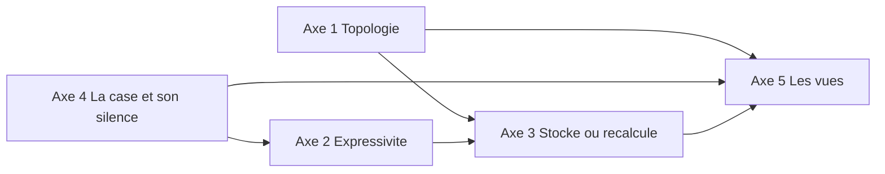

# Les cinq axes de décision du modèle

But : ramener les vingt décisions de 10, les seize questions de 11 et les tensions de 03 et 07 à **cinq axes indépendants**. Ensemble, ils fixent la forme du stockage d'une qualification et de ses projections, et le niveau de généralisation du modèle. Pour chaque axe : la question, les positions possibles du minimal au maximal, ce que chaque position coûte et verrouille, et une recommandation. Rien n'est décidé : tout est **proposé**, sauf ce qui est marqué **constaté**.

## TL;DR

- **Cinq axes orthogonaux** : (1) la **topologie** de la structure, (2) l'**expressivité** du calcul, (3) ce qui est **stocké** et ce qui est **recalculé**, et ce qui est copié ou partagé, (4) ce qu'est une **case** et ce que vaut son **silence**, (5) qui **compose les vues** et ce qu'une vue a le droit de calculer.
- **Hypothèse de cadrage** à confirmer : le modèle de données porte les concepts génériques dès le départ ; le produit n'en expose qu'une partie au début. Le **catalogue** de fonctions, lui, grandit par version. Toutes les recommandations ci-dessous reposent sur cette hypothèse.
- **Recommandations** : (1) un seul arbre de placement, plus des regroupements transversaux calculés et des étiquettes ; (2) catalogue fermé dans le modèle, sous-ensemble exposé en V1 ; (3) données maîtres plus instantanés figés aux moments nommés, structure versionnée, grille copiée par cours ; (4) la note est l'enregistrement, quatre états de case, certitude par l'intervalle des possibles ; (5) vues générées depuis la structure, vues d'équipe enregistrées, résultat restreint permis mais marqué, attestation déclarée dans la grille.
- **Couplage à connaître** : la certitude pendant le cours (axe 4) n'existe que si toutes les fonctions sont monotones (axe 2). Choisir une formule libre, c'est renoncer à « réussi seulement si c'est certain ».
- **Ordre conseillé pour trancher** : 1, 4, 2, 3, 5. Les deux premiers fixent l'atome et le graphe, donc le schéma.
- **Hors de ces axes, volontairement** : les droits, MiData, la nLPD, le vocabulaire, la forme du joker et des arrêts. Ce sont des décisions en aval, qui ne changent pas la forme du stockage.

## Comment les axes ont été choisis

Trois passes. La première a listé dix-huit candidats : topologie, expressivité, statut décisif, définition et instance, contexte, échelles, états du vide, certitude, cardinalité des notes, persistance des résultats, versions de structure, variantes, gabarit et référentiel partagé, composition des vues, résultat restreint, axes, attestation, stratégie d'extension. La deuxième a noté chacun sur trois critères : l'**effet d'entraînement** sur le stockage et les projections, l'**incertitude réelle** (les documents se contredisent, ou le porteur n'a pas été consulté), et l'**irréversibilité** (changer d'avis après un cours réel coûte une migration). La troisième a fusionné les candidats liés et retiré ceux qui découlent d'un autre.

| Candidat retiré | Absorbé par | Pourquoi |
| --- | --- | --- |
| Statut décisif ou indicatif (D2) | axe 2 | Dès qu'une règle cite des éléments, le statut se déduit. Il n'y a plus rien à décider. |
| Définition et instance, contexte | axe 1 | C'est la question « qu'est-ce qu'une feuille de l'arbre », inséparable de la topologie. |
| Échelles et conversions | axe 2 | Elles suivent le catalogue : une étape de conversion est une fonction comme une autre. |
| Variantes de calcul (L4) | axe 3 | Une variante est une version de structure appliquée en lecture seule aux mêmes notes. |
| Résultat restreint, axes, attestation | axe 5 | Trois réponses à la même question : qu'est-ce qu'une vue a le droit de produire. |
| Stratégie d'extension | cadrage | Elle traverse les cinq axes au lieu d'en être un. |

---

## Axe 1. Topologie : combien de parents, et où vit l'exercice

### La question

Un indicateur appartient-il à un seul regroupement, ou à plusieurs ? Le regroupement où il **s'affiche** est-il celui où il **compte** ? Et l'exercice (le contexte) est-il un étage de l'arbre ou une dimension de la case ?

**Constaté** : dans qualif2, « Analyse des risques » s'affiche sous l'objectif 1 et compte dans l'objectif 0 (07 F5). Dans qualif1, un critère compte dans son exercice et dans un thème transversal ; l'objectif 4.1 est évalué dans quatre exercices et moyenné à travers eux (07 F7, 10 §9.2). Aucun des trois Excel ne possède **deux hiérarchies de navigation** pour les mêmes feuilles : les thèmes de qualif1 sont des listes de références dans la feuille Synthèse.

### Les positions

| Position | Idée | Couvre | Ne couvre pas | Stockage | Vues |
| --- | --- | --- | --- | --- | --- |
| **T0 Arbre unique** | un parent ; affichage = calcul (`FEATURES.md` initial) | qualif3 | la sécurité de qualif2, les thèmes de qualif1 | un `parent` par élément | une hiérarchie |
| **T1 Arbre de calcul + mise en page + étiquettes indicatives** (07 §3.4) | un parent de calcul, une section d'affichage à part, des étiquettes pour des résultats jamais décisifs | les trois Excel tels qu'ils calculent | un thème décisif (09 T10), la sécurité décisive hors arbre, la meilleure tentative sur une épreuve entière | deux parents par élément, des étiquettes | une hiérarchie, des listes par étiquette |
| **T1,5 Arbre de placement + regroupements transversaux calculés + étiquettes** (proposé ici) | chaque élément est **rangé à un seul endroit** ; des regroupements **transversaux** comptent des membres pris n'importe où (par liste, par définition, par étiquette) et peuvent être cités par une règle ; des étiquettes pour les vues | tout le corpus de 09 et les seize cas de 12 | une deuxième hiérarchie de navigation complète | un `parent` de placement avec un drapeau « compte dans le parent », une table d'appartenances pour les transversaux, des sélections | l'arbre, plus une vue générée par transversal avec ses membres cités, plus les vues par étiquette |
| **T2 Graphe multi-chemins** (10 §4) | n hiérarchies de placement, appartenance « placé / compté », sélections, multiplicité contrôlée | tout | rien de connu | table d'appartenances (parent, membre, placé, compté, poids, conversion), table de chemins, couverture | reflets, reflets cités, « hors de ce chemin », rôle de chemin |

**Sous-question : le contexte.** Dans 10, un indicateur placé est le couple (définition, contexte), et chaque contexte est aussi un regroupement d'un chemin automatique « par contexte ». C'est ce qui fait dire à Marc « pourquoi j'ai deux arbres ? » (12 §6.2). Deux lectures :

- **Le contexte est un étage de l'arbre** : qualif1 (exercice → objectif → critère). Simple à lire, mais un CFC a alors un arbre « domaines » et un arbre « épreuves » qui se croisent.
- **Le contexte est une dimension de la case** : l'indicateur placé porte son contexte comme attribut. Un nœud de l'arbre **peut** être lié à un contexte (qualif1), mais la vue « par exercice » est toujours générée, jamais un second arbre.

### Ce que l'axe verrouille

- Le schéma de la structure : une colonne `parent` ou une table d'appartenances.
- Le moteur de recalcul : un repli d'arbre ou un graphe acyclique avec contrôle de cycle et de multiplicité (10 §4.8).
- L'éditeur de grille : « placer dans l'exercice » ou « placer dans le chemin X au niveau Y ».
- Les vues : le nombre de hiérarchies que la navigation doit offrir.
- Les décisions absorbées : D3, D6 (les tentatives sont des contextes d'une famille), Q10 de 11, et EX2 à EX4.

### Recommandation

**T1,5, avec le contexte comme dimension de la case.** Il garde l'expressivité de 10 pour le calcul (tout transversal peut être décisif, afficher ici et compter ailleurs reste un cas ordinaire) et retire ce qui coûte le plus au concepteur sans cas observé : les chemins multiples de placement, la couverture, le rôle de chemin, le chemin depuis un axe. Le passage à T2 plus tard est **additif** : un identifiant de chemin sur l'arête de placement.

**Ce qui me fait douter** : si des grilles réelles d'autres régions montrent deux hiérarchies complètes utilisées toutes deux pour naviguer et pour l'attestation, T2 s'impose. C'est la première chose à vérifier dans les grilles à collecter.

---

## Axe 2. Expressivité : jusqu'où le concepteur programme

### La question

Le concepteur écrit-il des formules, un petit langage contrôlé, ou choisit-il dans un catalogue fermé de fonctions, de conversions et de conditions ?

**Constaté** : les trois Excel contiennent des formules cassées ou fausses (dénominateur faux, plage oubliée, sphère oubliée, objectif figé à 1, dossier vide « Réussi » : 07 F9 à F12). Les chiffres de 10 ont été recalculés par 12 et sont justes ; les défauts étaient dans les règles.

### Les positions

| Position | Idée | Couvre | Prix | Ce qu'on perd |
| --- | --- | --- | --- | --- |
| **E0 Formule libre** | un tableur | tout | les bugs F9 à F12 reviennent | l'explication en phrases, la certitude pendant le cours, la vérification avant le cours |
| **E1 Formule contrôlée** | un petit langage (+, −, ×, ÷, min, max, si) | presque tout | l'effet tableur en plus étroit (10 §1.4) | la monotonie n'est plus garantie, donc l'intervalle des possibles non plus |
| **E2 Catalogue fermé complet** (10 §5, §6) | 11 fonctions, 6 étapes de conversion, grammaire de règle (toutes, au moins n, compensation, veto, issues ordonnées), extension **par version** avec une fiche et des cas de test | le corpus 09 et les cas de 12 | ce qui n'est pas au catalogue passe par un arrêt justifié ou attend une version | le classement, la notation relative, les systèmes exotiques |
| **E2 réduit** | même modèle, mais V1 n'expose que : Moyenne pondérée, Somme en rapport, Part des réussis, Comptage, Meilleure et Dernière ; conversions linéaire, paliers, points d'appui, arrondi ; règle « toutes », « au moins n », veto | les trois Excel, RQF, pratique romande, CFC, brevet | la compensation, la moyenne par rang, les seuils conditionnels et les écarts viennent par version | rien dans le modèle, seulement dans l'écran |

### Ce que l'axe verrouille

- Le package `domain` : un interpréteur d'un arbre de calcul **typé et fermé**, ou un évaluateur d'expressions.
- La **monotonie**, donc l'intervalle des possibles et la logique à trois valeurs (10 §6.3). C'est le couplage avec l'axe 4 : sans E2, pas de « réussi seulement si c'est certain ».
- L'explication de chaque chiffre (une phrase type par fonction) et sa traduction : des clés i18n par fonction, impossibles avec une formule.
- La stabilité dans le temps : une fonction publiée ne change jamais de définition, ce qui permet de rejouer une qualification close des années après (10 §5.5). Cela conditionne l'axe 3.
- Les décisions absorbées : D1, D2 (statut déduit des règles), D5, D10, D11, D17, et la grammaire de la règle.

### Recommandation

**E2 dans le modèle, E2 réduit dans l'écran.** La décision que le porteur doit prendre en connaissance de cause : **aucune soupape dans la grille**. Ce qu'une équipe ne sait pas exprimer passe soit par une **valeur arrêtée justifiée** (10 §6.4), soit par une **demande d'ajout au catalogue** dans une version du produit. C'est un engagement de maintenance, pas seulement un choix technique.

**Ce qui me fait douter** : le catalogue complet est déjà grand (moyenne par rang, compensation pondérée, seuil conditionnel). Si une qualification remplie montre que les équipes bricolent beaucoup en fin de cours, l'arrêt justifié sera très sollicité et il faudra le rendre confortable plutôt qu'élargir le catalogue.

---

## Axe 3. Stocké ou recalculé, copié ou partagé

### La question

Trois sous-questions, toutes sur « où vit la vérité ».

1. Les **résultats** sont-ils stockés, ou toujours recalculés à partir des notes et de la structure ?
2. La **structure** a-t-elle un historique, des versions, ou seulement un état courant ?
3. Une grille est-elle une **copie** par cours, ou une **référence** à un référentiel partagé entre cours ?

**Constaté** : `TODO.md` décide que le serveur ne stocke que les données maîtres et que le client calcule à l'affichage. 03 K8 relève le conflit : la décision qui fait foi (réussi ou non, imprimée dans l'attestation) n'existe alors nulle part de façon durable, et un calcul refait plus tard peut différer. 03 K3 relève que « figer » a deux sens. 03 K10 relève que personne ne possède une structure partagée entre cours.

### Les positions

**3a. Les résultats**

| Position | Idée | Prix |
| --- | --- | --- |
| **S0 Jamais stockés** (TODO actuel) | recalcul à chaque affichage, à l'export aussi | contredit K8 ; impose que structure et catalogue soient rejouables à l'identique pour toujours |
| **S1 Figés aux moments nommés** | données maîtres plus **instantanés** : à la clôture (obligatoire) et aux bilans nommés, on fige la version de structure, les valeurs, les statuts, les propositions, les décisions et les explications ; entre deux, le client recalcule | une table d'instantanés ; la décision enregistre la proposition sur laquelle elle a été prise |
| **S2 Matérialisés en continu** | le serveur recalcule et stocke à chaque écriture, comme des cellules Excel | deux sources de vérité ; contredit « le client calcule » ; pas de besoin mesuré |

**3b. La structure dans le temps**

| Position | Idée | Prix |
| --- | --- | --- |
| **V0 État courant seul** | on modifie la grille sur place | « état à une date » impossible (11 EX11) ; un bilan imprimé devient faux après une modification |
| **V1 État courant + journal + versions publiées** | même mécanique que les cellules (état courant, historique append-only) ; **figer** = publier la version n ; une qualification pointe la version en vigueur ; une variante (L4) est une version appliquée en lecture seule aux mêmes notes, jamais une branche avec des données propres (07 §3.3) | une table de versions ; les deux opérations « corriger le placement » et « évaluer ailleurs » (10 §4.1) sont des entrées du journal |
| **V2 Structure immuable, événements** | chaque modification est un événement, l'état est une projection | lourd pour un gain déjà couvert par V1 |

**3c. Copie ou référence**

| Position | Idée | Prix |
| --- | --- | --- |
| **C0 Grille copiée par cours, référentiel interne, provenance** | un gabarit est une grille source copiée avec sa trace (10 §8.1 : « copie dans ») ; les codes externes (objectifs MSdS) sont des étiquettes, pas des clés étrangères | les statistiques entre cours se font par code d'étiquette, pas par identité |
| **C1 Référentiel partagé entre cours** | les définitions pointent un catalogue d'organisation | modifier le catalogue touche n cours ; propriété et droits hors cours à inventer (K10, K7) |

À régler dans les deux cas : une grille sert à **un ou plusieurs événements MiData** (cours en deux week-ends, 07 §3.3), ce qui détache la qualification de l'événement.

### Ce que l'axe verrouille

- Le schéma : tables d'instantanés et de versions, ou non.
- La clôture, la réouverture avec motif, l'attestation et la purge : un instantané figé est aussi ce qu'on garde ou qu'on anonymise.
- Le rejeu d'un ancien cours (10 §10.5) et le rejeu d'un Excel : il faut une version de structure identifiée.
- Les décisions absorbées : D13 (ne pas reproduire l'Excel à l'identique), K3, K8, K10, L4, Q13 et EX11, EX14 de 11.

### Recommandation

**S1 + V1 + C0, et une grille liée à 1 à n événements.** C'est la position la plus proche de ce qui est déjà décidé (données maîtres, historique par cellule), corrigée du seul point qui ne tient pas : la vérité figée. Le principe reste « le client calcule », avec un serveur qui calcule aussi au moment de figer, via le même package `domain`.

**Ce qui me fait douter** : C1 devient tentant dès qu'on parle de statistiques entre cours par compétence. Je propose de ne pas le préjuger : une étiquette avec un code externe stable donne 80 % du besoin sans couplage.

---

## Axe 4. La case et son silence

### La question

Qu'est-ce que l'atome des données, combien de notes il porte, quels sont ses états quand il est vide, et quand un résultat a-t-il le droit de dire « réussi » pendant le cours ?

**Constaté** : le remplissage est bricolé dans qualif2 et qualif3 (constat 10). Dans qualif3, un dossier vide affiche « Réussi » (07 F12). Dans qualif1, un vide vaut 0 point (07 F1). En o/k, un vide vaut « non ». Un indicateur sans commentaire est ambigu : rien à dire, ou oubli (constat 8).

### Les positions

**4a. Combien de notes dans une case**

| Position | Idée | Prix |
| --- | --- | --- |
| **N0 Une valeur par case, historique technique à part** | la case a une valeur ; l'historique garde les anciennes | passer à un jury ou à un journal change la forme des données |
| **N1 La note est l'enregistrement** | une note porte valeur ou état, auteur, rôle, date d'évaluation, situation, origine (saisie ou reprise), portée (participant ou groupe) ; la case a une **note retenue** ; en mode unique, une correction remplace la note retenue et l'ancienne reste (10 §7) | le stockage est le même que « état courant + historique » déjà décidé ; la ligne d'historique devient un objet du domaine |

**4b. Les états du vide**

| Position | Idée | Prix |
| --- | --- | --- |
| **Deux états** : vide, non applicable (07 §4.3) | simple | les motifs éliminatoires donnent « incomplet » à tout le monde (12 R16) ; un non-rendu est neutre |
| **Quatre états + valeur du vide sur l'échelle** (10 §3.3) : vide, valeur, non applicable, absent ; l'échelle peut déclarer « vide = réponse » | les motifs sont des cases facultatives ; un absent compte comme le moins bon | « absent » est une option à activer ; un concept de plus |

**4c. La certitude pendant le cours**

| Position | Idée | Prix |
| --- | --- | --- |
| **P0 La valeur courante décide** | « réussi provisoire » dès que la valeur actuelle passe le seuil | trois notes sur 219 donnent « réussi » : le bug F12 en plus doux (12 CI1) |
| **P1 L'intervalle des possibles** (10 §6.3) | une condition est réussie seulement si **toutes** les valeurs encore possibles la passent ; sinon « en attente, réussi pour l'instant » ; **revue des vides** à la finalisation | presque tout le monde est « en attente » jusqu'au dernier soir ; demande la monotonie (axe 2) |

### Ce que l'axe verrouille

- La table centrale : notes (N1) ou cellules (N0).
- Le remplissage et toutes les mesures de suivi : ce qui compte comme attendu, rempli, facultatif, hors périmètre (11 §4.2).
- Le ressenti du produit pendant le cours : un tableau qui passe au vert, ou un outil qui dit « pas encore sûr ».
- Les décisions absorbées : D4, D7, D12, D14, D16, D18, les questions Q5, Q6, Q16 de 11, et EX6, EX7, EX12, EX13.

### Recommandation

**N1 + quatre états avec « absent » en option + P1 avec la tendance toujours visible.** N1 ne coûte rien de plus que ce qui est décidé et rend le jury, le journal, la note de groupe et la reprise possibles sans migration. P1 est la seule position qui tient la promesse « un dossier vide ne réussit jamais » sans cas particulier.

**Ce qui me fait douter** : P1 est la décision que le porteur doit **ressentir**, pas seulement lire. Une équipe habituée au vert d'Excel peut vivre « en attente » comme un défaut. Le défaut du vide par gabarit (ignorer pour les sphères 1 à 5, bloquer pour un CFC) et la revue des vides à la finalisation sont les deux parades ; elles font partie de la décision.

---

## Axe 5. Les vues : qui les compose, et ce qu'elles ont le droit de calculer

### La question

Les vues sont-elles codées une fois pour toutes, générées depuis la structure, ou composées par les formateurs ? Une vue peut-elle produire un chiffre que la grille n'a pas déclaré ?

**Constaté** : `FEATURES.md` attend onze projections, dont « rendus en colonnes, thèmes en lignes » qui n'existe dans aucun Excel. Les Excel n'ont jamais de matrice participants × indicateurs, alors que c'est le premier gain attendu de l'outil (07 §4.3, ligne 5).

### Les positions

**5a. Qui compose**

| Position | Idée | Prix |
| --- | --- | --- |
| **W0 Vues fixes** (07 §4.3) | par participant, par section × groupe, état du cours, attestation | pas de vue par thème, par rendu, par étiquette ; chaque nouveau besoin est du code |
| **W1 Générées + enregistrées + éditeur simple** (11 §5) | chaque élément de structure (arbre, transversal, étiquette, contexte, groupe) donne ses vues sans réglage, par trois questions (quoi, qui, pour quoi faire) ; on enregistre une vue pour l'équipe ; un éditeur par listes de choix, sans formule | un moteur de vues à six primitives ; des définitions de vue stockées par identifiants stables |
| **W2 Explorateur libre** | pivot, mesures à la demande | l'effet tableur déplacé dans les vues |

**5b. Ce qu'une vue peut calculer**

| Position | Idée | Prix |
| --- | --- | --- |
| **X0 Rien** | seulement les résultats de la grille et le catalogue fixe de suivi | la projection « rendus × thèmes » exige de déclarer chaque croisement dans la grille |
| **X1 Résultat restreint et statistique étiquetée** (11 ME5, ME6 ; 10 §4.9, D15) | la vue applique la **fonction du nœud** à la partie de ses cases qui tombe dans la cellule, marque « partiel », jamais cité par une règle ; une moyenne brute est permise, étiquetée « statistique », jamais dans l'attestation | il faut expliquer qu'un total n'est pas la moyenne de ses cellules partielles (12 EC13) |
| **X2 Mesures libres** | une vue définit ses propres calculs | deux sources de vérité pour un chiffre |

**5c. L'attestation** : fixée par la grille (11 SO3) ou composée comme une vue (11 Q11) ? Position intermédiaire : une vue de disposition « document » qui **appartient à la grille**, donc copiée avec elle et figée avec l'instantané de clôture.

### Ce que l'axe verrouille

- Le store client : l'espace des cases doit être interrogeable selon toutes les dimensions (participant, élément, contexte, étiquette, auteur, temps), avec les résultats par nœud × participant comme collection dérivée. C'est la forme que TanStack DB et ses requêtes vivantes supposent déjà.
- Ce qui se stocke en plus : des définitions de vue (périmètre, découpage, disposition, mesures, mode, sortie), par identifiants stables.
- L'intérêt des étiquettes : sans W1, un axe ne sert à rien.
- Les décisions absorbées : D15, les questions Q1 à Q4, Q7 à Q9, Q11, Q12, Q14 de 11, EX10, et N-PV1 à N-PV8.

### Recommandation

**W1 en commençant par les vues générées et les vues d'équipe, l'éditeur plus tard ; X1 ; l'attestation déclarée dans la grille.** Le niveau généré est la navigation elle-même : cliquer sur un en-tête pivote. C'est ce qui rend les étiquettes et les transversaux de l'axe 1 utiles sans configuration. X1 est nécessaire pour la projection 4 de `FEATURES.md` ; son marquage « partiel » est non négociable.

**Ce qui me fait douter** : les vues personnelles (11 Q2) fragmentent la façon dont une équipe regarde les données. Je propose de ne pas les ouvrir au pilote.

---

## Ce que les cinq axes absorbent

| Décision ou question | Axe | Devient |
| --- | --- | --- |
| D1, D5, D10, D11, D17 | 2 | tranchées par le catalogue |
| D2 | 2 | déduite : le statut est l'ensemble des règles qui citent l'élément |
| D3, D6, Q10, EX2 à EX4 | 1 | tranchées par la topologie |
| D4, D7, D12, D14, D16, D18, Q5, Q6, Q16, EX6, EX7, EX12, EX13 | 4 | tranchées par la case |
| D13, K3, K8, K10, L4, Q13, EX11, EX14 | 3 | tranchées par la persistance |
| D15, Q1 à Q4, Q7 à Q9, Q11, Q12, Q14, EX10 | 5 | tranchées par les vues |
| D8, D19, D20, la règle d'arrêt | aval | des données additives, à régler après |
| D9 vocabulaire | aval | se règle une fois les concepts fixés |
| Q7, Q15, droits, MiData, nLPD | hors axes | un autre chantier |

## Ordre conseillé pour trancher

1. **Axe 1**, parce qu'il fixe le schéma de la structure et l'éditeur.
2. **Axe 4**, parce qu'il fixe la table centrale et le ressenti pendant le cours.
3. **Axe 2**, parce que P1 (axe 4) n'existe qu'avec un catalogue monotone.
4. **Axe 3**, parce que figer une vérité suppose une structure versionnée (axe 1) et un calcul rejouable (axe 2).
5. **Axe 5**, parce que les vues se composent sur tout ce qui précède.

Chaque axe tranché se reporte dans `FEATURES.md` (le comportement) et `TODO.md` (la décision), puis se met à l'épreuve sur une grille réelle rejouée à la main (README, « Prochaines étapes »).
