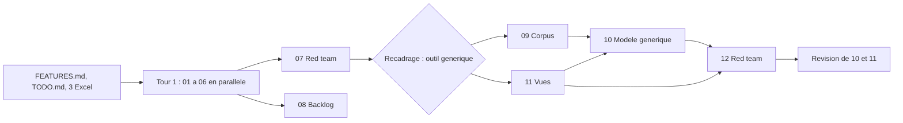
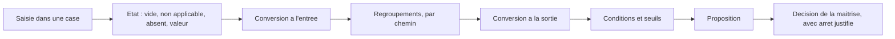
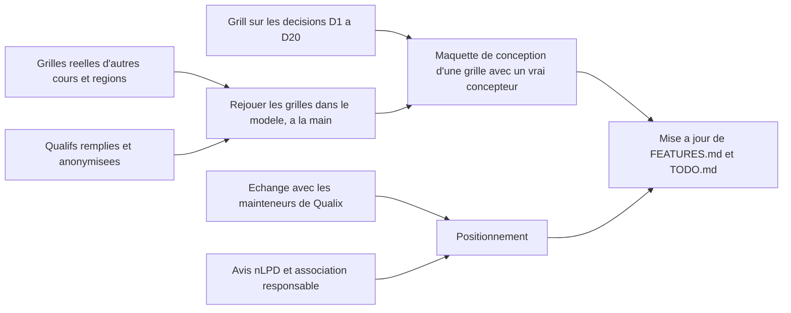

# Analyse du domaine — synthèse (2026-10-03)

Ce dossier analyse toutes les idées de features notées pour Azimut, sous l'angle du domaine métier uniquement. Ce document en donne la synthèse, les arbitrages entre analyses et les décisions à prendre. Rien n'est décidé : tout est **proposé**, sauf les faits marqués **vérifié**.

> **Cadrage.** Les trois Excel (qualif1 à qualif3) décrivent le système **actuel**, pas la cible. Azimut vise un outil **générique**, compatible avec **tous** les types de qualification. Il faut donc des généralisations pour les calculs, les échelles, les regroupements, les seuils et les vues, sans se limiter à ce que montrent les trois exemples. qualif1 calcule d'ailleurs déjà **deux chemins de regroupement en parallèle** : les compétences techniques par exercice, et les compétences transversales par thème (vérifié : `Synthèse!K65 = J65/I65`, `C55 = AVERAGE(C56:C59)`).

## TL;DR

- **Le modèle générique** (doc 10) tient en **six primitives** : l'échelle, la case, le regroupement, la conversion, la condition et l'arrêt. Il exprime les 3 Excel, **19 archétypes** de qualification (scoutisme, CFC, école, jury, portfolio, rattrapage…) et passe **31 cas de test**, dont 16 inventés par la red team pour le casser.
- **Plusieurs chemins de regroupement par grille.** Un élément peut appartenir à autant de chemins qu'on veut (exercice, thème, objectif officiel…). Chaque appartenance dit s'il est **placé** (affiché là) et s'il est **compté** (calculé là) : « affiché seulement » et « compte seulement » sont des cas ordinaires.
- **Le statut décisif n'est pas un réglage** : un résultat **compte pour** une règle si elle le cite ; sinon il est **pour information**. Le même thème est indicatif dans une grille et décisif dans une autre. Une sphère oubliée dans la règle se voit.
- **Pas de formule libre** : un catalogue fermé d'agrégations et de conversions, une règle de décision qui se lit comme une phrase, une logique à trois valeurs (réussi, échoué, indéterminé) jugée sur l'**intervalle des valeurs encore possibles** : rien n'est « réussi » tant que ce n'est pas certain. Chaque résultat est **explicable**. L'outil **propose**, la maîtrise **décide**, avec une justification si elle s'écarte.
- **Les vues** (doc 11) se composent de **six primitives** (périmètre, découpage, disposition, mesures, mode, sortie) sur un atome unique, la **case** (participant × indicateur placé). Chaque chemin et chaque axe génère des vues sans configuration.
- **Le risque principal est l'utilisabilité** : construire la grille de qualif1 demande environ 50 décisions. Les parades : gabarits par archétype, réglages par niveau, valeurs par défaut sûres, aperçu avec des participants fictifs, explication de chaque chiffre.
- **Trois erreurs de `FEATURES.md`** et **deux bugs graves des Excel** ont été vérifiés (voir « Corrections »). Exemple : dans qualif3, un dossier vide affiche « Réussi ».
- **Angles morts hors modèle** : la gouvernance du produit (qui maintient, qui répond le dernier soir), le responsable du traitement nLPD, le cadre J+S (la qualification donne une licence) et le biais de l'échantillon (trois cours romands).

## Les documents

| # | Document | Statut | Question |
| --- | --- | --- | --- |
| 00 | [Inventaire et conventions](00-inventaire.md) | référence | IDs des features existantes (S1, L3…) |
| 01 | [Carte des features](01-carte-des-features.md) | référence | Capacités métier, liens entre features, généralisations fonctionnelles |
| 02 | [Modèle généralisé](02-modele-generalise.md) | **remplacé par 10** | Première version du modèle, calée sur les Excel |
| 03 | [Zones d'ombre](03-zones-d-ombre.md) | référence | Contradictions, cas limites, hypothèses, données à collecter |
| 04 | [Six chapeaux](04-idees-six-chapeaux.md) | référence | Features manquantes (six chapeaux de Bono, inversion, SCAMPER) |
| 05 | [Acteurs et parcours](05-acteurs-et-parcours.md) | référence | Acteurs, droits, parcours, pre-mortem, cas d'abus |
| 06 | [Benchmark Qualix](06-benchmark-qualix.md) | référence | Ce que fait Qualix, que reprendre, positionnement |
| 07 | [Contre-analyse 1](07-contre-analyse.md) | **faits valables, périmètre écarté** | Red team de 01 à 06 : formules vérifiées, angles morts |
| 08 | [Backlog consolidé](08-backlog-consolide.md) | référence | Les 82 idées nouvelles fusionnées en X1 à X70 |
| 09 | [Corpus de qualifications](09-corpus-qualifications.md) | référence | 19 archétypes, matrice des besoins, 15 cas de test |
| 10 | [Modèle générique](10-modele-generique.md) | **référence du calcul** | Échelles, conversions, chemins, agrégations, seuils, règles, temps, jury |
| 11 | [Projections et vues](11-projections-et-vues.md) | **référence des vues** | La case, les six primitives de vue, composition, suivi |
| 12 | [Contre-analyse 2](12-contre-analyse-generique.md) | référence | Red team de 10 et 11 : 16 cas inédits, cohérence, utilisabilité |
| 13 | [Axes de décision](13-axes-de-decision.md) | **à trancher** | Les cinq axes qui fixent le stockage, les projections et le niveau de généralisation |

**Ordre de lecture conseillé** : ce document, puis 13 pour décider, puis 10, 11, 12, 09. Ensuite 03 et 05 pour le métier hors calcul.

### Comment l'analyse a été menée

Le premier tour (01 à 06, puis 07 et 08) partait trop des Excel. Après le recadrage, le corpus (09) a fourni un banc d'essai bien plus large, et le modèle (10) a été validé dessus. La red team 12 l'a ensuite attaqué avec 16 cas inédits, et 10 et 11 ont été révisés en conséquence.

## Le modèle générique en une page

| Primitive | Ce que c'est | Ce qu'elle couvre |
| --- | --- | --- |
| **Échelle** | Les **échelons** possibles d'une note, du moins bon au meilleur : numérique, ordinale, texte ou cible (durée visée), avec un échelon de réussite et une valeur du vide facultative | ok/ko, ++/+/-/--, acquis / en cours, 1 à 5, 1 à 6 avec demi-points, /20, points, %, appréciation seule |
| **Case** | Un participant × un indicateur placé dans un contexte. Elle reçoit une note (ou plusieurs : jury, journal) et un commentaire. États : vide, non applicable, absent, valeur | La saisie, le suivi du remplissage, « non observé » distinct de « oubli » |
| **Regroupement** | Une fonction prise dans un catalogue fermé (11 fonctions), appliquée à des membres, avec des paramètres communs (poids, vides, arrondi, minimum de membres) et une échelle de sortie déclarée | Moyenne pondérée, somme, min, max, médiane, part des réussis, au moins n, meilleure ou dernière tentative, moyenne par rang (retrait des extrêmes), écart signé… |
| **Conversion** | Une chaîne d'étapes monotones, à l'entrée ou à la sortie | Linéaire, points d'appui (1→0 %, 3→100 %, 5→150 %), paliers, formule de note type CFC, arrondi |
| **Condition** | Un seuil, un comptage ou une compensation, combinés par ET, OU, au moins n | Toutes les sphères ≥ 3 ; double compensation ; au plus 2 insuffisances ; seuil conditionnel ; veto d'un motif éliminatoire |
| **Arrêt** | Une valeur posée par un humain à la place du calcul, bornée et justifiée | Joker, consensus d'un jury, décision qui s'écarte de la proposition, acquis **repris** d'un cours antérieur |

Autour de ces primitives :

- **Chemins** : des hiérarchies nommées qui placent les éléments (par exercice, par thème, par sphère, par objectif officiel). Une **définition** du référentiel (critère 2.6.5) peut être placée dans plusieurs **contextes** (exercices, tentatives). Un regroupement par définition (« objectif 4.1 sur tous les exercices ») se construit sans copie.
- **Double comptage contrôlé** : pour chaque résultat, on compte les chemins qui mènent d'une case à lui. Plus d'un le long d'une moyenne ou d'une somme est une erreur, sauf si la grille le déclare voulu ; le long d'un maximum ou d'un comptage, un simple avertissement.
- **Proposition puis décision** : une grille peut avoir plusieurs règles (réussite, mention, volets), chacune facultative et avec des issues ordonnées. La règle produit une proposition (réussi, échoué, incomplet avec une tendance « pour l'instant », sans règle). La maîtrise enregistre la décision. Un dossier vide ne réussit jamais.
- **Hors modèle, par choix** : le classement entre participants, la notation relative à la moyenne du cours, et la visibilité des notes entre évaluateurs (qui relève des droits).

Détail, règles précises et validation : 10. Ce que la red team a corrigé : la section « Révision 2 » en tête de 10 et de 11. Le texte de 10 est long (environ 1 400 lignes) : le TL;DR et la Révision 2 suffisent pour une première lecture.

## Les vues en une page

- **L'atome est la case.** Une case affichée à deux endroits reste **une seule case** : la saisie se voit partout, et le suivi la compte une fois.
- **Une vue = périmètre + découpage + disposition + mesures + mode + sortie.** Les droits s'appliquent toujours en plus. Un membre « compte seulement » s'affiche comme un reflet cité, pour que l'objectif Sécurité de qualif2 ne paraisse pas vide.
- **Une vue ne crée pas de résultat.** Elle montre les résultats de la grille, des résultats **restreints** (la règle d'un nœud sur un sous-ensemble, marqués « partiel ») et des mesures de suivi tirées d'un catalogue fixe.
- **Trois niveaux de composition** : des vues **générées** depuis la structure (chaque chemin et chaque axe en donne), des vues **enregistrées** et partagées par la maîtrise, et un **éditeur simple** par listes de choix. Jamais de formule.
- Validées sur les 11 exemples de `FEATURES.md`, 10 besoins des parcours et 12 vues pour d'autres types de qualification (grille critériée, portfolio, rattrapage, jury, calibration, couverture d'objectifs, variantes).

## Généralisations fonctionnelles (hors calcul)

| Généralisation | Ce qu'elle unifie | Recommandation | Source |
| --- | --- | --- | --- |
| **État de la qualification** | figer (L2), modifier en cours (L3), clôturer (L6), rouvrir, archiver (L8), supprimer ou anonymiser (L9), droits selon le moment | Peu d'états, des transitions nommées. Une **réouverture avec motif** dès le départ. | 01 G1, 05 |
| **Projection** | vues de saisie, projections, suivi, PDF, accueil | La notion de vue de 11 : une seule mécanique pour tout ce qu'on regarde ou imprime | 01 G2, 11 |
| **Proposition puis décision** | seuil final (S11), éliminatoires (S12), joker (S13), finalisation (L5) | Règle facultative, arrêt justifié et tracé | 01 G4, 10 §6 |
| **Frontière MiData** | connexion (A6), cours et rôles (I1), participants (I2), report (I4) | Import seulement ; pas de report vers MiData pour l'instant | 01 G6, 06 |
| Versions et variantes, trace datée | copie pour comparer (L4), historique (C7) | Plus tard ; l'historique par cellule (décidé) suffit au départ | 01 G3, G7 |

## Corrections à reporter dans `FEATURES.md`

Vérifié dans les formules des Excel (par 07, puis contrôlé à nouveau pour cette synthèse) :

| # | Fait | Preuve | Ce que ça change |
| --- | --- | --- | --- |
| 1 | Dans qualif2, les critères de **sécurité ne comptent qu'une fois** : ils s'affichent sous leur objectif, mais seul l'objectif 0 les calcule. | `Sport de camp!N12` calcule l'objectif 1 sur `I13:I44` ; les lignes 45 à 51 (sécurité) sont calculées par `N10` (objectif 0). | Le constat 2 est à reformuler : c'est un cas « placé ici, compté là ». Le multi-chemin, lui, est bien réel (qualif1). |
| 2 | Dans qualif1, l'objectif 4.1 est **placé** dans les exercices mais **compté** seulement dans une moyenne transversale. | `Construction de cours!M7 = SUM(M11:M51)` exclut 4.1 ; `Synthèse!C55 = AVERAGE(C56:C59)` | Second chemin de calcul, à côté des 6 thèmes transversaux. |
| 3 | Dans qualif1, une **case vide vaut 0 point** (elle compte dans le possible). | `Construction de cours!K12`, `L12`, `O11` | La règle « case vide = non observé » n'est pas commune. Le traitement du vide doit être un réglage explicite. |
| 4 | **Bug** : dans qualif3, un dossier entièrement vide affiche « Réussi », pour chaque sphère et pour le cours. | `Synthèse!F24`, `F26`, `F35`, `F42` : valeur en cache « Réussi » sur le modèle vierge | Il faut un état **incomplet** et une logique à trois valeurs. |
| 5 | **Bug** : dans qualif2, l'objectif « Topographie » de Trekking vaut toujours 1. | `Trekking!N142` porte sur `G143` et `G70:G71` | Confirme qu'il faut des identifiants stables et des règles déclaratives. |

D'autres faits vérifiés (bonus de qualif2 sans effet, ligne 55 hors calcul, ordre conversion et moyenne dans qualif3) sont dans 07, section 1.

## Utilisabilité : le vrai risque de la généricité

La red team 12 a construit mentalement deux grilles en se mettant à la place d'un concepteur non informaticien. Résultat : **environ 50 décisions et 40 choix de membres pour qualif1**, environ 25 décisions et 30 valeurs pour un CFC. Les pièges relevés :

- le traitement du vide replié dans les réglages avancés alors qu'il change le résultat ;
- des alertes de cohérence qui tombent par centaines ;
- un vocabulaire qui se marche dessus (« niveau », « rangement », « regroupement », « mesure » ont chacun plusieurs sens).

Les parades, intégrées à la révision de 10 (§10) et de 11 (§5) : un **questionnaire de gabarit qui part de la décision** (« comment décidez-vous de la réussite ? »), le vide rendu visible avec un défaut par gabarit, des alertes groupées qui posent une question, et aussi : **gabarits par archétype** (on part d'une grille « CFC », « RQF », « 1 à 5 par sphère »…), réglages **par niveau** plutôt que nœud par nœud, valeurs par défaut sûres, règle écrite en phrases, **aperçu avec des participants fictifs**, explication de chaque chiffre, import d'une liste numérotée de critères. À éprouver tôt avec un vrai concepteur de cours, sur papier ou avec une maquette.

## Arbitrages entre analyses

| Sujet | Recommandation | Source |
| --- | --- | --- |
| **Vocabulaire** | **grille** (structure d'un cours), **qualification de [participant]** (ses données), **gabarit** (grille type), **maîtrise**, **participant·e**, **case**, **note**, **échelon** (d'une échelle), **niveau** (d'un chemin), **section** ; « observation » réservé au fait libre (sens de Qualix et RQF). À valider avec 2 ou 3 maîtrises, dont une germanophone. | 07 X1 à X3, 10 D9, 11 |
| **Modèle minimal de 07** | **Écarté.** Ses faits restent vrais ; sa réduction (un seul chemin, pas d'axes) contredit l'objectif. | cadrage, 10 |
| **Écart avec le calcul** | Permis par défaut, avec justification et trace ; interdiction possible par grille ; le joker est un arrêt borné. | 07 X4, 10 D8 |
| **Droits** | Peu de rôles au départ (direction, formateur) ; la matrice de 05 sert de réserve. | 05, 07 X11 |
| **Anonymisation** | Supprimer par défaut ; garder des agrégats seulement pour un usage nommé. À trancher avec un avis nLPD. | 03 K6, 07 X10 |
| **Qualix** | Azimut = la qualification **calculée** et générique. Les observations libres restent l'affaire de Qualix. Rencontrer ses mainteneurs. | 06, 07 X8 |
| **Priorités du backlog (08)** | Les priorités de 08 restent valables pour les features hors calcul. Le périmètre de 07 (§4.3, « 14 éléments ») est écarté pour le modèle ; il reste une piste pour **séquencer un pilote**, pas pour limiter le modèle. | 07, 08 |

## Angles morts et zones d'ombre

Hors modèle de calcul, ces points restent ouverts (détail dans 03 et 07 §5) :

1. **Décision finale** : qui décide, avec quelle procédure de recours ? (03 Z1)
2. **Figer, modifier, rouvrir** : effet d'un changement de structure en cours de cours sur les notes déjà saisies (03 Z2, 10 révisé).
3. **Rôles MiData → droits** : aucune correspondance n'existe pour les 7 rôles (03 Z3).
4. **Données** : anonymisation ou suppression, responsable du traitement nLPD, données sensibles dans les justifications d'éliminatoires (03 Z4, 07 A6).
5. **Cadre J+S et MSdS** : une moyenne compense des indicateurs entre eux, ce qui peut aller contre la doctrine RQF (« chaque exigence minimale pour elle-même »). Le modèle sait exprimer les deux. Reste à savoir lesquelles sont admises (07 A7).
6. **Gouvernance** : qui maintient, qui paie, qui répond le dernier soir à 23 h (07 A5).
7. **Échantillon** : trois cours romands. Le corpus 09 élargit le banc d'essai, mais seulement sur papier. Il faut des grilles **réelles** d'autres régions et d'autres types de cours (07 A8).

## Prochaines étapes proposées

1. **Grill** sur les décisions du modèle (10 §11, D1 à D20), en commençant par D1 à D4.
2. **Collecter** des grilles réelles d'autres cours (Suisse alémanique, Tessin, J+S, autres niveaux) et au moins une qualification **remplie** et anonymisée.
3. **Rejouer** ces grilles à la main dans le modèle. Chaque grille qui n'entre pas est un signal.
4. **Tester la conception** d'une grille avec un vrai concepteur de cours, sur une maquette, pour mesurer l'effet tableur.
5. **Échanger avec les mainteneurs de Qualix** et obtenir un **avis nLPD**.
6. **Reporter** les décisions et les corrections dans `FEATURES.md` et `TODO.md`.

## Décisions à prendre

Les décisions du modèle sont dans 10 §11 avec une recommandation pour chacune. Les plus structurantes :

- **D1 Expressivité** : catalogue fermé de fonctions (recommandé), formule contrôlée, ou formule libre ?
- **D2 Statut décisif** : dérivé de la règle (recommandé), ou réglé sur le regroupement ou le chemin ?
- **D3 Afficher ici, compter ailleurs** : appartenance « placé / compté » (recommandé) ?
- **D4 Défaut du vide** : ignoré, avec complétude affichée et revue obligatoire à la finalisation (recommandé), ou bloquant ?
- **D8 S'écarter de la proposition** : permis avec justification (recommandé) ?
- **D9 Vocabulaire** : grille, qualification, gabarit, maîtrise, participant·e, case, note, échelon, section ?
- **D16 Proposition pendant le cours** : « incomplet » avec la tendance (recommandé), ou « réussi provisoire » ?
- **D20 Joker** : ajoute-t-il un écart, ou fixe-t-il une valeur ?

Autres décisions du modèle : D5 à D7, D10 à D15, D17 à D19 (10 §11).

Décisions produit, hors modèle :

- Le **positionnement face à Qualix** : projet séparé, complément, ou contribution ?
- **Supprimer ou anonymiser** après le cours ?
- **Corriger `FEATURES.md`** maintenant avec les faits vérifiés, ou au prochain grill ?
